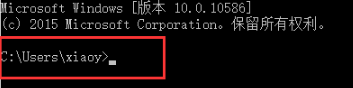
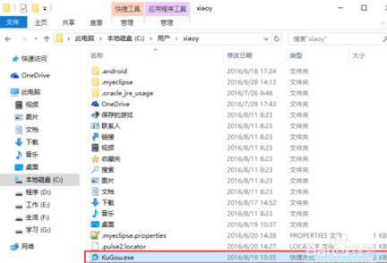
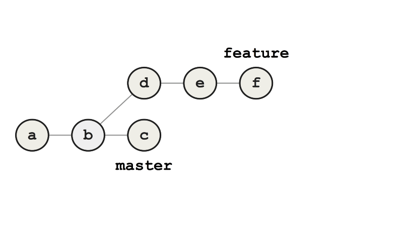
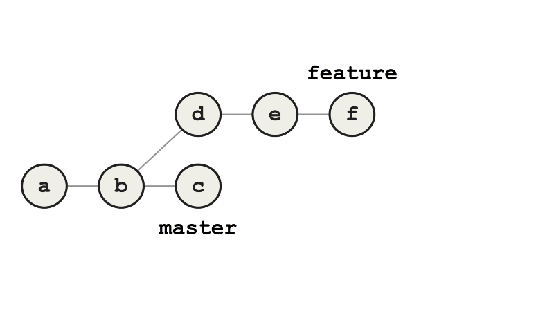
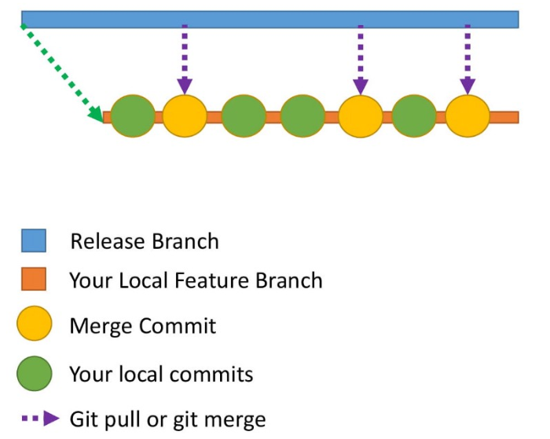
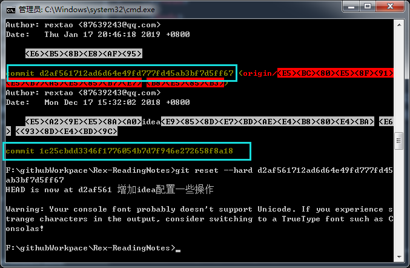

# 概述

1. How to become a Git expert
   - https://medium.freecodecamp.org/how-to-become-a-git-expert-e7c38bf54826
   - 20181002
2. why-you-should-stop-using-git-rebase
   - https://medium.com/@fredrikmorken/why-you-should-stop-using-git-rebase-5552bee4fed1
   - 20181218

# windows下快捷使用

## 如何cmd命令行快速打开git

1. 打开命令行，打开命令行中默认的路径 
2. 复制git.exe快捷方式到当前目录下
3. 然后，直接运行"git.exe.lnk"，方便起见，直接利用tab


# git命令

## git init

1. 把这个目录变成Git可以管理的仓库 

## cd /f/

1. 跳转到f盘#

## mkdir

1. 创建目录


# Git

## 介绍

1. git是开源分布式版本控制系统 
2. 控制系统：这意味着git是一个内容跟踪器，git可以存储内容，由于其其他特性多用于存储代码
3. 分布式：代码并不仅仅在存在中央服务器，开发者电脑都会存有代码的全部复制版，

## 为何需要版本控制

1. 开发代码是并行的，需要有软件解决代码冲突、合并等
2. 需求经常发生变化，版本控制系统允许开发者revert代码或访问某个老版本
3. 代码库的某些项目需要并行运行，这时候git的分支就很有用了


## 缓冲区（add）和commit

1. commit是将代码提交到本地仓库，在commit之前，代码会在缓冲区（staging area）中
2. Staging
   - `git add demo.txt`：缓存demo这个文件
   - `git add file1 file2 file3 `：缓存file1，file2，file3
   - `git add .`：项目中的文件夹与文件全部缓存
3. commit
   - `git commit -m "Initial Commit"`：提交并写上注释
4. log
   - `git log `：显示提交历史
5. status
   - `git status `：查看哪些文件修改了

## 分支

### 概述

1. 分支：是指向Git存储库中最新提交的指针。 

## rebase 与merger

### merger

1. 如图所示，我们有一个分支feature需要合并到master上，需要提交一个g，代表合并之后的

### rebase 

#### 概述

1. rebase相当于重写历史
2. rebase命令，先将feature指向master的最新节点c，然后在c后添加d，如有冲突提示用户处理冲突，一直添加完全部feature内容
3. 相比merge主要的好处是提交历史是线性的，而不是发散的

#### 主要问题

1. 如在d就有confict，需要解决冲突，e，f都要解决冲突，即在rebase过程中需要不停的解决冲突，这会有潜在的风险
2. rebase会隐藏d、e、f的历史，历史记录虽然看着更整齐，但可能会导致找错比较很困难，比如e提交有个错，但没有了提交历史

## 问题处理

### 如commit错了，如何处理

1. 提交时，提交信息写错，需要重写

   - `git commit --amend -m “New commit message”`

2. 如需要提交一组文件，但少提交了一个

   - 可以再提交一次，但是提交历史会比较混乱

   - --no-edit：表示提交信息不变

     ```
     git add file6 
     git commit --amend --no-edit
     ```

3. 注意：--amend只用于本地仓库，用于远程仓库会有很多问题

### 提交历史混乱，如何处理

1. 如预期一个模块需要10天，这期间会有很多其他人commit的内容，需要不断的pull
2. 那么本地的提交历史会变成这样：
3. 使用rebase可以解决这个问题

## branch

1. 

# 实际问题

## 撤销commit

1. commit了，但不想push

2. 命令：`git reset --hard commit_id  `

3. 可以先使用`git log`获取commit_id

   

4. 或利用`github desktop history`右键复制SHA值

## 分支内容被代入master

1. 分支修改的内容，如果未add与commit进行提交
2. 进行分支切换，会将文件带到新的分支上

## 如何fork项目并pull request

1. 先fork一个项目
2. 然后git clone到本地，最好是在分支进行更改代码
3. 然后再master上，运行git merge dev合并分支
4. git push 'fork的地址'，这样可以将代码提交到自己github上
5. 然后利用pull request，将更改提交