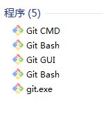
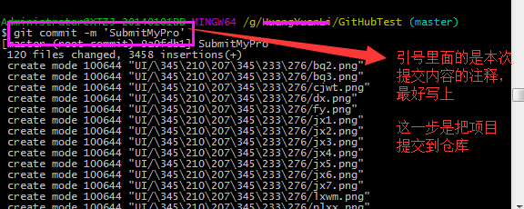
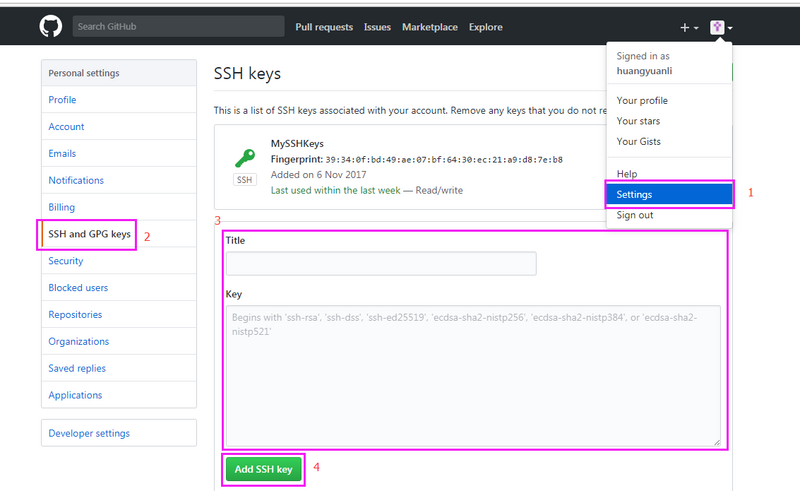
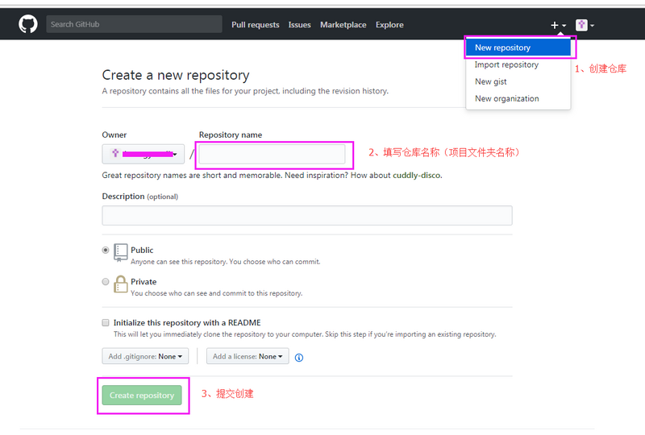
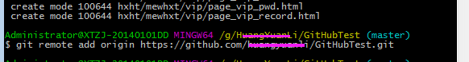
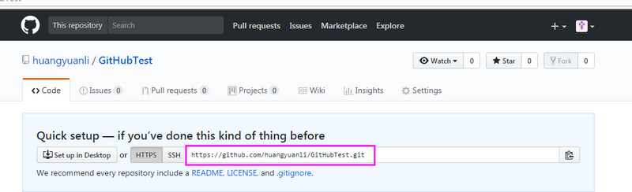
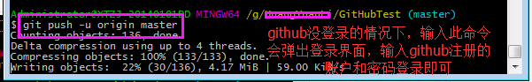

原文地址 https://segmentfault.com/a/1190000011909294

# 准备工作

## 安装 Git

## 在 github 创建账号： 

1. [https://github.com/](https://github.com/)

# 步骤

## 创建本地仓库

1. 

## 把文件夹变为git可管理的仓库

1. 打开Git Bash
2. 进入这个文件夹
3. git init

## 添加文件到缓存区

1. 将需要上传的文件复制到这个文件夹
2. git add .   
3. 将所有新复制的文件添加到缓存区

## 提交项目

1. git commit 把项目提交到仓库
2. 

## github的SSH加密

### 创建 SSH KEY

1. $ ssh-keygen -t rsa -C "youremail@example.com"
2. 然后再github添加ssh key

## github创建仓库

1. 在 Github 上创建一个 Git 仓库

## 关联本地仓库

1. 根据创建好的 Git 仓库页面的提示，可以在本地 GitHubTest 仓库的命令行输入：例：$ git remote add origin [https://github.com/guyibang/T...](https://github.com/guyibang/TEST2.git))

## 推送

1. $ git push -u origin master

