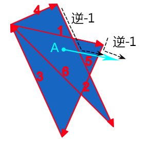
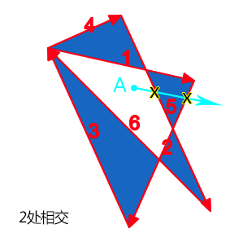

# canvas绘图
## 基本用法
1. canvas默认高度是300*150，可以利用HTML属性自定义canvas宽高
1. `<canvas id="tutorial" width="150" height="150"></canvas>`

## 回退内容

1. 可以在canvas内部添加回退内容，如一张图片，或一段文字

2. 当浏览器不支持canvas时，会显示canvas内部的回退内容，如支持，则会忽略

3. ```html
   <canvas id="stockGraph" width="150" height="150">
     current stock price: $3.15 + 0.15
   </canvas>
   
   <canvas id="clock" width="150" height="150">
     
   </canvas>
   ```

## 获得绘图上下文

1. html利用canvas内增加内容获得回退，js中需要判断canvas.getContext是否存在，判断是否可以使用canvas api

2. ```javascript
   var canvas = document.getElementById('tutorial');
   if (canvas.getContext) {
     var ctx = canvas.getContext('2d');
     // drawing code here
   } else {
     // canvas-unsupported code here
   }
   ```

3. `var ctx = canvas.getContext(contextType);`

    - 2d：构建一个CanvasRenderingContext2D对象，代表2维渲染上下文
    - webgl：构建一个WebGLRenderingContext对象，代表3维渲染上下文，浏览器必须实现了WebGL 第一个版本
    - webgl：webGL 第二个版本

# 2D上下文
## 概述

1. 默认坐标原点是(0,0)，左上角
2. 所有坐标值都是根据原点计算
3. 

## 绘制矩形

1. canvas目前仅支持绘制矩形，绘制其他图像需要使用path组合
2. `ctx.fillRect(x, y, width, height)`：绘制具有填充色的矩形
3. `ctx.strokeRect(x, y, width, height)`：绘制描边矩形
4. `clearRect(x, y, width, height)`：清除特定矩形范围，使其完全透明
5. 三个方法会立即绘制在canvas上

## 绘制路径

### 主要方法

1. `beginPath()`：创建新的path，一旦创建之后的绘制命令会用于此path上
2. `closePath()`：结束path，会在结束点与开始点使用直线连接
3. `stroke()`：绘制描边图形
4. `fill()`：绘制的图像区域被填充颜色
5. 注意：fill的图像路径会自动close，但stroke的不会

### 移动画笔

1. `moveTo(x,y)`：将画笔移动到某个位置
2. 如利用beginPath()初始化了路径，但需要利用moveTo方法确定开始绘制坐标

### 绘制直线

1. `lineTo(x, y)`：绘制一条直线从当前位置到x，y坐标

### 绘制arc

1. `arc(x, y, radius, startAngle, endAngle, anticlockwise)`
	- radius：半径
	- startAngle、endAngle：开始与结束角度
	- anticlockwise：true为逆时针，false为顺时针
2. `arcTo(x1, y1, x2, y2, radius)`
	- 起始点与x1，y1的直线和x1，y1与x2，y2直线构成一个夹角，绘制的圆与这两条线相切
	- 

### Bezier

#### 理论基础

1. 在平面内选3个不同线的点并且依次用线段连接。如下所示

2. 在AB和BC线段上找出点D和点E，使得 AD/AB = BE/BC

	

3. 连接DE，在DE上寻找点F，F点需要满足：DF/DE = AD/AB = BE/BC

	

4. 找出全部满足上述条件的F点，得到的曲线

5. 同理，3阶贝塞尔曲线，需要在平面选4个点

#### 方法

1. `quadraticCurveTo(cp1x, cp1y, x, y)`：2阶贝塞尔曲线
2. `bezierCurveTo(cp1x, cp1y, cp2x, cp2y, x, y)`：3阶贝塞尔曲线

### 矩形路径

1. `rect(x, y, width, height)`：绘制矩形路径（即矩形）

## 样式

### 颜色

1. `ctx.fillStyle = color`：填充颜色
2. `ctx.strokeStyle = color`：描边颜色
3. 设置颜色后，之后的图形都会按此颜色绘制，如需换色需要重设这个属性

### 半透明

1. 使用rgba的方式，如`ctx.strokeStyle = 'rgba(255, 0, 0, 0.5)';`
2. `ctx.globalAlpha=transparencyValue`：value值从0（完全透明）到1（完全不透明）

### 线样式

1. `lineWidth = value`：设置线宽
2. `lineCap = value`：设置终点样式
	- butt：默认值，矩形终点
	- round：圆形终点
	- square：会在线的结尾增加一个线宽大小的方块
	- 
3. `lineJoin = value`：设置两条线的连接处样式
	- bevel：斜角。
	- round：圆角。
	- miter：默认。创建尖角。
4. `miterLimit = 10`：设置最大斜接长度
	- 只有当 lineJoin 属性为 "miter" 时，miterLimit 才有效。
	- 斜接长度指的是在两条线交汇处内角和外角之间的距离。
	- 
5. 设置虚线
	- `ctx.setLineDash([4, 2])`：数组表示虚线与空格的长短
	- `ctx.lineDashOffset = 0`：表示虚线起始位置

### 渐变色

1. `createLinearGradient(x1, y1, x2, y2)`
	- 构建一个x1 ，y1到x2，y2的线性渐变对象
2. `createRadialGradient(x1, y1, r1, x2, y2, r2)`
	- 构建一个中心x1，y1，半径为r1到中心x2，y2，半径为r2的径向渐变
	- 渐变是可以理解为通过开始圆形移动到结束圆形
3. `gradient.addColorStop(position, color)`：在渐变对象上构建颜色停止位
	- postion：在0,1之间

### 模糊

1. 模糊常用属性

	```javascript
	// 阴影距形状的水平距离
	ctx.shadowOffsetX = 2;
	// 阴影距形状的垂直距离
	ctx.shadowOffsetY = 2;
	// 模糊程度
	ctx.shadowBlur = 2;
	ctx.shadowColor = 'rgba(0, 0, 0, 0.5)';
	```

### 模式Patterns

1. `ctx.createPattern(image, type)`
	- image图片
	- type为background-image可以设置的值，如repeat，repeat-x等

### 颜色填充规则

#### 非零环绕原则

1. `ctx.fill('nonzero')：默认规则
2. 在这个区域内任意找一个点，然后以这个点为起点，发射一条无限长的射线，然后起始值为0，射线会和路径相交，如果路径方向和射线方向形成的是顺时针方向则+1，如果是逆时针方向则-1，最后如果数值为0，则是路径的外部；如果不是0，则是路径的内部
3. 如随意选择一点A，随意一条射线，与5相交逆时针，故-1，与2相交为逆时针，故-1，故最终A的值为-2，内部

#### 奇偶原则

1. `ctx.fill('evenodd')`

2. 起始值为0，射线会和路径相交，每交叉一条路径，我们计数就+1，最后看我们的总计算数值，如果是奇数，则认为是路径内部，如果是偶数，则认为是路径外部。

3. 同样图片利用奇偶原则得到的结果是：

	

## 绘制文本

#### 基本方法

1. `CanvasRenderingContext2D.fillText(text, x, y [, maxWidth]);`
	- maxWidth：最大宽度，如设置后，浏览器会自适应文字到最大长度，如进行缩小字体、调整字间距等
2. `CanvasRenderingContext2D.strokeText(text, x, y [, maxWidth]);`

#### 文本样式

1. `font = value`：字体大小，默认10px
2. `textAlign = value`：对齐设置，start, end, left, right or center，默认start
3. `textBaseline = value`：文本基线，top, hanging, middle, alphabetic
4. `direction = value`：文本方向，ltr, rtl, inherit（默认）


1. 变换
    - rotate()：围绕原点旋转
    - scale()：缩放
    - translate()：将坐标原点移动到(x,y)
    - transform()：改变变换矩阵
    - 跟踪上下文状态变化
        - save()方法
            - 当时设置全部进入一个栈结构
            - 只保存对绘图上下文的设置和变换，不会保存绘图上下文的内容
        - restore()方法
            - 在保存栈结构中向前返回一级

2. 绘制图像
  - drawImage()
       - 传入一个HTML的``元素
       - 传入一个`<canvas>`元素

3. - 

4. - 

    - - 参数：如何重复图片的字符串

5. 使用图像数据
    - 取得原始图像数据
        - getImageData()
        - 返回是ImageData对象
            - width属性
            - height属性
            - data属性：一个数组，保存着图像每个像素的数据

6. 合成
    - globalAlpha属性
        - 值在0-1之间，默认为0
        - 指定透明度，如后续都是基于相同的透明度，可以设置这个属性
    - globalCompositionOperation属性
        - 后绘制的图如何与先绘制的图结合
        - 要多测试浏览器，属性的实现存在较大差异

## WebGL
1. 概述
    - 是针对Canvas的3D上下文，不是W3C制定的
    - 浏览器使用的WebGL是基于OpenGL ES制定的
    - OpenGL等3D图形语言非常复杂
2. 只适合实验性学习，不适合真正开发和应用，使用3D引擎