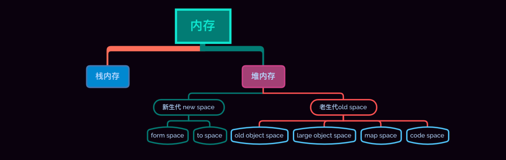
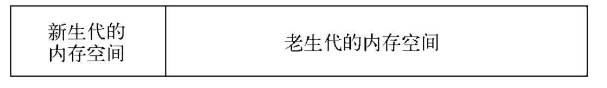
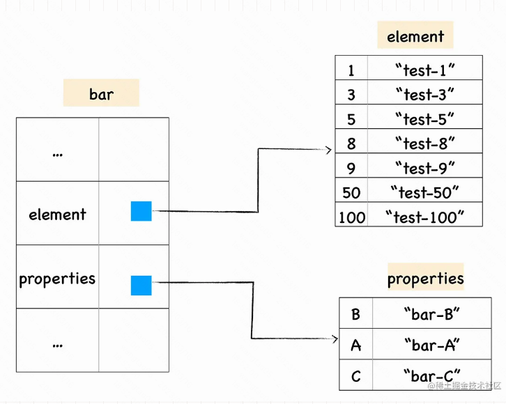
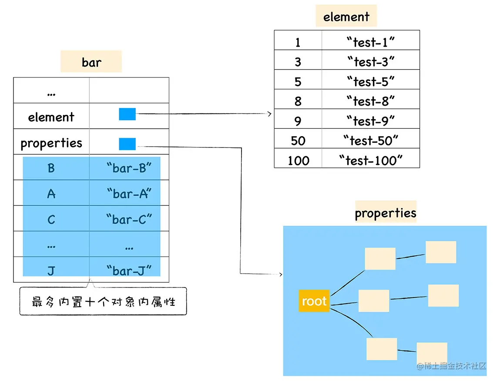

# 错误处理

## try-catch

### 概述

1. 如try块中有任何语句抛出异常，则会转跳到catch子句
2. 如try块中没有异常，则跳过catch子句
3. 无论上述哪种情况，finally子句都会执行
4. try中的return、continue、throw会在finally语句执行之后执行

### finally子句

1. 在`try`块和`catch`块之后执行但是在下一个`try`声明之前执行

2. 如果从`finally`块中返回一个值，那么这个值将会成为整个`try-catch-finally`的返回值，无论是否有`return`语句在`try`和`catch`中。这包括在`catch`块里抛出的异常。
   
   ```javascript
   function foo() {
       try {
           try {
               throw new Error("oops");// 1
           }
           catch (ex) {
               console.error("inner", ex.message);
               throw ex;
           }
           finally {
               console.log("finally");// 2
               return
           }
       }
       catch (ex) {
           console.error("outer", ex.message); // 3
       }
   }
   foo()
   ```
   
   - 结果：inner oops,finally
   - 并不会显示：outer oops，如果将finally中return删除，会显示

3. 根据上述规则，finally的return语句会覆盖try-catch中的return语句

### 合理使用

1. 最适合处理那些我们无法控制的错误
2. 如使用大型js库中函数，可能有意无意的抛出错误，又无法改源码，可以使用try-catch

### 注意

1. 无法捕获语法错误，开发阶段会看到，不会到线上系统
2. 无法捕获异步错误，只能捕获同步错误

## 抛出错误

1. 与try-catch相配的还有throw操作符，用于随时抛出自定义错误
2. 遇到throw操作符，代码立即停止执行
3. 创建自定义错误
   - throw new SyntaxError("haha");
   - 利用原型链继承Error来创建自定义错误类型，需要指定name和message属性
4. 抛出错误的时机
   - 虽然函数执行错误，浏览器会报错，但不同浏览器会给出不同的错误信息
   - 错误信息并没有清楚的告诉到底什么问题，如何修复，可以自定义类型，抛出
5. 捕获错误：目的在于避免浏览器默认方式处理他们
6. 抛出错误：目的在于提供错误发生具体原因的信息

## 错误事件

1. 任何没有通过try-catch处理的错误都会触发window对象的error事件
2. 在任何web浏览器中，onerror事件处理程序都不会创建error对象
3. 要指定onerror事件处理程序，必须使用DOM0级技术，它没有遵循DOM2级事件的标准格式
4. 只要发生错误，无论是不是浏览器生成的，都会触发error事件
5. 浏览器使用这个事件处理错误的方式不同，IE会保留变量和数据，firefox会在事件发生之前销毁数据和变量
6. 图像的error事件
   - 如图像src的url不能返回可以识别的图像格式，就会触发error事件

## 常见的错误类型

### 概述

1. 错误处理的核心：首先要知道代码里发生什么错误
2. 因为js是松散类型，不会验证函数的参数，因此错误只会在代码期间出现

### SyntaxError

1. 语法错误
   
   ```javascript
   // 变量名不符合规范
   var 1 ;//Uncaught SyntaxError: Unexpected number
   // 给关键字赋值
   function = 5 ;// Uncaught SyntaxError: Unexpected token =
   ```

### ReferenceError

1. 引用错误：引用一个不存在的变量时发生的错误
   
   ```javascript
   a();// Uncaught ReferenceError: a is not defined
   ```

### RangeError

1. 范围错误：
   - 数组长度为负数，`[].length = -5`
   - 函数堆栈超过最大值
   - number对象的方法参数超过范围

### TypeError

1. 类型错误，变量或参数不是预期类型

### URIError

1. uri相关函数参数不正确`decodeURI('%2') `

### EvalError

1. 此异常不再被js抛出，但EvalError对象扔保持兼容

## 全局监控

### window.error

1. 当 JavaScript 运行时错误（包括语法错误）发生时，会执行 window.onerror()
2. 最好写在全部js脚本之前，否则可能捕获不到错误
3. 不能捕获语法错误以及静态资源错误

### window.addEventListener

1. 当一项资源（如  或 <script> ）加载失败，能被单一的 window.addEventListener 捕获

## 注意

### 问题

1. 在查看 JavaScript 错误统计时，发现 80% 以上都是 "script error"。
2. 由于脚本来源于第三方（如cdn），为了避免信息泄露，故不报告细节，用script error代替

### 解决

1. 添加CORS支持，页面脚本使用`<script src="//xxx.com/example.js" crossorigin></script>`
2. 服务器添加access-control-allow-origin

# 性能

## 提高性能

### 注意作用域

1. 随着作用域链中的作用域数量的增加，访问当前作用域以外的变量的时间也在增加
2. 避免全局查找
   - 如要使用document.getElementById,100次
   - 需要在作用域链查找document100次，故可创建局部变量doc = document
3. 避免with语句
   - with会创建自己的作用域，因此会增加其中执行代码的作用域链的长度
   - 大部分情况下可以用局部变量代替

### 选择正确的方法

1. 避免不必要的属性查找
   - 避免不必要的属性查找
   - 访问字面值、存储在变量的值、数组，为O(1)，非常高效
   - 访问对象属性是O(n)操作，因为必须在原型链中对拥有该名称的属性进行一次搜索
   - 对象属性，可以根据点的个数确定属性查找的次数
   - 如多次用到对象属性，要存在局部变量中，第一次访问是O(n)，之后都是O(1)
2. 避免双重解释
   - 避免解析包含js代码的字符串
   - 如：new Function("alert('Hello world');");

### 优化DOM交互

1. js各个方面，DOM毫无疑问是最慢的一部分
2. 最小化现场更新
   - 一旦需要访问DOM部分是已经显示在页面的一部分，那么就进行了一个现场更新
   - 一旦需要更新DOM，可以考虑文档片段来构建DOM结构
3. 使用innerHTML
   - 使用innerHTML比标准DOM创建相同的DOM结构快
   - innerHTML设置值的过程
     - 后台创建一个HTML解析器
     - 使用内部DOM调用来创建DOM结构
     - 不是基于js的DOM调用
     - 由于内部方法是编译方法而非解释执行，执行更快
4. 使用事件代理
   - 根据事件冒泡，在更高层DOM设置事件处理程序
5. HTMLCollection
   - 任何时候访问HTMLCollection，无论是方法还是属性，都是在文档上进行一个查询
   - 何时返回一个HTMLCollection对象
     - 调用getElementByTagName()
     - 获取childNodes属性
     - 获取attribute属性
     - 访问特殊集合：document.forms,document.images等

# 测试

## 单元测试

### 意义

1. 如果API升级时，测试用例可以很好地􏶃查是否向下兼容

### 断言

1. 􏶠断言是单元􏴛测试中用来保证最小单􏴛是否正常的􏶃检测方法。
2. 是用于检测程序在运行时，是否满足期望
3. node存在assert模块，而市面上的断言库大多都是基于assert模块进行封􏱢和扩展的
4. 断言一􏰐􏶃查失败，将会抛出异常􏲀􏲿整个应用

### 测试框架

1. 测试框架用于为测试服务，它本身并不参与测试，主要用于管理测试用例和生成测试􏴋􏲎报告
2. 测试用例的不同组织方式
   - TDD测试驱动：所有功能是否被正确实现，每一个功能都具备对应的测试用例
   - BDD行为驱动：关注整体行为是否符合预期，适合自􏷈向下的设计方式

## 性能测试

### 基准测试

1. 基准测试要统计的就是在多少时间内执行了多少次􏱧某个方法，主要方法如下：
2. 使用new Date方式的缺陷
   - 由于浏览器精度问题，可能小于1ms或10ms，都会被显示为0
   - 无法确定每次都是相同的时间运行完
     - 不知道系统或引擎是不是对时间有影响
   - end-start会有误差
   - 无法确定测试的环境是不是过度优化了，即本次测试js引擎找到了最优办法，实际环境则不行了
3. 重复
   - 如果将上面代码重复100次，求平均也是不行的
     - 因为某处最优或最差可能影响最终结果
4. Benchmark.js
   - 任何有意义且可靠的性能测试都应该基于统计学上合理的实践
   - http://benchmarkjs.com/
   - 如想对代码进行功能测试和性能测试，这个库应该最优先考虑
   - 如果想得到可靠的测试结论的话，就需要在很多不同的环境进行测试
5. jsPerf.com
   - 可以实现多环境测试
   - 可以实现代码片段的性能测试

# 尾调用优化

## 概述

1. ES6涉及的一个性能领域的特殊要求：尾调用优化（ Tail Call Optimization， TCO）
   
   - 尾调用就是一个出现在另一个函数“结尾”处的函数调用
     
     ```javascript
     function bar(y) {
       return foo( y + 1 ); // 尾调用
     }
     function baz() {
       return 1 + bar( 40 ); // 非尾调用
     }
     ```
   
   - 这意味着 bar(..) 基本上已经完成了，那么在调用 foo(..) 时，它就不需要创建一个新的栈帧，而是可以重用已有的 bar(..) 的栈帧。这样不仅速度更快，也更节省内存

2. ES6要求引擎必须实现TCO，因为一些程序，无TCO则无法实现

3. 尾递归的本质实际上就是将方法需要的上下文通过方法的参数传递进下一次调用之中，以达到去除上层依赖

## 为何提倡使用尾调用

1. 函数调用会在内存形成一个“调用记录”，又称“调用帧”（call frame）

2. 此调用帧，只有在函数执行完毕，才会被 js 机制内存回收

3. 如果在函数A的内部调用函数B，那么在A的调用帧上方，还会形成一个B的调用帧。等到B运行结束，将结果返回到A，B的调用帧才会消失。如果函数B内部还调用函数C，那就还有一个C的调用帧，以此类推。所有的调用帧，就形成一个“调用栈”（call stack）

4. 如下代码
   
   ```javascript
   function f() {
       let m = 1;
       let n = 2;
       return g(m + n);
   }
   f();
   
   // 等同于
   function f() {
       return g(3);
   }
   f();
   
   // 等同于
   g(3);
   ```
   
   - f函数不是尾调用，函数f需要保存m和n的值、g的调用位置等信息
   - 由于f是尾调用，调用`g`之后，函数`f`就结束了，所以执行到最后一步，完全可以删除`f(x)`的调用帧，只保留`g(3)`的调用帧。

## 尾递归

1. 如果尾调用自身，就称为尾递归

2. 通用斐波那契数列
   
   ```javascript
   function foo(n){
      if(n <=1){
          return 1;
      }
      return foo(n-1)+ foo(n-2)
   }
   ```
   
   - n=100就会造成栈溢出

3. 尾递归斐波那契数列
   
   ```javascript
   function foo(n,ac1 = 1, ac2 = 1){
      if(n <=1){
          return ac2;
      }
      return foo(n-1, ac2, ac1+ac2)
   }
   ```
   
   - 利用参数来存储之前的值

# 内存管理

## 什么是内存

1. 内存可以看作是一个巨大的bits数组
2. 但我们并不擅长用bits思考问题，故使用byte来思考（1byte = 8bits）
3. 很多东西存储在内存中：如程序运行的全部变量与数据、程序代码（包括操作系统的）

## 内存动态分配

1. 如`const arr = readInput()`，arr数组大小需要根据用户输入才知道，故在编译阶段并不知道要给arr分配多少内存合适

2. 所以不能给arr在栈上分配，故需要在堆上分配

3. 两者的区别
   
   | 静态分配        | 动态分配      |
   | ----------- | --------- |
   | 编译时知道内存使用大小 | 不知道       |
   | 分配在栈上       | 分配在堆上     |
   | FILO结构      | 没有特殊的分配顺序 |

​    

## 垃圾回收机制

### 为何需要这样的机制

1. JavaScript程序每次创建字符串、数组或对象时，解释器都必须分配内存来存储这个实体。当这些值不再需要时，需要释放内存，否则，Js会消耗完全部内存，造成系统崩溃。
2. 垃圾回收的方法：标记清除、计数引用。

### 标记清除

1. 最常见的垃圾回收方式
2. 会为进入环境和离开环境的变量打上标记
3. 可以使用任何方式来标记变量，如通过翻转某个特殊位来记录何时进入环境，何时离开环境
4. 垃圾回收器会定期清除标记为离开环境的变量，以释放内存

### 引用计数（不常见）

1. 跟踪记录每个值被引用的次数

2. 何为引用：
   
   - 如一个对象可以访问另一个对象（无论是隐式还是显示）
   - 如js对象隐式引用他的原型，显示引用它的属性值

3. 当声明一个变量，并用一个引用类型值a赋值时，会将a引用次数标记为1，如变量更换了引用值，则a的引用次数标记减1，为0

4. 垃圾回收器会定时回收标记为0的

5. 此方式会导致内存泄漏
   
   ```javascript
   function problem() {
       var objA = new Object();
       var objB = new Object();
       objA.someOtherObject = objB;
       objB.anotherObject = objA;
   }
   ```
   
   - objA与objB相互引用，会被标记为2，当两个对象离开作用域后，计数不为0
   - 垃圾回收器并不能回收这样的对象，故会造成内存泄露

6. Mark-sweep算法，解决上述循环引用的问题
   
   - 会先获取根对象，如window或global
   - 然后检查其孩子并进行标记
   - 回收不在根上的对象
   - 对于循环引用的对象，由于未与根对象相关，故会被回收

### 注意

1. GC是不可以预测的，你并不知道它何时执行

# V8引擎

## 内存管理

1. v8引擎会把内存分为三个区块：代码空间、栈空间和堆空间
   - 代码空间：主要是用来存储可执行代码的，程序运行时用到的数据都是存储在栈空间和堆空间的
   - 栈空间：调用栈，来维护程序执行期间的上下文状态
   - 堆空间：V8通过老生代与低生代实现



### 内存限制

1. Node中通过js使用内存时就会发现只能使用部分内存(64位系统下约为1.4 GB，32位系统下约为0.7 GB)
2. 因此，node无法直接操作大内存对象，比如无法将一个2 GB的文件读入内存中进行字符串分析处理，即使物理内存有32 GB
3. 主要原因是node是基于v8构建的，Node使用的js对象基本上都是通过V8自己的方式来进行分配和管理的
4. 但Node中的内存使用并非都是通过V8进行分配的，那些不是通过V8分配的内存称为堆外内存（如Buffer）

### 对象分配

1. 在V8中，所有的JavaScript对象都是通过堆来进行分配的
2. 为何v8会限制内存的使用
   - 表层原因：V8最初为浏览器而设计，不太会遇到大量内存使用的场景
   - 深层原因：v8垃圾回收机制，以1.5G内存为例，做一次非增量式的垃圾回收甚至要1秒以上，垃圾回收会暂停js线程，会大大影响应用性能
3. 对于node应用
   - `process.memoryUsage()`：查看当前使用的内存情况
   - 也可以调整内存限制

## 栈空间

1. v8引擎中使用数组（保证数组的每一项都可以用相同长度的位来存储）实现，可以通过执行栈的索引来快速切换上下文
2. Boolean、Null、Undefined、Number可以用32位的数据来表示，所以直接存储在栈中
3. 其他数据类型，保存在堆中的，栈里面只会保存这些值的地址的引用。
4. 字符串是存储在堆中，理由
   - 字符串肯定会超过32位，栈内存一个单元存储不下
   - js中字符串是一个不可变值，如果保存在栈中，新的字符串替换旧的字符串时，栈的相对位置需要变化


## 垃圾回收机制

### 概述

1. V8 的垃圾回收建立在**弱分代假说**基础之上
   - 绝大部分的对象生命周期都很短，即存活时间很短
   - 生命周期很长的对象，基本都是常驻对象
2. 在实际应用中，上述介绍的垃圾回收通用方法并不能胜任全部场景

### 内存分代(堆内存)

1. 在V8中，主要将内存分为新生代 (new space)和老生代(old space)两代
   
   
   
   - 新生代中的对象：存活时间较短的对象
   - 老生代中的对象：存活时间较长或常驻内存的对象

2. node中通过--max-old-space-size与--max-new-space-size，可以分别调整两个空间的大小

3. 但这个设置需要在node启动前进行，意味着node并不能根据使用情况自动扩充

### 新生代

1. 新生代回收使用Scavenge算法：典型牺牲空间换时间的思路，只复制活着的对象，活对象在新生代中只占较小部分
2. 算法的思想
   - 将新生代内存分为两个相等的半空间( semispace ) **from space** （使用状态）与 **to space**（闲置状态）。因此，同一时间新生代内存使用率是50%
   - V8 引擎中的垃圾回收器检测到 from space 空间快达到上限了，此时要进行一次垃圾回收了
   - 从根部开始遍历，不可达对象(即无法遍历到的对象)将会**被标记**，并且复制**未被标记**的对象，放到 to space 中
   - 清除 from space 中的数据，两个空间角色进行交换
3. 主要缺点：只能使用堆内存中的一半，空间利用率低
4. 主要优点：非常适合新生代的内存空间，因为新生代中对象的生命周期较短，存活的对象也只占少数
5. 当一个对象经过多次复制依然存活时，它将会被认为是生命周期较长的对象，移动到老生代，采用新的算法进行管理，这个过程称之为：晋升
6. 晋升的条件
   - 经历一次 form => to 翻转之后，发现某些未被标记的对象居然还在，则晋升
   - To空间的内存占用比：如一个对象复制到To，To空间占用超过25%，则将对象晋升，主要是因为之后会切换FROM和TO的空间职能，如果TO空间占用太多，会影响后续的内存分配

### 老生代

1. 老生代可以分为以下几个区域
   - **old object space** 对象大部分是由新生代晋升而来
   - **large object space** 大对象存储区域，基本是超过 1M 的对象，这种对象不会在新生代对象中分配，直接存放到这里
   - **Map space** 存储对象的映射关系的，其实就是隐藏类
   - **code space** 存放编译后的代码
2. 老生代回收算法为：标记和清除/整理（mark-sweep/mark-compact），只清理死亡对象，死对象在老生代中只占较小部分

#### Mark-Sweep

1. 标记过程中，引入了概念三色法：
   - 白：未标记对象，可回收
   - 灰：已被标记，但对象未扫描完，不可回收
   - 黑：已被扫描完，黑色
2. Mark-Sweep（标记清除）
   - 标记阶段：
     - 首先将所有的非根部对象全部标记为白色
     - 深度优先遍历全部对象，访问的对象直接压入栈内，标记为灰色
     - 对象遍历完成，直接出栈，标记为黑色
   - 清除阶段：直接清除未标记的
3. 主要问题是：清除后，内存空间会出现不连续的状态，这会为后续的内存分配造成困难
4. 为了解决Mark-Sweep的内存碎片问题，Mark-Compact被提出来

#### Mark-Compact

1. 可以理解为标记整理的意思
2. 主要思路是：在于对象在标记为死亡后，在整理的过程中，将活着的对象往一端移动，移动完成后，直接清理掉边界外的内存
3. 由于此算法会移动对象，故速度会最慢的
4. 因此，为了性能，V8主要使用Mark-Sweep，在空间不足以对从新生代中晋升过来的对象进行分配时才使用Mark-Compact。

#### Incremental Marking

1. 为了避免出现js应用逻辑与垃圾回收器看到的不一致的情况，3种基本算法都需要将应用逻辑暂停下来，待执行完垃圾回收后再恢复执行应用逻辑，但会造成页面卡顿。这种方式称为：全停顿
   - 这种方式对于新生代存活对象少，全停顿影响不大，但对于老生代存活对象多，进行全标记、整理会占用大量时间
2. v8针对老生代进行了一系列优化
   - 增量标记：将标记全部内容拆分为多步，仅暂停JS程序最多几十毫秒，进行标记。
   - 并行回收：开启若干辅助线程，一起来清除垃圾

### 查看垃圾回收日志

1. node启动时添加`--trace_gc`参数
2. `node --prof test01.js`
   - 可以得到V8执行时的性能分析数据
   - 会在目录下得到一个v8.log日志文件，但此文件无可读性
3. v8提供了linux-tick-processor工具用于统计日志信息（deps/v8/tools目录下）
   - `linux-tick-processor v8.log` 可以获得统计信息
   - 可以看到垃圾回收占比

## 隐藏类

1. 为了提升对象的属性访问速度，借鉴了部分静态语言的特性

2. 为什么静态语言效率高？

   - 由于js运行时对象属性是可以修改的，因此当V8 使用了一个对象时，比如使用了 start.x 的时候，需要按照一定的规则一步一步来查询，这个过程非常的慢且耗时
   - 但如C++执行之前需要先被编译，比如在 C++ 中使用 start.x 的时候，编译器会直接将 x 相对于 start 的地址写进汇编指令中，那么当使用了对象 start 中的 x 属性时，可以直接去内存地址中取出该内容即可，没有任何中间的查找环节。

3. 目前V8基于如下两个假设，将js对象静态化

   - 创建好了，不添加新的属性
   - 创建好了，不会删除属性
   - 如果两个对象的形状是相同的，V8 就会为其复用同一个隐藏类

4. 但给一个对象添加新的属性，删除新的属性，或者改变某个属性的数据类型都会改变这个对象的形状，会重建新的隐藏类

   

对象属性访问

1.  V8 实现对象存储时，并没有完全采用字典的存储方式。因为字典是非线性的数据结构，查询效率会低于线性的数据结构，V8 为了提升存储和查找效率，把对象中的数字属性称为**排序属性**，在 V8 中被称为 **elements**，字符串属性就被称为**常规属性**，在 V8 中被称为 **properties**，如对于一个Bar对象，v8内部会构造为

   

   - 在 ECMAScript 规范中定义了数字属性应该按照索引值大小升序排列，字符串属性根据创建时的顺序升序排列。
   - 因此用v-for遍历bar对象，会先遍历element，然后遍历properties

2. 快属性与慢属性

   - 上述方式对于查询c这个属性值，多了一步操作，因此V8将10个属性默认存储在bar内，作为对象内属性（快属性）（有顺序，按照放置顺序存储），当属性过多时，所有数据按字典方式存储


## 内存泄漏

1. 尽管内存泄漏的情况不尽相同，但实质是：应当回收的对象出现意外而没有被回收，变成了常驻在老生代中的对象

### 慎将内存当做缓存

1. 在Node中，缓存并非物美价廉，一般被作为缓存，会被存储在老生代中，存储的越多，会导致垃圾回收扫描的消耗越多
2. 另一个方面，一般习惯使用对象来缓存东西，但严格意义讲，键值对的对象与缓存是有区别的，缓存是有严格过期策略的
3. 进程是无法共用缓存的，可能会导致缓存不可避免地有重复，对物理内存是一种浪费，故要使用大量缓存最好还是采用进程外缓存-redis等

### 关注队列状态

1. 如队列消费速度低于生产速度， 将会形成堆积，会产生内存泄漏
2. 表层的解决办法是：换用消费速度更快的方式，但还是无法应对激增
3. 深层的结晶办法是：
   - 监控队列长度，一旦堆积，则进行报警
   - 增加调用超时设置，为消费速度设置一个下限
   - 阻塞设置：当队列满了，则禁止再添加内容

## 大内存应用

1. 由于V8的内存限制，我们无法通过`fs.readFile()`和`fs.writeFile()`直接进行大文件的操作
2. 改用`fs.createReadStream()`和`fs.createWriteStream()`方法通过流的方式实现对大文件的操作