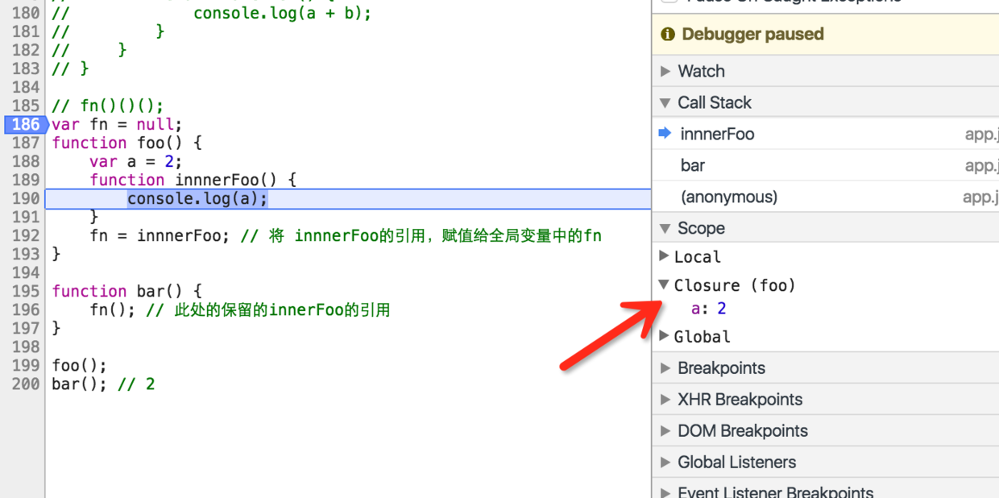

# 作用域是什么

## 概述
1. 计算机存储变量，但需要有一个规则寻找变量位置，这套规则就是作用域
1. 从编译原理角度看传统语言编译
    - 代码执行前需要经历3个步骤
    - 分词/语法分析
        - 将字符分解为对语言有意义的代码块，如程序`var a = 2`，可能会被分为`var、a、=、2`，这4个词法单元
    - 解析/语法分析
        - 将词法单元生成"抽象语法树"（AST）
    - 代码生成
        - 将AST转换为代码生成，如将`var a = 2`转换为机器指令
1. js引擎要复杂的多，在词法分析和代码生成阶段有特定步骤对运行性能进行优化

## 理解作用域
1. `var a = 2`的理解

    - 引擎会将此句分为编译与运行两个部分
    - 编译阶段
        - var a
        - 判断作用域（当前作用域，不向上查找）有a否，无则当前作用域（要有var关键字才会）声明一个
        - 创建 a = 2为运行期做准备
    - 运行阶段
        - 逐层查找作用域中的a
        - 查找到后进行赋值运算
1. 总结
    - 编译器会在当前作用域中声明一个变量（ 如果之前没有声明过）
    - 在运行时引擎会在作用域中查找该变量， 如果能够找到就会对它赋值
1. 编译器术语（理解）
    - 编译器查找变量需要作用域协助，但引擎执行（LHS或RHS）查找，会影响最终查找结果

    - LHS：左查询：找到变量，并对其赋值

    - RHS：右查询：仅获取变量值

    - 举例

    	```javascript
    	function foo(a) {
    	    console.log( a ); // 2
    	};
    	foo( 2 );
    	```

    	- foo(2)：进行RHS，获取foo值，是一个函数
    	- a=2，函数隐式赋值，进行LHS
    	- log(a)，在console对象进行RHS查询，是否有log方法
## RHS与LHS异常
1. 主要介绍LHS和RHS查询
1. RHS在所有作用域都查询不到，会抛出ReferenceError（未声明）错误
    - 如查询到变量，但对变量值进行不合理操作（应用null中的属性等），会抛出TypeError
1. LHS在所有作用域查询不到，会在全局作用域创建这个变量（非严格模式）
    - 严格模式禁止隐式或自动创建全局变量
1. 小结
    - ReferenceError：作用域鉴别失败
    - TypeError：作用域中有这个变量，但对结果操作不合法


# 作用域

## 概述

1. js定义变量，存在两种作用域，全局作用域与局部作用域

## 全局作用域

1. 在所有函数外声明，或在`{}`外声明的变量，定义在全局作用域上
2. 全局作用域的变量，可以在任何地方访问
3. const与let重复声明相同变量会报错，但var并不会
4. 在全局作用域声明变量很方便，最大的问题是变量名污染

## 局部作用域

### 概述

1. 使用局部作用域可以避免命名冲突
	- 全局命名空间
		- 为避免命名冲突，第三方库会声明一个独特的对象，将所有功能作为对象的属性或方法
	- 模块管理
		- 利用模块管理器（工具）
		- 这个工具会将第三方库标识符导入一个特定的作用域

### 函数作用域

1. 函数会为内部变量或函数创建作用域，故可以将任意一段代码包含在函数中，创建新作用域
2. 函数内定义的变量，只能函数内访问

#### 函数不能相互访问作用域

1. 在单独定义函数时，即使一个函数可以在另一个函数中使用，函数也不能访问彼此的范围

	```javascript
	function first () {
	  const a = `I'm part of first`
	}
	function second () {
	  first()
	  console.log(a) // Error, a is not defined
	}
	```


#### 匿名和具名
   1. 函数表达式可以匿名，声明不可（js中非法）

   1. 匿名函数缺点

	- 调试困难
	- 没有函数名，如事件无法解绑
	- 可读性差

1. 具名解决上述问题

	```javascript
	// 具名函数
	setTimeout( function timeoutHandler() {
	    console.log( "I waited 1 second!" );
	}, 1000 );
	// 匿名函数
	setTimeout( function () {
	    console.log( "I waited 1 second!" );
	}, 1000 );
	```

	- 上述两者没有本质区别    
### 块作用域

1. if，switch，for，while，不像function，用var声明不会产生新的作用域，但用let或const会产生新的作用域

2. 在`{}`内用const或let声明的变量，只能在`{}`中访问，但使用var声明的变量并不是

   ```javascript
    {
        const hello = 'Hello';
        var rex = 'rex';
        console.log(hello); // 'Hello'
        console.log(rex);  //  'rex'
    }
    console.log(rex);  // 'rex'
    console.log(hello); // Error, hello is not defined
   ```

#### 可形成块作用域的 

1. try-catch
	- ES3规范，catch会创建块作用域，声明只有在catch中有效
2. let声明
	- 将变量绑定到所在的任意作用域中（通常是{}内部）
	- let声明不存在声明提升
3. const声明
	- 也会创建块作用域

#### 暂时性死区

1. 如果区块中存在let和const命令，这个区块对这些命令声明的变量，从一开始就形成了封闭作用域。凡是在声明之前就使用这些变量，就会报错。

	```javascript
	var tmp = 123;
	if (true) {
	  tmp = 'abc'; // ReferenceError
	  let tmp;
	}
	```

	- 虽然存在全局变量tmp，但块作用域又用let声明了局部变量tmp，导致后者绑定在块作用域上
	- let在声明前使用tmp会报错

### 词法作用域

#### 概述

1. 由你写代码时将变量和作用域块写在哪里来决定的
2. 作用域查找，总是在运行处的最内部作用域开始，逐级向上进行
   3. 无论函数在哪调用，如何调用，他的词法作用域都只是由函数声明处的位置决定
4. 动态作用域：程序运行在哪调用而确定作用域

#### 举例

1. js使用的是词法作用域

	```javascript
	var a = 2;
	function foo() {
	    console.log(a); // 会输出2
	}
	function bar() {
	    var a = 3;
	    foo();
	}
	bar();
	```

	- 根据词法作用域，foo中的a会找到a=2这个值

#### 嵌套作用域

1. 当在另一个函数中定义函数时，内部函数可以访问外部函数的变量。

	```javascript
	function outerFunction () {
	  const outer = `outer`
	  function innerFunction() {
	    const inner = `inner`
	    console.log(outer) //  outer
	  }
	  console.log(inner) // Error, inner is not defined
	}
	```

#### ~~欺骗语法(废弃)~~

1. 因作用域在写代码期间确定，如何在运行期修改作用域呢，可以使用如下两个函数

	- 但这两种方法会导致性能下降，已经废弃使用

2. ~~eval()函数~~

	- 相当于就在代码原来位置，来确定作用域

		```javascript
		function foo(str, a) {
		    eval( str ); // 欺骗！
		    console.log( a, b );
		}
		var b = 2;
		foo( "var b = 3;", 1 ); // 1, 3
		```

		- 相当于在foo函数中利用var b = 3声明并赋值了b

3. ~~with关键字~~

	- with代码会创建一个新的作用域，对赋值运算进行LHS查询

		```javascript
		function foo(obj) {
		    with (obj) {
		        a = 2;
		    }
		}
		var o2 = {
		    b: 3
		};
		foo( o2 );
		console.log( o2.a ); // undefined
		console.log( a ); // 2 不好， a 被泄漏到全局作用域上了！
		```

		- with中的a会进行LHS查询（非严格模式下），查询不到，会在全局创建一个变量a，运行期间为其赋值
		- 本质是：一个对象的引用当作作用域来处理， 将对象的属性当作作用域中的标识符来处理， 从而创建了一个新的词法作用域

4. 严格模式下

	- 禁用with，间接非安全使用eval()被禁用

5. 性能

	- 因不知道eval和with如何更改作用域，引擎会选用悲观策略，减少对代码优化
	- 大量使用会造成代码很慢

# 作用域链

## 概述

1. 保证了当前执行环境对符合访问权限的变量和函数的有序访问。

## 举例

```javascript
var a = 20;
function test() {
    var b = a + 10;
    function innerTest() {
        var c = 10;
        return b + c;
    }
    return innerTest();
}
test();
```

1. innerTest的作用域链为

	

# 闭包

## 概述
1. 闭包是基于词法作用域书写代码时所产生的自然结果
1. 当函数可以记住并访问所在的词法作用域时，就产生了闭包，即函数是在当前词法作用域之外执行
2. 由于闭包会携带包含他的函数的作用域，因此会比其他函数更占用内存，小心内存泄露问题，如闭包的作用域链保存一个HTML元素，那么意味着该元素无法销毁（不会被回收）

## 闭包形式
1. 形式1:

	```javascript
	function foo() {
	    var a = 2;
	    function bar() {
	        console.log(a);
	    }
	    return bar;
	}
	var baz = foo();
	baz();
	```

	- foo()运行返回bar函数定义给baz，baz()相当于用不同标识符调用bar函数

2. 形式2：

	```javascript
	function foo() {
	    var a = 2;
	    function baz() {
	        console.log(a);
	    }
	    bar(baz);
	}
	function bar(fn) {
	    fn();// 这就是闭包
	}
	foo(); // 2
	```

	- 无论使用何种方式对函数类型的值进行传递， 当函数在别处被调用时都可以观察到闭包

3. 形式3:

	```javascript
	var fn;
	function foo() {
	    var a = 2;
	    function baz() {
	        console.log(a);
	    }
	    fn = baz;
	}
	function bar() {
	    fn();
	}
	foo(); // 将内部函数baz赋值给全局变量fn
	bar(); // fn调用，2
	```

	- 无论通过何种手段将内部函数传递到所在的词法作用域以外， 它都会持有对原始定义作用域的引用， 无论在何处执行这个函数都会使用闭包

4. 定时器例子

	```javascript
	function wait(message) {
	    function timer() {
	        console.log(message);
	    }
	    setTimeout(timer,1000);
	}
	wait("hello world!");
	```

	```javascript
	function wait(message) {
	    function timer() {
	        console.log(message);
	    }
	    bar(timer,1000);
	}
	function bar(fn) {
	    fn();
	}
	wait("hello world!");
	```

	- 对于一个定时器代码，可以改写为代码2形式，其中bar函数就相当于setTimeout函数，在函数内部对timer进行调用
	- 定时，事件监听，Ajax请求等，用到回调的都是在使用闭包


## 循环和闭包
```javascript
for(var i = 1 ; i <= 5 ; i++){
    setTimeout(function timer() {
        console.log(i); // 结果输出5次6
    },1000)
}
```
1. for循环开始运行前，会先将var i 声明提前，得到如下形式：

	```javascript
	var i ;
	for(i = 1 ; i <= 5 ; i++){
	    setTimeout(function timer() {
	        console.log(i); // 结果输出5次6
	    },1000)
	}
	```

	

1. 然后开始运行for循环，每次运行时，都是往事件队列里添加一个定时器

1. 注意：for的运行机制，当i=5时，进入循环，然后i++；此时i=6，不满足i<=5的条件，退出循环，这时for循环结束，开始运行定时器

1. 运行定时器时，需要查询变量i的值，故查询到最外层的i=6

1. 主要问题是：回调函数中的i引用了外部作用域同一个i

1. 解决办法是：为每个for循环新创建一个作用域

```javascript
for(var i = 1 ; i <= 5 ; i++){
    (function () {
        setTimeout(function timer() {
            console.log(i);
        },1000);
    })()
}
```
1. 利用IIFE声明新的作用域是创建作用域最容易办法，但这样并不起作用
1. 原因是：循环很快结束，延迟函数同样在循环结束后运行
1. 虽然每个setTimeout有一个新作用域，但没有i的声明，console.log(i)每次同样会找到外部共享的i

```javascript
for(var i = 1 ; i <= 5 ; i++){
    (function () {
        var j = i;
        setTimeout(function timer() {
            console.log(j);
        },1000);
    })()
}
```
1. 程序顺序执行，只是回调的timer会最后执行
1. 当执行到var j=i；当前新作用域会复制当前循环的i值
1. 当timer回调时，j则是当前作用域的值

```javascript
for(var i = 1 ; i <= 5 ; i++){
    (function (i) {
        setTimeout(function timer() {
            console.log(i);
        },1000);
    })(i)
}
```
1. 因为IIFE其实就是一个函数，```(function(){})(i)```中的i为外部引用的i，(function(i){})()中的i为形参
1. 相当于利用了隐式的赋值，i=i，保存了每次循环的i值

## 重返块作用域
1. 利用IIFE创建一个新的作用域，即每次迭代需要一个块作用域，故可以使用let完美解决这个问题

	```javascript
	for (let i=1; i<=5; i++) {
	    setTimeout( function timer() {
	    	console.log( i );
	    }, i*1000 );
	}
	```

2. babel对于let的解析其实是：

	```javascript
	"use strict";
	var _loop = function _loop(i) {
	  setTimeout(function timer() {
	    console.log(i);
	  }, i * 1000);
	};
	for (var i = 1; i <= 5; i++) {
	  _loop(i);
	}
	```

	- 通过函数调用的方式，将i变量进行保存
## 模块
1. 概述

    - 模块利用了闭包的强大威力，但表面与回调无关
1. 简单的模块
    ```javascript
    function foo() {
            var a = "rextao";
            var arr = [1,2,3];
            function say() {
                console.log(arr.join("!")+a);
            }
            return {say :say}
        }
        var b  = foo();
        b.say();
    ```
    - foo是一个函数，必须调用才能创建一个模块实例
    - foo返回对象包含内部函数而不是内部变量的引用，相当于公共API

1. 单例模块
    ``` var b = (function foo (){})() ```
1. 模块也是普通函数，同样可以接受参数
1. ES6为模块增加语法支持
    - 函数版模块缺点
        - 它们API语义只有在运行时才会被考虑进来
        - ES6模块API更稳定，编译器可以提前发现错误
1. 动态作用域
	- 词法作用域是在写代码或定义时确定的，动态作用域是在运行时确定的
	- 词法作用域关注声明，而动态作用域关注函数从何调用

## 如何在chrome查看闭包



1. 可以通过scope看到，当前innerFoo具有foo的作用域