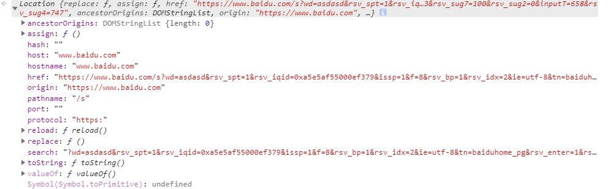

# BOM
## window对象
### 全局作用域
1. BOM核心对象是window，表示浏览器的一个实例
1. 全局作用域声明的变量，函数都会变成window的属性和方法
1. 全局变量与直接在window对象上定义属性是有差别的：
	- 全局变量不能用delete删除，直接在window对象上定义的可以
1. 尝试访问未声明的变量会抛出错误，但通过查询window对象，如window.old，可以知道这个变量（old）是否存在

### 窗口关系及框架
1. 页面中有框架，则每个框架都拥有自己的window对象，并保存在frames集合中
1. top对象：
	- 始终指向最高（最外）层框架，即浏览器窗口
1. parent对象
	- 始终指向当前框架的直接上层框架
1. self对象：
	- 和window对象一样，可以相互使用
1. 每个框架有自己一套的构造函数，构造函数一一对应，但不相等

### 窗口位置
1. 用来确定和修改window对象位置的属性和方法有很多，但有兼容性问题

1. 因为兼容性问题，无法跨浏览器条件下取得窗口左边和上边的精确位置

1. moveTo()

	- 按照绝对位置移动窗口

1. moveBy()

	- 按照相对位置移动窗口（重复调用，会一直移动，但moveTo则不会）

1. demo

	```javascript
	myWindow=window.open('','','width=200,height=100');
	 myWindow.moveBy(250,250);
	```

	

### 窗口大小
1. 跨浏览器确定一个窗口大小不是一件容易的事
1. resizeTo()
	- 绝对大小调整浏览器窗口
1. resizeBy()
	- 相对大小调整浏览器窗口
1. 窗口大小与位置移动只能用于window.open打开的窗口，并且打开的窗口不含tab页

### 打开与关闭窗口

1. window.open();

	- 弹出窗口被屏蔽，window.open()会返回null或者报错
1. window.close();
	- 只能关闭window.open()打开的窗口，关闭后，窗口的引用还存在，可以检测closed属性，窗口引用没别的作用了
        ```javascript
        var win = window.open("http://www.baidu.com");
        win.close();  //关闭打开的百度窗口
        console.log(win.closed);  //true,打开的窗口关闭了
        ```
1. opener属性

    - 保存着打开它的原始窗口对象；但原始窗口并不记录它们打开的弹出窗口，如有必要，需要手动实现跟踪

### 定时器

#### setInterval 的问题

1. 问题1：某些func未执行

   - 如setInterval(func,100)，即100ms往队列添加一个事件，100ms后的某个事件，101ms，func调用；
     - 根据事件循环，100ms添加一个定时器事件；在过了300ms后，应该t3创建，但此时t2创建的func还未执行完，故跳过t3创建

2. 问题2：使用 setInterval 时，func 函数的实际调用间隔要比代码给出的间隔时间要短

   

   - setInterval，比如设置100ms运行func一次，但如果func执行时间就是100ms，则实际调用时，则无函数间隔（不考虑事件循环）

3. 在Chrome/Opera/Safari中，弹窗会使周期时钟暂停

#### 递归setTimeout

1. 比setInterval更灵活，如服务器过载，可以降低请求频率

   ```javascript
   let delay = 5000;
   
   let timerId = setTimeout(function request() {
     // ...send request...
     if (request failed due to server overload) { 
       delay *= 2;
     }
     timerId = setTimeout(request, delay);
   }, delay);   
   ```

#### 时间间隔问题

1. 利用递归形式的setTimeout，则可以保证函数间隔为100ms

   

#### 嵌套定时器的最小间隔

1. 在浏览器环境下，嵌套定时器的运行频率是受限制的。
2. 根据 [HTML5 标准](https://www.w3.org/TR/html5/webappapis.html#timers) 所言：“经过 5 重嵌套之后，定时器运行间隔强制要求至少达到 4 毫秒”。（原话是：Timers can be nested; after five such nested timers, however, the interval is forced to be at least four milliseconds. ）

####  setTimeout

1. `const timeoutId = window.setTimeout(function[,delay,param1,param2...])`
   - function：不建议使用字符串（最好传递函数），由于传递字符串可能导致性能损失
   - param1, ..., paramN：可选，定时器到时间后将参数传给function

##### 用例

1. 将耗费 CPU 的任务分割成多块，这样脚本运行不会进入“挂起”状态。
2. 进程繁忙时也能让浏览器抽身做其它事情（例如绘制进度条）。
   - 因为浏览器在所有脚本执行完后，才会开始“重绘（repainting）”过程。
   - 所以，如果运行一个非常耗时的函数，即便在这个函数中改变了文档内容，除非这个函数执行完，那么变化是不会立刻反映到页面上的。
3. 以上两种情况都可以利用setTimeout对任务进行分割

#### requestAnimationFrame

1. 见《Rex-ReadingNotes\2.HTML\2-HTML5\window.requestAnimationFrame.md》


### 系统对话框
1. 浏览器可以通过alert(),confirm(),prompt()调用系统对话框向用户显示信息
1. 外观由浏览器或操作系统设置决定，和css没关系
2. prompt对话框，可以根据用户输入内容转跳页面

## location
1. 只读属性，包含有关文档当前位置信息

1. 既是window对象属性，又是document对象属性

1. location.search属性:

    - 返回从问号到URL结尾的所有内容，但无法逐个访问其中每个查询字符串参数（通过自定义函数可以访问）

1. 改变浏览器位置：
    - location.assign("http://www.baidu.com"):打开新的URL，并产生历史记录
    - window.location = ""
    - location.href = ""
    - 上述三种方式效果完全一样

1. location.replace():

	- 不会产生历史记录，故用户不能返回到之前页面

1. location.reload():

	- 重新加载当前页，传入true参数，从服务器获取，否则先在缓存中获取

1. location.hostname：返回主页名

1. location.pathname：返回当前页面路径

1. location.protocol：返回页面的协议

1. demo：

    

## navigator
1. 用于请求运行当前代码的应用程序相关信息
2. 主要问题是：
    - Navigator信息可能会有问题；
    - 不同浏览器可以有相同名字
    - navigator数据可以被用户更改
3. navigator.cookieEnabled：判断浏览器cookie是否开启
4. navigator.appCodeName
    - 返回浏览器名
    - IE、chrome、safari返回的都是“Mozilla”
5. navigator.appName
    - 返回浏览器名
    - IE、chrome、safari返回的都是“Netscape”
6. navigator.product：返回浏览器引擎名
7. navigator.appVersion
    - navigator.userAgent
    - 浏览器版本
8. navigator.platform
    - 浏览器所在的操作平台
    - 可以用来区分移动端和pc端，但不是很好的方案
9. 检测插件

      - 非ie可以使用navigator.plugins数组

      - 典型做法是针对每个插件创建检测函数，而不是通用检测


## screen
1. 只用来表明客户端能力,如屏幕实际DPI，屏幕像素高度等
1. 屏幕宽高
    - screen.width
    - screen.height
1. 可用宽高
    - screen.availHeight
    - screen.availWidth
    - 屏幕高度去掉给永久占用的标题栏
1. 屏幕颜色深度
    - screen.colorDepth
    - 使用配色方案，26bit还是32bits
1. 像素深度
    - screen.pixelDepth
    - 现代浏览器与屏幕颜色深度是相等的

## history
1. 保存用户上网的历史记录，从窗口被打开算起
1. go():
	- go("www.baidu.com")：跳到历史记录中包含该字符串的第一个位置
	- go(n):前进n页
	- go(-n)：后退n页
1. history.back()：后退,类似于go(-1)
1. history.forward()：前进，类似于go(1)
1. length属性:保存历史记录数量
1. html5 新增了pushstate等（参见：2.HTML\2-HTML5\README.md）


# 客户端检测
## 概述
1. 是一种补救措施，更是一种行之有效的开发策略
1. 先设计最通用的方案，再使用浏览器检测技术对特定浏览器，将方案进行增强

## 能力检测
1. 主要是识别浏览器能力，而不是识别特定浏览器
1. 要先先检测达到目的最常用的特性
1. 对于检测某种特性是否按照适当方式形式非常有用
1. 检测某几个特性并不能确定浏览器

## 怪癖检测
1. 想知道浏览器有什么bug

## 用户代理检测
1. 用户代理字符串是作为响应首部发送的
1. 但由于历史问题，通过用户代理字符串检测特定浏览器不是一件容易的事
