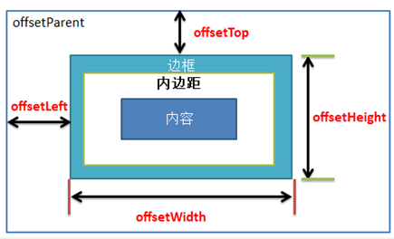
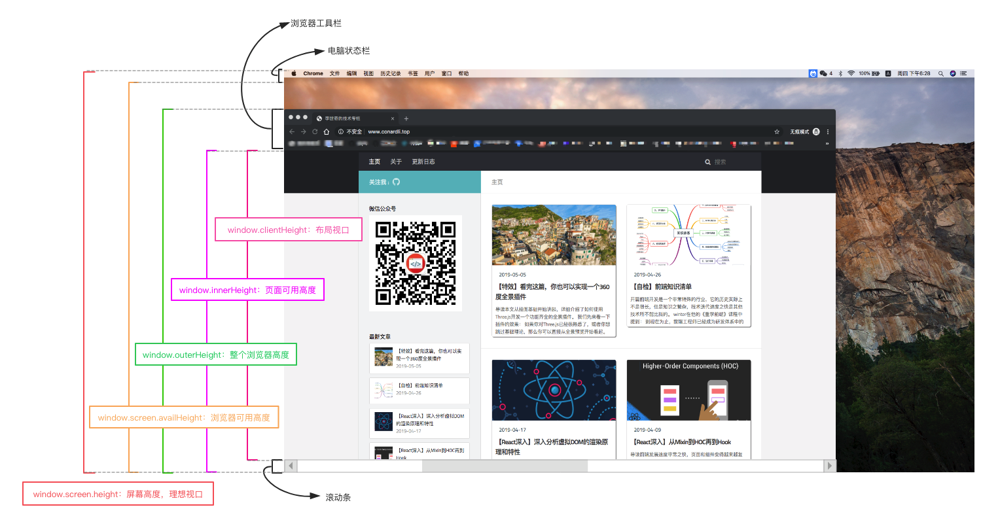
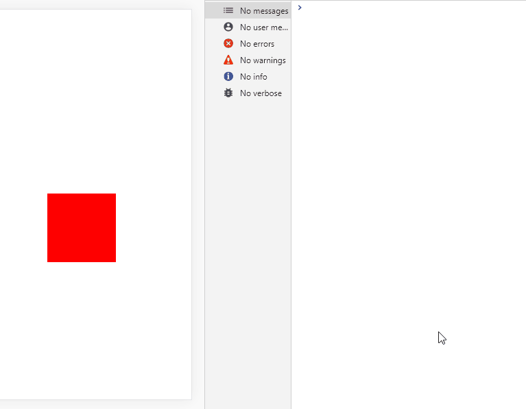
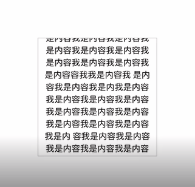
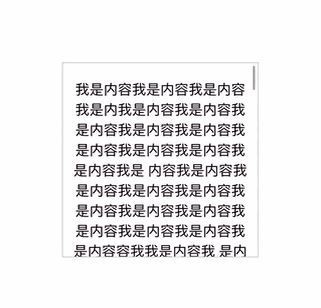

# DOM
## 概述
1. DOM是针对HMTL和XML的API，是W3c标准
1. IE中的DOM是用COM实现的，故与js原生对象的行为特点和活动特点并不一样
2. Document Object代表你的网页，如果要访问HTML网页的任何元素，通常是通过这个对象

## 节点层次
### Node类型
1. js中所有节点类型都继承自Node类型

1. 节点类型在Node类型定义的12个常量中，IE不能使用常量

1. nodeType属性：
  - 用来区分不同类型的节点，比如元素、文本、注释。
   - | 常量                             | 值   | 描述                           |

    	 	| -------------------------------- | ---- | ------------------------------ |
  
    | Node.ELEMENT_NODE                | 1    | 一个元素节点                   |
    | Node.TEXT_NODE                   | 3    | 文本                           |
    | Node.PROCESSING_INSTRUCTION_NODE | 7    | xml的processingInstruction声明 |
    | Node.COMMENT_NOD                 | 8    | 注释节点                       |
    | Node.DOCUMENT_NODE               | 9    | Document节点                   |
    | Node.DOCUMENT_TYPE_NOD           | 10   | DocumentType节点               |
    | Node.DOCUMENT_FRAGMENT_NOD       | 11   | DocumentFragment 节点          |

  - 2、4、5、6、12这几个值在DOM4规范已经移除

1. nodeName属性：

  - 返回当前节点的节点名称，html中返回值为大写

1. childNodes属性

  - 每个节点有一个childNodes属性，保存一个NodeList对象，并不是Array实例，DOM结构的变化会自动反应在NodeList对象上

1. parentNode属性

  - 文档树的父节点

1. previousSibling和nextSibling属性

    - 同胞上一个或下一个

1. firstChild和lastChild属性

    - 返回该节点的第一个或最后一个子节点，如果该节点没有子节点则返回`null`。

1. 节点操作

    - node.appendChild(child)：插入节点
    - node.removeChild(child)：从DOM中删除一个子节点
    - parentNode.insertBefore(newNode, referenceNode);
    -  parentNode.replaceChild(newChild, oldChild)：替换节点

1. cloneNode()
    - 复制节点副本
    - 参数：true，复制节点及其子节点
    - 参数：false，复制当前节点
    - 不会复制js属性，如事件处理程序等，建议使用时移出事件处理程序

1. contains(otherNode)方法

      - 查询一个节点是否为另一个节点的后代

### Document类型
1. 概述
	- js通过document表示文档，浏览器中document对象是window对象一个属性
	- Document类型最常见的应用是作为HTMLDocument实例的document对象
1. 标准document
    - documentELement属性：指向html元素
    - childNodes列表：访问文档元素
    - documentType子节点：访问<!DOCTYPE>，有兼容性问题
1. 作为HTMLDocument实例
    - 提供一些标准document没有的属性和方法
    - URL属性：页面完整URL（地址栏显示的URL）
    - domain属性：只包含页面的域名
    - referrer属性：返回来源页面的URI
    - getElementById()
        - 多个id，只返回文档第一次出现的元素
    - getElementsByTagName()
        - HTML文档中，返回HTMLCollection对象
        - namedItem()方法：获取对象中的项p257
    - getElementByName()
        - HTMLDocument特有
        - 最常用的是取得单选按钮，保证发给服务器单选按钮有相同的name特性
    - 文档写入能力
        - 将输出流写入网页的能力
        - write()
        - writeln()：在每行后面加了换行
        - 上述两个方法会重写整个页面

### Element类型
1. 用于表现XML和HTML元素，提供元素标签名，子节点和特性访问
1. 访问元素的标签名
	- nodeName属性
	- tagName属性
	- 两者返回值相同，HTML中返回值为全部大写
1. HTML元素
    - 所有的HTML元素是由HTMLELement元素或其子类型表示
    - HTML中的class是用className表示的，因为class是保留字，所以访问class要div.className
1. 创建元素：domcument.createELement("div")
1. 元素子节点
    - 元素可以有任意数目子节点和后代节点
    - 注意：如ul里面计算li数目，非ie浏览器会计算li与li之间的空白节点；计算节点数目时候，要注意浏览器的差异，可以通过判定nodeType=1来计数
1. getAttribute()
    - 返回元素上一个指定的属性值。如果指定的属性不存在，则返回  `null` 或 `""`（空字符串）
    - 传递参数要和HTML实际特性名相同，如class，应该传递class，而不是className
    - 特性名称不区分大小写，“ID”与“id”代表同一特性
    - 根据HTML5规范，自定义特性应加data-前缀以便验证
    - 只有公认的特性（非自定义的）才可以通过DOM对象属性访问，如id是div的公认属性，通过div.id可以得到，但my_index为自定义属性，获取不到
        ```HTML
        <div id="test" my_index="i">hello world!!</div>
        ```
        ```javascript
        var div = document.getElementById("test");
        div.id //test
        div.my_index // undefined
        ```
    - 通过属性值访问和getAttribute()返回值不同
      - div.style：访问返回对象
      - getAttribute("style"):返回是style属性包含的css文本
      - 
      - div.onclick:属性访问返回js函数
      - getAttribute("onclick"):返回是代码字符串
      - 
    - 通常只有在自定义属性时候会用getAttribute，平时使用对象属性

1. 设置与删除属性
    - setAttribute(name, value)
        - div.mycolor="red";
        - 不会自动成为元素的特性；即div.getAttribute("mycolor")为null
    - removeAttribute()：删除属性和属性值

1. attributes属性
  - 返回该元素所有属性节点的一个实时集合
  - element类型是使用attributes属性的唯一一个DOM节点类型
   - 返回结果是一个NameNodeMap对象（
   - 可以遍历元素的特性
       - 不同浏览器返回的顺序可能不同

### Text类型
1. 概述
    - 包含的是可以按照字面解释的纯文本内容，包含转义后的HTML字符，但不能包含HTNL代码
    - parentNode是一个ELement，不支持子节点
    - 可以通过nodeValue属性或data属性访问Text节点内包含的文本
    - 开始与结束标签之间只要存在内容，就会创建一个文本节点(有空格也会)
    - 文本节点存在于文档树中，修改文本就会立即显示，文本结果的输出会按照HTML文档类型编码
    - 故在向DOM文档树中插入文本之前，对其进行HTML编码是一种十分有效的方式
1. 创建文本节点
    - document.createTextNode()
1. 规范化文本节点
    - normalize()
        - 将相邻所有文本节点合并成一个节点
    - 浏览器在解析文档时，永远不会创建相邻的文本节点
1. 分割文本节点
    - splitText()：将一个文本节点分成两个文本节点
    - 分割文本节点是从文本节点中提取数据的一种常用DOM解析技术

### comment类型
1. div里面有注释节点，会被认为是div的一个子节点
1. 如果想访问注释节点，一定要保证他们是HTML元素的后代

### documentFragment
1. 是轻量级的文档，没有对应的标记，不像完整文档那样占用额外资源
1. 创建文档片段：document.createDocumentFragment();
1. 文档片段永远不会成为文档树的一部分
1. 如循环逐个给ul添加li，会导致浏览器反复渲染，可以将li添加到文档片段中，然后一起挂在ul下，文档片段的所有子节点会被删除并转移到ul元素中

### attr类型
1. 元素的特性在DOM以Attr类型表示
1. 他们也是节点，但特性不认为是DOM树的一部分
1. 一般使用getAttribute(),setAttribute(),removeAttribute();很少直接引用特性节点

- - -

# DOM扩展
## 概述
- 主要扩展是Selectors API和HTML5，都是来源于社区

## 选择符API
1. 概述
    - 通过css选择符匹配DOM元素
    - jQuery的核心是通过CSS选择符查询DOM文档取得元素的引用
    - W3C发起制定的一个标准，致力于浏览器原生支持CSS查询
1. Level 1 核心方法
    - querySelector();返回与模式匹配的第一个元素
    - querySelectorAll();
        - 返回所有元素，返回一个NodeList实例
        - 如果未找到元素，NodeList为空
1. 元素遍历
    - 对于元素中间的空格，IE9之前版本不会返回文本节点，其他浏览器都会返回文本节点;
    - 为弥补这个差异，同时保证DOM规范不变，Element Traversal定义了一些新属性
    - childElementCount：返回子元素不包含文本节点和注释的个数
    - nextElementSibling：后一个同辈元素（不包括文本节点、注释节点），nextSibling（包括文本节点、注释节点即回车、换行、空格、文本等等）

##　专有扩展
1. 概述
    - 只有少部分浏览器支持，还不是标准
    - 具体支持情况需查看MDN或caniuse
1. 文档模式
    - IE8引入的
    - 页面的文档模式决定可以使用什么功能，使用什么级别的css，哪些js API
    - 要强制浏览器以某种模式渲染页面，可以使用HTTP头信息X-UA-Compatible或通过等价的<meta>标签设置
    - content="IE=Edge"表示始终使用最新的文档模式来渲染页面，忽略文档类型声明 
        ```html
        <meta http-equiv = "X-UA-Compatible" content="IE=Edge">;
        ```

1. children属性
    - 为了解决IE9之前处理文本节点中空白符与其他浏览器的差异，出现的这个属性
    - 只包含元素中同样是元素的子节点
1. 插入文本
    - innerText属性（2016 HTML标准）
        - 读模式：将子元素的全部文本取出，不包含html标记
    - outerText属性（非标准）
        - 使用这个设置会删除调用的元素，不建议使用
1. 注意：专有方法可能也会在将来被扩充到标准中，使用专有方法通常需要对浏览器进行能力测试等，避免使用的方法在某些浏览器中不能使用

# DOM2和DOM3
## 概述
   - DOM1级主要定义了HTML和XML文档的底层结构
   - DOM2和DOM3在这个基础上引入了更多的交互功能，支持更高的XML特性


## DOM变化
   - 概述
       - DOM2级核心，没有引入新类型，只是在DOM1基础上增加新方法和属性以增加既有类型
       - DOM3级核心，增强了既有类型，也引入了新类型
        - 针对命名空间的变化
       - 技术上HTML不支持命名空间，XHTML支持XML命名空间
       - 基本是在各个类型节点上，增加了命名空间的支持
       - DOM其他部分在DOM2核心也发生了变化，这些变化与命名空间无关，如下：
   - DocumentType变化
       - 新增publicId属性、systemId属性（前两个表示的是文档类型声明中的两个信息段）、internalSubset属性（用于访问包含在文档声明中额外定义的信息）
        文档类型声明的两个信息，很少用
   - Document类型变化
       - importNode()方法
            - 从一个文档中获得一个节点，导入另一个文档，使其成为文档结构的一部分
            - 每个节点都有ownerDocument属性，表示所属文档，如果文档不一样，使用appendChild()会出错
            - HTML中用的不多
       - defaultView属性
            - IE之外浏览器支持，IE使用parentWindow属性
            - 表示文档的归属窗口
       - createDocumentType()方法
            - 由于既有文档的文档类型不能更改，所以这个方法要在创建新文档时候有用
       - createDocument()方法
            - 创建新文档
       - createHTMLDocument()方法
            - 创建完整的HTML文档，包含<html>,<head>
   - Node类型变化
       - isSupported():当前节点具有什么能力；DOM2
       - isSameNode():两个节点是否引用同一对象
       - isEqualNode():两个节点是否具有相同类型，相同属性
   - 框架变化
       - DOM2级，HTMLFrameElement和HTMLIFrameELement都有一个属性contentDocument
       - 指向框架内容的对象，之前只能通过frames集合获得
       - IE8之前不支持这个属性，支持一个contentWindow属性，要访问文档对象要contentWindow.document
       - 所有浏览器都支持contentWindow属性
       - 访问框架或内联框架的文档对象要受到跨域安全策略的限制

## 遍历
1. 概述
    - DOM2级，定义了两个辅助完成顺序遍历DOM结构的类型
    - 能够基于给定起点对DOM结构执行深度优先的遍历操作
    - IE不支持遍历
    - 遍历以给定节点为根，不会向上超过DOM树的跟节点，如以body开始，不会遍历到不属于body的子节点，遍历body，第一个节点是body
1. NodeIterator
    - document.NodeIterator()方法
      - 创建新实例
      - 参数:root:要搜索起点的树中的节点
      - 参数：whatToShow:表示要访问节点的数字代码（有规范，必须是规范中几个，多个可以用  |  连接）
      - 参数：filter：NodeFilter对象，表示是拒绝还是接受某个节点；如不指定过滤器，可以传null
      - 参数：entityReferenceExpansion：表示是否要扩展实体引用，HTML页面中无用
    - nextNode()方法
       - 向前前进一步
       - 第一次调用返回跟节点，最后一次调用返回null
    - previousNode():向后后退一步
1. TreeWalker
    - document.createTreeWalker()方法
        - 创建实例
        - 参数与上面类似
        - 第三个参数，过滤器返回可以是拒绝，跳过，或跳过整个子树
    - 真正强大的地方是能够在DOM结构中沿任意方向移动
1. 因为遍历方法IE不支持，故跨浏览器解决方案中很少用

## 范围
1. 概述
    - 通过范围可以选择文档的一个区域，而不用考虑节点界限
    - 选择后台完成，用户不可见
    - 常规DOM操作不能有效更改文档时，使用范围往往可以达到目的
    - IE使用专有特性实现范围特性
1. DOM中的范围
    - createRanger()
        - 来创建DOM范围
        - 与节点类似，创建的新范围与创建它的文档关联在一起，其他文档不能使用
    - 用DOM范围实现简单选择
        - selectNode():选择整个节点
        - selectNodeContent():只选择节点的子节点
    - 用DOM范围实现复杂选择
        - 使用setStart和setEnd方法
        - 接收参数：一个是参照节点，一个是偏移量
    - 操作DOM范围中的内容
        - 创建范围时，内部会为这个范围创建一个文本片段
        - 范围自身知道缺少哪些开标签或闭标签，能够重新构建有效的DOM结构
        - deleteContents()方法
            - 从文档中删除范围内容
        - extractContents()方法
            - 删除范围内容，但会返回被删除的内容
            - 可以将返回的片段添加到其他元素后，但插入的是片段的子节点，而非片段本身
        - cloneContents()方法
            - 返回的是范围中节点副本，而不是实际节点
    - 插入DOM范围中的内容
        - 使用insertNode()方法
        - 可以向范围选区的开始处插入一个节点
    - 折叠DOM范围
        - 折叠范围，范围中未选择文档的任何部分
        - 在折叠范围时，位置会落到文档的两部分之间
        - collapse()方法
            - 参数：true：折叠到范围的起点
            - 参数：false：折叠到范围终点
        - collapsed属性:判断是否折叠好
        - 判断某个范围是否处于折叠状态，可以帮我们确定范围中的两个节点是否紧密相连
    - 比较DOM范围
        - compareBoundaryPoints():确定范围是否有公共边界
    - 复制DOM范围
        - cloneRange()方法
            - 创建调用它的副本
            - 修改它的端点，不会影响原来的范围
    - 清理DOM范围
        - 使用完范围，最好调用detach()方法
            - 将范围从文档中分离出，一旦分离，则不能恢复
        - 分离范围后，就可以放心的解除对范围的引用，range = null

# 样式（CSSOM ）

## 概述

1. 最初在DOM Level 2 style定义，后这些接口统一为一个规范CSS Object Model（CSSOM）
2. CSS对象模型是一组用JavaScript操作CSS的API，允许用户动态地读取和修改CSS样式。 

## 访问元素样式(style对象)

1. `document.body.style.background = 'lightblue';`
   - style对象可以设置并读取样式，但只对内联样式有作用
   - **不包括外部和嵌入样式表的样式**
2. 需要用驼峰法对css属性进行转换，float在js是保留字，使用cssFloat，如需要兼容ie8是styleFloat
3. 在标准模式下，度量值必须指定单位，混杂模式，不设置默认为px，**一定要设置单位（之前有忘记设的坑）**
4. 没有设置style特性的元素，style对象可能包含一些默认的值，但不能准确反映样式信息
5. 因此，通常很容易使用`document.body.style`添加属性

## 计算样式getComputedStyle()

### 使用方法

1. `window.getComputedStyle(document.body).background; `
2. `window.getComputedStyle(el)['background-color'];`（不推荐使用，代码编辑器可以会提示）
3. `window.getComputedStyle(el).getPropertyValue('background-color') `
4. 通过3中方式可以获取body计算样式值

### 主要问题

1. 方法会返回过多的值，可能很多值并不是需要的
   - 比如`window.getComputedStyle(document.body).background`返回结果是：`"rgba(0, 0, 0, 0) none repeat scroll 0% 0% / auto padding-box border-box"`
   - 对于综合属性（如border，background等），因为不同浏览器解析方式不同，返回结果可能实际不同
2. 可能返回并不是样式定义的值
   - 比如`height`和`width`，如果样式中没有定义，也会返回实际的尺寸
3. 计算样式是只读的，不能修改计算后样式对象中的CSS属性

### 获取伪元素样式

1. `window.getComputedStyle(box, '::before').width; `，getComputedStyle第二个参数可以传入伪元素


## CSSStyleDeclaration API

### 概述

1. 用style对象`document.body.style`或`window.getComputedStyle(document.body)`返回的是CSSStyleDeclaration的对象

### 主要属性

#### cssText属性

1. 读模式：访问style特性中css代码的内部表示
2. 写模式：重写整个style特性值
3. 可以一次性应用所有变化

#### length属性

1. 与item()方法配套使用，遍历CSS属性
2. 在使用length时，sytle对象相当于一个集合，可以使用[ i ]
3. 取得的是CSS属性名background-color

### 主要方法

#### setProperty ()

1. `box.style.setProperty('color', 'orange'); `

#### getPropertyValue()

1. `box.style.getPropertyValue('color') `
2. 获得属性名对应的属性值
3. 获得的始终是字符串

#### item()

1. `box.style.item(index)`
2. 返回第index个元素的属性名

#### removeProperty()

1. 移除属性

#### getPropertyPriority() 

1. 获取内联属性是否有`! important`
2. 如`<div class="box" style="border: solid 1px red !important;"> `则border-right、border-left、border等，这个属性都会返回Important

## CSSStyleSheet API

### 概述

1. style对象只能访问内联属性，getComputedStyle获取的样式信息过多（默认信息也会返回）
2. CSSStyleSheet API，它允许检索具有可读和可写值的样式表，而不仅仅是用于内联样式。 
3. 获取文档包含的样式表数量
   - document.styleSheets.length；
4. 获取某个样式表的引用
   - document.styleSheets[0]; 

### CSSRule

#### 概述

1. cssRule接口表示样式表中的每一条规则，` document.styleSheets[0].cssRules `获取某个样式的表的规则，返回值是一个包含有序CSSRule对象的CSSRuleList 数组，每个数据项是一个CSSRule

2. 可以通过循环获取样式表的全部样式信息

   ```javascript
   let myRules = document.styleSheets[0].cssRules,
       p = document.querySelector('p');
   for (i of myRules) {
     if (i.type === 1) {// 1表示Css常量
       p.innerHTML += `<code>${i.selectorText}</code><br>`;
     }
   }
   ```

#### CSSRule常量

1. CSSRule.type：只读，表示CSSRule常量定义的css规则
2. cssRule常量，常用的有
   - CSSRule.STYLE_RULE = 1：普通样式，大多数情况下，style属性就能满足需求
   - CSSRule.MEDIA_RULE = 4 ：media的样式
3. 注意：不同的常量，返回的值实现了不同接口
   - CSSRule.MEDIA_RULE，返回的是CSSMediaRule（实现了CSSConditionRule接口）；
   - CSSRule.STYLE_RULE 返回的是CSSStyleRule（实现 CSSRule接口）
4. 可以通过不同的类型，操作@frame，@media等，但有的方法浏览器可能支持并不好

#### CSSRule.cssText

1. 获取样式规则，对于上面循环例子，使用cssText的结果如下：

   ```css
   * { box-sizing: border-box; }
   body { font-family: Helvetica, Arial, sans-serif; font-size: 1.5em; line-height: 1.4; padding: 0px 20px; }
   main { width: 1024px; margin: 0px auto !important; }
   .component { float: right; border-left: 1px solid rgb(68, 68, 68); margin-left: 20px; }
   ```

#### CSSStyleRule.selectorText

1. 获取样式规则的选择器，使用selectorText的结果

   ```
   *
   body
   main
   .component
   a:hover
   code
   ```

1. 此属性可以设置样式，比如

   ```javascript
   if (i.selectorText === 'a:hover') {
     i.selectorText = 'a:hover, a:active';
   }
   ```

   

### insertRule('string',index)

1. index默认为0，即插入到样式表最前面

2. string：要插入的完整样式，需要完整

   ```javascript
   let myStylesheet = document.styleSheets[0];
   console.log(myStylesheet.cssRules.length); // 8
   document.styleSheets[0].insertRule('article { line-height: 1.5; font-size: 1.5em; }', myStylesheet.cssRules.length);
   console.log(document.styleSheets[0].cssRules.length); // 9
   ```

3. 向现有样式表中添加新规则

4. 插入规则的次序在确定层叠之后应用到文档的规则时至关重要

   

### deleteRule(index)

1. 删除某条规则
2. 删除规则和创建规则都不是web开发常见做法，考虑到删除规则会影响层叠效果，慎用

### 与CSSStyleDeclaration API关系

1. 通过`document.styleSheets[0].cssRules[0].style`可以返回CSSStyleDeclaration

2. ```htm
	<div style="color: lightblue; width: 100px; font-size: 1.3em !important;"></div>
	```

3. ```css
	.box {
	    color: red;
	    width: 100px;
	    font-size: 1.3em !important;
	}
	```

4. ```javascript
	console.log(document.styleSheets[0].cssRules[0].style.color);
	console.log(document.querySelector('div').style.color)
	```


# 元素大小

## offsetWidth,offsetHeight

1. 是一个只读属性，返回一个元素的布局宽度、高度
2. 结果为四舍五入整数
3. 表述元素的外尺寸：元素内容+内边距+边框(不包括外边距) 
4. 

## offsetLeft，offsetTop

1. 表示该元素的左上角（边框外边缘）与**已定位的父容器**（offsetParent对象）左上角的距离。
2. offsetParent元素是指元素最近的定位（relative,absolute）祖先元素,可递归上溯。
3. 

## clientWidth，clientHeight

1. 用于描述元素的内尺寸：元素内容+两边内边距
2. 结果为四舍五入整数
3. 
4. html宽度：document.documentElement.clientWidth（documentElement返回的是html元素）

## 一图胜千言



# 滚动行为

## 设置全局滚动条高度

1. 最常用的方法：

   ```javascript
   window.scrollTo(0, 0);
   
   // or
   window.scrollTo({
     left: 0,
     top: 100
   });
   ```

1. 也可以利用`相对滚动`设置：

    ```
    window.scrollBy(0, 0);

    // or
    window.scrollBy({
    left: 0,
    top: 100
    });
    ```

1. 或者利用`scrollTop`设置：

    ```
    document.scrollingElement.scrollTop = 100;
    ```

    - 注意：`scrollTo`跟`scrollBy`的参数是一样的，区别就是`scrollBy`滚动距离是相对与当前滚动条位置进行滚动


## 指定元素显示在视窗

1. 最常用的方法：

    ```
    // 获取元素的offsetTop(元素距离文档顶部的距离)
    let offsetTop = document.querySelector(".box").offsetTop;

    // 设置滚动条的高度
    window.scrollTo(0, offsetTop);
    ```

1. 或者用锚点：

    ```
    <a href="#box">盒子出现在顶部</a>
    <div id="box"></div>
    ```

1. 或者利用`scrollIntoView`进行展现：

    ```
    document.querySelector(".box").scrollIntoView();
    ```

1. 指定元素的出现位置：

    ```
    // start出现在视口顶部、center出现在视口中央、end出现在视口底部
    document.querySelector(".box").scrollIntoView({
    block: "start" || "center" || "end"
    });
    ```

    


## 设置滚动平滑的过渡效果

1. 利用每个方法的`参数`设置：

    ```
    window.scrollTo({
    behavior: "smooth"
    });

    window.scrollBy({
    behavior: "smooth"
    });

    document.querySelector(".box").scrollIntoView({
    behavior: "smooth"
    });
    ```

1. 或者用`css`属性设置：

    ```
    html {
    scroll-behavior: smooth; // 全局滚动具有平滑效果
    }

    // 或者所有
    * {
    scroll-behavior: smooth;
    }
    ```
    - 注意：设置了该属性之后，所有方法都可以不用设置`behavior`参数了，二选一即可，因为都是`控制当前指定元素的滚动行为`，所以锚点跳转、设置`scrollTop`也具有平滑(`smooth`)的`滚动行为`


## scrollingElement

1. 该对象可以非常`兼容`地获取`scrollTop`、`scrollHeight`等属性，在`移动端`跟`PC端`都屡试不爽

2. 还记得当初写这个兼容性方法：

    ```
    let scrollHeight = document.documentElement.scrollHeight || document.body.scrollHeight;
    ```
1. 现在你只需要：

    ```
    let scrollHeight = document.scrollingElement.scrollHeight;
    ```
1. 因为在`MDN`中是这样介绍它的：标准模式返回`documentElement`，怪异模式返回`body`；

## 应用

### 滚动到底部

```
window.scrollTo({
  left: 0,
  top: document.scrollingElement.scrollHeight
});

// 如果你实在是懒的话...
window.scrollTo(0, 999999);
```

### 判断浏览器已滚动到底部

```
window.addEventListener("scroll", () => {
  let {
    scrollTop,
    scrollHeight,
    clientHeight
  } = document.scrollingElement;
  
  // 当前滚动高度 + 视口高度 >= 文档总高度
  if (scrollTop + clientHeight >= scrollHeight) {
    console.log("已到达底部");
  }
});
```


## 解决IOS设备局部滚动不顺畅(粘手)

1. 除了浏览器原生滚动，`自定义的滚动条`都会出现这种情况，加以下属性就可以解决：

    ```
    .box {
    -webkit-overflow-scrolling: touch;
    }
    ```
    

    


## 滚动传播

1. 指有多个`滚动区域`，当一个`滚动区域`滚动完之后，继续滚动会`传播到`到父区域继续滚动的行为：

    ```
    .box {
    overscroll-behavior: contain; // 阻止滚动传播
    }
    ```


## 横向滚动

```
<ul>
  <li>
    
  </li>
  // ...
</ul>

ul {
  white-space: nowrap; // 超出不换行
  overflow-x: auto;

  li {
    display: inline-block;

    img {
      display: block;
      width: 200px;
    }
  }
}
```


## 滚动结束后，强制滚动到指定元素

```
ul {
  scroll-snap-type: x mandatory;
  
  li {
    scroll-snap-align: start;
  }
}
```


1. 仔细看会发现，我们松手的时候，会将`最近的元素`滚动到最右边（初始位置，对于Y轴来讲就是顶部，X轴则是右边）

2. 也可以设置出现在中间：

    ```
    li {
    scroll-snap-align: center;
    }
    ```

    
