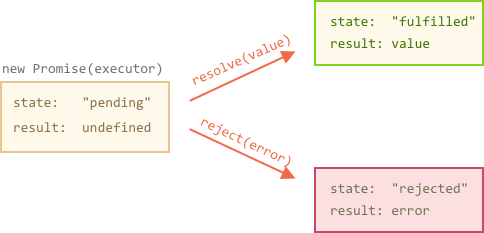
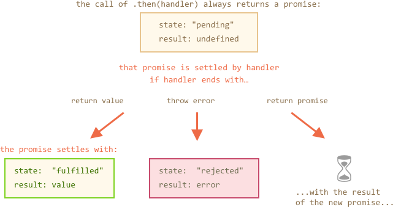

# 异步

## 现在与将来（异步铺垫）
### 概述
1. 程序中现在运行的部分和将来运行的部分之间的关系就是异步编程的核心
1. 任何程序都需要通过这样或那样方式控制时间间隔，如等用户输入，等从数据库读取数据

### 分块的程序
1. 从现在到将来的“等待”，最简单的方法是使用回调函数
1. 异步控制台
    - 浏览器可能会对控制台IO进行延迟，至于什么时候延迟是不确定的，故如console结果找不到头绪，可能是由IO的异步化造成的
    - 最好的调试办法是打断点，而不是console

    


### 并行线程
1. 异步是关于现在和将来的时间间隙，而并行是关于能够同时发生的事情。
1. Js 从不跨线程共享数据，不用考虑多线程编程的复杂度，不会有两个线程同时操作同一块内存
1. 完整运行
    - 如`foo();bar()`先后调用两个函数，foo运行开始，它所有代码都会在bar前运行
    - 如果存在多线程，且 foo() 和 bar() 中的语句可以交替运行的话，输出结果数目将会增加不少！

### 并发
1. 如果并发进程间没有相互影响的话，结果不确定性是完全可以接受的。

1. 如出现进程交互，需要对它们的交互进行协调以避免竞争出现
    ```javascript
    var res = [];
    function response(data) {
        res.push( data );
    }
    // ajax(..)是某个库中提供的某个Ajax函数
    ajax( "http://some.url.1", response );
    ajax( "http://some.url.2", response );
    ```
    - 先将url1放到res[0]中，url2放入res\[1]中，即使url1响应速度比url2快，但也无法保证url2先从服务器返回到浏览器

    - 可以通过协调交互顺序来解决这样的竞争，例如：

      ```javascript
      var res = [];
      function response(data) {
          if (data.url == "http://some.url.1") {
              res[0] = data;
          }
          else if (data.url == "http://some.url.2") {
              res[1] = data;
          }
      }
      // ajax(..)是某个库中提供的某个Ajax函数
      ajax( "http://some.url.1", response );
      ajax( "http://some.url.2", response );
      ```

      - 其实是为url1和url2分别指定res数组位置
      - 保证无论谁先返回，数组位置都是一致的
      - 此办法可以应用于并发函数调用共享DOM
        - 如foo为设置dom内容，bar为设置dom样式,要求先要更新了内容，才可以更新样式,可以利用上述代码形式

    

## 异步编程解决方案

### 事件发布/订阅模式

#### 高阶函数的应用

1. 如下Node的event模块

   ```javascript
   // 订阅
   emitter.on("event1", function (message) {
     console.log(message); 
   });
   // 发布
   emitter.emit('event1', "I am message!");
   ```

2. 订阅事件就是一个高阶函数的应用，本身这种模式并没有同步异步调用问题，但emit多数可能是异步触发的

#### 钩子机制

1. 事件侦听器模式也是一种钩子(hook)机制，利用钩子导出内部数据或 状态给外部的调用者

2. 例如`XMLHttpRequest`API，为每个请求创建一个请求对象，并登记事件处理函数

    ```javascript
    var req = new XMLHttpRequest();
    req.open('GET', url);
    req.onload = function () {
        if (req.status == 200) {
            processData(req.response);
        } else {
            console.log('ERROR', req.statusText);
        }
    };
    req.onerror = function () {
        console.log('Network Error');
    };
    req.send(); // Add request to task queue
    ```

    - `req.send()`实际是放入事件队列，顾此句可以直接在req.open后面进行调用（即先调用req.send，再调用req.onerror与req.onload也是可以的）
    - 对于http请求，程序员只需要将视线放在error、data、end这些业务事件点上即可，至于内部的流程（如何启动组件等）如何，无需过于关注

3. 事件方式处理异步请求适用于多次接受结果的情况，如只需要接收一次结果使用这样方式就会显得冗长，故回调函数变的流行

#### 解决雪崩问题

1. 雪崩问题，就是大量并发请求，导致缓存失效

2. 如站点刚启动，如下sql请求并发巨大，会导致同一条sql在数据库中查询多次

   ```javascript
   var select = function (callback) { 
     db.select("SQL", function (results) {
       callback(results); 
     });
   };
   ```

3. 利用once或状态标识符，解决这个问题

   ```javascript
   var status = "ready";
   var select = function (callback) {
     if (status === "ready") {
       status = "pending";
       db.select("SQL", function (results) {
         status = "ready";
         callback(results); 
       });
     } }
   ```

#### 多异步的协调问题

1. 一般是一个事件多个回调函数，但也可能一个业务需要依赖于多个事件的结果

   ```javascript
   var count = 0;
   var results = {};
   var done = function (key, value) {
     results[key] = value; count++;
     if (count === 2) {
       // 渲染页面
       render(results); }
   };
   fs.readFile(template_path, "utf8", function (err, template) {
     done("template", template);
   });
   db.query(sql, function (err, data) {
     done("data", data); 
   });
   ```

2. 可以利用偏函数对done函数进行封装

   ```javascript
   var after = function (times, callback) { 
     var count = 0, results = {};
     return function (key, value) {
       results[key] = value; count++;
       if (count === times) {
         callback(results); }
     }; 
   };
   var done = after(2, render)
   ```

#### 小结

1. 主要缺点是，使用此模式执行流程需要被预先设定
2. 如jquery常用的ajax，回调模式下，不设置succes会报错，无法执行ajax调用


### Promise/Deferred模式

1. jQuery 1.5 ajax可以使用deferred模式

   ```javascript
   $.get('/api')
     .success(onSuccess)
     .error(onError)
     .complete(onComplete);
   ```

   - 不带用success等，$.get也会执行
   - 通过Deferred对象，设置多个success

2. 此模式最早发布在CommonJS规范中，由于使用的越来越多，抽象出了Promises/A、 Promises/B、Promises/D这样典型的异步Promise/Deferred模型

# 回调

## 主要缺点

### 缺点一（顺序性）：

1. 大脑对于事情的计划方式是线性的、阻塞的、单线程的语义，但是回调表达异步流程的方式是非线性的、非顺序的，这使得正确推导这样的代码难度很大
2. 需要一种更同步、更顺序、更阻塞的的方式来表达异步，就像我们的大脑一样
3. 即书写回调函数的顺序并一定是实际函数调用顺序

### 缺点二（可信任性）：

1. 回调会受到控制反转的影响，回调暗中把控制权交给第三方来调用你的代码。如下c部分代码：

	```javascript
	// a
	ajax('',（）>={
	    //c
	})
	// b
	```

	- 这种控制转移导致一系列麻烦的信任问题
	- 比如回调被调用的次数会超出预期、少于预期、调用过早、调用过晚等。

2. 虽然可以通过在c中增加一些判断，通过一些手段可以信任问题，但会增加代码冗余

3. 需要一个通用的方案来解决这些信任问题

* * *

# Promise
## 概述

1. 同步执行的代码，不需要状态，代码要么执行成功，要么执行失败
2. Promise 本质上是一个绑定了回调的对象，而不是将回调传进函数内部 
3. 控制反转
   - callback 模式下，回调函数是由**业务层**传递给**封装层**的，**封装层**在任务结束时执行了回调函数
   - Promise 模式下，**业务层**并没有把回调函数直接传递给**封装层**( Promise 对象内部)，**封装层**在任务结束时，通过 resolve 或 reject 来通知到  **业务层**，**业务层**自己在 then() 或 reject() 里面去控制自己的回调执行。

### 对于x+y
1. 如存在异步，则可能会出现2种以上的结果，在运算x+y时，如y值还不存在，可能NaN

1. 回调的解决办法

    ```javascript
    function add(getX,getY,cb) {
        var x, y;
        getX( function(xVal){
            x = xVal;
            if (y != undefined) {// 两个都准备好了？
                cb( x + y ); // 发送和
            }
        });
        getY( function(yVal){
            y = yVal;
            if (x != undefined) {// 两个都准备好了？
                cb( x + y ); // 发送和
            }
        });
    }
    ```

    - 相当于把x，y都当做未来值，保证add函数结果可预测性

1. Promise的解决办法

    - promise机制相当于内置了等待，会等待x，y值，然后进行决议
    - promise决议后，值是不会改变的，可以传给第三方
    - Promise 是一种封装和组合未来值的易于复用的机制
### Promise状态

1. promise状态只能改变一次，然后就不再改变
2. promise总是在如下三种状态之一

#### Pending

1. 每个创建的promise都会无限期的处于pending状态，直到它resolved或rejected

#### Resolved

1. resolve后需要调用then方法

#### Rejected

1. reject 后需要调用catch方法

## 具有 then 方法的鸭子类型

1. 在使用Promise一个重要细节是如何确定某个值是否为Promise

2. 不可使用p instanceof Promise

	- Promise值可能来源于frame或其他浏览器，他们的Promise可能与自己的不一样
	- 有些库可能实现了Promise机制，但使用的不是ES6

3. 使用：

	```javascript
	p !== null
	&& (
	    typeof p === "object" ||
	    typeof p === "function"
	)
	&&
	    typeof p.then === "function"
	```

	- 来检测是否为Promise实例

4. 但使用这样的检测方式同样存在问题：
    - 可能某些普通对象存在then方法，只是想当做普通对象的，被识别为thenable
    - 有些库已经存在了then方法，与ES6不兼容，并无法更改不，则只能表示不兼容基于ES6 promise代码
    - 如果把不是Promise的识别为Promise是有危害的

## Promise/A+标准

### 术语

1. promise：一个具有then方法，并且行为符合此规范的对象或函数
2. thenable：一个具有then方法的函数或对象
3. value：任何合法值（包括undefined、thenable或promise）
4. exception：使用throw语句抛出的值
5. reason：promise被拒绝的原因

### promise状态

1. 一个promise必须是pending、fufilled、reject这三种状态中的一种
2. 处于pending状态时：
   - 可以转换为fufilled或reject状态
3. 处于fufilled状态时：
   - 不能转为其他状态
   - 必须有一个不能改变的value值
4. 处于reject状态时
   - 不能转为其他状态
   - 必须有一个不能改变的reason值
5. 不能改变表示不可改变状态（即===），但不意味着深不可变

### then方法

1. 一个promise必须有一个then方法来获取成功值或失败值

   `promise2 = promise.then(onFulfilled,onRejected)`

2. onFulfilled或onRejected是可选参数，如不是函数，必须忽略它

3. 两者都只能被调用一次，且在promise执行前不得调用

4. 如成功，则promise的value会作为onFulfilled的参数

5. 如失败，则promise的reason作为onRejected的参数

6. 同一个promise可以调用多次then方法，回调必须按顺序执行；

7. then返回值：必须是promise值

8. promise2值的确定：

   - 如onfulfilled或onRejected返回一个x值，会执行`[[Resolve]](promise2, x)`
   - 如onfulfilled或onRejected 抛出e，promise2必须使用e作为reason来rejected
   - 如promise1是fufilled，但onFufilled不是一个函数，promise2必须使用promise1相同值fufilled
   - 如promise1是rejected，但onRejected不是一个函数，promise2必须使用promise1相同值rejected
   - 综述：有返回值，则会执行promise特定步骤；如未配置函数，则传给promise2；如有异常，则promise2会rejected

### promise解决过程

1. 即如何处理`[[Resolve]](promise2, x)`，promise2是then的返回值，x为onFufilled或onRejected的返回值
2. 如promise2与x指向相同对象，会用TypeError拒绝promise
3. x为promise，会采用x的状态
   - 如x处于pending状态，promise2会处于pending状态，直到x决议
   - 如x是fufilled，使用相同的值fufill promise
   - 如x是rejected，则拒绝
4. x为obj或function
   - 如then是一个函数，会传递两个参数resolvePromise与rejectPromise
     - 如resolvePromise调用，则运行`[[Resolve]](promise,y)`
     - 如rejectPromise调用，则会reject
     - 函数只能会被调用一次
     - 如then中抛出异常，如resolvePromise或rejectPromise调用了，会忽略抛出的异常
   - 如then不是一个函数，则用x值fufill promise
5. x不是obj或function，则用x来fulfill promise

## Promise API 概述

### Promise构造函数

1. 创建Promise

   ```javascript
   new Promise((resolve,reject)  => {
       resolve(1);
       reject('error!...');// 忽略
   })
   ```

2. 构造函数接收一个函数称之为`executor `，

	- 执行器会立即执行，如上面的resolve(1)
	- 执行器仅调用一次resolve或reject，因为调用一次，状态就被确定

3. `executor `函数由两个参数，resolve()与reject()

4. 

### then()

#### 概述

1. `then()`接收一个或两个参数：第一个用于完成回调，第二个用于拒绝回调；

2. 语法形式，注意：onFulfilled，onRejected只有一个参数

   ```javascript
   p.then(onFulfilled, onRejected);
   
   p.then(function(value) {
      // fulfillment
     }, function(reason) {
     // rejection
   });
   ```

3. 注意事项

   ```javascript
   new Promise((resolve,reject)  => {
       resolve(1);
       reject('error!...')；// 忽略,不会决议2次
   }).then((x)=>{
       console.log(x);
   },(err)=>{
       console.log(err);
   })
   ```

   

  


#### 同步调用

```javascript
new Promise((resolve,reject)  => {
    resolve(1);
}).then((x)=>{
    return x*3;// 3
}).then((x)=>{
    console.log(x*10);// 30
}).then((x)=>{
    console.log(x);//undefined
})
```

1. 同步链式调用then方法，即每次返回的不是promise
2. 同步方法不推荐这样调用，都应写在一个then方法中即可
3. 如不return值，则会为undefined

#### 异步调用

1. 当一个then方法返回promise，接下来的执行会在promise决议前挂起

#### 时序问题

1. then的回调函数全部是异步调用

	```javascript
	Promise.resolve().then(() => console.log(2));
	console.log(1); // 1, 2
	```

2. then的回调函数处于microtask队列

	```javascript
	const wait = ms => new Promise(resolve => setTimeout(resolve, ms));
	wait().then(() => console.log(4));
	Promise.resolve().then(() => console.log(2)).then(() => console.log(3));
	console.log(1); // 1, 2, 3, 4
	```

	

### Promise.resolve与Promise.reject

1. 创建完成或拒绝的Promise的快捷方式

2. Promise.resolve转换任何值（Promise、thenable、其他值）为Promise

3. 如下两种方式是等价的

  ```javascript
  // 方式1
  const p1 = new Promise(resolve,reject){
      resolve('haha');
  }
  // 方式2
  const p2 = Promise.resolve('haha');
  ```

4. 特别注意：Promise.resolve()也会展开thenable值，如是thenable值，可能是完成也可能是拒绝

  ```javascript
  var fulfilledTh = {
      then: function(cb) { cb( 42 ); }
  };
  var rejectedTh = {
      then: function(cb,errCb) {
          errCb( "Oops" );
      }
  };
  var p1 = Promise.resolve( fulfilledTh );// p1是完成的promise
  var p2 = Promise.resolve( rejectedTh );// p2是拒绝的promise
  ```

5. 传入Promise.resolve()的是promise，只会直接把值返回

### then() 与 catch()

1. Promise 决议之后，立即会调用这两个处理函数之一，但不会两个都调用，而且总是异步调用

2. 不管是 then 还是 catch 方法调用，都返回了一个新的promise对象
	
	```javascript
	var aPromise = new Promise(function (resolve) {
	    resolve(100);
	});
	var thenPromise = aPromise.then(function (value) {
	    console.log(value);
	});
	var catchPromise = thenPromise.catch(function (error) {
	    console.error(error);
	});
	console.log(aPromise !== thenPromise); // => true
	console.log(thenPromise !== catchPromise);// => true
	```
	
3. `Promise.prototype.catch(onRejected)`
	
	- 该方法是`.then(undefined, onRejected)`的别名，用于指定发生错误时的回调函数。

### finally()

1. promise决议后都会调用finally

2. finally(onFinally)，onFinally的回调没有参数

3. finally函数会将结果或err传递给后面，通过then或catch可以处理

	```javascript
	new Promise((resolve, reject) => {
	  setTimeout(() => resolve("result"), 2000)
	})
	  .finally(() => alert("Promise ready"))
	  .then(result => alert(result)); // 会弹出result
	```

	- finally不是为了处理Promise结果的

### 注意

1. 如promise状态是pending，则`.then/catch/finally`会等待结果，如promise已经被决议，则立即执行

### Promise.all()

1. `Promise.all(iterable)`
	- iterable，可迭代对象，如array或string
	- 返回值
		- 如iterable为空，则返回resolved Promise
		- 如iterable不包含任何promise，则返回一个异步完成的Promise
		- 其他情况返回pending Promise，等待决议
	
2. 同时执行两个或更多步骤，完成的顺序不关键，关键的是必须都完成

3. 如数组中有一个被拒绝，则会立即被拒绝，并丢弃来自其他所有Promise的全部结果

4. Promise.all实现

   ```javascript
   let promiseAll = function(promises) {
       let results = [];
       let completedPromises = 0;
       return new Promise(function (resolve, reject) {
           promises.forEach(function(promise, index) {
               promise.then(function (value) {
                   results[index] = value;
                   completedPromises += 1;
                   if(completedPromises === promises.length) {
                       resolve(results);
                   }
               }).catch(function (error) {
                   reject(error);
               });
           });
       });
   };
   ```

   

### Promise.race()

1. 一旦有任何一个 Promise 决议为完成， Promise.race([ .. ])就会完成；
	
2. 一旦有任何一个 Promise 决议为拒绝，它就会拒绝。

3. 注意：如传入空数组，即不会完成也不会拒绝，由于Promise库早于es6 Promise，故遗留下这个问题

4. 超时竞赛

	```javascript
	Promise.race([
	    foo(), // 启动foo()
	    timeoutPromise(3000) // 给它3秒钟
	]).then(
	    function () {
	        // foo(..)按时完成！
	    },
	    function (err) {
	        // 要么foo()被拒绝，要么只是没能够按时完成
	        // 因此要查看err了解具体原因
	    }
	);
	```

	- foo运行时间超过3s，则定时器会触发函数，可以返回reject，则Promise返回拒绝状态


## Promise 信任问题

### 调用过早

1. 对于回调函数，如下：

	```javascript
	function result(data) {
	    console.log( a );
	}
	var a = 0;
	ajax( "..pre-cached-url..", result );
	a++;
	```

	- 如ajax是同步调用个，则返回0，异步调用则是1

2. 但对于promise就不会出现这样的情况

	- `new Promise(function(resolve){ resolve(42); }).then()`
	- 调用then时，即使promise已经决议，也总是异步调用

### 回调未调用

1. 假设由于某种原因，上面的ajax并没有调用result函数
2. promise一定会决议并调用注册的完成回调或拒绝回调
3. 如promise本身并未决议，则可以通过Promise.race构建一个超时竞赛来解决

### 调用过多

1. Promise只能被决议一次，如试图调用resolve或reject多次，则只接受第一次决议，忽略后面的
2. 由于 Promise 只能被决议一次，所以任何通过 then(..) 注册的（每个）回调就只会被调用一次。
	
	
	
## 是可信任的 Promise 吗
1. Promise 并没有完全摆脱回调
   - 解决方案是ES6原生的 Promise.resolve(..)
1. Promise.resolve()：参数
    - 非 Promise、非 thenable （一个对象，不存在then函数）值
        - 得到promise对象
        - p1和p2行为一致，但不是同一个对象
```javascript
    var p1 = new Promise( function(resolve,reject){
            resolve( 42 );
    } );
    var p2 = Promise.resolve( 42 );
```
    - 传递一个真正的 Promise
        - 返回同一个 promise
```javascript
var p1 = Promise.resolve( 42 );
var p2 = Promise.resolve( p1 );
p1===p2//true
```
    - thenable值
```javascript
var p ={
    then : function (cb1, cb2) {
        cb1("this is cb1");
        cb2("this is cb2");
    }
};
p.then(function (msg) {
    console.log("msg:"+msg); //msg:this is cb1
},function (err) {
    console.log("err:"+err); //err:this is cb2
})
```
        - 对于任意的对象，直接调用then，不能确保这个对象就是Promise对象，结果会发生错误,如上并没有拒绝，cb2却出现在reject中
        - 为避免这种情况，Promise.resovle(p).then解决了这个问题
            - 对传入的thenable值会展开，如得到一个拒绝状态，Promise返回实际是一个拒绝状态
        - Promise.resovle(p)会将p转换为真正的Promise
    - 当我们调用一个函数foo()并不十分信任其返回值是否为Promise时，可以使用Promise.resolve(foo()).then()

## 链式流
### 概述

1. 链式调用的关键是then方法返回一个值



### 链式流的关键
1. Promise调用then返回新Promise对象
1. Promise.then返回值，会被传入后一个then的第一个参数
```javascript
var p = Promise.resolve( 21 );
var p2 = p.then( function(v){
    console.log( v ); // 21
// 用值42填充p2
    return v * 2;
} );
// 连接p2
p2.then( function(v){
    console.log( v ); // 42
} );
```

### 链式流异步调用
```javascript
// 假定工具ajax( {url}, {callback} )存在
function request(url) {
    return new Promise(function (resolve, reject) {
        // ajax(..)回调应该是我们这个promise的resolve(..)函数
        ajax(url, resolve);
    });
}
request("http://some.url.1/")
        .then(function (response1) {
            return request("http://some.url.2/?v=" + response1);
        })
        .then(function (response2) {
            console.log(response2);
        });
```
1. 以前利用回调处理ajax，如ajax1在ajax2后面，需要在ajax中的success再调用ajax1
1. 如只是先后顺序写为ajax1和ajax2，无法保证回调函数先后顺序
1. 通过Promise机制，每次返回Promise对象，都会将异步放在队列中依次执行

### Promise 链中的某个步骤出错了怎么办
1. 举例
```javascript
request("http://some.url.1/") // 步骤1
        .then(function (response1) {  // 步骤2
            foo.bar(); // undefined，出错！
            // 永远不会到达这里
            return request("http://some.url.2/?v=" + response1);
        })
        .then(  // 步骤3
                function fulfilled(response2) {
                    // 永远不会到达这里
                },
                function rejected(err) {// 捕捉错误的拒绝处理函数
                    console.log(err); // 来自foo.bar()的错误TypeError
                    return 42;
                }
        )
        .then(function (msg) { // 步骤4
            console.log(msg); // 42
        });
```
    - 步骤2出错后，步骤3的reject会捕获这个错误
    - 如果reject有返回数据，会将数据返回给步骤4
1. 如未传入有效的拒绝处理函数
    - 默认拒绝处理函数只是把错误重新抛出给下一级
1. 如未传入有效的完成处理函数
    - 把接收的值传递给下一个步骤
    - 相当于仅处理拒绝
    - p.then(null, function(){})
        - 相当于功能如下
        - catch(function(err{ .. })

### 术语： 决议、 完成以及拒绝
1. 构造器 Promise(..)
```javascript
var p = new Promise( function(X,Y){
    // X()用于完成
    // Y()用于拒绝
} );
```
    - 实际上，x，y为任何名字，对于引擎来说没有任何意义，主要为了编码
    - 第一个参数
        - 大部分命名为：resolve
        - 这个参数与Promise.resolve行为一致，会展开thenable值或得到真正Promise
    - 第二个参数
        - 基本全部命名为：reject
1. ES6规范将这个两个参数命名为
    - onFulfilled和onRejected

## 错误处理

1. 由于如上方式，同时调用完成回调与拒绝回调，完成回调发生错误，则错误无法被处理，顾通常使用then接收成功回调，catch接收回调

	```javascript
	save().then(handleSuccess).catch(handleError);
	```

2. 但save可能是网络错误，then中的handleSuccess可能是程序猿造成的错误，顾可以利用then的拒绝回调处理save中的错误，catch处理handleSuccess（其实也可以根据错误不同类型，在catch中统一处理）


### 概述
1. try-catch
    - 只能处理同步错误，不能处理异步
```javascript
    function foo() {
        setTimeout(function () {
            baz.bar();
        }, 100);
    }
    try {
        foo();
        // 后面从 `baz.bar()` 抛出全局错误
    }
    catch (err) {
        // 永远不会到达这里
    }
```
    - 代码执行，遇到setTimout，会将baz.bar()等待100ms后放入事件循环中，try-cath早执行完了，出错后，catch也捕获不到
    - 通过一些额外环境支持（生成器），可以实现异步操作
1. 回到函数
    - 使用error-first风格可以实现异步错误捕获,但多级error-first回调交织在一起，会导致回调地狱的风险
    - 回调地狱是为了保证异步顺序，如ajax，ajax1，ajax2，ajax3的顺序，需要在每个成功回调调用，层级很很深
1. Promise的错误处理
    - 已经决议的值，即使发生错误，reject也无法捕获
```javascript
    var p = Promise.resolve(42);
        p.then(
        fucntion(){1/0},
        funtcion(){//执行不到此处}
    )
```
    - 但错误发生在promise构造，会直接抛出异常，如Promise（null），无法得到一个拒绝的Promise

### 绝望的陷阱
1. 为了避免丢失被忽略和抛弃的 Promise 错误，最佳实践是在promise链最后使用.catch捕获错误
1. 类似：```p.then(function(){}).then(function{}).catch()```
    - 不为then创建拒绝处理函数，直到最后捕获
    - 但catch同样会报错，尽量减少这种情况

### 处理未捕获的情况
1. 已经有的尝试解决办法
    - 有些Promise库会在全局设一个“全局未处理拒绝”处理函数的东西，避免抛出全局错误
        - 如上述问题中，最后的catch有一个错误
        - 这些库通常做法是设一个定时器，如3s，在Promise拒绝时启动，定时器触发时无错误处理函数注册，则被认为当前错误无捕获，转而利用全局错误处理函数处理
    - 此方式主要问题:定时器时间，如3s是个经验值
1. 常见的看法使用done()函数
    - 此函数不会返回promise对象
    - done(..) 拒绝处理函数内部的任何异常都会被作为一个全局未处理错误抛出
    - 但并不是ES6标准
1. 浏览器的帮忙
    - 浏览器追踪Promise，在被垃圾回收时有拒绝，浏览器就可以确认这是一个未捕获错误，报告给控制台
    - 但如果Promise未被垃圾回收（很多代码模式会造成这种情况），还是会存在问题

## Promise局限性
1. 循环promise无法得知代码何时运行完，故只能使用类似Promise.all


## Promise高级应用

1. 中断场景：我们正在发送多个请求用于请求数据，等待完成后将数据插入到不同的 dom 元素中，而如果在中途 dom 元素被销毁了，需要取消请求

   ```javascript
   function getPromiseWithCancel(originPromise) {
     let cancel = (v) => {};
     let isCancel = false;
     const cancelPromise = new Promise(function (resolve, reject) {
       cancel = e => {
         isCancel = true;
         reject(e);
       };
     });
     const groupPromise = Promise.race([originPromise, cancelPromise])
     .catch(e => {
       if (isCancel) {
         // 主动取消时，不触发外层的 catch
         return new Promise(() => {});
       } else {
         return Promise.reject(e);
       }
     });
     return Object.assign(groupPromise, { cancel });
   }
   
   // 使用如下
   const originPromise = axios.get(url);
   const promiseWithCancel = getPromiseWithCancel(originPromise);
   promiseWithCancel.then((data) => {
     console.log('渲染数据', data);
   });
   promiseWithCancel.cancel(); // 取消 Promise，将不会再进入 then() 渲染数据
   ```

   

