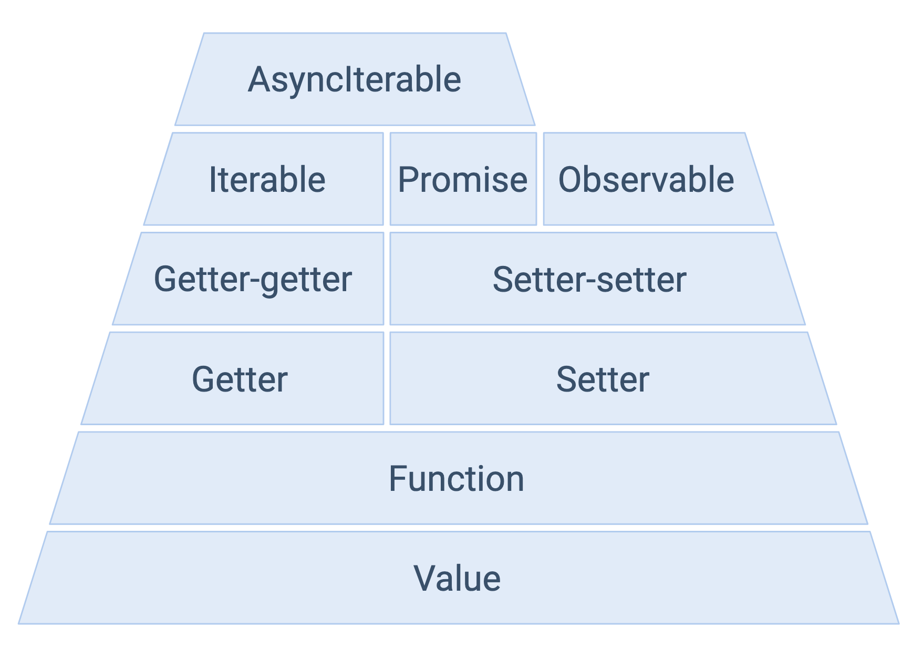

# async

## 概述

1. async 函数返回的是一个 Promise 对象（无论是否内部使用await），故可以把 `async` 看成将函数返回值被`Promise.resolve()` 包裹了下。
2. 由于async返回的是一个promise对象
3. async是 Generator 函数的语法糖，顾可以使用generator作为async/await的 polyfill
4. async/await 使得异步代码看起来像同步代码，异步编程发展的目标就是让异步逻辑的代码看起来像同步一样

## 优点

1. 内置执行前，generator，需要手动调用next()
2. 更好的语义


# await

## 语法描述

1. `[return_value] = await expression;`
	- expression：promise对象或任何要等待的值
	- 返回值：promise对象的处理结果，如等待的不是promise值，则返回该值本身
2. await 会暂停当前async的执行，等待promise处理完成
	- 如promise返回fufilled，则回调的resovle函数参数作为await表达式的值，继续执行async函数
	- 如promise返回rejected，抛出异常原因
	- 如await后不是promise，则返回该值本身；
	- 注意：故对于一个普通的异步函数，如setTimeout，直接返回id值，而不是异步回调结果值

## await运行机制

1. 如果它等到的不是一个 Promise 对象，那 await 表达式的运算结果就是它等到的东西。
2. 如果它等到的是一个 Promise 对象，await 就忙起来了，它会阻塞后面的代码，等着 Promise 对象resolve，然后得到 resolve 的值，作为 await 表达式的运算结果。
3. 由于await会阻塞代码，故这是必须用在async函数的原因；
4. async 函数调用不会造成阻塞，它内部所有的阻塞都被封装在一个 Promise 对象中异步执行。
5. 注意：因此await后面只能等待promise，普通的异步是不能被等待的

## 优点

### 概述

1. `async 和 await` 相比直接使用 `Promise` 来说，优势在于处理 `then` 的调用链，能够更清晰准确的写出代码。
2. 缺点在于滥用 `await` 可能会导致性能问题，因为 `await` 会阻塞代码，也许之后的异步代码并不依赖于前者，但仍然需要等待前者完成，导致代码失去了并发性。

### 错误处理

1. async可以使用try/catch来处理同步和异步错误，而promise不可以（由于promise是异步，并且promise的reject是内部一个状态）

2. 而且promise的错误指向也不如async/await更加清晰

3. 如对于promise，对于JSON.parse的错误，只能通过promise.catch来处理，而同步错误利用try-catch来处理

   ```javascript
   const oddRequest = () => {
       try {
           getJSON()
               .then(result => {
               // this parse may fail
               const data = JSON.parse(result)
               console.log(data)
           }).catch((err) => {//  handle asynchronous errors
               console.log(err)
           })
       } catch (err) {
           console.log(err)
       }
   }
   ```

4. 改写为async/await

   ```javascript
   const oddRequest = async () => {
       try {
           // this parse may fail
           const data = JSON.parse(await getJSON())
           console.log(data)
       } catch (e) {
           console.log(e)
       }
   }
   ```

### 条件语句更优雅

1. async/await处理条件语句更加优雅

   ```javascript
   // promise
   const getNumbers = () => {
       return getJSON().then(data=> {
           if (data.name) {
               return getAge(data.name)
                   .then(age=> {
                   	console.log(age)
                   return data
               })
           } else {
               console.log(data)
               return data
           }
       })
   }
   // async/await
   const getNumbers = () => {
       const data = await getJSON():
       if (data.name) {
       	const age = await getAge(data.name);
           console.log(age);
           return data
       } else {
           console.log(data);
           return data
       }   
   }
   ```

   


# 循环与并行串行

1. 主要是使用定时器，每隔一秒输出arr的一个值

## 普通方式

```javascript
const arr = [1,2,3];
for(let i=0;i<arr.length;i++){
    setTimeout(()=>{
        console.log(arr[i])
    },1000*i);
}
```

1. 注意：使用var会出现问题（3-作用域有介绍）
2. 这种方式会创造多个setTimeout定时器

## 串行

### Promise方式

```javascript
const arr = [1,2,3];
function asyncTimetOut(arr,i) {
    return new Promise((resolve, reject)=>{
        setTimeout(()=>{
            console.log(arr[i]);
            resolve(i);
        },1000);
    })
}
function foo(){
    arr.reduce((promise,item,index)=>{
        return promise.then(()=>{
            return asyncTimetOut(arr,index)
        })
    },Promise.resolve());
}
foo()
```


### await方式

```javascript
const arr = [1,2,3];
function asyncTimetOut(arr,i) {
    return new Promise((resolve, reject)=>{
        setTimeout(()=>{
            console.log(arr[i])
            resolve(i);
        },1000);
    })
}
async function foo(){
    for(let i=0;i<arr.length;i++){
        await asyncTimetOut(arr,i)
    }
}
foo()
```

1. 注意：for循环等会造成串行，await会等待定时器决议

## 并行

### Promise方式

```javascript
const arr = [1,2,3];
function asyncTimetOut(arr,i) {
    return new Promise((resolve, reject)=>{
        setTimeout(()=>{
            console.log(arr[i])
            resolve(i);
        },1000*i);
    })
}
const p = [];
for(let i=0;i<arr.length;i++){
    p.push(asyncTimetOut(arr,i))
}
Promise.all(p)
```


### await

```javascript
async function dbFuc(db) {
  let docs = [{}, {}, {}];  
  docs.map(async function (doc) {
    await db.post(doc);
  });
}
```

1. array.map(func)` 不在乎我提供给它的是不是异步函数，只把它当作一个返回 Promise 的函数来看待。 它不会等到第一个函数执行完毕就会调用第二个函数。


# demo

```javascript
var a = 0
var b = async () => {
  a = a + await 10
  console.log('2', a) // -> '2' 10
  a = (await 10) + a
  console.log('3', a) // -> '3' 20
}
b()
a++
console.log('1', a) // -> '1' 1
```

对于以上代码你可能会有疑惑，这里说明下原理

- 首先函数 `b` 先执行，在执行到 `await 10` 之前变量 `a` 还是 0，因为在 `await` 内部实现了 `generators` ，`generators`会保留堆栈中东西，所以这时候 `a = 0` 被保存了下来
- 因为 `await` 是异步操作，遇到`await`就会立即返回一个`pending`状态的`Promise`对象，暂时返回执行代码的控制权，使得函数外的代码得以继续执行，所以会先执行 `console.log('1', a)`
- 这时候同步代码执行完毕，开始执行异步代码，将保存下来的值拿出来使用，这时候 `a = 10`
- 然后后面就是常规执行代码了

# JS金字塔



1. js的基础就是函数

## Functions

1. `X => Y`

## Getter/ Setter

1. Getter:  ` () => x`

   - 无参数，但返回一个结果，如`Math.random()`，`Date.now()`

   - 优势主要是lazy

     ```javascript
     const user = {name: 'Alice', age: 30};
     console.log(user.name); // Alice
     // 函数的方式，在调用前，无需声明user
     function getUser() {
       return {name: 'Alice', age: 30};
     }
     console.log(getUser().name); // Alice
     ```

2. Setter: ` x => ()`

   - 传入一个参数，但无返回接口，如`console.log(x)`


## Getter Getters

1. `() => ( () => x)`  ： 返回值是一个getter

2. 比如，想显示二次幂的数字序列，简单做法是

   ```javascript
   let i = 2;
   function getNextPowerOfTwo() {
     const next = i;
     i = i * 2;
     return next;
   }
   ```

   - 需要用到一个全局变量i，想重置函数需要手动设置 i= 2

3. 可以使用getter/getters

   ```javascript
   function getNextPowerOfTwo() {
     let i = 2;
     return function getNext() {
       const next = i;
       i = i * 2;
       return next;
     }
   }
   let getNext = getNextPowerOfTwo();
   console.log(getNext()); // 2
   console.log(getNext()); // 4
   getNext = getGetNext(); // 🔷 restart!
   console.log(getNext()); // 2
   console.log(getNext()); // 4
   ```

   

## Setter Setters

1. `( x => ()) => () `: 参数是setter

2. 主要的应用场景就是回调函数：

   ```javascript
   function setTenListener(cb) {
     setTimeout(() => { 
       cb();
     }, 1000);
   }
   ```

   

## Iterables

1. `() => (() => ({done, value}))` ： 特殊类型的getter getters， 返回值是一个固定对象

2. 如上面显示二次幂的例子，转为迭代器**模式**

   ```javascript
   function getNextPowerOfTwo() {
     let i = 2;
     return function getNext() {
       if (i <= 48) {
         const next = i;
         i += 2;
         return {done: false, value: next};
       } else {
         return {done: true};
       }
     }
   }
   let getNext = getNextPowerOfTwo();
   ```


### ES6对迭代器的支持

#### 定义

1. 标准迭代器

   ```javascript
   const oddNums = {
     [Symbol.iterator]: () => {
       let i = 2;
       return {
         next: () => {
           if (i <= 48) {
             const next = i;
             i += 2;
             return {done: false, value: next};
           } else {
             return {done: true};
           }
         }
       }
     }
   }
   ```

2. 利用语法糖（生成器）支持

   ```javascript
   function* oddNums() {
     let i = 40;
     while (true) {
       if (i <= 48) {
         const next = i;
         i += 2;
         yield next;
       } else {
         return;
       }
     }
   }
   
   for (let x of oddNums()) {
     console.log(x);
   }
   ```

   - 特别注意：生成器本身不是迭代器，返回一个迭代器

#### 消费

```javascript
let iterator = oddNums[Symbol.iterator]();
for (let result = iterator.next(); !result.done; result = iterator.next()) {
  console.log(result.value);
}
```

利用 for-of

```javascript
for (let x of oddNums) {
  console.log(x);
}
```


## Promise

1. `(X => (), Err => ()) => ()`: 两个setters作为参数，函数被作为异步函数
2. 语法糖：async/await


## Observables

1. `(X => (), Err => (), () => ()) => ()`，具体实现目前还没有统一的标准

2. 使用RxJs、most.js等通用的实现方式

   ```javascript
   const oddNums = {
     subscribe: (observer) => {
       let x = 40;
       let clock = setInterval(() => {
         if (x <= 48) {
           observer.next(x);
           x += 2;
         } else {
           observer.complete();
           clearInterval(clock);
         }
       }, 1000);
     }
   };
   
   oddNums.subscribe({
     next: x => console.log(x),
     complete: () => console.log('done'),
   });
   ```

3. 增加`unsubscribe`功能，需要返回一个待执行函数

   ```javascript
   const oddNums = {
     subscribe: (observer) => {
       // ... 省略
       return {
         unsubscribe: () => {
           clearInterval(clock);
         }
       };
   
     }
   };
   
   ```


## Async Iterables

1. 迭代器的异步模式，即 Iterables + promise

   ```javascript
   function slowResolve(val) {
     return new Promise(resolve => {
       setTimeout(() => resolve(val), 1000);
     });
   }
   
   function* oddNums() {
     let i = 40;
     while (true) {
       if (i <= 48) {
         const next = i;
         yield slowResolve(i);
         i += 2;
       } else {
         return;
       }
     }
   }
   
   for (let promise of oddNums()) {
       const x = await promise;
       console.log(x);
   }
   ```

2. 但ES2018 AsyncIterable标准是：`() => (() => Promise<{done, value}>)`，其实是违反Iterables的定义的，由于异步Iterables不再是Iterables，故需要如下定义方式

   ```javascript
   const oddNums = {
     [Symbol.asyncIterator]: () => {
       let i = 40;
       return {
         next: () => {
           if (i <= 48) {
             const next = i;
             i += 2;
             return slowResolve({done: false, value: next});
           } else {
             return slowResolve({done: true});
           }
         }
       };
     }
   };
   ```

3. 语法糖：

   ```javascript
   async function* oddNums() {
     let i = 40;
     while (true) {
       await sleep(1000);
       if (i <= 48) {
         yield i;
         i += 2;
       } else {
         return;
       }
     }
   }
   
   async function main() {
     // 🔷 Consumption side uses the new syntax `for await`
     for await (let x of oddNums()) {
       console.log(x);
     }
     console.log('done');
   }
   
   main();
   ```

   - Production side: `async function*`
   - Consumption side: `for`–`await`–`let`–`of`

