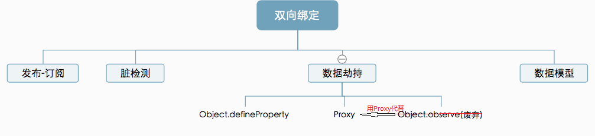

# Reflect

## 概述

1. `Reflect`对象与`Proxy`对象一样，主要目的是

2. 将`Object`对象的一些明显属于语言内部的方法（比如`Object.defineProperty`）

3. 修改某些Object的返回结果，让其变得更合理

4.  让`Object`操作都变成函数行为

	```javascript
	// 老写法
	'assign' in Object // true
	// 新写法
	Reflect.has(Object, 'assign') // true
	```

5. 有了`Reflect`对象以后，很多操作会更易读。

	```javascript
	// 老写法
	Function.prototype.apply.call(Math.floor, undefined, [1.75]) // 1
	// 新写法
	Reflect.apply(Math.floor, undefined, [1.75]) // 1
	```

## 注意

1. 如果在Proxy中调用Reflect的话，其实对应的就是默认行为。

# Proxy

## 概述

1. Proxy 用于修改某些操作的默认行为
2. 可以理解成，在目标对象之前架设一层“拦截”，外界对该对象的访问，都必须先通过这层拦截

## 语法

1. `let p = new Proxy(target, handler);`
	- target：用proxy包装的对象
	- 一个对象，定义操作时代理的行为函数

# 双向绑定

## 什么是

1. 简单的说就是在`数据`和`UI`之间建立双向的通信通道
2. 用户改变数据，立即反应到UI上，用户改变UI，数据也随之变化
3. 如user.name改变时，ui上的name值会变化，当input将name值改变时，对象user上的name属性随之变化
4. 注意：react是单向数据绑定，vue是双向数据绑定；但react可以手动绑定onChange和value实现双向数据绑定，而vue通过props也加入了单向数据流

## 实现方式

1. 双向绑定实现方式

	

2. 发布-订阅模式：如backbone.js

3. 脏检测

	- Angular 为主
	- 数据发生变更后，对于所有的数据和视图的绑定关系进行一次检测，识别是否有数据发生了改变，有变化进行；
	- 这个检测过程可能又出现数据变化，则再检测，直到没有数据变化
	- 如何监听数据变化呢？采用的是进入某些事件后进行脏检测

4. 基于数据劫持的双向绑定（vue为主）：主要是Object.defineProperty与ES6的Proxy

	

## defineProperty

### 极简实现双向绑定

```html
<body>
<input type="text" id="input">
<span id="span"></span>
<script>
  const obj = {};
  Object.defineProperty(obj, 'text', {
    get: function() {
      console.log('get val');
    },
    set: function(newVal) {
      console.log('set val:' + newVal);
      document.getElementById('input').value = newVal;
      document.getElementById('span').innerHTML = newVal;
    }
  });
  const input = document.getElementById('input');
  input.addEventListener('keyup', function(e){
    obj.text = e.target.value;
  })
</script>
</body>
```

1. 这种方式的缺点
	- 只监听1个属性，一个对象不可能只有一个属性
	- 代码耦合严重

### 问题

1. 不能监听数组的变化：因为需要检测的是一个对象的某个属性变化

2. 必须遍历对象的每个属性

	- 需要外层利用遍历配合，才能对每一个属性进行监听

		```javascript
		Object.keys(obj).forEach(key => {
		  Object.defineProperty(obj, key, {
		    // ...
		  })
		})
		```

3. 必须深层遍历嵌套的对象

	- 如对象是深层嵌套的，必须逐层遍历

## Proxy实现

1. proxy检测的是对象而不是对象属性，可以避免外层循环
2. Proxy可以直接监听数组的变化

### 极简实现

```html
<body>
<input type="text" id="input">
<span id="span"></span>
<script>
  const pro = new Proxy({},{
    get: function(target, key, receiver) {
      console.log('get val');
      return Reflect.get(target, key, receiver);
    },
    set: function(target, key, value, receiver) {
      if (key === 'text') {
        console.log('set val:' + value);
        document.getElementById('input').value = value;
        document.getElementById('span').innerHTML = value;
      }
      return Reflect.set(target, key,value, receiver);
    }
  })
  const input = document.getElementById('input');
  input.addEventListener('keyup', function(e){
    pro.text = e.target.value;
  })
</script>
</body>
```

