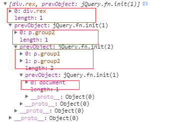

# 第3章 jQuery原型添加方法与属性
## 3.1 概述
1. 此处代码主要是源码114-194行，添加一些get，toArray，each，map等方法

## 3.2 pushStack----------( L143)
1. 为jQuery链式调用提供可能，所有可以链式调用的函数，都调用了pushStack函数，pushStack函数主要作用是将旧对象添加到新jquery对象的prevObject属性上
Html为
```html
<div class="rex">
　　<a>hello rextao</a>
    <p class="group1">group1</p>
　　<p class="group2">group2</p>
　　<span class="group"></span>
</div>
<div class="aaa"></div>
```

1. 如使用$('p').eq(1).parent()，因为eq与parent内部都调用了pushStack函数，根据html代码，可得到，$(‘p’)选择的是2个p元素，eq(1)则选择到p.group2，parent()则选择是div
.rex，可以看到，每次调用，都会把之前查询到的存储在prevObject中，比如开始为document，调用$(‘p’)，查询到p.group1与p.group2，则创建一个新的jQuery对象（例如a）,则a.preObject= document，然后调用.eq(1)，查询到p.group2，再创建新的jQuery对象（例如b），则b.preObject = a;一次类推

1. 故可以假象为一个stack，每次查询到结果就push进去，因此stack=[document,[p.group1,p.group2],p.group2],最后查询到的div.rex并没有push到stack中


2. 源码分析
```javascript
// 取一组元素并推入栈中，返回新匹配的元素集
pushStack: function( elems ) {
   // this.constructor = jquery，所以this.constructor()返回一个jQuery对象
   var ret = jQuery.merge( this.constructor(), elems );
   // 为ret添加prevObject属性，指向old对象
   ret.prevObject = this;
   // 返回新的ret元素集合
   return ret;
},
```


## 3.3 end----------------(L184)
1. 根据pushStack的分析，故每次调用end函数相当于，返回上述stack的最外层元素，即返回p.group2，每次调用弹出一个元素
2. 源码
```javascript
end: function() {
// this.constructor(),如当前this无prevObject属性，即非pushStack构建的，则返回当前的jQuery对象
   return this.prevObject || this.constructor();
},
```

## 3.4 jQuery.fn = jQuery.prototype---(L114)
```javascript
// 给JQ原型对象，添加一些方法和属性
jQuery.fn = jQuery.prototype = {
   // 当前的jQuery版本
   jquery: version,
   constructor: jQuery,
   // jQuery对象的默认长度
   length: 0,
   toArray: function() {
      return slice.call( this );
   },
   // 从匹配元素集中获取第N个元素或获取整个匹配元素集
    // $('div').get(0),this则是html匹配到的dom元素
   get: function( num ) {
      // Return all the elements in a clean array
      if ( num == null ) {
         return slice.call( this );
      }
      // 如num<0,返回整个this，否则仅返回num这个元素
      return num < 0 ? this[ num + this.length ] : this[ num ];
   },
   // 取一组元素并推入栈中，返回新匹配的元素集
    // 类似于栈，将对象一层层包裹在prevObject属性上
   pushStack: function( elems ) {
      // this.constructor = jquery，所以this.constructor()返回一个jQuery对象
      var ret = jQuery.merge( this.constructor(), elems );
      // 为ret添加prevObject属性，指向old对象
      ret.prevObject = this;
      // 返回新的ret元素集合
      return ret;
   },
   // 为每个匹配集合执行回调函数
   each: function( callback ) {
      return jQuery.each( this, callback );
   },
    // 对this的每个结果应用function函数，
   map: function( callback ) {
      return this.pushStack( jQuery.map( this, function( elem, i ) {
         return callback.call( elem, i, elem );
      } ) );
   },
    // 选取一个匹配的子集
   slice: function() {
      return this.pushStack( slice.apply( this, arguments ) );
   },

   first: function() {
      return this.eq( 0 );
   },
   last: function() {
      return this.eq( -1 );
   },
    // 对于$('div').eq(0),假如$('div')匹配到[div.rex,div.aaa]，this.length=2
    // 因此this[0] = div.rex,传入pushStack处理
   eq: function( i ) {
      var len = this.length,
            // ( i < 0 ? len : 0 ),处理eq(-2)情况，从数组最后往前计算
         j = +i + ( i < 0 ? len : 0 );
            // 主要是push哪个元素到stack（pushStac类似于一个栈）中
      return this.pushStack( j >= 0 && j < len ? [ this[ j ] ] : [] );
   },
    // this.constructor(),如当前this无prevObject属性，即非pushStack构建的，则返回当前的jQuery对象
   end: function() {
      return this.prevObject || this.constructor();
   },
   // 内部使用
   // 表现类似于数组方法，而不像jQuery方法
   push: push,
   sort: arr.sort,
   splice: arr.splice
};
```


