# 第5章 选择器sizzle引擎
## 5.1 Sizzle的设计思路
### 5.1.1 概述
1. 对于一个复杂的选择器表达式（前提是浏览器不支持querySelectorAll），如何对其进行处理？
1. jQuery的特点快捷选取、操作DOM元素，如#id .class > p:first-child, .class2 input[type=’text’]，但js本身名没有这么复杂的选择器，只有getElementById，getElementByTagName等，作者写了一个Sizzle引擎，用于css选取
1. Sizzle这样的选择器引擎是为了解决某些低级浏览器没有document.getElementsByClassName，document.querySelector，document.querySelectorAll接口


### 5.1.2 分割解析
1. 对于$(“#id .class > p:first-child, .class2 input[type=’text’]”)，可以处理的办法有什么呢？
 - 方式1：根据选择器中逗号（，）实际是两个选择器组，可以分开来处理，故可以使用split(',')来处理，处理出来后，对每一个分块分别处理
 - 方式2：利用正则表达式分块，获取结果的同时可以提取信息，缺点是可读性差以及效率问题
1. jQuery处理办法
 - 对于选择器表达式#id .class > p.red + a, .class2 p:first-child input[type=’text’]拆分为块表达式、块间表达式
 - 对于有逗号（，）的，是先分离出#id .class > p.red + a，处理完毕后再分离.class2 p:first-child input[type=’text’]处理
 - 故对于#id .class > p.red + a进行处理，得到块表达式A：#id .class；B: p.red；C：a，块间关系为A>B，B+C
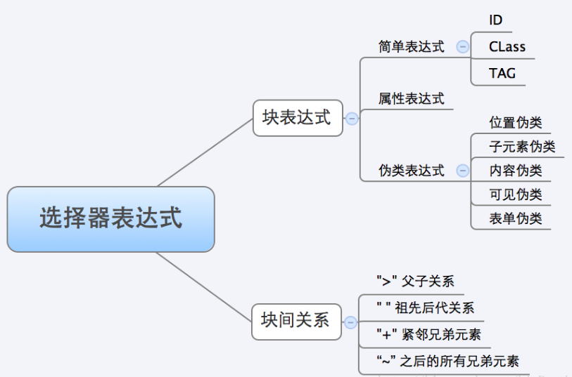


### 5.1.3 块表达式内部查找
1. 对于上述块表达式ABC，只能使用DOM中的API查找
1. 代码的效率是一个永恒的主题，因此一定是ID > Class > Name> Tag
1. 对于块表达式A，会先查询#id得到集合a，然后再集合a中筛选出.class的集合，因为分别查找#id和.class是完全没必要的


### 5.1.4 块间关系处理
1. 处理了块表达式内部查找，需要处理的关键是块间关系，处理方式可以从左到右，也可从右到左
1. 情况一、body div p:first===》(body div p):first
 - 自左向右的查询。先找到body，获得集合A，然后在集合A中查找div获得集合B，在集合B中查找p获得集合C，最后取集合C的第一个元素，得最终结果XX
1. 情况二、body div p:first-child　　
 - 自右向左的查询，先找到p:first-child获得集合A1，然后判断祖先元素里面是否有div获得集合B1，然后判断祖先元素里面是否有body获得集合C1，得最终结果C1
1. 情况三、div#a p
 - 先找到div#a，获得单个元素A1，然后再A1的环境中查找p，得最终结果B1
1. Jquery的处理方式并不是拿到一个块，就是从左到右，要么从右到左；是根据具体情况而定的


## 5.2 正则表达式(613)
### 5.2.1 whitespace(匹配空白符)
1. 首先要特别注意，下面代码中whitespace是变量，故有两个\\，如看不懂可先输出正则表达式后再看具体含义
1. [https://regexper.com/](https://regexper.com/)，正则图示软件，感觉很不错，方便分析复杂正则表达式
1. [https://www.debuggex.com/](https://www.debuggex.com/)：可以调试正则表达式，判断给定的string是否满足正则
2. [https://regex101.com/](https://regex101.com/):测试正则，里面会用英文介绍x20,\t是匹配的什么，会简要介绍正则匹配内容，针对多种语言正则
3. 对于有些图比较大，看不清楚，请直接拷贝正则到上述网址查看
4. 对于sizzle中使用的正则，想了解就贴到上面网址，一点点看正则，自己写几个字符串，看看是否匹配的上，如不想，则只需知道是在用正则匹配#id,.class,伪类选择器等这些样式选择器
```javascript
whitespace = "[\\x20\\t\\r\\n\\f]"
rwhitespace = new RegExp( whitespace + "+", "g" )
```
 - 结果：/[\x20\t\r\n\f]+/g

1. 可以通过查询ASCII对照表，看十六进制\x对应的是什么
 - \x20：空白符
 - \x0D：\r归为符
 - \x0A：\n换行符
 - \0x0C:\f换页符

1. 图由[https://regexper.com/](https://regexper.com/)生成（有时候网站会挂），第二个网站也可以生成正则图，只是不那么美观，但道理是一样的
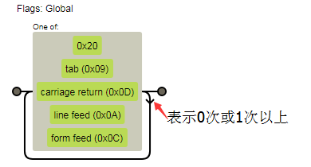


### 5.2.2 Identifier(匹配标识符)
1. w3c文档规定，css的标识符只能包含[a-zA-Z0-9]和ISO 10646标准中的U+00A0和它之后的字符，以及中划线、下划线。不能以数字，两个中划线或者中划线后跟一个数字作为标识符的开始。标识符也可以包含转义字符和任意ISO 10646作为数字编码。例如标识符“B&W?”可以写成“B\26 W\3F”。
1. \0-\xa0：为了满足W3C中字符要是“U+00A0”以及其后的字符的要求，排除ISO 10646编码中0-xa0范围内的字符都排除
1. \w：匹配单词，等于[a-zA-Z0-9]
1. \0：表示的是C0控制符中的NULL
1. 注意：下面结果中，^和-中间有一个空格，在浏览器中显示为一个空格了，实际是\0
```javascript
identifier = "(?:\\\\.|[\\w-]|[^\0-\\xa0])+"
ridentifier = new RegExp( "^" + identifier + "$" )
```
 - Chrome控制台结果：/^(?:\\.|[\w-]|[^ -\xa0])+$/
 - 实际结果：/^(?:\\.|[\w-]|[^\0-\xa0])+$/
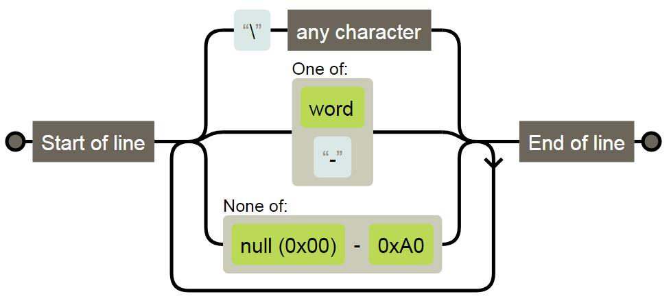


### 5.2.3 Attributes(匹配属性)
1.  通过图示，可将复杂的正则很快区分出来
```javascript
attributes = "\\[" + whitespace + "*(" + identifier + ")(?:" + whitespace +
   // Operator (capture 2)
   "*([*^$|!~]?=)" + whitespace +
   // "Attribute values must be CSS identifiers [capture 5] or strings [capture 3 or capture 4]"
   "*(?:'((?:\\\\.|[^\\\\'])*)'|\"((?:\\\\.|[^\\\\\"])*)\"|(" + identifier + "))|)" + whitespace +
   "*\\]"
```

1. 为了结构更清晰，将whitespace设为[]，identifier设置为[a]得到结果为
2.  /\\[[]\*([a])(?:[]\*([\*\^\$\|!\~]?=)[]\*(?:'((?:\\\\.\|[\^\\\\'])\*)'\|"((?:\\\\.\|[\^\\\\"])\*)"\|([a]))\|)[]\*\\]/
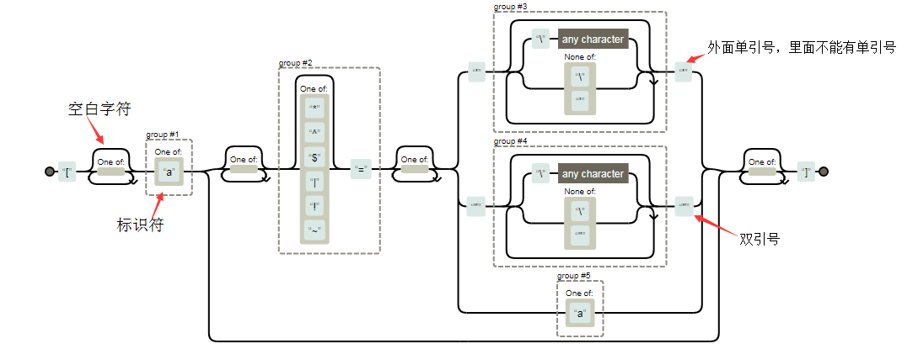

### 5.2.4 Pseudos(匹配伪类)
1.  将identifer设置为[a]，将attributes设置为[b]
2.  /:([a])(?:\\((('((?:\\\\.\|[\^\\\\'])\*)'\|"((?:\\\\.\|[\^\\\\"])\*)")\|((?:\\\\.\|[\^\\\\()[\\]]\|[b])\*)\|.\*)\\)\|)/
```javascript
pseudos = ":(" + identifier + ")(?:\\((" +
   // To reduce the number of selectors needing tokenize in the preFilter, prefer arguments:
   // 1. quoted (capture 3; capture 4 or capture 5)
   "('((?:\\\\.|[^\\\\'])*)'|\"((?:\\\\.|[^\\\\\"])*)\")|" +
   // 2. simple (capture 6)
   "((?:\\\\.|[^\\\\()[\\]]|" + attributes + ")*)|" +
   // 3. anything else (capture 2)
   ".*" +
   ")\\)|)"
```
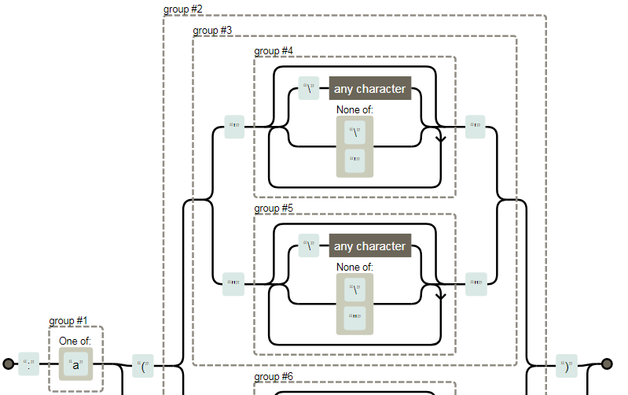
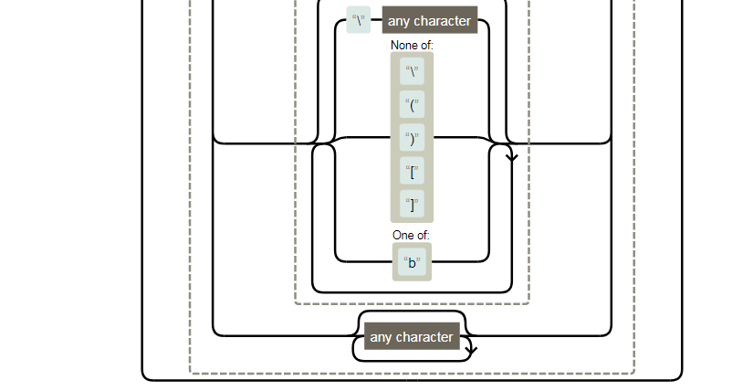

### 5.2.5 rtrim
1.  将whitespace设置为[]
2.  匹配字符串两头的空白
```javascript
rtrim = new RegExp( "^" + whitespace + "+|((?:^|[^\\\\])(?:\\\\.)*)" + whitespace + "+$", "g" )
```

1. 结果：/\^[]+\|((?:\^\|[\^\\\\])(?:\\\\.)\*)[]+\$/g
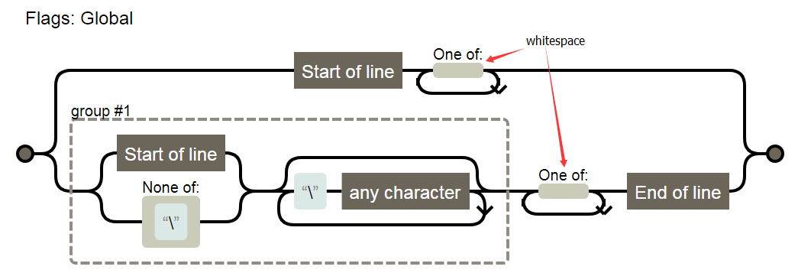

### 5.2.6 rcomma
1.  rcomma = /\^[\\x20\\t\\r\\n\\f]\*,[\\x20\\t\\r\\n\\f]\*/,匹配（ ， ）形式
```javascript
rcomma = new RegExp( "^" + whitespace + "*," + whitespace + "*" )
```

### 5.2.7 rcombinators
1.  匹配是否为关系符，\>+\~空格
```javascript
rcombinators = new RegExp( "^" + whitespace + "*([>+~]|" + whitespace + ")" + whitespace + "*" )
```


### 5.2.8 rattributeQuotes(匹配属性)
1.  \*?表示懒惰模式，匹配能匹配到最少词，.\*匹配的最长词
2.  对于字符串aabab，a.\*?b匹配的是aab，a.\*b匹配的是aabab
```javascript
rattributeQuotes = new RegExp( "=" + whitespace + "*([^\\]'\"]*?)" + whitespace + "*\\]", "g" )
```

1. 结果：/=[]\*([\^\\]'"]\*?)[]\*\\]/g
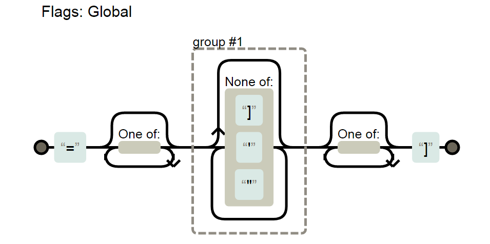

### 5.2.9 matchExpr.CHILD
```javascript
"CHILD": new RegExp( "^:(only|first|last|nth|nth-last)-(child|of-type)(?:\\(" + whitespace +
   "*(even|odd|(([+-]|)(\\d*)n|)" + whitespace + "*(?:([+-]|)" + whitespace +
   "*(\\d+)|))" + whitespace + "*\\)|)", "i" )
```

1.  结果：（空白使用[]替换）
/\^:(only\|first\|last\|nth\|nth-last)-(child\|of-type)(?:\\([]\*(even\|odd\|(([+-]\|)(\\d\*)n\|)[]\*(?:([+-]\|)[]\*(\\d+)\|))[]\*\\)\|)/i
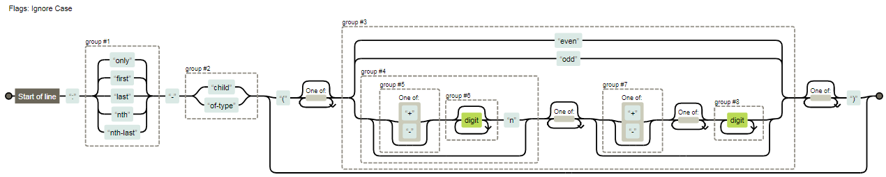

1.  可以匹配如下表达式
 - :only-child
 - :only-child( )
 - :only-child( +123n )
 - :only-child(+123n -1234)

### 5.2.10 matchExpr.needsContext
1.  用于实现.is()
2.  用于```select =Sizzle.select```中，判断第一个token是[\>+\~]关系选择器，或整个选择器中有sizzle自定义伪类
```javascript
"needsContext": new RegExp( "^" + whitespace + "*[>+~]|:(even|odd|eq|gt|lt|nth|first|last)(?:\\(" +
   whitespace + "*((?:-\\d)?\\d*)" + whitespace + "*\\)|)(?=[^-]|$)", "i" )
```

1.  结果：（空白使用[]替换）
/\^[]\*[\>+\~]\|:(even\|odd\|eq\|gt\|lt\|nth\|first\|last)(?:\\([]\*((?:-\\d)?\\d\*)[]\*\\)\|)(?=[\^-]\|\$)/i
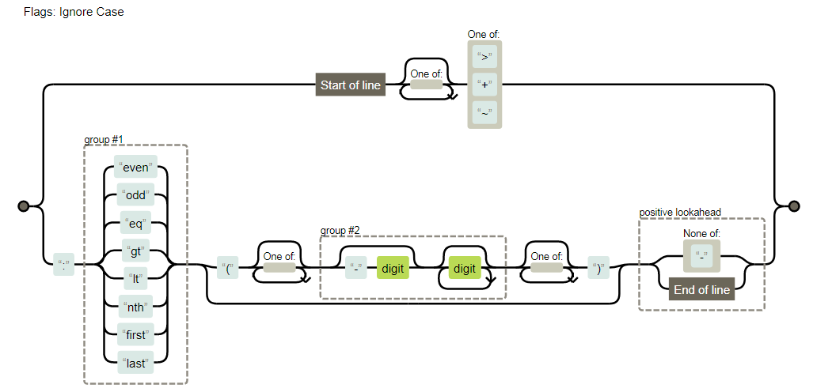

### 5.2.11 补：?=与?!
1.  环视语法（详见《正则指引p91》）
2.  ？= 肯定顺序环视，判断方向右，结构内表达式匹配成功，返回true
    ！= 否定顺序环视，判断方向右，结构内表达式匹配成功，返回false
```javascript
var a1 = /(?=\d{3})/g;
var a2 = /(?!\d{3})/g;
console.log('123456'.replace(a1,',')); //——,1,2,3,456
console.log('123456'.replace(a2,',')); //—— 1234,5,6,
```

1.  匹配规则图示，如？=开始位置在1前面，然后向后环视，看后面是否有3个数字，确定有则将此处添加一个逗号，1前面；然后向右移位到2前面，然后再环视。。当到4前面时，后面的数字不满足\\d{3}返回false
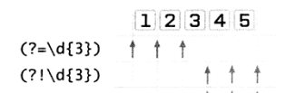

### 5.2.12 rnative
1. 用以匹配function getElementByClassName(){[native
    code}代码，判断一个函数是否存在
```javascript
/^[^{]+\{\s*\[native \w/
```


### 5.2.13 rquickExpr
1.  快速解析ID，tag，class
```javascript
/\^(?:\#([\\w-]+)\|(\\w+)\|\\.([\\w-]+))\$/,
```
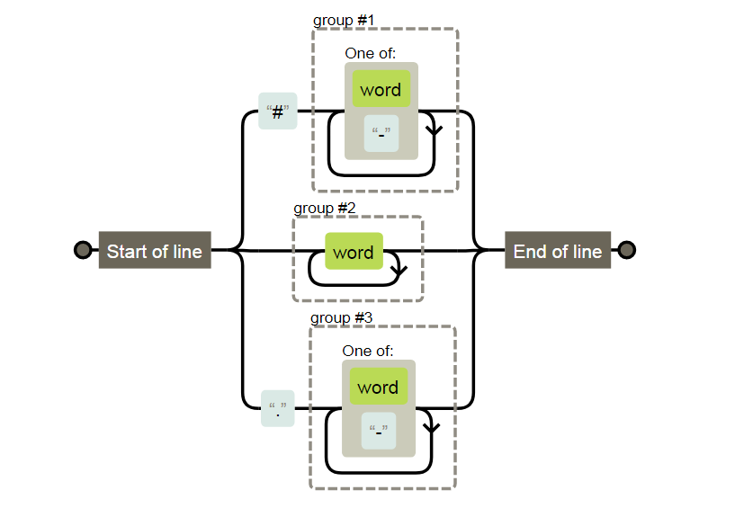

### 5.2.14 补：exec和match方法
1.  exec是正则表达式的方法，match是字符串方法
 - /\\d/.exec( "abc4def" );
 - "abc4def".match(\\d);
1. 两者返回的都是数组，exec没有分组时，如匹配返回只有一个元素的数组
 - 如不是全局匹配
```javascript
    var str= "cat,hat" ;
    var p=/at/; //没有g属性
    console.log(p.exec(str)); //["at", index: 1, input: "cat,hat"]
    console.log(str.match(p)); //["at", index: 1, input: "cat,hat"]
```

 - 全局匹配
```javascript
var str= "cat,hat" ;
var p=/at/g;
console.log(p.exec(str));//["at", index: 1, input: "cat,hat"]
console.log(str.match(p));//["at", "at"]
```

 - **exec永远只返回第一个匹配，而match在正则指定了g属性的时候，会返回所有匹配**

1.  如reg有分组，则exec第一个元素为第一个匹配的字符串，之后为括号的反向引用
```javascript
var str= "catdtxy2,hatdtxy6" ;
var p=/c(at)(dt)(x)(y)\d/;
console.log(p.exec(str));
```

 - [“catdtxy2”,”at”,”dt”,”x”,”y”,index:0,input:”catdtxy2,hatdtxy6”]

2.  match函数在满足如下条件下将越俎代庖，实现和exec一样的功能
 - 正则表达式中含有分组（括号）
 - 返回唯一的匹配

5.  对于(?:)包含的，不会返回到exec数组中.

 - 返回["\#id", "\#id", undefined, "id", index: 0, input: "\#id"]
```javascript
var b =/^(\s*(<[\w\W]+>)[^>]*|#([\w-]+))$/;
console.log(b.exec("#id"))
```

 - ["\#id", undefined, "id", index: 0, input: "\#id"]
```javascript
var b =/^(?:\s*(<[\w\W]+>)[^>]*|#([\w-]+))$/;
console.log(b.exec("#id"))
```

1. **大的分组中存在小的分组时，小的分组是排在该大分组后面的分组**


## 5.3 setDocument(1108)
### 5.3.1 documentElement与ownerDocument区别
1.  ownerDocument：返回当前节点的顶层的document对象，环境不是window，可能返回不是window.document
- 返回的是一个对象
- console.log(a.ownerDocument);返回的结果
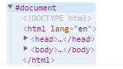

2.  documentElement：返回文档对象（document）的根元素的只读属性
- 如html文档中的```<html>```元素
- ```console.log(document.documentElement);```
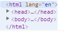

### 5.3.2 isXML = Sizzle.isXML(1096)
1.  检测是否为xml节点
2.  根据：[https://developer.mozilla.org/en-US/docs/Web/API/Node/nodeName](https://developer.mozilla.org/en-US/docs/Web/API/Node/nodeName)，介绍
- Xhtml或其他xml格式，document.getElementById("d1").nodeName为div（全部小写），在html中为DIV（全部大写）
```javascript
/**
 * 检测xml节点
 * @param {Element|Object} elem： 一个elment或document
 * @returns {Boolean} True ：如为true则不是html节点
 */
isXML = Sizzle.isXML = function( elem ) {
   // documentElement返回文档
   var documentElement = elem && (elem.ownerDocument || elem).documentElement;
   return documentElement ? documentElement.nodeName !== "HTML" : false;
};
```


### 5.3.3 assert (920)
1.  测试一个element是否符合fn要求，符合返回true，否则返回null
2.  ？？？？？？？？？？？？？？为何创建fieldset元素，用来测试
```javascript
function assert( fn ) {
   var el = document.createElement("fieldset");
   try {
      return !!fn( el );
   } catch (e) {
      return false;
   } finally {
      // Remove from its parent by default
      if ( el.parentNode ) {
         el.parentNode.removeChild( el );
      }
      // 释放内存
      el = null;
   }
}
```

3.  为何使用try-catch结构：
-  如源码L1313，解决某个bug，使用断言函数，此时如下代码IE8会报错
```javascript
assert(function( el ) {
	……
if ( !el.querySelectorAll(":checked").length ) {
        rbuggyQSA.push(":checked");
     }
}
```

### 5.3.4 区分properties和attributes
1.  元素特性attribute是指HTML元素标签的特性
-  下面的id、class、title、a都是特性，其中a叫做自定义特性
```javascript
<div id="id1" class="class1" title="title1" a='a1'></div>
```

2.  对象属性property是指元素节点的属性
-  下面的id、title、b都是属性，其中b叫做自定义属性

3.  分析源码prop与attr会加深这两个属性的理解
-  Attributes是html标签上的，用getAttribute获取
-  Properties就一个对象的key，使用点获取；
-  主要问题是：浏览器会默认把id，class等attr也赋值给prop
```javascript
<script>
    var test = document.getElementById('text');
    test.id = 'id2';
    test.title = 'title2';
    test.b = 'b2';
</script>
```

3.  支持```IE<8``（1143）
-  官方介绍：验证getAttribute实际是返回attributes而不是properties
```javascript
support.attributes = assert(function( el ) {
      el.className = "i";
      return !el.getAttribute("className");
});
```
-  对于如下，代码，在普通浏览器中返回的是123，在IE8返回的是properties，即rextao
-  对于```IE<8```，如上代码，```el.getAttribute("className")```会返回i，而其他代码会返回null；
-  对于```IE<8``，如上代码，```el.getAttribute('class')```会返回null，其他的会返回i

### 5.3.5 Element.matches()------(L1360)
1.  如元素被指定的选择器字符串选择返回true，否则返回false
2.  一些浏览器以非标准是方式，前缀+matchesSelector()实现了这个方法
```javascript
<div id="id" class="c1"><span class="c2"></span></div>
<script src="jquery-3.2.1.js"></script>
<script>
    var docElem =document.getElementById('id');
    console.log(docElem.matches('div'));     // true
    console.log(docElem.matches('.c1'));     // true
    console.log(docElem.matches('.c2'));     // false
</script>
```

### 5.3.6 Node.compareDocumentPosition(otherNode)--------(L1383)
1.  比较两个节点，返回描述他们位置关系的整数，整数值其实是用bits值表示的，故可通过&位运算来判断何种类型
|名称		|值	|	bits|
|--------|--------|
|没关系，不属于同一文档	|1	| 000001|  
|第1节点在第二节点后	|2	|000010|
|第1节点在第二节点前	|4	|000100|  
|第1节点在第二节点内	|8	|001000|
|第1节点在第二节点外	|16|	010000|  
|没关系，浏览器私有使用	|32|	100000|
2.  Contains的兼容性解决办法
```javascript
contains = hasCompare || rnative.test( docElem.contains ) ?
   function( a, b ) {
      // 如a是DOM根节点，返回顶层document对象
      var adown = a.nodeType === 9 ? a.documentElement : a,
         bup = b && b.parentNode;
      // 如a包含b，则b.parentNode为a或a的子
      return a === bup || !!( bup && bup.nodeType === 1 && (
         adown.contains ?   // 如contais方法存在，使用contains判断
            adown.contains( bup ) :
            // a.compareDocumentPosition( bup ) ==16表示a为bup的外部节点，如前2个&&为真，返回16
            a.compareDocumentPosition && a.compareDocumentPosition( bup ) & 16
      ));
   } :
   // 不存在contains和compareDocumentPosition方法，使用parentNode一层层比较
   function( a, b ) {
      if ( b ) {
         while ( (b = b.parentNode) ) {
            if ( b === a ) {
               return true;
            }
         }
      }
      return false;
   };
```

### 5.3.7 siblingCheck()——(L954)
1.  sourceIndex：IE的属性，表示对象在文档出现顺序的序列
```javascript
/**
 * 检查同辈元素document顺序
 * @param {Element} a
 * @param {Element} b
 * @returns {Number} 返回值小于0，a在b前，大于0，则a在b后
 */
function siblingCheck( a, b ) {
   var cur = b && a,
      //
      diff = cur && a.nodeType === 1 && b.nodeType === 1 &&
         a.sourceIndex - b.sourceIndex;
   // 如存在sourceIndex，使用IE的sourceIndex
   if ( diff ) {
      return diff;
   }
   // 检查b是否在a后面
   if ( cur ) {
      while ( (cur = cur.nextSibling) ) {
         if ( cur === b ) {
            return -1; //a在b前面
         }
      }
   }
   // 此句目的？？？？？？？？？？？？？
// 为了让函数返回1或-1，如a为null，返回 -1？？？？？
   return a ? 1 : -1;
}
```

### 5.3.8 完整代码
```javascript
setDocument = Sizzle.setDocument = function( node ) {
   var hasCompare, subWindow,
      // preferredDoc = window.document ,返回window的document引用，是一个对象
      // ownerDocument,返回当前节点的顶层的document对象，环境不是window，可能返回不是window.document
      doc = node ? node.ownerDocument || node : preferredDoc;

   // nodeType ==9：一个 Document 节点
   // documentElement：返回文档对象（document）的根元素的只读属性
   if ( doc === document || doc.nodeType !== 9 || !doc.documentElement ) {
      return document; //返回window.document
   }

   // 更新全局变量
   document = doc;
   docElem = document.documentElement;
   documentIsHTML = !isXML( document );

   // Support: IE 9-11, Edge
   // 解决iframe文件卸载后，抛出“没有权限”的bug (jQuery #13936)
   // document.defaultView:在浏览器中返回document相关的window对象
   // ？？？？？？？？？？？为何能通过这种方式修复bug-。-不需要关注
   if ( preferredDoc !== document &&
      (subWindow = document.defaultView) && subWindow.top !== subWindow ) {

      // Support: IE 11, Edge
      if ( subWindow.addEventListener ) {
         subWindow.addEventListener( "unload", unloadHandler, false );

      // Support: IE 9 - 10 only
      } else if ( subWindow.attachEvent ) {
         subWindow.attachEvent( "onunload", unloadHandler );
      }
   }

   /* 是否支持属性
   // 其实support为true，表示当前方法或属性没有bug，如果为false表示有bug，需要特殊处理
   ---------------------------------------------------------------------- */

   // Support: IE<8
   // 在使用getAttribute('class')时,IE<8,需要写为getAttribute('className')，IE8修复
   // <input type="text" value="123" id="input" title="input" />
   // var a = document.getElementById("input");
   // a.value = "rextao";
   // console.log(a.getAttribute("value"));
   //—— 对于IE<8，如上代码，el.getAttribute("className")会返回i，而其他代码会返回null；
   support.attributes = assert(function( el ) {
         el.className = "i";
         return !el.getAttribute("className");
   });

   // 针对support情况，为Expr增加find与filter方法
   /* getElement(s)By*
   ---------------------------------------------------------------------- */

   // Check if getElementsByTagName("*") returns only elements
   //IE<9会考虑上comment节点，返回1，其他返回0
   support.getElementsByTagName = assert(function( el ) {
      el.appendChild( document.createComment("") );
      return !el.getElementsByTagName("*").length;
   });

   // Support: IE<9
   // IE<9,因为没有document.getElementsByClassName，故返回undefined，
   // rnative = /^[^{]+\{\s*\[native \w/; \w匹配单词字符
   // 支持的返回 function getElementsByClassName() { [native code] }
   support.getElementsByClassName = rnative.test( document.getElementsByClassName );

   // Support: IE<10，
   // 低版本IE，getElementById会返回表单元素是name值
   // <input type="text" name="myElement" value="The field" />
   // <div id="myElement">A div</div>   对于这个代码，会返回input元素
   // expando = "sizzle" + 1 * new Date(),
   // 对于非IE，getElementsByName( expando ).length=0，因为设定是的id，不会查到
   support.getById = assert(function( el ) {
      docElem.appendChild( el ).id = expando;
      return !document.getElementsByName || !document.getElementsByName( expando ).length;
   });

   // ID filter and find
   // filter查看是否有某个id元素
   // find 查找某个元素
   if ( support.getById ) {
      Expr.filter["ID"] = function( id ) {
         //解决firefox<24错误的数字解读，有w3c规范说明=。=
         var attrId = id.replace( runescape, funescape );
         return function( elem ) {
            return elem.getAttribute("id") === attrId;
         };
      };
      //查询id
      Expr.find["ID"] = function( id, context ) {
         if ( typeof context.getElementById !== "undefined" && documentIsHTML ) {
            var elem = context.getElementById( id );
            return elem ? [ elem ] : [];
         }
      };
   } else {
      Expr.filter["ID"] =  function( id ) {
         var attrId = id.replace( runescape, funescape );
         return function( elem ) {
            //返回指定元素的指定属性， 返回值是 Attr 节点类型，此方法是已废弃方法
            //MDN上说已经使用getAttribute代替，并且性能上， element.id >element.getAttribute('id') >element.getAttributeNode('id').nodeValue.
            // 但是对于如下代码，对于IE<7,下面1行返回null，而2可以返回rextao
            // var el = document.getElementById('myElement')
            // el.className ='rextao'
            // console.log(el.getAttribute('class'))------------1
            // console.log(el.getAttributeNode('class').value)------2
            var node = typeof elem.getAttributeNode !== "undefined" &&
               elem.getAttributeNode("id");
            return node && node.value === attrId;
         };
      };

      // Support: IE 6 - 7 only, getElementById不可靠，可能会返回name值，上面有说明
      Expr.find["ID"] = function( id, context ) {
         if ( typeof context.getElementById !== "undefined" && documentIsHTML ) {
            var node, i, elems,
               elem = context.getElementById( id );

            if ( elem ) {

               // Verify the id attribute
               node = elem.getAttributeNode("id");
               if ( node && node.value === id ) {//准确的找到了id元素
                  return [ elem ];
               }

               // 回退到使用getElementByName方法
               elems = context.getElementsByName( id );
               i = 0;
               while ( (elem = elems[i++]) ) {
                  node = elem.getAttributeNode("id");
                  if ( node && node.value === id ) {
                     return [ elem ];
                  }
               }
            }

            return [];
         }
      };
   }

   // Tag
   Expr.find["TAG"] = support.getElementsByTagName ?
      function( tag, context ) {
         if ( typeof context.getElementsByTagName !== "undefined" ) {
            return context.getElementsByTagName( tag );

         // DocumentFragment nodes 没有gEBTN
         } else if ( support.qsa ) {
            return context.querySelectorAll( tag );
         }
      } :

      function( tag, context ) {
         var elem,
            tmp = [],
            i = 0,
            // 出于巧合，documentFragment的nodes有gEBTN方法
            results = context.getElementsByTagName( tag );

         // Filter out possible comments
         if ( tag === "*" ) {
            while ( (elem = results[i++]) ) {
               if ( elem.nodeType === 1 ) {
                  tmp.push( elem );
               }
            }

            return tmp;
         }
         return results;
      };

   // Class
   // getElementsByClassName htmlDOM
   // 如support.getElementsByClassName == true，返回function( className, context )
   Expr.find["CLASS"] = support.getElementsByClassName && function( className, context ) {
      if ( typeof context.getElementsByClassName !== "undefined" && documentIsHTML ) {
         return context.getElementsByClassName( className );
      }
   };

   /* QSA/matchesSelector
      针对具体有问题的浏览器，提出解决办法
   ---------------------------------------------------------------------- */

   // 匹配选择器(:active) 实际为true时，却返回false(IE9/Opera 11.5)
   rbuggyMatches = [];

   // 匹配选择器(:focus) 实际为true时，却返回false (Chrome 21)
   // 这个bug未修复是因为 IE8/9在iframe中访问document.activeElement会抛出错误
   // 未修复这个bug是为了不让ie抛出错误
   // See https://bugs.jquery.com/ticket/13378
   rbuggyQSA = [];
   // document.querySelectorAll:返回与指定的选择器组匹配的文档中的元素列表 。返回的对象是 NodeList 。
   if ( (support.qsa = rnative.test( document.querySelectorAll )) ) {
      // 创建QSA正则表达式，策略采用来源  Diego Perini
      // el = document.createElement("fieldset");
      assert(function( el ) {
         // Select 元素设置为空字符串
         // 解决https://bugs.jquery.com/ticket/12359问题
         // 下面产生的html代码为：
         // <a id="a"></a>
         // <select id="a-
         //        \" msallowcapture="">
         //        <option selected=""></option>
         // </select>
         docElem.appendChild( el ).innerHTML = "<a id='" + expando + "'></a>" +
            "<select id='" + expando + "-\r\\' msallowcapture=''>" +
            "<option selected=''></option></select>";

         // Support: IE8, Opera 11-12.16
         //  ^= , $= , *=选择符后空字符串，应无内容选出
         // https://msdn.microsoft.com/en-us/library/ie/hh465388.aspx#attribute_section
         if ( el.querySelectorAll("[msallowcapture^='']").length ) {
            rbuggyQSA.push( "[*^$]=" + whitespace + "*(?:''|\"\")" );
         }

         // Support: IE8
         // IEB对Boolean特性和值处理不正确
         if ( !el.querySelectorAll("[selected]").length ) {
            rbuggyQSA.push( "\\[" + whitespace + "*(?:value|" + booleans + ")" );
         }

         // Support: Chrome<29, Android<4.4, Safari<7.0+, iOS<7.0+, PhantomJS<1.9.8+
         if ( !el.querySelectorAll( "[id~=" + expando + "-]" ).length ) {
            rbuggyQSA.push("~=");
         }

         // Webkit/Opera - :checked应该返回选中的元素，IE抛出异常
         // http://www.w3.org/TR/2011/REC-css3-selectors-20110929/#checked
         if ( !el.querySelectorAll(":checked").length ) {
            rbuggyQSA.push(":checked");
         }

         // Support: Safari 8+, iOS 8+
         // 类似的span#id + ok选择器返回结果不正确
         // https://bugs.webkit.org/show_bug.cgi?id=136851
         if ( !el.querySelectorAll( "a#" + expando + "+*" ).length ) {
            rbuggyQSA.push(".#.+[+~]");
         }
      });

      assert(function( el ) {
         el.innerHTML = "<a href='' disabled='disabled'></a>" +
            "<select disabled='disabled'><option/></select>";

         // Support: Windows 8 Native Apps
         // type和name特性，在.innerHTML使用时受限
         var input = document.createElement("input");
         input.setAttribute( "type", "hidden" );
         el.appendChild( input ).setAttribute( "name", "D" );

         // Support: IE8
         // Enforce case-sensitivity of name attribute
         if ( el.querySelectorAll("[name=d]").length ) {
            rbuggyQSA.push( "name" + whitespace + "*[*^$|!~]?=" );
         }

         // FF 3.5 - :enabled/:disabled and hidden elements (hidden elements are still enabled)
         // IE8 throws error here and will not see later tests
         if ( el.querySelectorAll(":enabled").length !== 2 ) {
            rbuggyQSA.push( ":enabled", ":disabled" );
         }

         // Support: IE9-11+
         // IE's :disabled selector does not pick up the children of disabled fieldsets
         docElem.appendChild( el ).disabled = true;
         if ( el.querySelectorAll(":disabled").length !== 2 ) {
            rbuggyQSA.push( ":enabled", ":disabled" );
         }

         // Opera 10-11 does not throw on post-comma invalid pseudos
         el.querySelectorAll("*,:x");
         rbuggyQSA.push(",.*:");
      });
   }
   // el.matches（selectorString）:el能否被selectorString选择
   // 几个浏览器以非标准名称实现了这个前缀matchesSelector()。
   // 以下内容应足以满足大多数（如果不是全部）（即IE9 +支持）
   if ( (support.matchesSelector = rnative.test( (matches = docElem.matches ||
      docElem.webkitMatchesSelector ||
      docElem.mozMatchesSelector ||
      docElem.oMatchesSelector ||
      docElem.msMatchesSelector) )) ) {

      assert(function( el ) {
         // 看能否在为挂在文档树中的node使用matches方法(IE9)
         support.disconnectedMatch = matches.call( el, "*" );

         // 这段代码应抛出异常，但Gecko会返回false
         matches.call( el, "[s!='']:x" );
         rbuggyMatches.push( "!=", pseudos );
      });
   }

   rbuggyQSA = rbuggyQSA.length && new RegExp( rbuggyQSA.join("|") );
   rbuggyMatches = rbuggyMatches.length && new RegExp( rbuggyMatches.join("|") );

   /* Contains
   ---------------------------------------------------------------------- */
   hasCompare = rnative.test( docElem.compareDocumentPosition );

   // 元素是否包含另一个
   // contais：判断一个元素是否为指定元素后代
   contains = hasCompare || rnative.test( docElem.contains ) ?
      function( a, b ) {
         // 如a是DOM根节点，返回顶层document对象
         var adown = a.nodeType === 9 ? a.documentElement : a,
            bup = b && b.parentNode;
         // 如a包含b，则b.parentNode为a或a的子
         return a === bup || !!( bup && bup.nodeType === 1 && (
            adown.contains ?   // 如contais方法存在，使用contains判断
               adown.contains( bup ) :
               // a.compareDocumentPosition( bup ) ==16表示a为bup的外部节点，如前2个&&为真，返回16
               a.compareDocumentPosition && a.compareDocumentPosition( bup ) & 16
         ));
      } :
      // 不存在contains和compareDocumentPosition方法，使用parentNode一层层比较
      function( a, b ) {
         if ( b ) {
            while ( (b = b.parentNode) ) {
               if ( b === a ) {
                  return true;
               }
            }
         }
         return false;
      };

   /* Sorting
   ---------------------------------------------------------------------- */

   // document顺序
   sortOrder = hasCompare ?
   function( a, b ) {

      if ( a === b ) {
         hasDuplicate = true;
         return 0;
      }

      // 如a，b只有一个有compareDocumentPosition方法，返回true-false：1或false-true：-1
      var compare = !a.compareDocumentPosition - !b.compareDocumentPosition;
      if ( compare ) {
         return compare;
      }

      // 如a,b属于同一个文档，计算输入位置
      compare = ( a.ownerDocument || a ) === ( b.ownerDocument || b ) ?
         a.compareDocumentPosition( b ) :

         // 否则无关系，不属于一个文档
         1;

      // 处理无关系两个节点关系
      // a,b无关系，a.compareDocumentPostion(b)===1
      // compare & 1 --true
      // b.compareDocumentPosition( a ) === compare --true
      // support.sortDetached,浏览器无bug时，返回true，有bug时返回false
      if ( compare & 1 ||
         (!support.sortDetached && b.compareDocumentPosition( a ) === compare) ) {

         // Choose the first element that is related to our preferred document
         if ( a === document || a.ownerDocument === preferredDoc && contains(preferredDoc, a) ) {
            return -1;
         }
         if ( b === document || b.ownerDocument === preferredDoc && contains(preferredDoc, b) ) {
            return 1;
         }

         // Maintain original order
         return sortInput ?
            ( indexOf( sortInput, a ) - indexOf( sortInput, b ) ) :
            0;
      }

      return compare & 4 ? -1 : 1;
   } :
   function( a, b ) { //不存在compareDocumentPosition方法

      if ( a === b ) {
         hasDuplicate = true;
         return 0;
      }

      var cur,
         i = 0,
         aup = a.parentNode,
         bup = b.parentNode,
         ap = [ a ],
         bp = [ b ];

      // 无父节点的不是documents节点，就是为挂在在dom树上的节点
      if ( !aup || !bup ) {
         return a === document ? -1 :
            b === document ? 1 :
            aup ? -1 :
            bup ? 1 :
            sortInput ?
            ( indexOf( sortInput, a ) - indexOf( sortInput, b ) ) :
            0;

      // 如节点为同辈（父节点相同），快速检查
      } else if ( aup === bup ) {
         return siblingCheck( a, b );
      }

      // 否则需要全部祖先做比较
      cur = a;
      while ( (cur = cur.parentNode) ) {
         ap.unshift( cur );
      }
      cur = b;
      while ( (cur = cur.parentNode) ) {
         bp.unshift( cur );
      }

      // 选择相同的祖先元素，只要dom树上元素一定存在
      // 通过判断相同祖先的子元素，判断元素先后
      while ( ap[i] === bp[i] ) {
         i++;
      }

      return i ?
         // Do a sibling check if the nodes have a common ancestor
         siblingCheck( ap[i], bp[i] ) :

         // Otherwise nodes in our document sort first
         ap[i] === preferredDoc ? -1 :
         bp[i] === preferredDoc ? 1 :
         0;
   };

   return document;
};
```

### 5.3.9 小结
1.  反观setDocument函数，目的是针对node设置document
2.  如node为window.document直接返回，如不是
3.  参看各方法的支持情况，添加到support的各个属性上
4.  根据support不同，设置Expr.find和Expr.filter方法
5.  根据QSAbug，将解决办法push到rbuggyQSA、rbuggyMatches数据
6.  定义contains和sortOrder函数
-  问题：
	-  rbuggyQSA、rbuggyMatches的push进的内容，为何这么push，怎么用

### 5.3.10 注意
1.  Line 2736，对setDocument进行了调用，初始化默认文档;
2.  针对$(".c2 , span:first,.c1,input[type = button]")选择器，Sizzle函数参数分别为，selector=.c2 , span:first,.c1,input[type = button]；context=document，results=[prevObject: jQuery.fn.init(1)]，通过调用栈，可以查看完整的调用信息，通过断点，可以查看参数
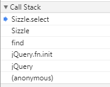


