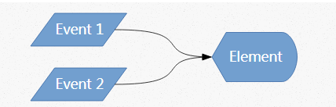
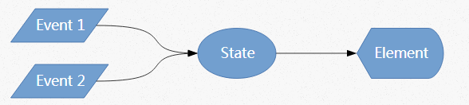
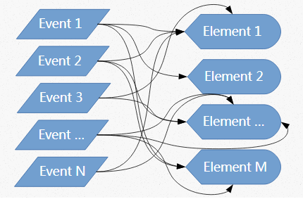
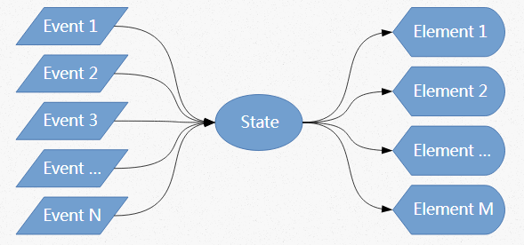

# 文章

1. http://hackflow.com/blog/2015/03/08/boiling-react-down-to-few-lines-in-jquery/ Boiling React Down to a Few Lines in jQuery 20150408
	- 概述，利用jQuery，一步步实现虚拟dom
	- 以及虚拟dom（react）实现是有些缺点的
2. https://medium.com/@yelouafi/react-less-virtual-dom-with-snabbdom-functions-everywhere-53b672cb2fe3  React-less Virtual DOM with Snabbdom  20150728
	- 简述虚拟dom为何适合web应用程序


## 降低复杂度

1. ```html
	<span id="colored-counter">0</span>
	<label for="color"></label><input id="color"/>
	<button id="inc">按钮</button>
	<script>
	  $('#color').on('keyup', function () {
	    $('#colored-counter').css('color', `#${this.value}`);
	  })
	  $('#inc').on('click', function () {
	    var oldValue = $('#colored-counter').html();
	    var newValue = 1 + Number(oldValue);
	    $('#colored-counter').html(newValue);
	  })
	</script>
	```

2. 将样式处理的部分提取为函数

	```javascript
	const state = {color:'', value: 0};
	function updateUI(){
	    $('#colored-counter').css('color', state.color);
	    $('#colored-counter').html(state.value);
	}
	$('#color').on('keyup', function () {
	    state.color = this.value;
	    updateUI();
	});
	$('#inc').on('click', function () {
	    state.value++;
	    updateUI();
	})
	```

3. 原始的工作流程是多个事件会改变一个元素，如：

4. 新的工作流程是多个事件改变状态，状态去触发元素改变

5. 当M事件和N个元素，原始工作流程会变成，复杂度为O(M*N)：

6. 新流程则是，O(M+N)的复杂度：

## 纯函数方式

1. 一个复杂点的例子，add可以增加列表数量，点击列表项可以删除列表某一条数据

2. 注意：如下使用render方式，并不能称之为优化，只是一种简化

3. 利用js实现

	```html
	<span id="count">2</span>
	<ul>
	    <li>hi</li>
	    <li>there</li>
	</ul>
	<button id="add">add</button>
	<script>
	    const state = {items: ['hi', 'there']};
	    function updateUI() {
	        const countDom = document.getElementById('count');
	        countDom.innerText = state.items.length;
	        const maparr = state.items.map((item) => {
	            return `<li>${item}</li>`
	        });
	        document.querySelector('ul').innerHTML = maparr.join('');
	    }
	    document.querySelector('ul').addEventListener('click',(e) => {
	        if(e.target.nodeName === 'LI') {
	            const index = Array.prototype.indexOf.call(document.querySelectorAll('li'),e.target);
	            state.items.splice(index, 1);
	            updateUI();
	        }
	    });
	    document.getElementById('add').addEventListener('click', () => {
	        state.items.push(`aaa${~~(Math.random()*1000)}`);
	        updateUI();
	    });
	</script>
	```

4. 主要问题是，updateUI不再是state的函数，预呈现的html与初始状态重复（应该用状态初始值表示预呈现html，这样改变state的初始值就可以改变预呈现html）

5. ```javascript
	<script>
	  const state = {items: ['hi', 'there']};
	  function render() {
	    const span = ` <span id="count">${state.items.length}</span>`
	    const maparr = state.items.map((item) => {
	      return `<li>${item}</li>`
	    });
	    return span + maparr.join('')
	  }
	  function updateUI() {
	    document.getElementById('ul').innerHTML = render() ;
	  }
	  document.getElementById('ul').addEventListener('click',(e) => {
	    if(e.target.nodeName === 'LI') {
	      const index = Array.prototype.indexOf.call(document.querySelectorAll('li'),e.target);
	      state.items.splice(index, 1);
	      updateUI();
	    }
	  });
	  document.getElementById('add').addEventListener('click', () => {
	    state.items.push(`aaa${~~(Math.random()*1000)}`);
	    updateUI();
	  });
	  updateUI();
	</script>  const state = {items: ['hi', 'there']};
	  function render() {
	    const span = ` <span id="count">${state.items.length}</span>`
	    const maparr = state.items.map((item) => {
	      return `<li>${item}</li>`
	    });
	    return span + maparr.join('')
	  }
	  function updateUI() {
	    document.getElementById('ul').innerHTML = render() ;
	  }
	  document.getElementById('ul').addEventListener('click',(e) => {
	    if(e.target.nodeName === 'LI') {
	      const index = Array.prototype.indexOf.call(document.querySelectorAll('li'),e.target);
	      state.items.splice(index, 1);
	      updateUI();
	    }
	  });
	  document.getElementById('add').addEventListener('click', () => {
	    state.items.push(`aaa${~~(Math.random()*1000)}`);
	    updateUI();
	  });
	  updateUI();
	```

6. 主要改变是：将updateUI转换为state的函数，即提出其他内容为render函数，程序开始调用下updateUI函数

## 虚拟dom

1. 我们可以看到render函数每次运行都是重新渲染一遍dom
2. 故使用diff算法，将每次更新dom的区别找出来，只更新已经修改过的dom
3. 有不同方式实现虚拟DOM，故在不同表现上，性能会不同，比如create，swap等，[具体可以看](https://github.com/krausest/js-framework-benchmark)
4. 

## 数据不变性

1. Immutability思想是基于之前的状态构建新状态，而不是复制然后变异 