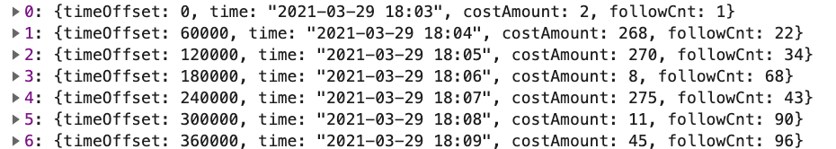
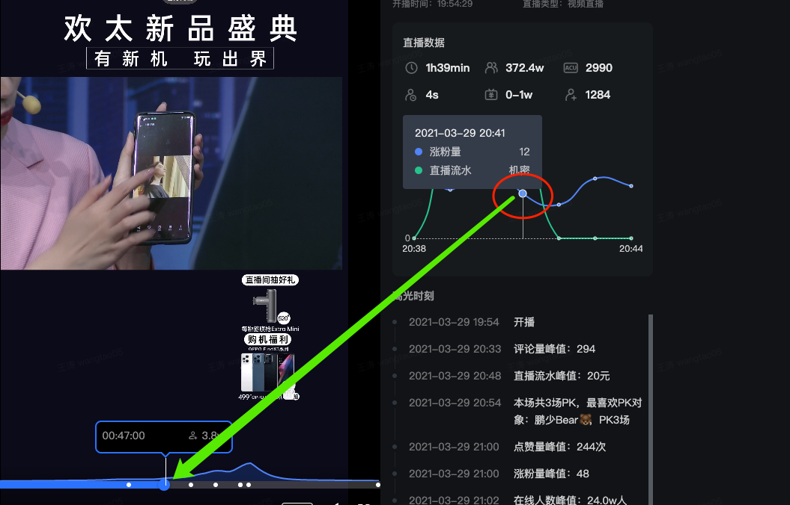
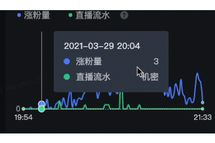
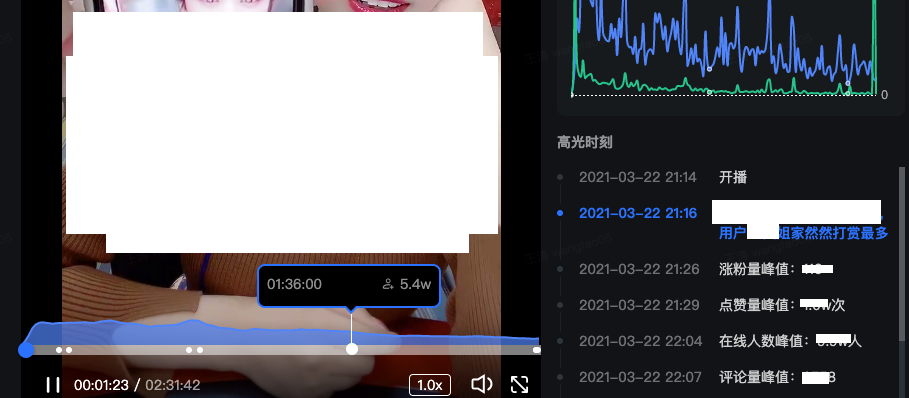
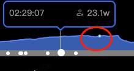
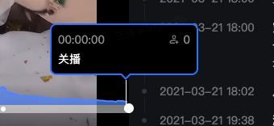

# 播放器与echart交互


## 数据准备方面

1. 图表数据
   - 图表数据需要包含视频播放的绝对时间，此数据中的timeOffset

## 图表点击触发视频播放

```javascript
state.chartApp.on('click', function (params) {
  const { dataIndex } = params;
  const timeOffset = dataSet[dataIndex].timeOffset
});
```

1. 当点击echart图某个数据点时，可拿到点击的index值，拿到数据对应的timeOffset，设置视频播放即可




## 视频播放触发图表tooltip

1. 根据上述图表数据的timeOffset，数据是60s为间隔进行抽样的；

2. 需要采用一定的策略，如视频播放0-60s时，图表数据显示index=0点，60-120s时，图表数据显示index=1 点

3. 通过监听`timeupdate`，可以获得video的播放时间，根据播放视频向echart派发事件

   ```javascript
   function dispatch(dataIndex) {
     state.chartApp = echarts.init(chartRef.value as HTMLDivElement);
     state.chartApp.dispatchAction(chartApp => {
       // 高亮点
       chartApp.dispatchAction({
         type: 'highlight',
         dataIndex,
       });
       // 显示tooltip和线
       chartApp.dispatchAction({
         type: 'showTip',
         seriesIndex: 0,
         dataIndex,
       });
     });
   }
   // 调用demo，假设handleSeeking监听了video的updateTime事件
   function handleSeeking(e) {
     const floor = Math.floor( e.srcElement.currentTime);
     // 特别注意：handleSeeking会每秒调用一次
     dispatch(floor);
   }
   ```



## 


# 直播榜单



1. 数据层面

   - 折线图：进度条上方图，通过hover的卡片，显示当前直播的在线人数
   - 高光时刻：进度条上的白点，显示直播的重点时刻

2. 数据格式

   ```javascript
   [
      {timeOffset: 60000, time: "2021-03-22 18:59", aaa: 'xxx', bbb: 'xxx'}
      {timeOffset: 120000, time: "2021-03-22 18:59", aaa: 'xxx', bbb: 'xxx'}
   ]
   ```

   - timeOffset 表示偏移绝对时间，任何和视频播放有关的，都需要有视频的绝对时刻，才能与视频一一对应

3. 播放器鼠标hover点实现

   ```javascript
   const left = this.$refs.bar.getBoundingClientRect().left; // 视频控制bar，距离左边距
   const barWidth = this.$refs.bar.clientWidth;
   let precent = (e.clientX - left) / barWidth;
   ```

   - 通过hover，计算鼠标当前位置占总控制bar的比例，设置 left值即可
   - hover对应的视频播放时间值： `precent * duration(视频总长)`

4. 高光时刻实现

   - 高光时刻数据可能是为数不多的几个点
   - `timeoffset / 总播放时间`，然后设置` left : xxxxpx`， 绝对定位到进度条上

5. 折线图

   - 开始chart有交互，直接用canvas实现折线图，需要自己处理事件较麻烦，项目也引用了echart，故直接使用

   - 使用echart4，目前只能通过调用echart api，设置并清除高亮点，效率必然不高

     ```javascript
     state.chartApp.dispatchAction({
       type: 'downplay',
       dataIndex: dataIndex,
     });
     state.chartApp.dispatchAction({
       type: 'highlight',
       dataIndex,
     });
     ```

6. 显示卡片

   - 当鼠标hover到高光时刻点时，会hover对应的内容

     ```html
     <template v-for="(item,index) in highlight" >
       <span
             v-if="time >= item.highlightTimeOffset / 1000 - RANGE
                   && time <= item.highlightTimeOffset / 1000 + RANGE"
             :key="index"
             >
         {{item.highlight}}
       </span>
     </template>
     ```

   - 由于高光是一个时刻点，但hover是无法hover到准确这个点上的，故设了高光60s后范围都可以被hover，但会存在一个问题：参见问题1

   

## 问题

### hover问题

1. 如果视频非常长，十几小时甚至更长，鼠标hover挪动一下，可能过了几十秒
2. 如果默认，一个高光点后60秒范围可以显示卡片，那么如果两个点间隔小于60s如何处理
3. 解决：
   - 问题1，目前未接，可通过视频时间不同，高光点后x秒不同，减少问题
   - 问题2，card设置为高度自适应，如果点离的比较近，都填充进去

### 数据点漂移问题

1. 
2. 由于数据抽样导致的问题，比如当前视频只有180秒，折线图60秒抽样，故折线图高亮点只能有3个，所以hover上去时，通过hover的毫秒数取整，找到能高亮的点，肯定会有缝隙，无法对齐；视频越短（抽样点数量越少），缝隙会越大（计算逻辑，hover的时刻除以取样间隔，判断在数组位置index，然后进行dispatchAction）
3. 解决：
   - 未解，直接不要这折线图上的白点了。。
4. 如何解
   - echart 应该无解，echart根据采样点，无法高亮到两个x点中间数据的
   - 如使用canvas自己实现折线图，如总共就3个点，那么需要定义一个平滑函数，可以根据x值，获取y值

### 末尾数据00问题

1. 
2. 数据index是通过`Math.ceil()`获取的，最后点向上取整会超过数组边界
3. 解决：
   - 使用`Math.floor`


