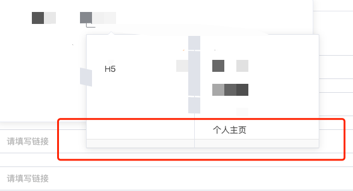

# 封装

1. packages/admin/src/pages/misc/sentence/components/biz-cascader.vue

# 问题

1. mac电脑接了鼠标，会出现这个：无鼠标即没问题

   

2. 仅清空v-model绑定的值可能会报错

   - Error in callback for watcher "value": "TypeError: Cannot read property 'level' of null"
   - 需要清空当前选中的节点，文档并没有方法调用，源码看到，可以使用
   - `this.$refs.cascader.handleClear();`

   

