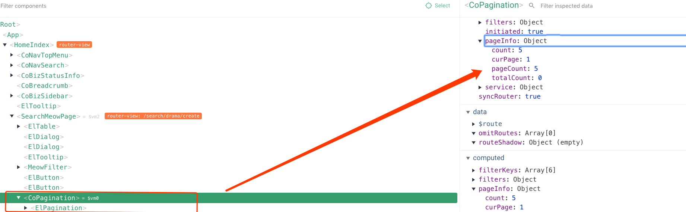
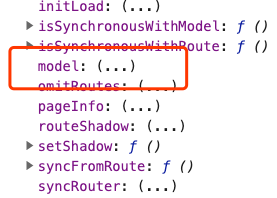
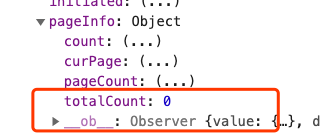

## 对于后端传来的html并没有好的办法添加事件

1. 问题描述：

   - acfun动态详情需要用ubb解析，解析之后的html，针对图片需要点击显示浮层

2. 解决：

   ```html
   <span v-html="ubb2html(content.description)" @click="handleShowImg($event)"></span>
   <script>
   export default {
       methods: {
           handleShowImg(event) {
               this.img = event.target.getAttribute('data-src');
               if (this.img) {
                   this.showImgDialog = true;
               }
           },
       }
   };
   </script>
   ```

   

## 利用ref调用其他子组件方法

1. 问题描述：

   - 点击a时，想调用b组件内部方法获取数据

     ```vue
     <!--a-->
     <a>a组件</a>
     <!--b-->
     <b>b组件</b>
     ```

     

2. 在B组件上增加一个ref，调用A时，同时调用this.refs.B.getList()方法

3. 思考：使用model会比较麻烦

   - 因为B组件还需要获取对比视频id，这个输入框的内容，可以单独点击确定进行搜索
   - 如果将方法放在model上，数据也要绑定到model上

## props与v-model

### 描述

1. form表单的某些部分是被共用的，或者说需要再对upload或date-picker进行封装
2. 主要是如何绑定提交值

### 解决

#### 方案一：自定义v-model

```html
<date-schedule
    v-model="searchForm.time"
    :showSchedule="false"
></date-schedule>
```

```vue
<!--date-schedule组件内部-->
<template>
<ks-el-date-picker v-model="time" ></ks-el-date-picker>
</template>
<script>
  export default {
    props: {
      value: {
        type: Array,
        default: () => []
      }
    },
    data() {
      return {
        time: this.value,
      }
    },    
    methods: {
        handleDatePickerChange(val) {
            this.$emit('input', val);
        }
    }
  }
</script>
```

1. 子组件设 value 为props属性，并且不主动改变 value 值
2. 子组件通过 this.$emit('input', 'updateValue') 将 updateValue 值传给父组件
3. 父组件通过 v-model="localValue" 绑定一个本地变量
4. 即可实现子组件value值与父组件updateValue 值同步更新

#### 方案二：sync

```vue
<picuter-upload :imgUrl.sync="searchForm.bannerUrl" ></picuter-upload>
```

```vue
<!--picuter-upload组件内部-->
<script>
export default {
    props: {
        imgUrl: {
            type: String,
            default: ''
        }
    },
    methods: {
        handleUploadSuccess(res) {
            const { url } = res.data;
            this.$emit('update:imgUrl', url);
        },
    },
};
</script>
```

### 结论

1. 方案一，是子组件需要使用v-model


## 内外组件值不一致

### 描述

1. pageInfo在组件内外值不一致

   ```vue
   <!--父组件-->
   <co-pagination
       :model.sync="model"
       sync-router
       @current-change="currentChange"
   ></co-pagination>
   test: {{model.pageInfo}}
   <!--子组件-->
   <div>
       {{model.pageInfo.totalCount}}
   </div>
   ```

   - 内外组件totalCount不一致

### 解决

1. 首先在vue组件页面页面，查看传入组件的props是否正确

   

2. 发现确实是传入的model，再在子组件查看model是否和外部一致，在子组件

   ```html
   <!--子组件-->
   <div>
       {{model === $parent.model}}
   </div>
   ```

3. 发现传入的与外部是同一个model，在控制台查看$vm0组件情况，可以看到model是响应式的（属性后是一个括号），往下看pageInfo也是响应式的，但pageInfo的totalCount不是响应式的

   

### 结论

1. 主要是由对象的某个属性不具有响应式造成的

## data变化未触发updated方法

### 问题

1. 观察到data发生了变化，但未触发这updated与beforeUpdate方法

### 解决

1. 没有触发，是不触发了created，组件并没有更新，实际是进行了销毁重构

### 引申

```vue
<!--wrapper.vue-->
<template>
    <div>
        <slot></slot>
    </div>
</template>
<!--main.vue-->
<template>
    <template v-if="shoow">
        <wrapper>
            <p>123123123</p>
        </wrapper>
        <wrapper>
            <p>123123123</p>
        </wrapper>
    </template>
    <wrapper v-else>
        <p>afafds</p>
    </wrapper>
    <wrapper>
        <test></test>
    </wrapper>
</template>
```

1. test组件很简单，只是一个created方法
2. 当切换show时，由于dom销毁重建，会导致test组件重新销毁重建
3. 注意：
   - 将v-else放于template上依然会出现test组件重新渲染这个问题
   - 或者v-else改为v-if="!show"也可以解决这个问题

## video组件内存泄漏

1. ```
        beforeDestroy() {
            // 组件销毁时，浏览器并不是实时释放video的内存占用，有可能造成页面引用也未释放，引起内存泄漏 
            this.$refs.video.src = null;
        },
   ```


# 总结

## 常量不要在data中赋值

1. create方法中定义的变量为非响应式的，因此，常量不应该在data中定义

## 使用如下方式定义接口是不好的

1. ```javascript
   const API_LIST = {
       create: 'CHANNEL_TOPIC_SLIDE_CREATE',
       update: 'CHANNEL_TOPIC_SLIDE_UPDATE',
       test: 'CHANNEL_TOPIC_SLIDE_TEST',
   }
   ```

   - 之后迁移ts不方便
   - 模块依赖是动态的，依赖运行时状态，编译时侦测不到，会完美避开webpack压缩的tree shaking能力
   - 如果有多个页面，某个页面只用了一个接口，但实际会把serviceMethod的全部请求都打包进去

## 透传属性

1. 直接使用

   ```
   v-bind="$attrs"
   ```

   

