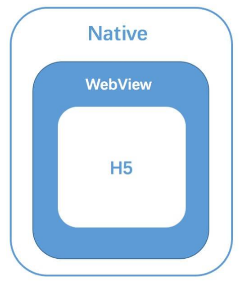

# H5开发

## 术语

### 物理像素

1. 一个物理像素是显示器(手机屏幕)上最小的物理显示单元

### 设备独立像素

1. 计算机坐标系统中得一个点，如css的一像素

### 设备像素比(device pixel ratio)：

1. 物理像素/设备独立像素
2. js可以使用`window.devicePixelRatio`获取设备dpr
3. 如iphone6设备宽高为375×667，可以理解为设备独立像素(或css像素)
	- 物理像素就应该×2，为750×1334
	- 如同样尺寸的普通屏幕与retina屏幕（设备宽高都是375*667），1px的css，在普通屏用一个物理像素点表示，而在retina用4个

### 位图像素

1. 理论上，1个位图像素对应于1个物理像素，图片才能得到完美清晰的展示
2. 但在retina上，位图像素不够用，导致图片会变大模糊
3. 因此对于dpr=2的屏幕，一个`200*300px`的img标签，需要提供一个`400*600`的图片，即@2x图


# Hybrid技术原理

1. Hybrid App 就是混合式的 App，也就是在移动端原生应用的基础上，通过 JSBrdige 等方法，访问原生应用的 API 进行 JS 的交互，并通过 WebView 等技术实现 HTML 与 CSS 的渲染。

1. WebView 可以理解为嵌套了一个浏览器内核（比如 webkit）的移动端组件。

2. 最核心的点就是Native端与H5端之间的**双向通讯层**，其实这里也可以理解为我们需要一套跨语言通讯方案，来完成 Native(IOS/Android) 与 JS 的通讯。

3. 这个方案就是我们所说的 JSBridge，而实现的关键便是作为容器的 WebView，一切的原理都是基于 WebView 的机制

	


## JSBridge

### 起源

1.  JavaScript 主要载体 Web 是当前世界上的 最易编写 、 最易维护 、最易部署 的 UI 构建方式
2. 任何一个移动操作系统中都包含可运行 JavaScript 的容器，因此使用js作为bridge的语言，不像其他语言一样，需要额外的运行环境


适配方案

1. @media，主要缺点

   - 页面上所有的元素都得在不同的 `@media` 中定义一遍不同的尺寸，代价有点高。
   - 如果再多一种屏幕尺寸，就得多写一个 `@media` 查询块。

2. rem 适配方案：根据不同分辨率修改根元素的font-size

   - `flexible` 方案：阿里早期的一个移动端适配解决方案
   - postcss-pxtorem 插件：通过插件实现px到rem的转换

3. viewport 适配方案

   - `viewport` 方案使用 vw/vh 作为样式单位。vw/vh 将 `viewport` 分成了一百等份，`1vw` 等于视口 `1%` 的宽度，当我们的设计稿宽度是 750px 时，`1vw` 就等于 `7.5px`。

   - 设置 meta 标签

     ```html
     <meta name="viewport" content="width=device-width, initial-scale=1.0, maximum-scale=1.0, user-scalable=yes">
     ```

   - 使用postcss-px-to-viewport：将px转为vw，可以通过配置标注不需要转换的属性

   - 缺点：`px` 转换成 `vw` 不一定能完全整除，因此有一定的像素差。

