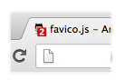

# 动画库概述

## animed

### 轻量级动画库

1. https://github.com/juliangarnier/anime

2. Star：22985，min.js：14.1KB，11月前（201808）

3. 兼容性

| Chrome | Safari | IE / Edge | Firefox | Opera |
| ------ | ------ | --------- | ------- | ----- |
| 24+    | 6+     | 10+       | 32+     | 15+   |

4. 主要功能

  - 可以对css，dom，NodeList，Object，Array进行动画操作，而且有简单事例

  - 动画时间轴控制
  - 开始、暂停等动画精细控制
  - 基于函数返回值创建动画
  - svg动画
  - 自定义缓动函数

## popmotion

### 支持React的动画库，最小pure动画库11KB

1. https://github.com/Popmotion/popmotion
2. Star：14347， min.js：多版本（最小的11KB），2天前（201808）
3. 主要特点
  - 有React和React Native的动画支持
  - demo有代码

## velocity

### js动画加速，$.animate()的加速版本

1. https://github.com/julianshapiro/velocity
2. star：15051，min.js：47KB，1月前（201808）
3. 兼容性：IE8
4. 是jQuery.animate()动画的加速版本，因此可以将jQuery.animate()完全，替换为$.velocity()

## mojs

### 创建网格动画的库（很久不更新了）

1. https://github.com/legomushroom/mojs
2. Star：13792，min.js：33.9KB，2年前（201808）
3. 兼容性：IE9+
4. 只提供较为复杂的demo，以及3个从简到繁的手册

## move.js

### css3支持的js动画库

1. https://github.com/visionmedia/move.js
2. star：4370,3年前
3. 有点整合了css3与$.animate()的意思

## 

## particles

### js粒子效果库

1. https://github.com/VincentGarreau/particles.js
2. star：16540，min.js:22.8KB，3年前（201808）
3. 官网演示挂了，只有api介绍，没有使用demo

## parallax

### 视差引擎

1. https://github.com/wagerfield/parallax
2. star：13269,1年前
3. demo小例子不多，不知道能做什么（感觉主要是提供一种层次感的效果），官网很6

## Tween.js

### 缓动函数库，create.js的一部分

1. https://github.com/CreateJS/TweenJS
2. star：2721,3个月前
3. 无太多实例，但有中文网，有详细api

# CSS动画库

## animista（nice，nice，nice）

1. http://animista.net/play/basic
2. 在网站可以通过定制，实现某些动画效果，直接获得css代码

## animate.css

### 适用于基于样式的简单动画

1. https://github.com/daneden/animate.css
2. Star：53802，min.css：56.6KB，1个月前（201808）
3. 简单的跨浏览器动画，为元素增加样式，再用jQuery改变样式就可以形成动画
4. 动画库内置了一些动画，都是基于样式的，非常简单实用
5. 主要功能：
  - 可以定义动画延迟时间
  - 对于这个项目，可以通过npm install，更改animate-config.json后，运行gulp，自己编译需要的版本
  - 还是基于css3的单一样式动画效果，主要是对transform的封装
  - 应用场景，支持css3，3d效果ie10+，2d的是ie9+

## Hover

### 基于css3的hover动画

1. https://github.com/IanLunn/Hover
2. star：19724,3个月前（201808）
3. 提供了css，scss/less等版本样式，需要哪个hover特性直接样式拷贝过来即可

## Csshake

###  提供元素抖动的css

1. https://github.com/elrumordelaluz/csshake
2. star：3685,3个月前（201808）
3. 可以使多种元素抖动

## magic

### css3的特殊动画（3D）

1. https://github.com/miniMAC/magic
2. star：5511，3月前（20180829）
3. 提供css3构建动画的样式代码，css3d效果，需要ie10+支持

# SVG动画

## vivus

1. https://github.com/maxwellito/vivus
2. Star：10671，min.js：11.7KB，3月前（201808）
3. 无依赖的使svg形成动画的库
4. 注意：主要是针对path进行动画，即同时，依次或延迟绘制path

## Snap.svg

1. https://github.com/adobe-webplatform/Snap.svg
2. star：11k，最新是0.51版本（20170207发布），2年前（20181208）
3. 类似css动画，可以让svg从一个图形向另一个图形动画

# Loading样式

## SpinKit 

1. https://github.com/tobiasahlin/SpinKit
2. star：15279,3年前
3. 提供了ie9以下的pollyfill

## css-loaders

1. https://github.com/lukehaas/css-loaders
2. star：5616,2年前

# 进度条动画

## pace

### 为站点增加进度条（不再维护）

1. <https://github.com/HubSpot/pace>
2. star：13915,3年前
3. 会自动检测progress，增加滚动条；demo页的样式也下载不下来

## progress.js

### 对各种对象控制progress

1. https://github.com/usablica/progress.js/
2. star：2321,4年前
3. 其实是利用了css3样式+onprogress事件（大致）

# 鼠标滚动动画库

## aos

1. https://github.com/michalsnik/aos
2. star：7213，min.js：14kB，2月前（201808）
3. css3驱动的动画库
4. 主要功能：向上或向下滚动鼠标时，对某些元素进行动画处理，当返回top时，元素回到原始状态

## scrolldir

1. https://github.com/dollarshaveclub/scrolldir
2. 632 stars
3. 0依赖的滚动库，主要就是向下滚动header出现，向下滚动footer出现
4. 可以作为代码实现的餐口

## ScrollMagic

1. https://github.com/janpaepke/ScrollMagic
2. 10.5k 20190116（3month前）
3. 可以制作很多关于滚动鼠标的动画

# 新手引导

## Intro.js

1. https://github.com/usablica/intro.js
2. 17k star  20181205
3. 为网站和项目提供分步指导新功能介绍的好方法

# IDEAs

## favico.js

### 浏览器消息提示

1. https://github.com/ejci/favico.js
2. 
3. star：8023，2年前
4. IE：no，Edge：no

## Textillate.js

### 文字动画效果

1. https://github.com/jschr/textillate/
2. star：3267，2年前
3. 依赖，jQuery，animate.css,lettering.js，**依赖的太多**

