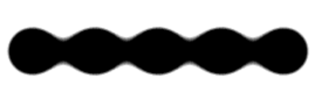
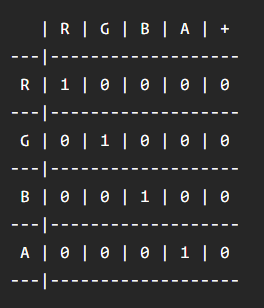

# Gooey Effects

## 概述

1. 提供多个demo：https://tympanus.net/codrops/2015/03/10/creative-gooey-effects/   2015/03/10 
2. 效果原理：https://css-tricks.com/gooey-effect/  2015/2/4
3. 主要是对SVG filters的使用，浏览器95%支持
4. css滤镜也能实现，codepen搜gooey Effects

## 原理

1. 使用过滤器为元素增加模糊和背景的对比度
2. 当两个模糊的元素彼此靠近时，元素重合的地方有连接的效果，增大图像的模糊度和整个区域的对比度，图形粘连效果更明显
3. 看demo1.html
4. CSS的`filter`有一个极大的缺陷，其缺乏一个关键特性来对每个通道做处理 
5. 主要问题，无法在球内添加文字，透明度等，故使用SVG Filter
   - 我们可以只操作alpha通道，故不会更改颜色
   - 利用svg的SourceGraphic关键字，可以看到内容

## SVG Filter

1. 定义filter基本语法：

   ```html
   <svg xmlns="http://www.w3.org/2000/svg" version="1.1">
     <defs>
       <filter id="name-your-filter-here">
         ...          
         <!-- insert filters here -->
         ...
       </filter>
       ...
     </defs>
   </svg>
   ```

2. 将SVG过滤器应用到一个DOM上

   ```css
   .selector {
     filter: url('#name-of-your-filter-here');
     /* you can also load filters from external SVGs this way: */
     filter: url('filters.svg#name-of-your-other-filter-here');
   }
   ```

3. W3C 标准：https://www.w3.org/TR/filter-effects，会有详细的参数值介绍

## 公共属性

### result

1. 如提供值，则可以在被同一个<filter>标签下的其他过滤器，在in中引用；可以理解为一个过滤器处理结果的引用标识符

### in

1. 当前过滤器输入，可以是上一个filter结果，可以是SourceGraphic 、SourceAlpha 等关键词

## 滤镜介绍

### feColorMatrix 

1. 颜色矩阵滤镜，利用矩阵变换进行过滤
2. 如type=matrix，values为一个5*4的颜色变换矩阵，values='a00 a01 a02 a03 a04 a10 a11 ... a34 '，如
3. 利用如下方式计算RGBA自已每行的最终值
   - 1 0 0 0 0 // R = 1*R + 0*G + 0*B + 0*A + 0 
   - 0 1 0 0 0 // G = 0*R + 1*G + 0*B + 0*A + 0 
   - 0 0 1 0 0 // B = 0*R + 0*G + 1*B + 0*A + 0 
   - 0 0 0 1 0 // A = 0*R + 0*G + 0*B + 1*A + 0 

### feblend（混合）

1. 通过一个确定的混合模式将两个对象组合到一起。它有点像我们平常使用的图片编辑器中的合并两个图层 

## 结果

1. ```html
   <filter id="goo">
     <feGaussianBlur in="SourceGraphic" stdDeviation="10" result="blur" />
     <feColorMatrix in="blur" mode="matrix" values="1 0 0 0 0  0 1 0 0 0  0 0 1 0 0  0 0 0 18 -7" result="goo" />
     <feBlend in="SourceGraphic" in2="goo" />
   </filter>
   ```

2. 含义：

   - 先在原始图应用10px模糊
   - 利用颜色变换矩阵，对模糊图片进行转换，这个变换矩阵只是增加了透明通道的值，颜色未改变
   - 利用feBlend滤镜，将两个图进行融合

3. 