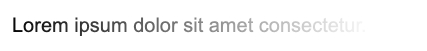

## 等待效果


## border，背景动态效果

1. https://github.com/jolaleye/cssfx

# 页面滚动阴影

```css
header{
  position: sticky;
  background: #fff;
  top: 0;
  font-size: 20px;
  padding: 10px;
  z-index: 1;
}
shadow::before{
  content: '';
  box-shadow: 0 0 10px 1px #333;
  position: fixed;
  width: 100%;
}
shadow::after{
  content: '';
  width: 100%;
  height: 30px;
  background: linear-gradient(to bottom, #fff 50% , transparent);
  position: absolute;
}
```

```html
<header>LOGO</header>
<shadow></shadow>
<main>很多内容文本</main>
```


# 多行文本下的文字渐隐消失术



https://mp.weixin.qq.com/s/qADnUx3G2tKyMT7iv6qFwg


# css控制鼠标移动（可拖动便签贴）

https://mp.weixin.qq.com/s/pxeoY8yO2ipnfarIa8hK_g


1. CSS 渐变锯齿消失术
   - https://mp.weixin.qq.com/s/gAF3nAOHZI39oq63hJmicw
