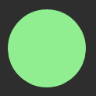
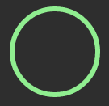
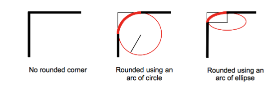
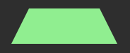

原文地址 https://blog.csdn.net/xinruliushui/article/details/79176890 

## 都知道是圆角

1. `border-radius` 属性是一个简写属性，用于设置四个 `border-*-radius` 属性。他用于向 `block` 级别元素增加圆角

## 实现一个圆

1. 在不使用 `canvas` 和 `svg` 的情况下，用 `border-radius` 就能简单实现一个圆

2. ```html
	<div>
		<p></p>
	</div>
	```

3. ```css
	div {
	  width: 100px;
	  height: 100px;
	}
	p {
	  width: 100%;
	  height: 100%;
	  background: lightgreen;
	  border-radius: 50%;
	}
	```

4. 

## 实现一个圆环

1. 给圆加一个边框，然后不绘制圆的背景颜色就好了？

	```css
	p {
	  width: 100%;
	  height: 100%;
	  border: solid 3px lightgreen;
	  border-radius: 50%;
	}
	```

2. 

3. 通过设置box-sizing，可以不超过设定的宽高

	```css
	box-sizing: border-box;   // 规定元素的宽高包含了元素边框的大小
	```


##  实现一个 半圆

1. ```css
	p {
	    width: 100%;
	    height: 50%;
	    background-color: lightgreen;
	    border-top-left-radius: 50px;
	    border-top-right-radius: 50px;
	}
	```

2. 

## 实现一个 小房子 ？

1. 上方一个半圆，下方一个 “半方”

2. ```css
	p {
	    width: 100%;
	    height: 100%;
	    border: solid 6px lightgreen;
	    box-sizing: border-box;
	    border-top-left-radius: 50%;
	    border-top-right-radius: 50%;
	}
	```

3. 


## border-radius八个值

1. border-top-left-radius等都可以设置两个值

2. 

	```css
	/* horizontal vertical */
	border-top-left-radius: 0.5em 1em;
	```

3. border-radius同样可以表示两个值，用/分割

	```css
	border-radius: 50% 50% 0 0 / 100% 100% 0 0;
	```

## 拓展

### IE 的标签页卡片

```css
p {
    width: 100%;
    height: 50%;
    background: lightgreen;
    border-radius: 25% 25% 0 0 / 50% 50% 0 0;
}
```


### 实现梯形

```
p {
    height: 0;
    width: 100px;
    border-bottom: 50px solid lightgreen;
    border-left: 25px solid transparent;
    border-right: 25px solid transparent; 
}
```



### 对角圆角

```
p {
  width: 100%;
  height: 50%;
  background: lightgreen;
  border-radius: 100% 50%/ 0 100%;
}
```


### 一片叶子

```
p {
  width: 100%;
  height: 50%;
  background: lightgreen;
  border-radius: 0 100% / 0 100%;
}
```


