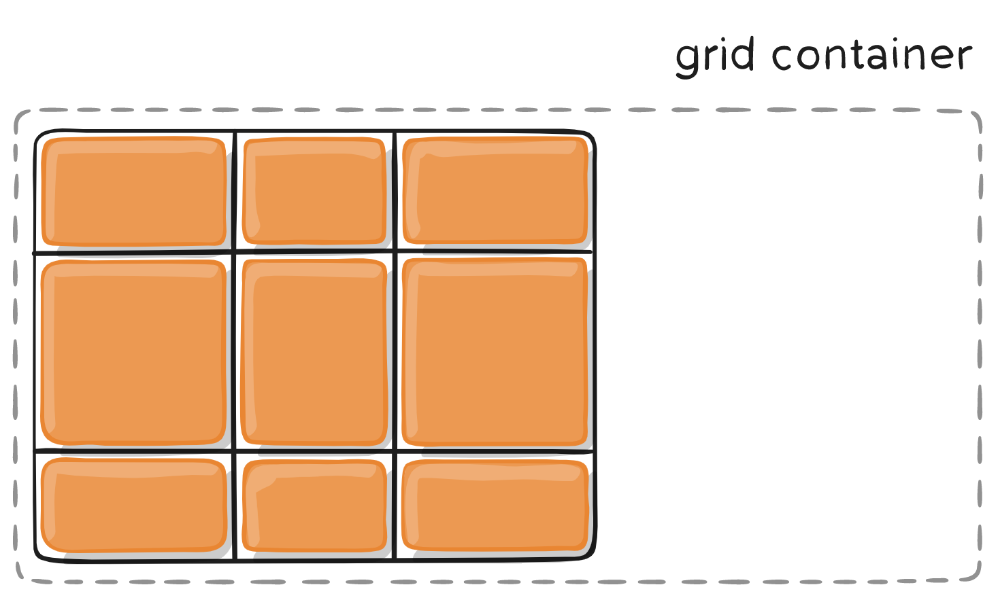

# 概述

1. flex目的是为了解决更简单的一维布局，而不是复杂的二维布局

# 容器属性

## display

1. 将元素定义为网格容器，并为其内容建立新的网格格式上下文

2. 主要分为内联网格和块级网格（指的的当前grid容器是内联还是块级）

   ```css
   .container {
     display: grid | inline-grid;
   }
   ```

3. 块级网格（注意foo与bar位置）

   

4. 内联网格

   

5. 注意，设为网格布局以后，容器子元素（项目）的`float`、`display: inline-block`、`display: table-cell`、`vertical-align`和`column-*`等设置都将失效。

## grid-template-rows

1. `grid-template-columns`属性定义每一列的列宽，`grid-template-rows`属性定义每一行的行高

   ```css
   .container {
     display: grid;
     grid-template-columns: 100px 100px 100px;
     grid-template-rows: 100px 100px 100px;
   }
   ```

   - 3行3列网格，都是100px
   - 也可使用百分比

### repeat()

1. 当行列很多时，这么写会非常复杂，可以使用`repeat(重复次数，重复的值或模式)`函数

2. 重复某个值

   ```css
   .container {
     display: grid;
     grid-template-columns: repeat(3, 33.33%);
     grid-template-rows: repeat(3, 33.33%);
   }
   ```

3. 重复某个模式，得到如下图的结果

   ```css
   .container {
     display: grid;
     grid-template-columns: repeat(2, 100px 20px 80px);
   }
   ```

   

### auto-fill 关键字

1. 解决：单元格大小固定，但容器大小未知，希望一行有更多单元格

   ```css
   .container {
     display: grid;
     grid-template-columns: repeat(auto-fill, 100px);
   }
   ```

   - 每列宽度`100px`，然后自动填充，直到容器不能放置更多的列

### fr关键字

1. 方便表示比例关系，如 1fr 2fr ,表示后者是前者的2倍

2. 表示两个相同的列

   ```css
   .container {
     display: grid;
     grid-template-columns: 1fr 1fr;
   }
   ```

3. 与绝对值使用

   ```css
   .container {
     display: grid;
     grid-template-columns: 150px 1fr 2fr;
   }
   ```

   - 第一个网格是150px，剩下的区域1比2

### mixmax()

1. 产生一个长度范围，表示长度就在这个范围之中

   ```css
   .container {
     display: grid;
     grid-template-columns: 1fr 1fr minmax(100px, 1fr);
   }
   ```

   - 表示最后一个元素，最小是100px

### auto关键字

1. 由浏览器自己决定长度

   ```css
   .container {
     display: grid;
     grid-template-columns: 100px auto 100px;
   }
   ```

### 网格线名称

1. 可以使用方括号，指定每一根网格线的名字，方便以后的引用

2. 还允许为一根网格线定义多个名字

   ```css
   .container {
     display: grid;
     grid-template-columns: [c1 c11] 100px [c2] 100px [c3] auto [c4];
     grid-template-rows: [r1] 100px [r2] 100px [r3] auto [r4];
   }
   ```

## grid-template-areas

1. 指定区域，一个区域由单个或多个单元格组成

2. 可以使用`.`表示空位

   ```css
   #container{
     display: grid;
     grid-template-columns: 100px 100px 100px 100px;
     grid-template-rows: auto;
     grid-template-areas: "a a a a" "b b . c" ". . . c" "d d d ."
   }
   
   .item {
     font-size: 4em;
     text-align: center;
   }
   
   .item-1 {
     grid-area: a;
     background: red;
   }
   
   .item-2 {
     grid-area: b;
     background: green;
   }
   
   .item-3 {
     grid-area: c;
     background: yellow;
   }
   
   .item-4 {
     grid-area: d;
     background: #00ff00;
   }
   ```

   - areas类似于tr-td的合并单元格，要保证每行每列数量准确，效果才正确

   - 上述代码得到的结果是

     

3. 注意：

   - 区域的命名会影响到网格线。每个区域的起始网格线，会自动命名为`区域名-start`，终止网格线自动命名为`区域名-end`
   - 比如，区域名为`header`，则起始位置的水平网格线和垂直网格线叫做`header-start`，终止位置的水平网格线和垂直网格线叫做`header-end`

## grid-template

1. 用于定义 grid-template-rows ，grid-template-columns ，grid-template-areas 简写属性

   ```css
   .container {
     grid-template: none | <grid-template-rows> / <grid-template-columns>;
   }
   ```

   - `none`：将所有三个属性设置为其初始值

## grid-column-gap/grid-row-gap

1. 网格线大小，设置列/行之间间距的宽度

   ```css
   .container {
     grid-column-gap: 10px;
     grid-row-gap: 15px;
   }
   ```

   

2. 注意：

   - 只能在 列/行 之间创建间距，网格外部边缘不会有这个间距
   - 等同于：`column-gap` 和 `row-gap`，将来将删除grid前缀

## 内容对齐方式

### justify-items

1. 水平对齐方式

   ```css
   .container {
     justify-items: start | end | center | stretch;
   }
   ```

   - `start`：左侧对齐
   - `end`：右侧对齐
   - `center`：水平居中对齐
   - `stretch`：填满单元格的宽度（默认值）

### align-items

1. 垂直对齐方式

   ```css
   .container {
     align-items: start | end | center | stretch;
   }
   ```

   - `start`：顶部对齐
   - `end`：底部对齐
   - `center`：垂直居中对齐
   - `stretch`：默认值

### place-items

1. `place-items` 是设置 `align-items` 和 `justify-items` 的简写形式。

   ```css
   .container {
     place-items: <align-items> <justify-items>;
   }
   ```

   - 省略第二个值，则两个值设置为相同的

## 内容区域对齐方式

1. 解决单元格内容小于网格容器大小后，整体单元格内容的对齐方式

### justify-content

1. 水平方式

   ```css
   .container {
     justify-content: start | end | center | stretch | space-around | space-between | space-evenly;    
   }
   ```

   - `start`：左侧对齐
   - `end`：右侧对齐
   - `center`：水平居中对齐
   - `stretch`：调整 网格项(grid items) 的宽度，允许该网格填充满整个 网格容器 的宽度
   - `space-around`：在每个网格项之间放置一个均匀的空间，左右两端放置一半的空间
   - `space-between`：在每个网格项之间放置一个均匀的空间，左右两端没有空间
   - `space-evenly`：在每个网格项目之间放置一个均匀的空间，左右两端放置一个均匀的空间

2. 如start参数的效果

   

### align-content

1. 垂直方向，与水平方向参数相同

### place-content

1. `place-content` 是设置 `align-content` 和 `justify-content` 的简写形式

## grid-auto-*

1. 如网格只有3列，但是某一个项目指定在第5行，浏览器会自动生成多余的网格，以便放置项目
2. `grid-auto-rows`与`grid-auto-columns`用于设置浏览器自动生成多余的网格的大小

## grid-auto-flow

1. 控制没有明确放置在网格上的网格项(grid items)如何进行排布

   ```css
   .container {
     grid-auto-flow: row | column | row dense | column dense
   }
   ```

   - row：依次填充每行，默认方式
   - column：按列填充
   - dense：尝试填充网格中较早的空缺，只会更改网格项的可视顺序，并可能导致它们出现乱序，这对可访问性不利

2. 考虑如下代码

   ```htm
   <section class="container">
     <div class="item-a">item-a</div>
     <div class="item-b">item-b</div>
     <div class="item-c">item-c</div>
     <div class="item-d">item-d</div>
     <div class="item-e">item-e</div>
   </section>
   ```

   ```css
   .container {
     display: grid;
     grid-template-columns: 60px 60px 60px 60px 60px;
     grid-template-rows: 30px 30px;
     grid-auto-flow: row;
   }
   .item-a {
     grid-column: 1;
     grid-row: 1 / 3;
   }
   .item-e {
     grid-column: 5;
     grid-row: 1 / 3;
   }
   ```

   - 设置了一个2行5列的grid，a与e被分别放置在固定位置

3. `grid-auto-flow: row;`得到的结果：

   

4. `grid-auto-flow: column;`得到的结果：

   

## 简写属性

1. grid是`grid-template-rows`, grid-template-columns,`grid-template-areas, `grid-auto-rows, `grid-auto-columns, 和 `grid-auto-flow`简写
2. 由于并不方便阅读，


# 项目属性

## `grid-*-start`/ `grid-*-end`

1. 通过指定位于哪根网格线，指定项目位置

   ```css
   .item {
     grid-column-start: <number> | <name> | span <number> | span <name> | auto
     grid-column-end: <number> | <name> | span <number> | span <name> | auto
     grid-row-start: <number> | <name> | span <number> | span <name> | auto
     grid-row-end: <number> | <name> | span <number> | span <name> | auto
   }
   ```

2. 注意：

   - 未指定的项目会根据grid-auto-flow进行排列，默认是row
   - 如果产生了项目的重叠，则使用`z-index`属性指定项目的重叠顺序

3. 指定数值

   ```css
   .item-1 {
     grid-column-start: 2;
     grid-column-end: 4;
   }
   ```

   

4. 指定名称

   ```css
   .item-1 {
     grid-column-start: header-start;
     grid-column-end: header-end;
   }
   ```

5. 使用`span`

   ```css
   .item-1 {
     grid-column-start: span 2;
   }
   ```

   - 1号项目的左边框距离右边框跨越2个网格

## grid-column / grid-row

1. 分别为 grid-column-start + grid-column-end 和 grid-row-start + grid-row-end 的简写形式

   ```css
   .item {
     grid-column: <start-line> / <end-line> | <start-line> / span <value>;
     grid-row: <start-line> / <end-line> | <start-line> / span <value>;
   }
   ```

2. 举例

   ```css
   .item-1 {
     grid-column: 1 / 3;
     grid-row: 1 / 2;
   }
   /* 等同于 */
   .item-1 {
     grid-column-start: 1;
     grid-column-end: 3;
     grid-row-start: 1;
     grid-row-end: 2;
   }
   ```

   - 项目`item-1`占据第一行，从第一根列线到第三根列线。


## grid-area

1. 为网格项提供一个名称，以便可以 被使用网格容器 grid-template-areas 属性创建的模板进行引用

## 单元格内容对齐方式

### justify-self

1. 水平方向
   - `start`：左侧对齐
   - `end`：右侧对齐
   - `center`：水平居中对齐
   - `stretch`：填满单元格的宽度（默认值）

### align-self

1. 垂直方式

### place-self

1. place-self 是设置 align-self 和 justify-self 的简写形式。


# 动画

1. 根据 CSS Grid 布局模块 Level 1 规范，有 5 个可应用动画的网格属性
2. 但支持还不太好