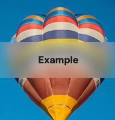

# inert(102+)

1. 当前元素与子元素，无法focus+click

   ```html
   <div inert>
     <label for="button2">Button 2</label>
     <button id="button2">I am inert</button>
   </div>
   ```

2. https://developer.chrome.com/articles/inert/

# 布局

[书写模式 Writing Mode](https://developer.mozilla.org/zh-CN/docs/Web/CSS/CSS_Writing_Modes)

1. 定义了各种国际书写模式


[CSS Logical Properties and Values](https://developer.mozilla.org/en-US/docs/Web/CSS/CSS_Logical_Properties)

1. 通过逻辑与值控制布局，而不是物理、方向等控制
2. Block dimension： 垂直于英语书写方向，类似于高
3. inline dimension： 水平与英语书写方向，类似于宽


[content-visibility](https://developer.mozilla.org/en-US/docs/Web/CSS/content-visibility)  chrome 不支持

1. 可以跳过元素的渲染工作（包括布局和绘画），直到需要为止，这使初始页面加载速度更快。


Media Queryies： Range Syntax

1. `@media (100px <= width <= 1900px)` is the equivalent of `@media (min-width: 100px) and (max-width: 1900px`)`


# 图形与图像

[blend-mode](https://developer.mozilla.org/en-US/docs/Web/CSS/blend-mode)

1. 当元素重叠时，颜色应当如何呈现。它被用于 [`background-blend-mode`](https://developer.mozilla.org/zh-CN/docs/Web/CSS/background-blend-mode) 和 [`mix-blend-mode`](https://developer.mozilla.org/zh-CN/docs/Web/CSS/mix-blend-mode) 属性

[backdrop-filter](https://developer.mozilla.org/en-US/docs/Web/CSS/backdrop-filter)

1. 某个元素后面添加模糊等效果




[min-content](https://developer.mozilla.org/en-US/docs/Web/CSS/min-content)

1. 例如：`width:min-content`，多个空格分隔的英文，可以按照最长单词设置宽，但目前无法控制几行（比如2行文字自动分配）


# 滚动

[scroll-behavior](https://developer.mozilla.org/en-US/docs/Web/CSS/scroll-behavior)

1. `scroll-behavior: smooth;` 触发滚动时，会smooth，比如点击1时

   ```html
   <nav>
     <a href="#page-1">1</a>
   </nav>
   <div class="scroll-container">
     <div class="scroll-page" id="page-1">1</div>
   </div>
   ```

   

[overscroll-behavior](https://developer.mozilla.org/en-US/docs/Web/CSS/overscroll-behavior)

1. 设置网页内部的滚动是否会触发父级容器滚动


[CSS Scroll Snap](https://cloud.tencent.com/developer/article/2023709)

1. 控制滚动时，子元素与容器的对齐位置，优化滚动的


[scrollbar-gutter](https://developer.mozilla.org/en-US/docs/Web/CSS/scrollbar-gutter)

1. 让滚动条出现的时候内容不晃动
1. MacOS操作系统滚动条本身就不占据宽度，因此无效，本demo需要在Windows操作系统下体验


# 选择器

[::marker](https://developer.mozilla.org/en-US/docs/Web/CSS/::marker)

1. `display:list-item`前的marker样式，相比伪类after实现有局限性


# 可交互性

forced-colors

```css
@media (forced-colors: active) {
  .button {
    border: 2px ButtonText solid;
  }
}
```

1. 查询浏览器是否使用高对比度模式

prefers-color-scheme

```css
@media (prefers-color-scheme: dark | light) {
  .day.dark-scheme {
    background: #333;
    color: white;
  }
}
```

1. 查询用户使用dark还是light模式

[prefers-reduced-motion](https://developer.mozilla.org/en-US/docs/Web/CSS/@media/prefers-reduced-motion)

```css
@media (prefers-reduced-motion) {
  .animation {
    animation: dissolve 2s linear infinite both;
  }
}
```

1. 判断用户是否开启了减小不要动画模式

[prefers-contrast](https://developer.mozilla.org/en-US/docs/Web/CSS/@media/prefers-contrast)

1. 浏览器是否使用更高或更低的对比度


其他

[color-scheme](https://developer.mozilla.org/en-US/docs/Web/CSS/color-scheme)

1. 允许元素根据用户选择的dark mode或light mode进行调整，但会被如color，background覆盖


[font-palette]()

1. 给颜色字体进行自定义配色
2.  [Wakamai Fondue](https://wakamaifondue.com/) 的在线网站工具可以帮助识别字体中的颜色色板
3. 多色字体技术的实际应用不是中文的处理，更多的是英文数字
4. 彩色 icon 图标，但一般都是 SVG 绘制的，颜色的控制并不方便，如果能转为彩色字体，则可以通过这个方式进行颜色控制


[Variable_Fonts_Guide](https://developer.mozilla.org/en-US/docs/Web/CSS/CSS_Fonts/Variable_Fonts_Guide)

1. 可变字体，可以根据字体设计配置字的宽窄、字的粗细、是否倾斜、倾斜程度，参考可变字体资源：[资源1](https://v-fonts.com/)，[资源2](https://docs.google.com/spreadsheets/d/1ycxOqpcPA9NmCWcNbmxiY-KHEh820MucI1eO6QkKLOE/htmlview#gid=0)
2. 主要解决静态字体，需要单独下载常规、斜体、粗体、斜体粗，至少4个字体包；


font-display

1. 可以根据 Web Font 的加载时间来决定如何渲染或降级处理
2. 字体下载可能比较慢，为了减轻风险，浏览器都采用了超时处理。一旦超时，就使用后备字体，但在实现上各有自己的一套。
3. optional：将由浏览器来决定是否开始下载字体。可以不下载，当用户处于弱网络下，这是非常有用的
4. fallback：如果字体没有加载，则首先会使用后备字体渲染。一旦加载成功，就会切换字体，但如果等待时间过久，则页面将一直使用后备字体
5. block：浏览器将创建一个匿名字体，只有需要特定字体渲染文本之后页面方才可用的情况下使用
6. swap：一旦字体加载成功，立即切换字体，如logo


@layer

1. 用于控制不同样式之间的优先级


@property

1. 允许开发者显式地定义css自定义属性，并允许进行属性类型检查、设定默认值以及定义该自定义属性是否可以被继承
1. demo: [完美的波浪进度条效果](https://mp.weixin.qq.com/s/ixMp0Jqc_sfNMPDrCYnPPw)

@supports

1. 用于检测浏览器是否支持 CSS 的某个属性


@container

1. 容器查询，可以根据容器大小切换布局


[CSS Houdini  (CSS paint api)](https://developer.mozilla.org/en-US/docs/Web/Guide/Houdini)

1. 使用举例：[不规则边框解决方案](https://mp.weixin.qq.com/s/wVbPXjIp71z2DA7szqjK1g)
