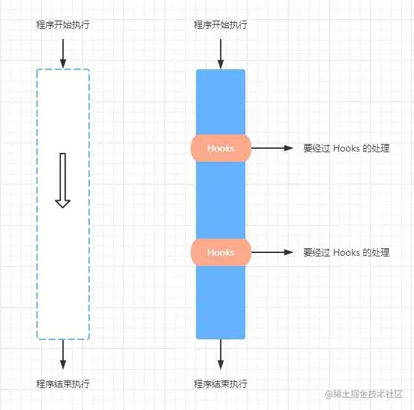

React 简单粗暴地用「时序」决定了这一切（背后的数据结构是链表），这也导致 Hooks 对调用时序的严格要求

hooks是什么

1. 其实是钩子函数，在程序执行过程中，经历Hooks的处理

   


React Hooks 的本质

1. React之前的函数式组件不可以存储属于自己的数据状态，通过React Hooks 达到数据逻辑的复用

2. 最简模型

   ```javascript
   function useReducer(reducer, initalState) {
       let hook = initalState
       const dispatch = (action) => {
           hook = reducer(hook, action)
           // 关键，执行 setCount 函数的时候会重新执行 FunctionComponent 函数
           FunctionComponent()
       }
       return [hook, dispatch]
   }
   // 函数组件
   function FunctionComponent() {
      const [count, setCount] = useReducer(x => x + 1, 0)
       
      return {count, setCount}
   }
   
   const result = FunctionComponent()
   // 执行 setCount 会从新执行 FunctionComponent
   result.setCount()
   ```

   - 问题：hook一直被初始化，状态无法保存，最简单方式hook被定义在函数外（react 是Fiber上）

3. react的解决模型

   ```javascript
   // Fiber 节点
   const Fiber = {
       type: FunctionComponent, // Fiber 节点上的 type 属性是组件函数
       memorizedState: null // Fiber 节点上的 memorizedState 属性是 Hooks
   }
   // Hooks
   function useReducer(reducer, initalState) {
       // 初始化的时候，如果 Fiber 节点的 Hooks 不存在则进行设置
       if(!Fiber.memorizedState) Fiber.memorizedState = initalState
       const dispatch = (action) => {
           Fiber.memorizedState = reducer(Fiber.memorizedState, action)
           // 关键，执行 setCount 函数的时候会重新执行 FunctionComponent 函数
           Fiber.type()
       }
       return [Fiber.memorizedState, dispatch]
   }
   // 函数组件
   function FunctionComponent() {
       const [count, setCount] = useReducer(x => x + 1, 0)
       console.log("渲染的count:", count) 
       return {count, setCount}
   }
   
   const result = Fiber.type() // 打印 0
   ```

   - 因为Fiber变量是全局的，故如果A组件调用了这个hook，B组件也调用了，那么A组件中的dispatch就不是原来的fiber节点了，因此需要把Fiber缓存起来


