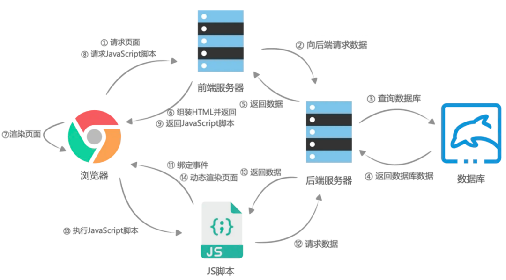
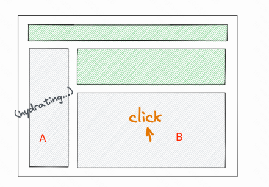

# 服务端渲染



1. 服务端渲染 + 客户端 hydrate 渲染。服务端渲染在服务端渲染出了首屏内容；客户端 hydrate 渲染复用服务端返回的节点，进行一次类似于 render 的 hydrate 渲染过程，把交互事件绑上去（此时页面可交互），并接管页面。

## 核心思想（同构）

1. 两份代码，供双端使用

2. node端，使用renderToString方法

   - 大部分生命周期函数在服务端都不执行
   - 生成的产物中会包含一些额外生成特殊标记，代码体积会有所增大
   - 会被故意忽略掉的on开头的的属性，也就忽略掉了react代码中事件处理

3. web端

   - React代码在服务器上执行一遍之后，浏览器再去加载JS后又运行了一遍React代码，完成事件绑定和完整生命周期的执行，从而才能成为完全可交互页面

   - 核心API是React-dom下的**hydrate**，会复用服务端返回的原本已经存在的 DOM 节点，出于性能考虑，hydrate可以弥补文本内容的差异，但并不能保证修补属性的差异，而是将错就错（development模式下会报warning）

   - webpack.client.js打包的web端代码，发到public下，node启动时，发给web端的html片段具有，如下script，然后加载对应的js脚本

     ```html
     <script src="./index.js"></script>
     ```


# Streaming SSR

1. React 18 提供了一种新的 SSR 渲染模式，可以实现以下两个功能
   - Streaming HTML：服务端可以分段传输 HTML 到浏览器；解决需要等待所有数据在服务端渲染完成才能发到浏览器的问题（React 18）
   - Selective Hydration：解决如下问题：
     - 所有js都加载后才能进行注水，现在可以在服务端code-spliting后，对某些包单独注水
     - 所有组件注水完成后，才能进行交互的问题


##  Streaming HTML 

1. HTTP 支持以 stream 格式进行数据传输。当 HTTP 的 Response header 设置 `Transfer-Encoding: chunked` 时，服务器端就可以将 Response 分段返回

2. 与传统的HTML流不同，不必以自上而下的顺序发生

3. 如对于如下HTM

   ```react
   import { Suspense, lazy } from "react";
   const Content = lazy(() => import("./Content"));
   export default function App() {
     return (
       <html>
         <head></head>
         <body>
           <div>App shell</div>
           <Suspense>
             <Content />
           </Suspense>
         </body>
       </html>
     );
   }
   ```

   - **第 1 次**访问页面时，SSR 渲染的结果会分成 2 段传输

     ```html
     <!DOCTYPE html>
     <html>
        <head></head>
        <body>
           <div>App shell</div>
           <!--$?-->
           <template id="B:0"></template>
           <!--/$-->
        </body>
     </html>
     ```

   - 第2段，会传输一段js，将`id="B:0"`替换为Suspense内部的content组件

4. 当**第 2 次**访问页面时，html 结构会一次性返回。不再分段传输渲染。

   - 因为第 1 次请求时，`Content` 组件对应的 JS 模块在服务器端已经被加载到模块缓存中，再次请求时，加载 `Content` 组件是一个同步过程。

## Selective Hydration

1. **React 18 之前**，SSR 实际上是不支持 code splitting 的，常见解决方式
   - 对于需要 code splitting （比如直接异步导入）的组件，不在服务端渲染，而是在浏览器端渲染；
   - 提前将 code splitting 的 JS 写到 html script 标签中，在客户端等待所有的 JS 加载完成后再执行 hydration

2. 如果在没有等待所有的 JS bundle 都加载完成，就开始 hydration
   - 如果在没有等待所有的 JS bundle 都加载完成，就开始 hydration，会报：
   - Hydration failed because the initial UI does not match what was rendered on the server.

3. 为了避免大的依赖bundles，需要用的code-spliting，通过使用`React.lazy`将组件从主bundle中分离出来

   ```javascript
   const Comments = lazy(() => import('./Comments.js'));
   ```

4. React 18方式：React 18 的 hydration 阶段，当渲染到 Suspense 组件时，会根据 Suspense 的 children 是否已经渲染完成，而选择是否继续向子组件执行 hydration
   - 用 React 18 的 lazy 和 Suspense 改写：如果 `Content` 组件的 JS bundle 还没有加载完成，在 hydration 阶段，渲染到 Suspense 节点时会跳出，而不会让整个 hydration 过程失败
   - 同步导入 `Content` 组件（不做 code splitting），但Content组件内有异步数据读取 + 一个同步组件Test，即使异步数据未响应回来，Test组件也可以做交互

5. 会优先hydration，用户交互优先级更高的内容；比如A、B同时注水，但B好了后，用户Click了B的内容，React会优先对B相应部分进行注水，用户交互完成的空闲时间再对A注水

   


## 降级逻辑

1. Streaming SSR 过程中，如果某个 Suspense 的 children 渲染过程抛出异常，那么这个 children 组件将降级到 CSR
2. 会在第二段数据中返回了 `$RX` 函数（简单理解为错误处理函数）
   - 如果父组件已经完成 hydration，会调用 Comment 节点上的 `_reactRetry` 方法，立即执行对需要降级的组件的渲染
   - 否则等待父组件执行时 hydration，再“顺道”执行渲染。
3. 如还没渲染到Suspense组件就发生错误，意味着应用对应的整棵组件树都没有渲染成功，SSR 完全失败
   - `onShellReady` 不会被调用，`onShellError` 会调用，我们可以在 `onShellError` 中返回 CSR 使用的 HTML 模版

参考

1. React服务端渲染：https://mp.weixin.qq.com/s/j2rB8qE5OOPmLHAS7qdCrQ
   - 路由，redux，等同构的简单demo，以及常遇到的问题
   - 服务端获取异步数据
   - css服务端渲染
   - nextjs，umijs，icejs的简单介绍


