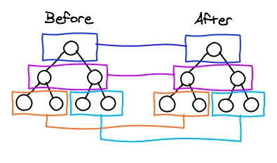
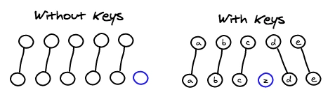
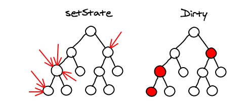

## Diff 算法

1. render 执行的结果得到的不是真正的 DOM 节点.
2. 结果仅仅是轻量级的 JavaScript 对象, 我们称之为 virtual DOM.

 ## 层级比较

1. 找到两棵任意的树之间最小的修改是一个复杂度为 `O(n^3)` 的问题

1. 当根节点为不同类型的元素时，React 会拆卸原有的树并且建立起新的树。举个例子，当一个元素从 `<a>` 变成 ``会触发一个完整的重建流程。

1. 当对比两个相同类型的 React 元素时，React 会保留 DOM 节点，仅比对及更新有改变的属性

2. react考虑web应用很少将component移动到另一个层级去，大部分是相邻子节点之前移动，故考虑将树按层级分解

	

## key的使用

1. 对于列表而言，如果无key属性帮助，则很难弄清两个component的列表是怎么对应的，因此在list头插入元素会开销很大，使用key将解决此问题

1. 使用元素在数组中的下标作为 key。这个策略在元素不进行重新排序时比较合适，如果有顺序修改，diff 就会变慢，还会导致错误

2. 使用key帮助react处理他们之间的关系

	

## Components

1. react通过component组成，通常结果是很多div组成的树
2. react只会匹配class相同的component
3. 如果有个 `<Header>` 被 `<ExampleBlock>` 替换掉了，React 会删除掉 header 再创建一个block，而不是花宝贵时间匹配差异

## React事件代理

1. 事件 listener 被绑定到整个文档的根节点上
2. 事件listener存在hash map中，发现性能比virtual DOM还好
3. React 在启动时就为那些对象分配了一个内存池。任何时候需要用到事件对象, 就可以从这个内存池进行复用，减轻垃圾回收的负担

## 渲染

### 合并渲染

1. 调用 component 的 `setState` 方法的时候, React 将其标记为 dirty.
	到每一个事件循环结束, React 检查所有标记 dirty 的 component 重新绘制

	