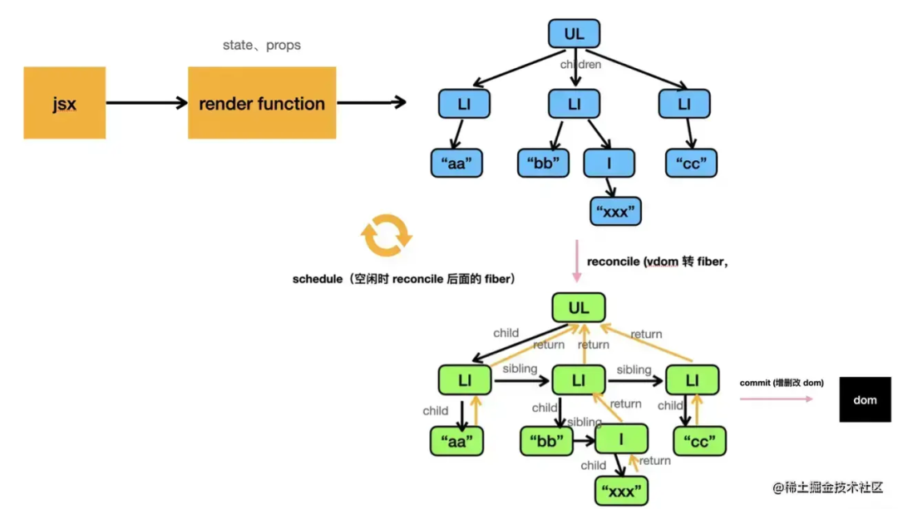

# React理念

## 概述

1. React 是用 JavaScript 构建**快速响应**的大型 Web 应用程序的首选方式
2. 制约快速响应的因素是：IO瓶颈与CPU瓶颈，解决的本质思路是：将**同步的更新**变为**可中断的异步更新**。

### CPU瓶颈

1. JS可以操作DOM，GUI渲染线程与JS线程是互斥的。所以JS脚本执行和浏览器布局、绘制不能同时执行。当JS执行时间过长，超出了16.6ms，这次刷新就没有时间执行样式布局和样式绘制了，会造成卡顿。
2. React使用时间分片：在浏览器每一帧的时间中，预留一些时间给JS线程，`React`利用这部分时间更新组件（可以看到，在[源码 (opens new window)](https://github.com/facebook/react/blob/1fb18e22ae66fdb1dc127347e169e73948778e5a/packages/scheduler/src/forks/SchedulerHostConfig.default.js#L119)中，预留的初始时间是5ms）。当预留的时间不够用时，`React`将线程控制权交还给浏览器使其有时间渲染UI，`React`则等待下一帧时间到来继续被中断的工作。将**同步的更新**变为**可中断的异步更新**。

### IO的瓶颈

1. 在当前页面停留了一小段时间，当“这一小段时间”足够短时，用户是无感知的。如果请求时间超过一个范围，再显示`loading`的效果。
2. 为此，`React`实现了[Suspense (opens new window)](https://zh-hans.reactjs.org/docs/concurrent-mode-suspense.html)功能及配套的`hook`——[useDeferredValue (opens new window)](https://zh-hans.reactjs.org/docs/concurrent-mode-reference.html#usedeferredvalue)。


## 老架构

1. React15架构可以分为两层：

### Reconciler（协调器）—— 负责找出变化的组件

1. 调用函数组件、或class组件的`render`方法，将返回的JSX转化为虚拟DOM
2. 将虚拟DOM和上次更新时的虚拟DOM对比
3. 通过对比找出本次更新中变化的虚拟DOM
4. 通知**Renderer**将变化的虚拟DOM渲染到页面上

#### 缺点

1. 由于递归更新组件，而且更新一旦开始，中途就无法中断。当层级很深时，递归更新时间超过了16ms，用户交互就会卡顿。
2. 用可中断的异步更新代替同步的更新思路是无法解决此问题的
   - 如123更新到456，更新1->4需要很长时间，如果此方式，用户将看到中间状态

### Renderer（渲染器）—— 负责将变化的组件渲染到页面上

1. 由于React支持跨平台，所以不同平台有不同的Renderer。


## React16架构

1. React16中新增了Scheduler（调度器）

### 调度器

实现了功能更完备的`requestIdleCallback`（此API当浏览器有剩余时间时通知我们）polyfill，除了在空闲时触发回调的功能外，Scheduler还提供了多种调度优先级供任务设置。

## Reconciler（协调器）

1. 更新工作从递归变成了可以中断的循环过程。
2. 每次循环都会调用`shouldYield`判断当前是否有剩余时间。
3. 当Scheduler将任务交给Reconciler后，Reconciler会为变化的虚拟DOM打上代表增/删/更新的标记，整个Scheduler与Reconciler的工作都在内存中进行。
4. 只有当所有组件都完成Reconciler的工作，才会统一交给Renderer。
5. `Reconciler`内部采用了`Fiber`的架构


## Fiber架构

1. 目标是提高其在动画、布局和手势等领域的适用性。功能是增量渲染：能够将渲染工作分割成块，并将其分散到多个帧上。

代数效应

1. 代数效应是函数式编程中的一个概念，用于将副作用从函数调用中分离
2. 代数效应能够将副作用从函数逻辑中分离，使函数关注点保持纯粹。
3. 一种编程语言特性，目前JavaScript还不支持
4. 机制类似于Try-catch，但能从错误中“回到”原来的地方然后做一些改变
5. 代数效应与React最明显的例子就是Hooks，类似useState等

实现原理 

1. 虚拟DOM在新架构被称为Fiber，旧用于递归的虚拟DOM数据结构已经无法满足需要
2. 含义：
   - 架构层面，之前React15的Reconciler采用递归的方式执行，数据保存在递归调用栈中，所以被称为stack Reconciler。React16的Reconciler基于Fiber节点实现，被称为Fiber Reconciler。
   - 静态的数据结构层面，每个Fiber节点对应一个React element，保存了该组件的类型（函数组件/类组件/原生组件...）、对应的DOM节点等信息。
   - 动态的工作单元层面，每个Fiber节点保存了本次更新中该组件改变的状态、要执行的工作（需要被删除/被插入页面中/被更新...）。

工作原理

1. 

Reconciler源码

1. 源码主要在`react-reconciler`包中，主要作用分为 4 个方面：

   - **输入**: 暴露`api`函数(如: `scheduleUpdateOnFiber`), 供给其他包(如`react`包)调用.
   - 注册调度任务: 与调度中心(`scheduler`包)交互, 注册调度任务`task`, 等待任务回调.
   - 执行任务回调: 在内存中构造出`fiber树`, 在内存中创建出与`fiber`对应的`DOM`节点.

   1. **输出**: 与渲染器(`react-dom`)交互, 渲染`DOM`节点

   

整体架构图


1. 在`react-reconciler`对外暴露的 api 函数中, 只要涉及到需要改变 fiber 的操作(无论是`首次渲染`或`后续更新`操作), 最后都会间接调用`scheduleUpdateOnFiber`

2. 判断是否需要注册调度任务，如需创建则将`performSyncWorkOnRoot`或`performConcurrentWorkOnRoot`被封装到了任务回调(`scheduleCallback`)中

   ```javascript
   // demo
   newCallbackNode = scheduleSyncCallback(
     performSyncWorkOnRoot.bind(null, root),
   );
   ```

3. 输出阶段：主要是处理副作用队列（fiber节点的一些标记）, 将最新的 fiber 树结构反映到 DOM 上

   - commitBeforeMutationEffects：**dom 变更前**, 处理副作用队列中带有`Snapshot`,`Passive`标记的`fiber`节点.
   - commitMutationEffects：**dom 变更**, 界面得到更新. 处理副作用队列中带有`Placement`, `Update`, `Deletion`, `Hydrating`标记的`fiber`节点.
   - commitLayoutEffects：**dom 变更后**, 处理副作用队列中带有`Update | Callback`标记的`fiber`节点.

4. 


## cocurrent模式

做到了从框架层面去提升应用的体验

### 是什么

1. Concurrent Mode 只是 Async Mode 的 [重新定义](https://link.zhihu.com/?target=https%3A//github.com/facebook/react/pull/13732)，来凸显出 React 在不同优先级上的执行能力，与其它的异步渲染方式进行区分。
2. Fiber Reconciler 就是 Concurrent 的雏形
3. 能使 React 在长时间渲染的场景下依旧保持良好的交互性，能优先执行高优先级变更，不会使页面处于卡顿或无响应状态，从而提升应用的用户体验。

运行机制

任务如何按时间片拆分

1.  Fiber 树的更新流程分为 render 阶段与 commit 阶段
   - render 阶段可以被拆解，每个时间片内分别运行一部分，直至完成，
   - commit  阶段由于带有 DOM 更新，不可能 DOM 变更到一半中断，因此必须一次性执行完成。
2. 实现是：在while循环中，每结束一次循环就会进行一次时间片的检查，如果时间片到了，while 循环将被 break，相当于 render 过程暂时被中断，当前处理到的节点会被保留下来，等待下一个时间分片到来时，继续处理
3. 

怎样划分优先级

1. 提出了expiration time的概念：过期时间，在 Fiber 中有两层不同的含义：
   - 解决调度中经典的饥饿（Starvation）问题，假设高优先级任务一直执行，低优先级任务将无法得到执行，我们给低优先级任务设定一个过期时间，一旦过期后，就需要被当做同步任务，立即执行
   - 代表 update 优先级，expiration time 越大，优先级越高
2. 主要作用：
   - 在结点遍历中，通过比较判断节点/子孙是否需要更新
   - 如果 Fiber.expirationTime < currentExpirationTime，说明当前 Fiber 节点本身低优先级或没有变更，不需要执行更新的操作
   - 如果 Fiber.childExpirationTime < currentExpirationTime，说明当前 Fiber 的子孙均为低优先级节点或没有变更，不需要向下继续遍历。
3. React的内部设定
   - Sync 具有最高优先级
   - 异步方面，优先级分为 InteractiveExpiration (如：blur, click, focus，keyDown, mouseDown 等等)  >  AsyncExpiration
   -  unstable_scheduleCallback (AsyncExpiration)与 flushSync (同步，最高优先级)两个 API

如何让高优先级任务先执行，低优先级任务如何恢复

1. Fiber 节点在变更后会形成 update 对象，带有 expirationTime，插入 updateQueue 中，对于低优先级的 update 会采用跳过方式处理
2. 由于高优先级任务的变更可能对低优先级任务产生影响，低优先级任务必须重新来过，因此 componentWillMount（包含在 render 阶段） 可能被调用多次，即低优先级任务的 render 阶段可能被重复执行


# 优先级管理

1. `可中断渲染`,`时间切片(time slicing)`,`异步渲染(suspense)`等特性, 都会依赖此管理

Lane (车道模型)

1. `react@17.0.0`的新特性，通过位运算，是对于`expirationTime`的重构

概述

1. `Lane`类型被定义为二进制变量, 利用了位掩码的特性, 在频繁运算的时候占用内存少, 计算速度快.
2. 以前使用`expirationTime`表示的字段, 都改为了`lane`

主要优势

1. 更方便的判断优先级是否重叠.

   ```js
   // 判断: 单task与batchTask的优先级是否重叠
   //1. 通过expirationTime判断
   const isTaskIncludedInBatch = priorityOfTask >= priorityOfBatch;
   //2. 通过Lanes判断
   const isTaskIncludedInBatch = (task & batchOfTasks) !== 0;
   
   // 当同时处理一组任务, 该组内有多个任务, 且每个任务的优先级不一致
   // 1. 如果通过expirationTime判断. 需要维护一个范围(在Lane重构之前, 源码中就是这样比较的)
   const isTaskIncludedInBatch =
     taskPriority <= highestPriorityInRange &&
     taskPriority >= lowestPriorityInRange;
   //2. 通过Lanes判断
   const isTaskIncludedInBatch = (task & batchOfTasks) !== 0;
   ```

2. 从 group 中分离出单个 task非常容易

   ```js
   // 从group中删除或增加task
   
   //1. 通过expirationTime实现
   // 0) 维护一个链表, 按照单个task的优先级顺序进行插入
   // 1) 删除单个task(从链表中删除一个元素)
   task.prev.next = task.next;
   // 2) 增加单个task(需要对比当前task的优先级, 插入到链表正确的位置上)
   let current = queue;
   while (task.expirationTime >= current.expirationTime) {
     current = current.next;
   }
   task.next = current.next;
   current.next = task;
   // 3) 比较task是否在group中
   const isTaskIncludedInBatch =
     taskPriority <= highestPriorityInRange &&
     taskPriority >= lowestPriorityInRange;
   
   
   // 2. 通过Lanes实现
   // 1) 删除单个task
   batchOfTasks &= ~task;
   // 2) 增加单个task
   batchOfTasks |= task;
   // 3) 比较task是否在group中
   const isTaskIncludedInBatch = (task & batchOfTasks) !== 0;
   ```


# 调度原理

1. 调度中心(位于`scheduler`包), 是整个 React 运行时的中枢
2. react/packages/scheduler/src/forks/Scheduler.js

## 时间分片相关

1. getCurrentTime获取当前时间：使用`localPerformance.now()` > Date.now()`获取时间

   ```javascript
   let getCurrentTime;
   if (hasPerformanceNow) {
     const localPerformance = performance;
     getCurrentTime = () => localPerformance.now();
   } else {
     const localDate = Date;
     const initialTime = localDate.now();
     getCurrentTime = () => localDate.now() - initialTime;
   }
   ```

2. shouldYieldToHost：是否让出主线程

   - 通过对比剩余时间 + isInputPending 判断是否需要让出主线程

     ```javascript
     function shouldYieldToHost() {
       const timeElapsed = getCurrentTime() - startTime;
       if (timeElapsed < frameInterval) {
         // The main thread has only been blocked for a really short amount of time;
         // smaller than a single frame. Don't yield yet.
         return false;
       }
     	// 会利用到"navigator.scheduling.isInputPending "
       // If there's a pending paint or a pending input, then we should yield
       if (enableIsInputPending) {
         // ... 省略；
       }
     
       // `isInputPending` isn't available. Yield now.
       return true;
     }
     ```

3. isInputPending

   - 在页面加载的情况下，如果用户在浏览器运行JavaScript时单击某个内容，浏览器必须将单击输入事件排队，直到整个JavaScript块运行为止，如果js加载较慢会阻塞用户交互
   - 解决通常是：将js分为小块，运行一部分js后，见控制权交还给浏览器，让浏览器检查事件队列，响应事件等处理
   - 但遇到的问题是：如果我们太频繁地让步，页面加载就会太慢。如果我们减少让步，浏览器响应用户事件的时间就会更长
   - isInputPending告诉您是否存在输入挂起。因此可以在运行JavaScript时使用这些信息来决定他们是否要退回浏览器。如果使用得当，isInputPending可以完全消除快速加载和快速响应事件之间的权衡。

### 小结

1. 只有时间超过`yieldInterval`默认是`5ms`之后才会让出主线程)，即如果一个`task`运行时间超过`5ms`, 下一个`task`执行之前, 会把控制权归还浏览器
2. 通过isInputPending，判断是否有输入事件(包括: input 框输入事件, 点击事件等)，更精细化的控制

## 调度相关

1. 目的就是请求执行(或取消)回调函数

2. requestHostCallback：主要根据不同环境，选用不同的js内置机制，选择顺序为`immediate > MessageChannel(浏览器会使用) > tiemout`

   ```javascript
   function requestHostCallback(callback) {
     // 注意：定义scheduledHostCallback
     scheduledHostCallback = callback;
     if (!isMessageLoopRunning) {
       isMessageLoopRunning = true;
       schedulePerformWorkUntilDeadline();
     }
   }
   ```

   ```javascript
   schedulePerformWorkUntilDeadline = () => {
     // performWorkUntilDeadline内部主要是执行scheduledHostCallback函数
     localSetImmediate(performWorkUntilDeadline);
   };
   ```

   

### 任务队列管理

1. unstable_scheduleCallback：创建任务
   - 根据传入的优先级, 设置任务的过期时间 expirationTime
   - 将新任务加入taskQueue队列
   - 使用`requestHostCallback(flushWork)`请求调度
2. `flushWork`函数作为参数被传入调度中心内核等待回调（浏览器就是等待MessageChannel的回调）
3. flushWork：消费任务
   - 主要是内部调用`workLoop`对任务进行消费

#### workLoop

1. 本质是循环执行taskQueue，直到执行完；
2. 每一次`while`循环的退出就是一个时间切片，检测是否超时
   - 在执行`task.callback`之前, 会检测是否超时, 
   - 如果某个`task.callback`执行时间太长(如: `fiber树`很大, 或逻辑很重)也会造成超时，因此在执行`task.callback`过程中, 也需要一种机制检测是否超时
   - 对于超时的callback，并未在队列中清除，因此下次循环还会继续执行
3. 因此关键是看看task.callback如何实现中断？？？？？？？？


**那么执行一半的fiber构造，如何继续执行？？？？**

Fiber树构建


# JSX

1. [React 17+](https://zh-hans.reactjs.org/blog/2020/09/22/introducing-the-new-jsx-transform.html) 无需引入 React 即可使用 JSX

   - 在 React 的 package 中引入了两个新入口，这些入口只会被 Babel 和 TypeScript 等编译器使用。

   - 新的 JSX 转换不会将 JSX 转换为 React.createElement，而是自动从 React 的 package 中引入新的入口函数并调用

     ```typescript
     // 由编译器引入（禁止自己引入！）
     import {jsx as _jsx} from 'react/jsx-runtime';
     function App() {
       return _jsx('h1', { children: 'Hello world' });
     }


# 与Vue的差别

1. react 和 vue 都是基于 vdom 的前端框架，之所以用 vdom 是因为可以精准的对比关心的属性，而且还可以跨平台渲染。

2. 但是开发不会直接写 vdom，而是通过 jsx 这种接近 html 语法的 DSL，编译产生 render function，执行后产生 vdom。

3. vdom 的渲染就是根据不同的类型来用不同的 dom api 来操作 dom。

4. 组件本质上就是对一段 vdom 产生逻辑的封装，函数、class、option 对象甚至其他形式都可以。

5. 管理状态的方式不一样，

   - vue 有响应式，对状态做代理，get 的时候收集，修改状态的时候触发对应组件的 render 了，因此Vue可以独立渲染某个组件
   - react 是通过 setState 的 api 触发状态更新的，因为并不知道影响了哪些组件，只能重新渲染整个DOM，。但是这样计算量又会比较大，会阻塞渲染，导致动画卡顿。

6. fiber 架构：优化的目标是打断计算，分多次进行，但递归方式有些问题

   - 渲染的时候直接就操作了 dom 了，这时候打断了，那已经更新到 dom 的那部分怎么办？

     - react 把渲染流程分为了两部分：render （reconcile，是可以被打断的，只找到变化的部分，打个增删改的标记）和 commit（一次性更新DOM）

   - 现在是直接渲染的 vdom，而 vdom 里只有 children 的信息，如果打断了，怎么找到它的父节点呢？

     - 现有的 vdom 是不行的，需要再记录下 parent、silbing 的信息。所以 react 创造了 fiber 的数据结构（fiber 既是一种数据结构，也代表 render + commit 的渲染流程）

     - react 会先把 vdom 转换成 fiber，再去进行 reconcile，这样就是可打断的了
     - 任何一个位置的 Fiber 节点，都可以非常容易知道它的父 Fiber, 第一个子元素的 Fiber,和它的兄弟节点 Fiber。却不容易知道它前一个 Fiber 节点是谁，这就是 React 中单向链表 Fiber 节点的特点

7. useEffect 被设计成了在 dom 操作前异步调用，useLayoutEffect 是在 dom 操作后同步调用。

   - 都要操作 dom 了，这时候如果来了个 effect 同步执行，计算量很大，那不是把 fiber 架构带来的优势有毁了么？所以 effect 是异步的，不会阻塞渲染。
   -  useLayoutEffect，在这个阶段拿到一些布局信息的，dom 操作完且都渲染完了，自然也就可以同步调用了。


Diff算法的差异

React的Diff算法

1. Vue2 和 Vue3 都使用了双端对比算法，而 React 的 Fiber 由于是单向链表的结构，所以在 React 不设置由右向左的链表之前，都无法实现双端对比
2. 


渲染流程

1. jsx 会被编译成 render function，然后执行Render function，生成Vdom，Vdom转换为链表结构的Fiber树
   - render阶段：也就是reconcile
     - Vdom（只有children属性）转为 Fiber（有了 child、sibling、return 属性来关联父子、兄弟节点）， diff 算法在这个过程
     -  reconcile 结束之后处理副作用，也就是 useEffect、生命周期等函数
   - commit 阶段：具体操作 dom，以及执行副作用函数的过程。
     - commit 还分为了 3 个小阶段：before mutation、mutation、layout。





参考

1. [React技术揭秘](https://react.iamkasong.com/)
2. [图解React](https://7kms.github.io/react-illustration-series/)
2. [React Fiber Architecture](https://github.com/acdlite/react-fiber-architecture)
