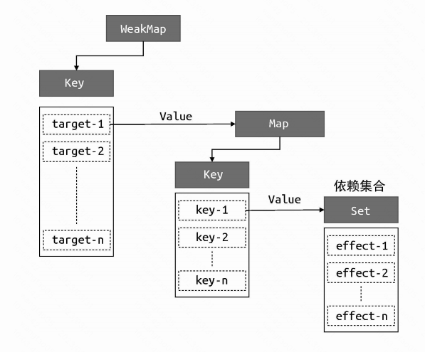
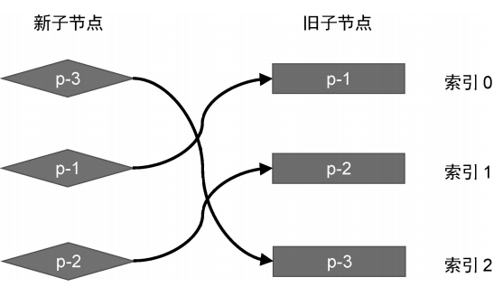

框架选择

命令式和声明式

从范式上来看，视图层框架通常分为命令式和声明式

1. 命令式框架
   - 关注过程，如jQuery
2. 声明式框架
   - 关注结果，如html，vue（帮我们封装过程，内部是命令式的）

性能与可维护性的权衡

1. 声明式代码的性能不优于命令式代码的性能
   - 因为如果要修改什么，直接使用` div.textContent = 'hello vue3'`修改，不可能有比这更优的
   - 声明式代码的更新性能消耗 = 找出差异的性能消耗+直接修改的性能消耗（命令式）
2. vue选择声明式，原因就在于声明式代码的可维护性更强。


虚拟 DOM 的性能到底如何

1. 虚拟 DOM，就是为了最小化找出差异这一步的性能消耗而出现的。
2. VDOM性能更好，是与innerHtml的方式对比而言，并且要综合考虑页面大小，变更部分等
   - 由于js运算远远低于DOM重新渲染
   - innerHtml是重写整个页面DOM，会销毁并新建DOM，性能很差

运行时和编译时


框架设计的核心要素

1. 思路：需要很好的开发体验 => 有良好的报错 => 代码内要有各种报错处理 => 利用tree-shaking+ 预定义变量 缩小包体积

2. `initCustomFormatter`，通过`custom formatters`，控制台输入合适的ref值

3. 实现 Tree-Shaking，

   - 必须满足一个条件，即模块必须是ESM（ES Module），因为 Tree-Shaking 依赖 ESM 的静态结构
   - 必须没有副作用，比如，一个函数里有个Proxy对象，读取对象属性时，可能触发get钩子产生副作用
     - 可以通过` /*#__PURE__*/ `标明我纯函数，可以被Rollup，webpack等识别

4. 输出的构建产物

   - 带有 -bundler 字样的 ESM 资源是给 rollup.js 或 webpack 等打包工具使用的，而带有 -browser 字

     样的 ESM 资源是直接给 <script type="module"> 使用的

     - 区别主要是在`__dev__`处理上，bundler的需要把这个处理未`process.env.NODE_ENV `方便复用webpack的配置


Vue.js 3 的设计思路

1. 声明式地描述UI
   - 使用模板来声明式地描述 UI，哪怕是事件，都有与之对应的描述方式
   - js对象也可以描述对象，其实就是Vdom，render函数返回就是一个对象，为了让我们编写Vdom更轻松
2. 渲染器
   - 作用就是把虚拟 DOM 渲染为真实 DOM
   - 本质其实是使用一些我们熟悉的 DOM 操作 API 来完成渲染工作，但其中复杂的是在更新时，需要diff找出需要更新的内容


# 响应系统

1. 如果修改一个字段值`obj.text`，当值变化后，副作用函数自动重新执行，如果能实现这个目标，则obj就是响应式数据

   ```javascript
   œconst obj = { text: 'hello world' }
   function effect() {
   	// effect 函数的执行会读取 obj.text
   	document.body.innerText = obj.text
   }
   ```

2. 能拦截一个对象属性读取和设置的操作：`Object.defineProperty`与Proxy函数

## 开发思路

1. 最简单的实现思路

   ```javascript
   // 存储副作用函数的桶
   const bucket = new Set();
   const data = { text: 'hello world' };
   const obj = new Proxy(data, {
       get(target, key) {
           bucket.add(effect);//// 硬编码
           return target[key];
       },
       // 拦截设置操作
       set(target, key, newVal) {
           target[key] = newVal;
           bucket.forEach(fn => fn());
           return true;
       },
   });
   ```

2. 解决硬编码问题：如effect函数，希望可以传入任意函数名，提供一个用来注册副作用函数

   ```javascript
   // 用一个全局变量存储被注册的副作用函数
   let activeEffect;
   // effect 函数用于注册副作用函数
   function effect(fn) {
       activeEffect = fn;
       // 执行副作用函数
       fn();
   }
   ```

3. 解决副作用函数与被操作的目标字段无关系的问题，使用树结构存储

   ```javascript
   data
   	└── ok
   		└── effectFn
   	└── text
   		└── effectFn
   ```

   

   - target为每个对象，使用weakMap存储（key只能是对象），内部使用Map存储key与副作用函数

4. 解决条件运算的依赖管理问题

   ```javascript
   const data = { ok: true, text: 'hello world' };
   const obj = new Proxy(data, {});
   effect(() => {
       document.body.innerText = obj.ok ? obj.text : 'not';
   });
   ```

   - 如果`obj.ok = false`时，`obj.text`不应该收集当前effect，值改变也不应该触发当前effect重新执行
   - 解决办法：每次副作用函数执行时（如obj.ok = false赋值时），可以把副作用函数从`obj.text 等`依赖集合中删除
     - 常规想法是，遍历data中的key，然后再遍历每一个的依赖集合，删除对应的副作用函数
     - vue做法，收集依赖时，把依赖集合绑定在`effect.deps上`，这样在删除时，直接遍历deps就可以
   - 注意：根据语言规范，forEach函数遍历时，如果一个值已经被访问过了，但该值被删除并重新添加到集合，会被重新访问，导致死循环，可以使用`(new Set()).forEach()`

5. 解决嵌套effect函数问题：

   - 当组件发生嵌套时，会发生effect 嵌套

     ```javascript
     effect(() => {
         effect(() => {
             temp2 = obj.bar;
         });
         temp1 = obj.foo;
     });
     ```

     - 由于上述使用全局`activeEffect`存储effect函数，内层副作用函数的执行会覆盖 activeEffect 的值，并且永远不会恢复到原来的值（外部的effect值），导致`obj.foo`的依赖是错的

   - 使用函数栈 effectStack解决这个问题

     ```javascript
     // 用一个全局变量存储当前激活的 effect 函数
     let activeEffect;
     // effect 栈
     const effectStack = []; // 新增
     function effect(fn) {
         const effectFn = () => {
             activeEffect = effectFn;
             effectStack.push(effectFn); // 新增
             fn();
             effectStack.pop(); // 新增
             activeEffect = effectStack[effectStack.length - 1]; // 新增
         };
     }
     ```

6. 解决无限递归循环问题

   ```javascript
    effect(() => obj.foo++)
   ```

   - 首先读取 obj.foo 的值，将当前副作用函数收集到“桶”中，接着将其加 1 后再赋值给 obj.foo，此时会触发 trigger 操作，执行当前副作用函数
   - 解决：如果 trigger 触发执行的副作用函数与当前正在执行的副作用函数相同（`effectFn !== activeEffect`），则不触发执行

7. 解决：调度能力

   - 在不修改代码的情况下使，下面的输出位：1，结束了，2

     ```javascript
     const data = { foo: 1 };
     const obj = new Proxy(data, {
         /* ... */
     });
     effect(() => {
         console.log(obj.foo);
     });
     obj.foo++;
     console.log('结束了');
     ```

     - 可以给effect函数传入一个options，允许用户指定调度器（trigger时，有调度器，则优先执行），最终实现可以是：

       ```javascript
       effect(
           () => {
               console.log(obj.foo);
           },
           // options
           {
               // 调度器 scheduler 是一个函数
               scheduler(fn) {
                   // 将副作用函数放到宏任务队列中执行
                   setTimeout(fn);
               },
           }
       );
       ```

       

   

computed

1. effect函数需要支持lazy配置，延迟执行副作用函数

   ```javascript
   function effect(fn, options = {}) {
       const effectFn = () => {};
       // 只有非 lazy 的时候，才执行
       if (!options.lazy) {
           effectFn();
       }
       return effectFn; // 新增
   }
   // 这样就可以在需要的时候手动执行
   const test = effect(fn,{lazy: true})
   effectFn(); // 执行
   // 希望：
   const value = test(); // 实际是fn的返回值
   ```

   - 仅能够手动执行副作用函数意义不大，希望是能能拿到fn的结果，即在`effectFn`执行fn函数并返回结果即可

     ```javascript
     function effect(fn, options = {}) {
         const effectFn = () => {
             const res = fn(); // 新增
             return res; // 新增
         };
         return effectFn; // 新增
     }
     ```

2. 懒计算的computed为：

   ```javascript
   function computed(getter) {
       // 把 getter 作为副作用函数，创建一个 lazy 的 effect
       const effectFn = effect(getter, {
           lazy: true,
       });
       const obj = {
           // 当读取 value 时才执行 effectFn
           get value() {
               return effectFn();
           },
       };
       return obj;
   }
   ```

3. 增加缓存，则非常简单

   ```javascript
   function computed(getter) {
       // value 用来缓存上一次计算的值
       let value;
       // dirty 标志，用来标识是否需要重新计算值，为 true 则意味着“脏”，需要计算
       let dirty = true;
       const effectFn = effect(getter, {
           lazy: true,
       });
       const obj = {
           get value() {
               // 只有“脏”时才计算值，并将得到的值缓存到 value 中
               if (dirty) {
                   value = effectFn();
                   // 将 dirty 设置为 false，下一次访问直接使用缓存到 value 中的值
                   dirty = false;
               }
               return value;
           },
       };
       return obj;
   }
   ```

   - 问题的关键是：何时将dirty设置为true（getter有依赖改变时）

4. 解决：computed嵌套问题

   - 现在的方式，如果在一个副作用函数中调用computed，修改`obj.foo`，副作用函数并不会重新执行

     ```javascript
     const sumRes = computed(() => obj.foo + obj.bar);
     effect(() => {
         // 在该副作用函数中读取 sumRes.value
         console.log(sumRes.value);
     });
     // 修改 obj.foo 的值
     obj.foo++;
     ```

   - 因此，需要手动对数据进行track和trigger

     ```javascript
     function computed(getter) {
         let value;
         let dirty = true;
         const effectFn = effect(getter, {
             lazy: true,
             scheduler() {
                 if (!dirty) {
                     dirty = true;
                     // 当计算属性依赖的响应式数据变化时，手动调用 trigger 函数触发响应;
                     trigger(obj, 'value');
                 }
             },
         });
         const obj = {
             get value() {
                 if (dirty) {
                     value = effectFn();
                     dirty = false;
                 }
                 // 当读取 value 时，手动调用 track 函数进行追踪
                 track(obj, 'value');
                 return value;
             },
         };
         return obj;
     }
     ```

     - 建立的关系为：

       ```javascript
       computed(obj)
       	── value
       		── effectFn
       ```

       

watch

1. 本质是观测响应式数据，执行相应的回调函数，利用scheduler 选项

2. 如何获得新值与旧值呢？利用 effect 函数的lazy 选项

   ```javascript
   function computed(getter) {
       // value 用来缓存上一次计算的值
       let value;
       // dirty 标志，用来标识是否需要重新计算值，为 true 则意味着“脏”，需要计算
       let dirty = true;
       const effectFn = effect(getter, {
           lazy: true,
       });
       const obj = {
           get value() {
               // 只有“脏”时才计算值，并将得到的值缓存到 value 中
               if (dirty) {
                   value = effectFn();
                   // 将 dirty 设置为 false，下一次访问直接使用缓存到 value 中的值
                   dirty = false;
               }
               return value;
           },
       };
       return obj;
   }
   ```


响应式数据

1. 单纯地拦截 get/set 操作即可。举例来说，如何拦截for...in 循环？track 函数如何追踪拦截到的 for...in 循环


Reflect

提供了访问一个对象属性的默认行为

```javascript
const obj = { foo: 1 }
// 直接读取
console.log(obj.foo) // 1
// 使用 Reflect.get 读取
console.log(Reflect.get(obj, 'foo',receiver)) // 1
```

- 关键在第三个参数上（还有很多其他方面的意义）

但是对于如下数据，根据上面的reactive代码，如果在副作用调用`obj.bar`,会由于this指向问题，this指向obj，而不是Proxy后的对象，导致无法关联副作用函数

```javascript
const obj = {
  foo: 1,
  get bar() {
    // 现在这里的 this 为代理对象 p
    return this.foo
  }
}
```

```javascript
const p = new Proxy(obj, {
    // 拦截读取操作，接收第三个参数 receiver
    get(target, key, receiver) {
        track(target, key);
        // 使用 Reflect.get 返回读取到的属性值
        return Reflect.get(target, key, receiver);
    },
    // 省略部分代码
});
```


如何代理Object

1. 读取操作有：`obj.foo`、`key in obj`、`for...in`

2. `obj.foo`： 使用get拦截函数

3. in操作符

   - 需要check规范是如何实现的，是通过HasProperty，因此可以调用Proxy的has函数

4. `for...in`

   - 也是check规范，使用 ownKeys 拦截函数来拦截 Reflect.ownKeys 操作

   - ownKeys 拦截函数，我们只能拿到目标对象 target，并不能拿到具体的key，因此我们需要虚构一个Key作为标识

     ```javascript
     const obj = { foo: 1 };
     const ITERATE_KEY = Symbol();
     const p = new Proxy(obj, {
         ownKeys(target) {
             // 将副作用函数与 ITERATE_KEY 关联
             track(target, ITERATE_KEY);
             return Reflect.ownKeys(target);
         },
     });
     ```

   - 什么情况下需要触发与 ITERATE_KEY 相关联的副作用函数重新执行呢

     ```javascript
     const obj = { foo: 1 };
     const p = new Proxy(obj, {
     });
     effect(() => {
         for (const key in p) {
             console.log(key); // foo
         }
     });
     ```

     - 如，obj添加属性`obj.bar = 2` ，p从一个属性变为两个，需要执行；但如果只是修改`obj.foo = 2`不应该执行；
     - 因此，响应式代码内部，通过Object.prototype.hasOwnProperty 检查当前操作的属性是否已经存在于目标对象上，如不是则触发与 ITERATE_KEY 相关联的副作用函数

5. 代理delete 操作符

   - 根据规范，delete 操作符的行为依赖[[Delete]] 内部方法，可以使用deleteProperty 拦截
   - 注意，删除key，也需要触发ITERATE_KEY


合理地触发响应

值没有发生变化时，不应该触发响应式

1. 利用===判断oldValue与newValue

2. 由于：NaN !== NaN，需要考虑NaN的特殊性

3. 原型上继承属性的情况，如

   ```javascript
   const obj = {};
   const proto = { bar: 1 };
   const child = reactive(obj);
   const parent = reactive(proto);
   // 使用 parent 作为 child 的原型
   Object.setPrototypeOf(child, parent);
   effect(() => {
       console.log(child.bar); // 1
   });
   // 修改 child.bar 的值，child没这个属性，parent上有
   child.bar = 2; // 会导致副作用函数重新执行两次
   ```

   - 读取 child.bar 的值时，会触发 child 代理对象的 get 拦截函数`Reflect.get(obj, 'bar', receiver)`，但根据规范，child上没有属性时，会调用原型链父级的[[Get]] 方法，即访问`parent.bar`，由于parent也是响应式数据，副作用会被收集到parent上

   - child.bar = 2;设置值时，由于child上没有这个属性，同理根据规范，也会调用父级的[[Set]] 内部方法

   - 如何解决？？屏蔽一次副作用函数执行

     - 不可以用判断是否当前对象有这个属性，因为响应式数据可以不用提前什么添加属性

     - 由于set函数的特殊性，最初设置的是 child.bar的值，所以无论在什么情况下，receiver 都是 child，而 target

       则是变化的，因此只要判断receiver是否为target的代理对象即可（`const child = reactive(obj);`）

       ```javascript
        // child 的 set 拦截函数
        set(target, key, value, receiver) {
            // target 是原始对象 obj
            // receiver 是代理对象 child
        }
       
        // parent 的 set 拦截函数
        set(target, key, value, receiver) {
           // target 是原始对象 proto
           // receiver 仍然是代理对象 child
        }
       ```

     - 解决：在get时，通过raw属性，返回target，在set时，判断receiver.raw === target`，因为chid.raw返回是obj；parent.raw返回的是proto

       ```javascript
       new Proxy(obj, {
           get(target, key, receiver) {
               // 代理对象可以通过 raw 属性访问原始数据
               if (key === 'raw') {
                   return target;
               }
               return Reflect.get(target, key, receiver);
           },
           // 省略其他拦截函数
       });
       new Proxy(obj, {
           set(target, key, newVal, receiver) {
               if (target === receiver.raw) {
                   // 省略其他拦截函数
               }
               // 省略其他拦截函数
           },
       });
       // child.raw === obj
       ```

       - raw属性（为了说明问题），实际上*为了避免与用户传入属性冲突，实际应该使用用 Symbol 类型来代替


浅响应与深响应

1. 上述响应式代码是浅响应

   ```javascript
   const obj = reactive({ foo: { bar: 1 } });
   effect(() => {
       console.log(obj.foo.bar);
   });
   // 修改 obj.foo.bar 的值，并不能触发响应
   obj.foo.bar = 2;
   ```

   - 先读取obj.foo，得到的一个普通对象，即 { bar: 1 }，它并不是一个响应式对象，所以在副作用函数中访问 obj.foo.bar 时，是不能建立响应联系的
   - 解决：在get函数判断一下，如果是对象，则用reactive再包一层

2. 只读

   - 不可以设置或删除属性
   - 没有必要为只读数据建立响应联系，因此只读模式不需要track副作用函数


代理数组

1. 数组对象除了 [[DefineOwnProperty]] 这个内部方法之外，其他内部方法的逻辑都与常规对象相同，数组是一个异质对象，大部分用来代理常规对象的代码对于数组也是生效的

2. 数组的索引与 length

   - 根据规范可得到通过索引设置数组的元素值本质逻辑，可能会隐式地修改 length 的属性值，应该触发与 length 属性相关联的副作用函数；

     ```javascript
     new Proxy(obj, {
         set(target, key, newVal, receiver) {
             const type = Array.isArray(target)
                 ? // 如果代理目标是数组，则检测被设置的索引值是否小于数组长度，
                   // 如果是，则视作 SET 操作，否则是 ADD 操作
                   Number(key) < target.length
                     ? 'SET'
                     : 'ADD'
                 : Object.prototype.hasOwnProperty.call(target, key)
                 ? 'SET'
                 : 'ADD';
             const res = Reflect.set(target, key, newVal, receiver);
             if (target === receiver.raw) {
                 if (oldVal !== newVal && (oldVal === oldVal || newVal === newVal)) {
                     trigger(target, key, type);
                 }
             }
             return res;
         },
         // 省略其他拦截函数
     });
      
     function trigger(target, key, type) {
         // 当操作类型为 ADD 并且目标对象是数组时，应该取出并执行那些与 length属性相关联的副作用函数;
         if (type === 'ADD' && Array.isArray(target)) {
             // 取出与 length 相关联的副作用函数
             const lengthEffects = depsMap.get('length');
             // 将这些副作用函数添加到 effectsToRun 中，待执行
             lengthEffects &&
                 lengthEffects.forEach(effectFn => {
                     if (effectFn !== activeEffect) {
                         effectsToRun.add(effectFn);
                     }
                 });
         }
     }
     
     ```

   - 修改length，会修改数组元素，但如果将 length 属性设置为 100，这并不会影响第 0 个元素，因此如数组长度为10，但设置`a.length =5`，应该>=5的元素执行一遍副作用函数

     ```javascript
     // 为 trigger 函数增加第四个参数，newVal，即新值
     function trigger(target, key, type, newVal) {
         // 如果操作目标是数组，并且修改了数组的 length 属性
         if (Array.isArray(target) && key === 'length') {
             // 对于索引大于或等于新的 length 值的元素，
             // 需要把所有相关联的副作用函数取出并添加到 effectsToRun 中待执行
             depsMap.forEach((effects, key) => {
                 if (key >= newVal) {
                     effects.forEach(effectFn => {
                         if (effectFn !== activeEffect) {
                             effectsToRun.add(effectFn);
                         }
                     });
                 }
             });
         }
     }
     
     ```

3. 遍历数组

   - 无论是为数组添加新元素，还是直接修改数组的长度，本质上都是因为修改了数组的 length 属性。因此可以一旦数组的 length 属性，那么 for...in 循环对数组的遍历结果就会改变

     ```javascript
     new Proxy(obj, {
         // 省略其他拦截函数
         ownKeys(target) {
             // 如果操作目标 target 是数组，则使用 length 属性作为 key 并建立响应联系;
             track(target, Array.isArray(target) ? 'length' : ITERATE_KEY);
             return Reflect.ownKeys(target);
         },
     });
     ```

   - For...of遍历，内部的迭代器会读取数组的 length 属性，由于上述响应式已经涵盖数组长度和元素值改变，副作用函数就会执行的能力，因此不需要改代码

   - 为了避免发生意外的错误，以及性能上的考虑，不应该在副作用函数与 Symbol.iterator 这类 symbol 值之间建立响应联系，

     ```javascript
     new Proxy(obj, {
         get(target, key, receiver) {
             // 添加判断，如果 key 的类型是 symbol，则不进行追踪
             if (typeof key !== 'symbol') {
                 track(target, key);
             }
             return res;
         },
     });
     ```

4. 数组的查找方法

   - includes特殊情况

     ```javascript
     const obj = {};
     const arr = reactive([obj]);
     console.log(arr.includes(arr[0])); // false
     ```

     - 主要reactive函数为，并且在读取arr[0]时，由于元素是obj，响应式函数内部会再用reactive包裹一层，每次都返回新的对象

       ```javascript
       function reactive(obj) {
           // 每次调用 reactive 时，都会创建新的代理对象
           return createReactive(obj);
       }
       ```

     - 解决：使用map对象存储obj对应的reactive

       ```javascript
       // 定义一个 Map 实例，存储原始对象到代理对象的映射
       const reactiveMap = new Map();
       function reactive(obj) {
           // 优先通过原始对象 obj 寻找之前创建的代理对象，如果找到了，直接返回已有的代理对象;
           const existionProxy = reactiveMap.get(obj);
           if (existionProxy) return existionProxy;
           // 否则，创建新的代理对象
           const proxy = createReactive(obj);
           // 存储到 Map 中，从而避免重复创建
           reactiveMap.set(obj, proxy);
           return proxy;
       }
       ```

   - 问题2：

     ```javascript
     const obj = {};
     const arr = reactive([obj]);
     console.log(arr.includes(obj)); // false
     ```

     - 因为 includes 内部的 this 指向的是代理对象 arr，并且在获取数组元素时得到的值也是代理对象，所以拿原始对象 obj 去查找肯定找不到，因此返回 false

     - 解决：重写includes，拦截`arr.includes`，使用自定义函数实现（先在代理对象中进行查找，如果找不到在原数组查找）

       ```javascript
       const originMethod = Array.prototype.includes;
       const arrayInstrumentations = {
           includes(...args) {
               // this 是代理对象，先在代理对象中查找，将结果存储到 res 中
               let res = originMethod.apply(this, args);
               if (res === false) {
                   // res 为 false 说明没找到，通过 this.raw 拿到原始数组，再去其中查找并更新 res 值
                   res = originMethod.apply(this.raw, args);
               }
               // 返回最终结果
               return res;
           },
       };
       new Proxy(obj, {
           // 拦截读取操作
           get(target, key, receiver) {
               // 如果操作的目标对象是数组，并且 key 存在于arrayInstrumentations 上，
               // 那么返回定义在 arrayInstrumentations 上的值
               if (Array.isArray(target) && arrayInstrumentations.hasOwnProperty(key)) {
                   return Reflect.get(arrayInstrumentations, key, receiver);
               }
           },
       });
       ```

       

隐式修改数组长度的原型方法

1. 主要指的是数组的栈方法，例如 push/pop/shift/unshift，以 push 方法为例，根据规范，调用push方法时，既会读取数组的 length 属性值，也会设置数组的 length属性值

   ```javascript
   const arr = reactive([]);
   // 第一个副作用函数
   effect(() => {
       arr.push(1);
   });
   
   // 第二个副作用函数
   effect(() => {
       arr.push(1);
   });
   ```

   - 上述代码会栈溢出，第一函数执行时，push会读取length，建立响应联系；第二个函数执行时，由于又读取length，会把所有副作用函数全部取出执行一遍，导致死循环

   - 解决：因为数组的 push 方法在语义上是修改操作，而非读取操作，所以可以“屏蔽”对 length 属性的读取，从而避免在它与副作用函数之间建立响应联系

     ```javascript
     // 一个标记变量，代表是否进行追踪。默认值为 true，即允许追踪
     let shouldTrack = true;
     // 重写数组的 push 方法
     ['push'].forEach(method => {
         // 取得原始 push 方法
         const originMethod = Array.prototype[method];
         // 重写
         arrayInstrumentations[method] = function (...args) {
             // 在调用原始方法之前，禁止追踪
             shouldTrack = false;
             // push 方法的默认行为
             const res = originMethod.apply(this, args);
             // 在调用原始方法之后，恢复原来的行为，即允许追踪
             shouldTrack = true;
             return res;
         };
     });
     //  track
     function track(target, key) {
         // 当禁止追踪时，直接返回
         if (!activeEffect || !shouldTrack) return;
         // 省略部分代码
     }
     ```

2. 小结：!!!!!重点是要看es规范，函数或for...in方法本质是如何实现的


#### 集合类型数据的响应式方案

如何代理 Set 和 Map

1. set与map的使用方式上与普通对象有些差别，不能像普通对象那样代理，但整体思路是一致的

   ```javascript
   // 普通对象的读取和设置操作
   const obj = { foo: 1 };
   obj.foo; // 读取属性
   obj.foo = 2; // 设置属性
   
   // 用 get/set 方法操作 Map 数据
   const map = new Map();
   map.set('key', 1); // 设置数据
   map.get('key'); // 读取数据
   ```

2. 如需要读取size属性

   ```javascript
   const s = new Set([1, 2, 3]);
   const p = new Proxy(s, {});
   console.log(p.size); // 报错 TypeError: Method get Set.prototype.size called on incompatible receiver
   ```

   - 根据规范，Set.prototype.size 是一个访问器属性，访问size属性，会检查对象内部槽 [[SetData]]，很明显代理对象P并没有，需要把this指向原对象

   - 解决：

     ```javascript
     const s = new Set([1, 2, 3]);
     const p = new Proxy(s, {
         get(target, key, receiver) {
             if (key === 'size') {
                 // 如果读取的是 size 属性
                 // 通过指定第三个参数 receiver 为原始对象 target 从而修复问题
                 return Reflect.get(target, key, target);
             }
         },
     });
     ```

     - size 是属性，是一个访问器属性，而 delete 是一个方法。当访问p.size 时，访问器属性的 getter 函数会立即执行，此时我们可以通过修改 receiver 来改变 getter 函数的 this 的指向

3. 从 Set 中删除数据，`p.delete(1)`，p.delete 时，delete 方法并没有执行，真正使其执行的语句是p.delete(1) 这句函数调用，因此需要通过bind，改变this指向

   ```javascript
   const s = new Set([1, 2, 3]);
   const p = new Proxy(s, {
       get(target, key, receiver) {
           if (key === 'size') {
               return Reflect.get(target, key, target);
           }
           // 将方法与原始数据对象 target 绑定后返回
           return target[key].bind(target);
       },
   });
   // 调用 delete 方法删除值为 1 的元素，正确执行
   p.delete(1);
   ```

建立响应联系

1. 调用 p.add 函数向集合中添加数据。这个行为会间接改变集合的 size 属性值，所以我们期望副作用函数会重新执行
   - 重写add方法，调用trigger方法

避免污染原始数据

1. 解决：原始数据改变时，不应该触发响应式

   ```javascript
   // 原始 Map 对象 m
   const m = new Map();
   // p1 是 m 的代理对象
   const p1 = reactive(m);
   // p2 是另外一个代理对象
   const p2 = reactive(new Map());
   // 为 p1 设置一个键值对，值是代理对象 p2
   p1.set('p2', p2);
   
   effect(() => {
       // 注意，这里我们通过原始数据 m 访问 p2
       console.log(m.get('p2').size);
   });
   // 注意，这里我们通过原始数据 m 为 p2 设置一个键值对 foo --> 1
   m.get('p2').set('foo', 1);
   ```

2. 原因：set方法的实现是：

   ```javascript
   const mutableInstrumentations = {
       set(key, value) {
           const target = this.raw;
           const had = target.has(key);
           const oldValue = target.get(key);
           // 我们把 value 原封不动地设置到原始数据上
           target.set(key, value);
       },
   };
   ```

   - 如果 value 是响应式数据，就意味着设置到原始对象上的也是响应式数据
   - 解决：判断value是否为响应式数据，如果是，则取value.raw赋值


原始值的响应式方案

引入Ref概念

1. 由于 Proxy 的代理目标必须是非原始值，想到唯一的办法就是包一层.

2. 一个办法是，用户每次都声明一个对象放置基本类型值

   ```javascript
   // 类似
   const state = reactive({
      text: 1,
   })
   ```

3. 提供包装类型Ref，将逻辑封装在内部

   ```javascript
   // 封装一个 ref 函数
   function ref(val) {
       // 在 ref 函数内部创建包裹对象
       const wrapper = {
           value: val,
       };
       // 将包裹对象变成响应式数据
       return reactive(wrapper);
   }
   ```

4. 解决：区别Ref值与普通的响应式对象

   - ref内部，使用 Object.defineProperty 为包裹对象 wrapper 定义了一个不可枚举且不可写的属性 __v_isRef，它的值为 true

响应式丢失问题

1. 展开运算符（...）导致响应式丢失

   ```javascript
   // obj 是响应式数据
   const obj = reactive({ foo: 1, bar: 2 });
   
   // 将响应式数据展开到一个新的对象 newObj
   const newObj = {
       ...obj,
   };
   
   effect(() => {
       // 在副作用函数内通过新的对象 newObj 读取 foo 属性值
       console.log(newObj.foo);
   });
   
   // 很显然，此时修改 obj.foo 并不会触发响应
   obj.foo = 0;	
   ```

   - 使用展开运算符得到一个新的对象 newObj，它是一个普通对象
   - 副作用访问的是newObj，一个普通对象，没有响应式能力

2. 解决：可以想办法在读取newobj.foo时，实际能访问`obj.foo`

   ```javascript
   // 改造newObj
   const newObj = {
       foo: {
           get value() {
               return obj.foo;
           },
       },
       bar: {
           get value() {
               return obj.bar;
           },
       },
   };
   // 访问 newObj.value.foo，即可
   ```

   - 因此，可以通过封装函数toRef实现类似能力

     ```javascript
     function toRef(obj, key) {
         const wrapper = {
             get value() {
                 return obj[key];
             },
         };
     
         return wrapper;
     }
     const newObj = {
         foo: toRef(obj, 'foo'),
         bar: toRef(obj, 'bar'),
     };
     ```

   - 为了避免转换的key太多，可以通过循环，封装一个toRefs

自动脱 ref

1. 属性的访问行为，即如果读取的属性是一个 ref，则直接将该 ref 对应的 value 属性值返回

2. 解决：提供一个包装函数，通过判断是否为Ref类型（.__v_isRef），然后进行处理

   ```javascript
   function proxyRefs(target) {
       return new Proxy(target, {
           get(target, key, receiver) {
               const value = Reflect.get(target, key, receiver);
               return value.__v_isRef ? value.value : value;
           },
           set(target, key, newValue, receiver) {
               // 通过 target 读取真实值
               const value = target[key];
               // 如果值是 Ref，则设置其对应的 value 属性值
               if (value.__v_isRef) {
                   value.value = newValue;
                   return true;
               }
               return Reflect.set(target, key, newValue, receiver);
           },
       });
   }
   ```

3. 应用：

   - setup函数的返回，可以使用此函数包裹，这样模板里ref会自动脱ref

   - reactive 函数也有自动脱 ref 的能力

     ```javascript
     const count = ref(0);
     const obj = reactive({ count });
     obj.count; // 0
     ```

     - obj.count 本应该是一个 ref，但由于自动脱 ref能力的存在，无须通过 value 属性即可读取 ref 的值


# 渲染器

渲染器的设计

1. 渲染器的实现直接影响框架的性能

2. 渲染器与响应系统的结合

   ```javascript
   const { effect, ref } = VueReactivity;
   // 简单的渲染器
   function renderer(domString, container) {
       container.innerHTML = domString;
   }
   const count = ref(1);
   effect(() => {
       renderer(`<h1>${count.value}</h1>`, document.getElementById('app'));
   });
   // 数据改变，触发响应式的副作用函数，执行renderer，进行重新渲染
   count.value++;
   ```

3. 基本概念

   - 渲染器的作用是把虚拟 DOM 渲染为特定平台上的真实元素

   - 使用createRenderer创建渲染器，而不是直接使用render函数，渲染器是更加宽泛的概念，它包含渲染

     ```javascript
     function createRenderer() {
         function render(vnode, container) {
             // ...
         }
     
         function hydrate(vnode, container) {
             // ...
         }
         return {
             render,
             hydrate,
         };
     }
     ```

4. 自定义渲染器：将渲染器设计为可配置的“通用”渲染器

   ```javascript
   function mountElement(vnode, container) {
       // 创建 DOM 元素
       const el = document.createElement(vnode.type);
       // 处理子节点，如果子节点是字符串，代表元素具有文本节点
       if (typeof vnode.children === 'string') {
           // 因此只需要设置元素的 textContent 属性即可
           el.textContent = vnode.children;
       }
       // 将元素添加到容器中
       container.appendChild(el);
   }
   ```

   - 通常实现mountElement的思路，但为了使渲染器更通用，可以将Dom的Api通过config传入，这样可以通过定义不同的config.api的实现，实现跨平台应用

     ```javascript
     // 在创建 renderer 时传入配置项
     const renderer = createRenderer({
         // 用于创建元素
         createElement(tag) {
             return document.createElement(tag);
         },
         // 用于设置元素的文本节点
         setElementText(el, text) {
             el.textContent = text;
         },
         // 用于在给定的 parent 下添加指定元素
         insert(el, parent, anchor = null) {
             parent.insertBefore(el, anchor);
         },
     });
     ```

     在 `Chrome 112` 版本正式变为只读属性在 `Chrome 112` 版本正式变为只读属性

正确地设置元素属性

1. 对于普通的 HTML 文件来说，当浏览器解析 HTML 代码后，会自动分析 HTML Attributes 并设置合适的 DOM Properties

   ```javascript
    <button disabled>Button</button>
   ```

   - 浏览器解析html时，会设置el.disabled = true

2. setAttribute 与 el.xxx =xxx的问题

   ```javascript
   // html
   <button disabled>Button</button>
   <button :disabled="false">Button</button>
   // vnode
   const button = {
       type: 'button',
       props: {
           disabled: '',
          // 或者 disabled: false
       },
   };
   ```

   - setAttribute，会将disabled设置为空字符串；false时，由于第二个参数会默认作为string类型，所以会设置为禁用
   - el.disabled = ''，这个属性是boolean类型，浏览器会默认将空字符串转为Boolean类型，即false，但实际用户是想禁用按钮
   - 因此，两种设置属性的方式都有缺陷
   - 解决：优先设置元素的 DOM Properties，但当值为空字符串时，要手动将值矫正为 true

3. 解决：某些属性是只读属性，如el.form，这种情况只能使用setAttribute

   - 这个解决方案本质是经验之谈，对只读属性做特殊处理

     ```javascript
     function shouldSetAsProps(el, key, value) {
         // 特殊处理
         if (key === 'form' && el.tagName === 'INPUT') return false;
         // 兜底
         return key in el;
     }
     ```


class 的处理

1. vue class支持多种模式，string，对象与数组
2. 因此，需要封装一个normalizeClass函数，将不同类型的 class 值正常化为字符串
3. class的设置方式有：setAttribute、el.className 或 el.classList，通过设置1000次，对比class的性能，选用el.className

卸载操作

1. 通过 innerHTML 清空容器，是不严谨的
   - 卸载需要调用一些生命周期函数
   - 元素自定义指令，卸载时要执行
   - innerHTML不会清除DOM上绑定的事件处理函数
2. 解决：根据 vnode 对象获取与其相关联的真实DOM 元素，然后使用原生` parent.removeChild(el)`移除
   - vnode与真实dom建立联系：`const el = vnode.el = createElement(vnode.type)`

事件的处理

1. 如何在Vnode中描述事件

   - 约定props中，以字符串 on 开头的属性都视作事件

2. 如何将事件添加到 DOM 元素：直接调用addEventListener

3. 如何更新事件

   - 方式一：卸载旧事件，add新事件
   - 方式二：绑定一个伪造的事件处理函数 invoker，然后把真正的事件处理函数设置为 invoker.value属性的值

4. 伪造的事件处理函数方式

   ```javascript
   patchProps(el, key, prevValue, nextValue) {
     if (/^on/.test(key)) {
       // 获取为该元素伪造的事件处理函数 invoker
       let invoker = el._vei
       const name = key.slice(2).toLowerCase()
       if (nextValue) {
         if (!invoker) {
           // 如果没有 invoker，则将一个伪造的 invoker 缓存到 el._vei 中
           // vei 是 vue event invoker 的首字母缩写
           invoker = el._vei = (e) => {
             // 当伪造的事件处理函数执行时，会执行真正的事件处理函数
             invoker.value(e)
           }
           // 将真正的事件处理函数赋值给 invoker.value
           invoker.value = nextValue
           // 绑定 invoker 作为事件处理函数
           el.addEventListener(name, invoker)
         } else {
           // 如果 invoker 存在，意味着更新，并且只需要更新 invoker.value 的值即可
           invoker.value = nextValue
         }
       } else if (invoker) {
         // 新的事件绑定函数不存在，且之前绑定的 invoker 存在，则移除绑定
         el.removeEventListener(name, invoker)
       }
     }
   }
   ```

   - 问题1：`el._vei`只能缓存一个事件，因此可以设计为对象形式，`el._vei[key]` ，支持不同事件

   - 问题2：现在一个事件只能绑定一个事件处理函数，因此，需要把vnode.props设计为数组形式

     ```javascript
     const vnode = {
       type: 'p',
       props: {
         onClick: [
           // 第一个事件处理函数
           () => {
             alert('clicked 1');
           },
           // 第二个事件处理函数
           () => {
             alert('clicked 2');
           },
         ],
       },
     };
     ```

     

事件冒泡与更新时机问题

1. 举个例子说明问题：

   ```javascript
   const { effect, ref } = VueReactivity;
   const bol = ref(false);
   effect(() => {
       // 创建 vnode
       const vnode = {
           type: 'div',
           props: bol.value
               ? {
                     onClick: () => {
                         alert('父元素 clicked');
                     },
                 }
               : {},
           children: [
               {
                   type: 'p',
                   props: {
                       onClick: () => {
                           bol.value = true;
                       },
                   },
                   children: 'text',
               },
           ],
       };
       // 渲染 vnode
       renderer.render(vnode, document.querySelector('#app'));
   });
   ```

   - 问题：点击p元素时，父元素也会alert

   - 点击p元素， bol.value 的值被改为 true，由于bol是响应式数据，会触发副作用函数更新，渲染器会为父级 div 元素绑定 click 事件处理函数

   - 解决思路1：自然思路，能否将绑定事件的动作挪到事件冒泡之后，不可以！

     - 无法知道事件冒泡是否完成，以及完成到什么程度

   - 解决：根据触发事件的时间与绑定事件的时间之间的关系，屏蔽触发事件时间后的事件处理函数执行

     ```javascript
     patchProps(el, key, prevValue, nextValue) {
       if (/^on/.test(key)) {
         if (nextValue) {
           if (!invoker) {
             invoker = el._vei[key] = (e) => {
               // e.timeStamp 是事件发生的时间
               // 如果事件发生的时间早于事件处理函数绑定的时间，则不执行事件处理函数
               if (e.timeStamp < invoker.attached) return
               // 省略代码..
             }
           }
         }
       }
     ```


文本节点、注释节点、Fragment

1. vnode.type 的值是字符串类型，则代表它描述的是普通标签，并且该值就代表标签的名称。
2. 但这两个节点不具有标签名称，因此创建 symbol 类型的值（Comment和Text）表示这两个节点
3. Fragment
   - 用于解决述多根节点模板，使用`const Fragment = Symbol()`,作为类型
   - Fragment类型，渲染器只会渲染 Fragment 的子节点，遍历vnode.children即可


## Diff 算法

1. 子节点可能的情况是：没有子节点、文本子节点或一组子节点

2. Diff算法，主要是处理新旧节点都是一组节点的问题

   

DOM 复用与 key 的作用

1. dom复用：新的子节点复用旧的子节点

   - 使用vnode.type做区别？可能对比的节点都是p元素，无法得到如何移动更新
   - 使用key解决

2. DOM 可复用并不意味着不需要更新

   - 如两个vnode拥有相同的 key 值和 vnode.type 属性值，在更新时可以复用 DOM 元素，即只需要通过移动操作来完成更新
   - 但如果有文本等改动，还是会执行patch函数的

3. 找到需要移动的元素

   

   - 外循环新列表，内循环旧列表，记录遇到的最大索引
   - 如p-3，内循环最大索引是2；那么p-1的内循环索引是0，小于2，需要移动；

4. 如何移动元素

   - 通过el获取真实dom的引用，利用nextSibling与insertBefore，把元素插入到对应位置

5. 添加新元素

   - 遍历旧元素中是否存在新元素a，位置是index，如果不存在，则是新增元素
   - 则找到pre元素，加在后面；如果未找到，则作为first元素

6. 删除元素

   - 旧节点中，未被使用的节点，循环删除


双端 Diff 算法

1. 上面的方式是最简单的DIFF算法，但效率并不是最高的
2. 新旧列表都有startIndex与endIndex，每次循环头头，头尾（新与旧列表）总共对比四次，寻找可复用节点
3. 添加新元素
   - 新旧列表循环完，如果新列表有元素（通过index判断的），则通过oldStartVnode.el作为锚点挂载
4. 主要的优势：相比于简单Diff算法，移动DOM的次数要更少

快速Diff算法

1. 借鉴了ivi和inferno框架，实际测试要快于双端算法
2. 包含预处理步骤，主要思路对相同文案的内容，不再进行DIFF算法
3. 使用array.fill，构造source数组，用来存储新的一组子节点中的节点在旧的一组子节点中的位置索引，后面将会使用它计算出一个最长递增子序列
   - 最长子序列：假设给定数值序列 [ 0, 8, 4, 12 ]，那么它的最长递增子序列就是 [0, 8, 12]。[0,4,12]也是一个最长子序列，因此最长子序列可能是多个
4. 如果解决两个列表对比循环，时间复杂度为O(n1 * n2)问题
   - 第一个for 循环用来构建索引表，存储的旧：新节点的index值
   - 第二个 for 循环用来遍历旧节点，如果在索引表找不到，则删除


