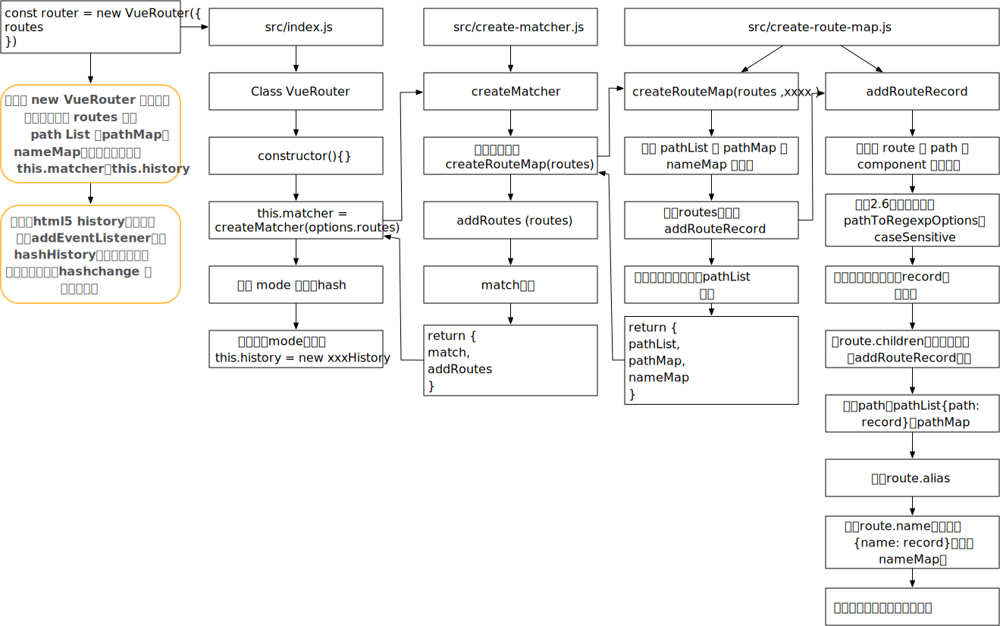
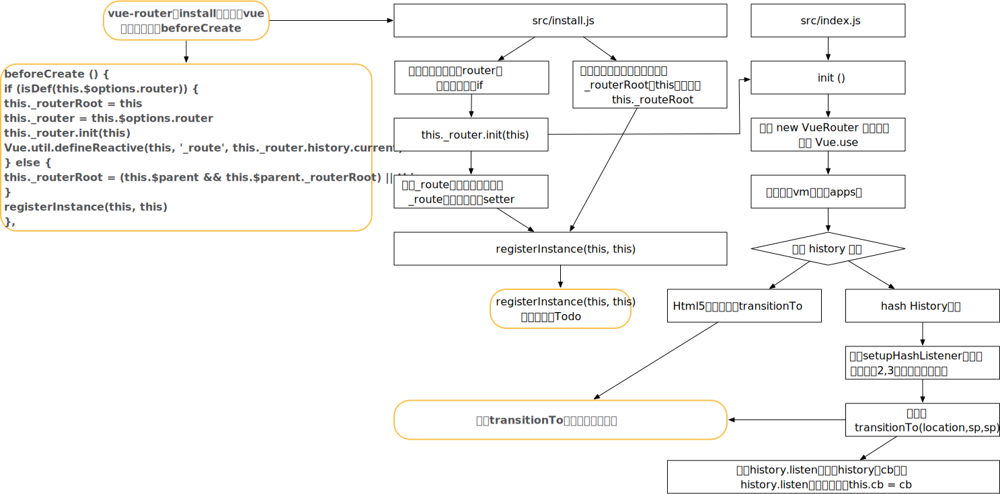
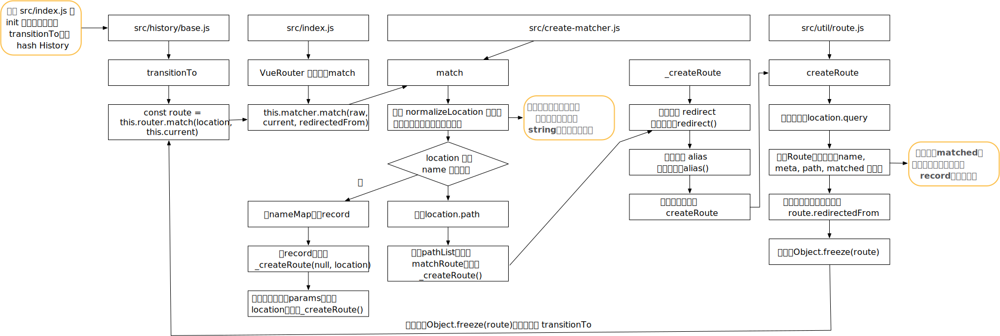
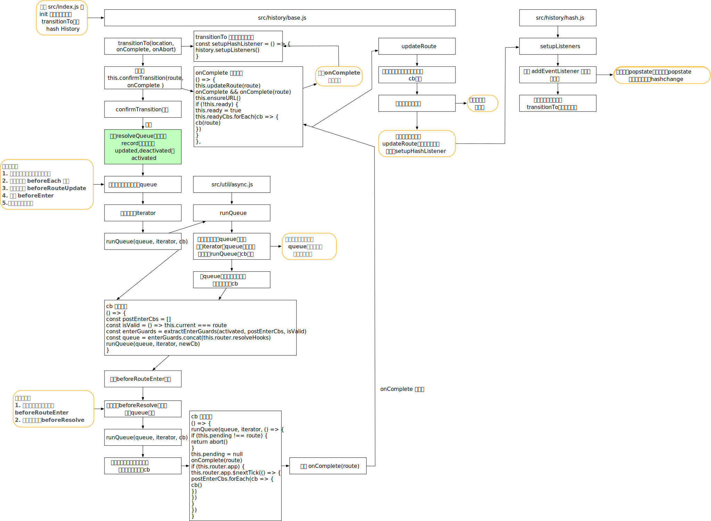

  

#路由注册

## 注意

1. 一般开源项目的入口文件都是：`src/index.js`
2. 如何看辅助函数，在test，unit，辅助函数有单元测试，可以通过单元测试查看

## 概述

1. 使用webpack 3 会默认找package.json的module字段对应的值

1. 由于vue-router与vue使用相同的打包方式，在`build/configs.js`中的genConifg，知道入口文件为src/index.js

1. Vue-router的使用方式

   ```javascript
   import Vue from 'vue'
   import VueRouter from 'vue-router'
   Vue.use(VueRouter)
   ```

# vue.use介绍

1. 定义在`src/core/global-api/use.js`
2. Vue会将注册的全部插件保存在_installedPlugins数组中
3. Vue.use利用args.unshift将Vue传入插件，这样插件内部就无需import Vue，也可以使用vue
4. 插件plugin需要提供install方法，或plugin本身就是函数
5. 实际上，Vue.use 就会调用pluin.install方法
6. 基于回调导致函数调用会较为难理解

# install

1. src/install.js
2. 主要步骤是：
   - 保证install只调用一次，设置install.installed = true，可以避免未使用Vue.use就去实例化vue-router
   - 为Vue混入beforeCreate与destroyed
   - 为Vue.prototype 绑定$router与$route，便于利用vm访问
   - 注册View与link组件
   - 自定义选项合并策略


# new VueRouter

## 概述

## 流程图




# 路由初始化
1. 在install中会对每个组件混入beforeCreate，每个组件初始化时，会调用beforeCreate钩子函数

   ```javascript
   beforeCreate () {
     // 判断组件是否存在 router 对象，该对象一般只在根组件上有
     if (isDef(this.$options.router)) {
       this._routerRoot = this
       this._router = this.$options.router
       // src/install.js，传入的_router是vm实例
       this._router.init(this)
       // 为 _route 属性实现双向绑定
       Vue.util.defineReactive(this, '_route', this._router.history.current)
     } else {
       // 用于 router-view 层级判断
       this._routerRoot = (this.$parent && this.$parent._routerRoot) || this
     }
     registerInstance(this, this)
   },
   ```

   

1. 对于根组件，我们会传入vue-router实例router

   ```html
   new Vue({
       el: '#app',
       router,
       template: '<router-view/>'
   })
   ```

1. 因此，在执行根组件，传入参数具有router，故会执行`this.router.init(this)`函数

1. init 函数定义在`src/index.js` 中

1. init最后就是调用`history.transitionTo(history.getCurrentLocation())`函数


## 流程图



# 获取route对象

1. 进入transitionTo后，先调用`const route = this.router.match(location, this.current)`获取route对象
2. 由于可能使用alias，redirect，故实际这个就是处理location等，获取新的route对象

## 流程图




# 路由切换




# url 变化

1. 路由切换时，会导致浏览器的url变化，或者页面回退时，也会使页面发送变化，这是如何实现的
2. 通常路径切换是点击router-link或直接在js中调用push方法
3. 而push方法会执行transitionTo，然后在回调时，执行pushHash与handleScroll
4. 主要在pushHash中操作url变化，实际就是直接修改window.location.hash或利用history API

# router-view

## 概述

1. 是一个函数式组件

## 问题

1. router-view可以进行嵌套，需要能找到route对应的components

## 流程

1. 对变量进行赋值
2. 计算当前view的depth，查找对应的component
3. 定义data.registerRouteInstance，用于将vm实例保存在matched.instances上
4. 执行data.hook函数
5. 对路由组件传入的参数进行处理


# router-link

## 问题

1. 如何变为a标签
   - 默认是渲染a标签，但还可以渲染为其他标签
   - 最终通过的还是h函数，传入不同tag名，不同的data，生成不同的标签并具有不同是attr与事件
2. linkActiveClass与linkExactActiveClass

## 流程

1. 解析目标位置
2. 处理全局与局部的activeClass与exactActiveClass
3. 构建handler，为click事件进行包装，包装事件满足某些要求
4. 处理event参数，可以是数组，也可以是字符串
5. 处理插槽元素，如果只有一个元素，则直接返回
6. 处理tag标签
   - 如果当前节点是a标签，则直接绑定数据到data上
   - 否则会递归查找child的a标签
   - 如果子标签没有a，则只会将on绑定到当前节点上

# 问题

## 路由切换为何会触发组件的重新渲染

1. 在beforeCreate中调用`Vue.util.defineReactive(this, '_route', this._router.history.current)`将`_route`设置为响应式
2. 在router-view组件中，会获取parent.$route的值，实际就是获取`this._routerRoot._route`会进行依赖收集
3. 而在init函数最后会调用`history.listen`对`app._route`进行赋值操作

