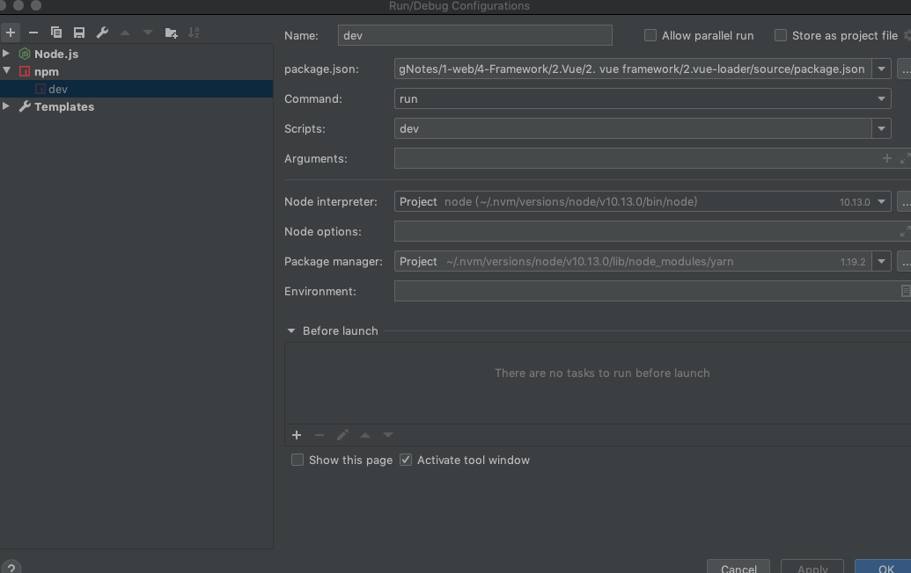
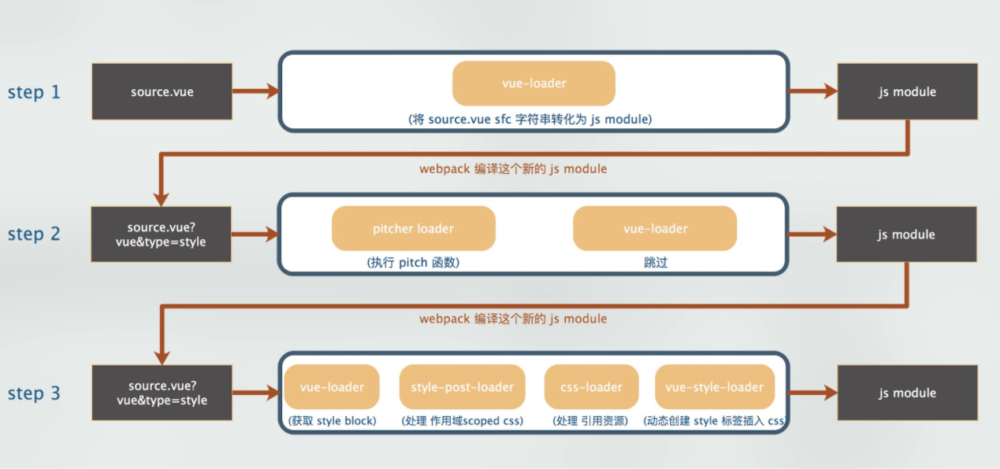

#  Scoped CSS

## /deep/

1. 使用 `scoped` 后，父组件的样式将不会渗透到子组件中

2. 这种情况下你可以使用 `/deep/` 或 `::v-deep` 或`>>>`

   ```html
   <style scoped>
   .a >>> .b { /* ... */ }
   </style>
   ```

   上述代码会被解析为

   ```css
   .a[data-v-f3f3eg9] .b { /* ... */ }
   ```

3. 这个转换通过PostCss进行的，而不是polyfill


# 概述

1. 启动项目

   - `clone`了vue-loader项目，可以利用debug模式启动`npm run dev` 
   - 会以入口`lib/index`开始执行vue-loader

2. vue-loader的英文注释很详细

3. debug方式

   

## 总结

1. 可以通过复制rules添加`resourceQuery`的方式，复用用户配置的rules
2. vue-loader的逻辑并不复杂，主要是依托webpack的loader机制（pitch函数可以终止后面的loader）以及vue解析template、style 的能力
3. vue-loader通过pitcher插件，将pitch函数作为一个loader，添加到webpack的配置中，并利用`resourceQuery`配置处理


# 将Vue SFC转为 js module

1. 在`lib/index.js`中

   ```javascript
   module.exports = function (source) {
     // 获取 loaderContext 对象
     const loaderContext = this
     // 从 loaderContext 获取相关参数，具体含义在：https://webpack.docschina.org/api/loaders/#the-loader-context
     const stringifyRequest = r => loaderUtils.stringifyRequest(loaderContext, r)
     const {
       target,
       request,
       minimize,
       sourceMap,
       rootContext,
       resourcePath,
       resourceQuery
     } = loaderContext
     // 接下来就是一系列对于参数和路径的处理
     const rawQuery = resourceQuery.slice(1)
     const inheritQuery = `&${rawQuery}`
     const incomingQuery = qs.parse(rawQuery)
     const options = loaderUtils.getOptions(loaderContext) || {}
   
     const isServer = target === 'node'
     const isShadow = !!options.shadowMode
     const isProduction = options.productionMode || minimize || process.env.NODE_ENV === 'production'
     const filename = path.basename(resourcePath)
     const context = rootContext || process.cwd()
     const sourceRoot = path.dirname(path.relative(context, resourcePath))
   	// 利用@vue/component-compiler-utils 解析这个vue文件
     const descriptor = parse({
       source,
       compiler: options.compiler || loadTemplateCompiler(loaderContext),
       filename,
       sourceRoot,
       needMap: sourceMap
     })
   
     // 生成scoped 的id
     const rawShortFilePath = path
       .relative(context, resourcePath)
       .replace(/^(\.\.[\/\\])+/, '')
   
     const shortFilePath = rawShortFilePath.replace(/\\/g, '/') + resourceQuery
   
     const id = hash(
       isProduction
         ? (shortFilePath + '\n' + source)
         : shortFilePath
     )
   
     // feature information
     const hasScoped = descriptor.styles.some(s => s.scoped)
     const hasFunctional = descriptor.template && descriptor.template.attrs.functional
     const needsHotReload = (
       !isServer &&
       !isProduction &&
       (descriptor.script || descriptor.template) &&
       options.hotReload !== false
     )
   
     // 分别解析 template、script、style内容，拼接code代码
     // template
     let templateImport = `var render, staticRenderFns`
     let templateRequest
     if (descriptor.template) {
       // 省略。。。。。
       templateImport = `import { render, staticRenderFns } from ${request}`
     }
   
     // script
     let scriptImport = `var script = {}`
     if (descriptor.script) {
       // 省略。。。。。
       scriptImport = (
         `import script from ${request}\n` +
         `export * from ${request}` // support named exports
       )
     }
   
     // styles
     let stylesCode = ``
     if (descriptor.styles.length) {
       stylesCode = genStylesCode(
         loaderContext,
         descriptor.styles,
         id,
         resourcePath,
         stringifyRequest,
         needsHotReload,
         isServer || isShadow // needs explicit injection?
       )
     }
   
     let code = ``
     return code
   }
   ```

   - 这块代码逻辑比较简单，主要是通过`@vue/component-compiler-utils`解析vue文件，然后生成js module的code代码

2. 生成的伪代码为：

   ```javascript
   import { render, staticRenderFns } from "./source.vue?vue&type=template&id=27e4e96e&lang=pug&"
   import script from "./source.vue?vue&type=script&lang=js&"
   export * from "./source.vue?vue&type=script&lang=js&"
   import style0 from "./source.vue?vue&type=style&index=0&module=true&lang=css&"
   
   var cssModules = {}
   var disposed = false
   
   function injectStyles (context) {
       if (disposed) return
   
       cssModules["$style"] = (style0.locals || style0)
       Object.defineProperty(this, "$style", {
           configurable: true,
           get: function () {
               return cssModules["$style"]
           }
       })
   
   }
   module.hot && module.hot.dispose(function (data) {
       disposed = true
   })
   module.hot && module.hot.accept()
   /* normalize component */
   import normalizer from "!../lib/runtime/componentNormalizer.js"
   var component = normalizer(
       script,
       render,
       staticRenderFns,
       false,
       injectStyles,
       null,
       null
   
   )
   
   /* custom blocks */
   import block0 from "./source.vue?vue&type=custom&index=0&blockType=foo"
   if (typeof block0 === 'function') block0(component)
   
   /* hot reload */
   if (module.hot) {}
   component.options.__file = "example/source.vue"
   export default component.exports
   ```

   - 省略了模块热部署相关代码

3. 本文上接，webpack  loader ，这个vue-loader解析后的代码，会被加入webpack流程中，即之后会先执行

   ```javascript
   [
    './source.vue?vue&type=template&id=27e4e96e&scoped=true&lang=pug&',
    './source.vue?vue&type=script&lang=js&',
    './source.vue?vue&type=style&index=0&id=27e4e96e&scoped=true&lang=css&',
    './source.vue?vue&type=custom&index=0&blockType=foo'
   ]
   ```

   

# vue-loader的插件安装

1. 要特别注意，vue-loader官方说明，与其他的loader不同的是，必须要引入`new VueLoaderPlugin`这个插件

2. 主要目的是：将定义过的其它规则复制并应用到 `.vue` 文件里相应语言的块。例如，如果你有一条匹配 `/\.js$/` 的规则，那么它会应用到 `.vue` 文件里的 `<script>` 块

3. 而且插件的执行是在module执行之前，即在vue文件进行转换之前，此插件已经执行

4. 在`plugin-webpack4.js`中（插件源码分为webpack4与5两个版本）

   ```javascript
   class VueLoaderPlugin {
     apply (compiler) {
       // 读取配置rules，利用RuleSet将rules进行转换
       const rawRules = compiler.options.module.rules
       const { rules } = new RuleSet(rawRules)
   
       // 进行一系列必要性检测
       // 1、判断是否有给.vue或.vue.html进行 module.rule 的配置
       // 2、不支持 oneOf
       // 3、vue-loader是否配置正确
   
       // clone 用户配置rules，并为每条rules增加一个resourceQuery字段
       const clonedRules = rules
       .filter(r => r !== vueRule)
       .map(cloneRule)
       // 拓展开发者的 module.rule 配置，加入 vue-loader 内部提供的 pitcher loader
       const pitcher = {
         loader: require.resolve('./loaders/pitcher'),
         resourceQuery: query => {
           // 要解析的 URL 查询字符串
           const parsed = qs.parse(query.slice(1))
           return parsed.vue != null
         },
         options: {
           cacheDirectory: vueLoaderUse.options.cacheDirectory,
           cacheIdentifier: vueLoaderUse.options.cacheIdentifier
         }
       }
   
       compiler.options.module.rules = [
         pitcher,
         ...clonedRules,
         ...rules
       ]
     }
   }
   ```

5. 我们思考一个问题：vue文件，template可以使用plug等各种语言，style可以使用css、less、scss，不可能vue-loader再配置这些规则，因此，vue-loader实际是利用插件，将这些能力注入到vue-loader中

6. 因此，插件的主要功能是，将用户配置的rules，复制一套，并增加`resourceQuery`参数，这个参数是用于识别是vue-loader生成的文件

7. 即 文件经过vue-loader解析转为js module后，会引入类似这样的文件，即将`template、style、script`全部转为带参数的形式

   ```javascript
   [
    './source.vue?vue&type=template&id=27e4e96e&scoped=true&lang=pug&',
    './source.vue?vue&type=script&lang=js&',
    './source.vue?vue&type=style&index=0&id=27e4e96e&scoped=true&lang=css&',
    './source.vue?vue&type=custom&index=0&blockType=foo'
   ]
   ```

   - 发现文件有 ?vue 这个参数时，会加载这个`'./loaders/pitcher'` 处理文件

# pitcher

1. 伪代码

   ```javascript
   module.exports.pitch = function (remainingRequest) {
     const options = loaderUtils.getOptions(this)
     const { cacheDirectory, cacheIdentifier } = options
     const query = qs.parse(this.resourceQuery.slice(1))
   
     let loaders = this.loaders
   	
     if (query.type) {
       // if this is an inline block, since the whole file itself is being linted,
       // remove eslint-loader to avoid duplicate linting.
       if (/\.vue$/.test(this.resourcePath)) {
         loaders = loaders.filter(l => !isESLintLoader(l))
       } else {
         loaders = dedupeESLintLoader(loaders)
       }
     }
   
     // remove self
     loaders = loaders.filter(isPitcher)
   
   
     const genRequest = loaders => {
     }
   
     if (query.type === `style`) {
       const cssLoaderIndex = loaders.findIndex(isCSSLoader)
           ...afterLoaders,
           stylePostLoaderPath,
           ...beforeLoaders
         ])
         return `import mod from ${request}; export default mod; export * from ${request}`
       }
     }
     if (query.type === `template`) {
       const request = genRequest([
         ...cacheLoader,
         ...postLoaders,
         templateLoaderPath + `??vue-loader-options`,
         ...preLoaders
       ])
       return `export * from ${request}`
     }
   
     const request = genRequest(loaders)
     return `import mod from ${request}; export default mod; export * from ${request}`
   }
   ```

   - 剔除 eslint loader；
   - 剔除 pitcher loader 自身；
   - 根据不同 type query 参数进行拦截处理，返回对应的request内容

2. 如对于`style`，pitch 处理后，会得到类似这样

   ```javascript
   import mod from "-!../node_modules/vue-style-loader/index.js!../node_modules/css-loader/index.js??ref--3-oneOf-0-1!../lib/loaders/stylePostLoader.js!../lib/index.js??vue-loader-options!./source.vue?vue&type=style&index=0&module=true&lang=css&"; 
   export default mod; 
   export * from "-!../node_modules/vue-style-loader/index.js!../node_modules/css-loader/index.js??ref--3-oneOf-0-1!../lib/loaders/stylePostLoader.js!../lib/index.js??vue-loader-options!./source.vue?vue&type=style&index=0&module=true&lang=css&"
   ```

3. 注意

   - 对于style、template会调用vue-loader的`stylePostLoaderPath`和`templateLoaderPath`进行处理，而这两个LoaderPath对文件解析使用的`compileStyle`和`compileTemplate`还是`@vue/component-compiler-utils`能力
   - 这个picher，只定义了pitch函数，根据webpack 运行机制，会根据pitch 函数的返回值决定之后运行

# 处理流程

1. 以vue文件的style部分为例

   


