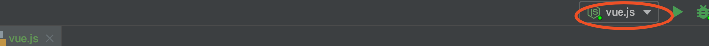
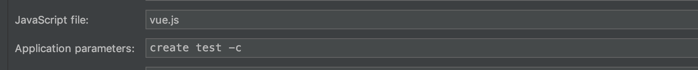

# 学习

## 概述

1. 主要目的是想深入了解脚手架实现，并希望通过此搭建自己的脚手架或写vue3的插件，顺带学习下node
2. 通过学习，优化branch-cli
   - prompt的封装
   - 全部删除模式可以将要删除的远程分支存在本地，然后下次再删
3. 会引入很多方便的第三方包，更快的完成需求
   - 如，读取package -> read-pkg

## 插件机制

1. 首先需要一个类似`options.plugins`数组，存储配置的插件（export一个函数）

2. 可以对plugins再做一层封装，便于传递参数等

   ```javascript
   const plugin = {
     apply: func, // 实际的export函数
     id: 123,
     options: xxx // 参数
   }
   ```

3. 在代码中，只需要遍历plugins，获取apply函数，进行调用`apply(api,options)`

   - 由于插件的处理逻辑全部集中在，API这个class上，api为 API的实例

4. 插件机制，要求插件的文件目录符合要求，这样才能统一提取

   - 利用globby读取处理**操作符，读取文件

5. 调用的主要实现在

   - packages/@vue/cli/lib/Generator.js
   - `initPlugins`函数中

## 如何实现在默认模板中插入插件的代码

1. 官网：使用 YAML 前置元信息继承并替换已有的模板文件的一部分

2. 首先：插件开头要写一些这样的YAML语言

   ```html
   ---
   extend: '@vue/cli-service/generator/template/src/App.vue'
   replace:
     - !!js/regexp /<template>[^]*?<\/template>/
     - !!js/regexp /\n<script>[^]*?<\/script>\n/
     - !!js/regexp /  margin-top[^]*?<\/style>/
   ---
   ```

3. 会利用：`yaml-front-matter`插件将上述YAML解析为对象

4. 先将读到文件，用ejs解析一下（因为可能存在ejs语法），如果存在extend，读取这个文件，将replace的正则进行替换

5. 整体的实现在：packages/@vue/cli/lib/GeneratorAPI.js下的renderFile

6. 小结

   - 开发插件，可以直接全部替换了，似乎还容易些
   - 但如开发readFile类似的模式，还是略麻烦

## 处理webpack

### 插件是如何扩展webpack

1. 首先要注意的是`vue serve`与实际项目调用的`npm run serve`并不是执行的一个命令
   - 项目中调用`npm run serve`实际是`vue-cli-service serve`
   - 命令定义：`packages/@vue/cli-service/bin/vue-cli-service.js`
2. 其次将vue-cli将插件的index文件定义为service插件的入口文件，因为
   - 在new Service时，会`this.resolvePlugins(plugins, useBuiltIn)`，`npm run serve`的方式plugins传入的是null，故会从`this.pkg.devDependencies`读取依赖，获取插件的index.js ，push到`webpackChainFns数组`
   - 因为，选择要安装的插件，会在create时把依赖包放在package.json中
   - 在读取webpack配置时，就可以运行webpackChainFns数组获取插件的对webpack的扩展
3. 总结下：就是生成代码时，将插件放在package中，然后在serve时，通过package读取插件，并混入webpack配置

### 如何隐式serve与build

1. 通过`vue serve`命令得知
2. 子包`cli-service-global`的index.js export serve与build等函数
3. 在内部，利用`context = process.cmd()`获取到执行目录，并配置好入口文件等
4. 因此，在执行`service.run`，会在内部读取`vue.config.js`，读取用户添加的配置
   - `packages/@vue/cli-service/lib/Service.js`中`init`->`loadUserOptions`

## 快速生成项目

1. vue-cli3增加了插件与dashboard功能，但还兼容vue-cli2 的vue init方法
2. 因此：通过`@vue/cli-init`可以快速生成项目模板

## 注意

1. 安装cli时，实际是`npm install -g @vue/cli`，整个vue-cli的仓库，包含了其他插件

## 补充

1. 如何调试命令行程序

   

   

   - 配置一下参数，这样可以进入断点，简单方式还不知道-。-


# 源码

## 概述

1. 安装好vue-cli3后，输入vue，可以看到有create，add等命令可以使用，之后逐个进行分析
2. 常用的npm包
   - `commander` 是一款重量轻，表现力和强大的命令行框架，提供了用户命令行输入和参数解析强大功能
   - `Inquirer` 为交互式命令行工具
   - `semver`：npm版本号的一些操作
   - `execa` ：可以调用 shell 和本地外部程序的 javascript 封装。会启动子进程执行，支持多操作系统。它是在 Node.js 内置的 `child_process.exec` 基础上进行了提升，比如更好地支持 windows 平台
   - **`handlebars` 是一个 `javascript` 语义模版库，而且与 `Mustache` 模板是兼容的**
   - `metalsmith` 一个静态网站生成器，可以用在批量处理模板的场景，和 `hexo` 类似，可以通过通过使用 [metalsmith-markdown](https://github.com/segmentio/metalsmith-markdown) 和 [metalsmith-layouts](https://github.com/metalsmith/metalsmith-layouts) 插件 将 `markdown` 文件以 `handlebars` 的模板形式来生成`html` 文件
   - `download-git-repo` 是用于 从 `GitHub`, `GitLab`, `Bitbucket` 下载一个 `git` 仓库
   - `consolidate` 是一个模版引擎整合库，它的作用是把一些著名的模板引擎适配成 `Express` 兼容的接口

## create命令

### 学习

1. 通过command处理多个参数，并利用cleanArgs函数，将`-p, --preset`等转换为`options.preset`形式
   - 定义的命令都存在`-p与--preset`形式，因此即使输入-p，command也能知道对应的是--preset
2. 通过require动态加载create.js，执行create
3. 获取当前路径所在文件夹：`path.relative('../', cwd)`
4. 读取与写入配置文件的封装
   - `packages/@vue/cli/lib/options.js`
   - 利用`@hapi/joi`对配置文件中的值进行校验
5. 获取cli的最新版本：不是直接获取， 而是通过 [vue-cli-version-marker](https://github.com/vuejs/vue-cli/blob/dev/packages/vue-cli-version-marker/package.json) npm 包获取的 CLI 版本
   - 由于cli放在@vue下面，即是一个 scoped package, 而 scoped package 又不支持通过 `npm registry` 来获取 latest 版本信息
   - 获取 scoped packages 的数据比获取 unscoped package 通常要慢 300m
6. 直接利用read-pkg读取package.json
   - 读取包文件的封装：packages/@vue/cli-shared-utils/lib/pkg.js
7. Vue-cli3.0 采用了一套基于插件的架构
   - Options.plugin传入插件，然后利用generator去依次执行插件逻辑
   - 因此实际Generator类暴露的方法，即是给自定义插件使用

### 源码

1. 入口文件在：packages/@vue/cli/bin/vue.js

   ```javascript
   program
     .command('create <app-name>')
     .description('create a new project powered by vue-cli-service')
     .option('-p, --preset <presetName>', 'Skip prompts and use saved or remote preset')
     .option()
     .option()
     .action((name, cmd) => {
     const options = cleanArgs(cmd)
   
     if (minimist(process.argv.slice(3))._.length > 1) {
       console.log(chalk.yellow('\n Info: You provided more than one argument. The first one will be used as the app\'s name, the rest are ignored.'))
     }
     // --git makes commander to default git to true
     if (process.argv.includes('-g') || process.argv.includes('--git')) {
       options.forceGit = true
     }
     // 将命令行的参数转为options.forceGit = true 的对象
     require('../lib/create')(name, options)
   })
   ```

   - 理解是，将命令行配置的参数，转成options.forceGit = true的对象，传入create函数

2. 实际调用的命令定义在packages/@vue/cli/lib/create.js，主要可以分为如下几个步骤

###基础验证

1. 根据输入的项目名，判断应该生成文件的文件路径
2. 通过`validate-npm-package-name`严重输入的文件名是否合法的npm package包
3. 处理指定的文件路径有内容，利用`inquirer.prompt`让用户选择策略，是覆盖还是合并（cli-branch开发时已经搞过）

### 获取预设选项

1. 基础验证完成后，执行`const creator = new Creator(name, targetDir, getPromptModules())`
2. 通过getPromptModules获取babel，typescript等配置信息
   - `packages/@vue/cli/lib/PromptModuleAPI.js`中封装了injectFeature，onPromptComplete等方法
   - getPromptModules会根据用户选择，动态加载`packages/@vue/cli/lib/promptModules`文件夹下的文件
3. new Creator，进入`packages/@vue/cli/lib/Creator.js`构造函数
   - 获取presetPrompt，featurePrompt，outroPrompts
   - 实例化PromptModuleAPI并将其传入到promptModules中
4. 调用creator.create(options)函数

### 调用creator.create

1. 首先处理preset为false的情况，create命令默认preset为null
2. 处理preset.router等情况，即根据不同情况添加不同插件


### 依赖安装

1. 根据是否有yarn，pnpm以及是否指定了packageManager，获得packageManager的值
2. `new PackageManage`获取版本控制的实例pm ？？？？？？
3. 获取最新cli版本
   - 获取本地 CLI 以及插件的版本
   - 利用getAndCacheLatestVersion获取远程cli的latest版本
4. 根据本地的package.json与最新的cli版本，构造pkg对象
5. 处理`preset.plugins`：在create函数前面，会根据配置的参数添加router，vuex等插件
   - 主要是利用pkg.devDependencies，保存插件的版本
6. 调用`writeFileTree`将获取的最新版本信息，写入package.json
7. 判断是否需要执行`git init`，如果需要则执行
8. 安装依赖
   - 测试环境会执行`./util/setupDevProject`
   - 运行环境会执行`pm.install()`：其实就是调用 `npm install`方法
     - Install 内部有个逻辑是通过Promise.race分别向taobao与默认源发请求，判断哪个快，使用哪个源

### Generator

1. 主要new Generator实例，然后调用generate方法

### 结尾

1. 安装额外依赖
2. 调用回调函数
3. 产生README.md
4. 产生.npmrc文件
5. 如果配置了shouldInitGit，则进行git初始化的add与commit
6. 是否跳过开始导引
7. 输出日志`this.exitLogs`，generator可以用exitLogs为cli结尾添加日志


