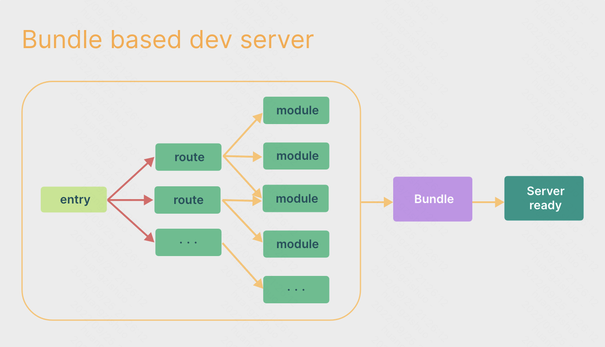
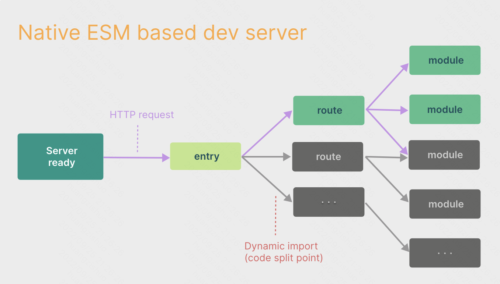
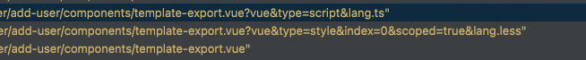
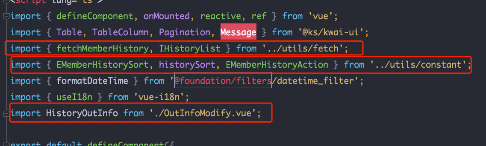
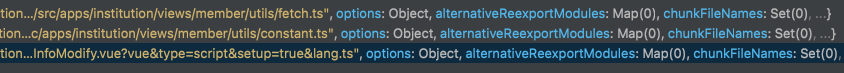
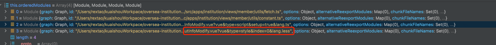
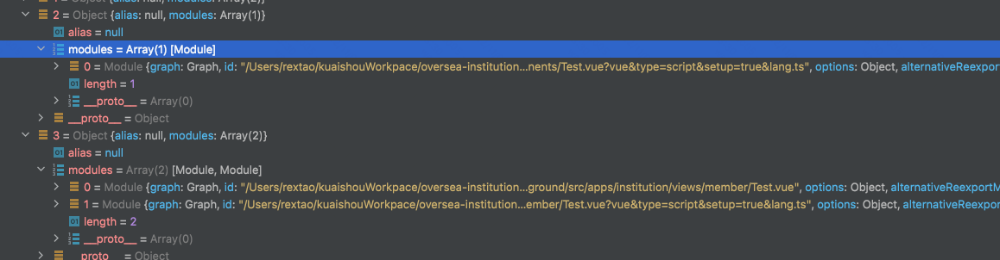

预构建

1. commonJs与Umd兼容性：将CommonJS 或 UMD 发布的依赖项转换为 ESM

2. 提升构建性能：将有许多内部模块的 ESM 依赖关系转换为单个模块，以提高后续页面加载性能，如lodash-es如果排除出预构建，会单独加载很多文件（很多请求），预构建会将n多模块合并为一个请求

3. 缓存：

   - Vite 会将预构建的依赖缓存到 node_modules/.vite。它根据几个源来决定是否需要重新运行预构建步骤:

     - package.json 中的 dependencies 列表

     - 包管理器的 lockfile，例如 package-lock.json, yarn.lock，或者 pnpm-lock.yaml

     - 可能在 vite.config.js 相关字段中配置过的

   - 浏览器缓存：解析后的依赖请求会以 HTTP 头 max-age=31536000,immutable 强缓存


vite与webpack的区别

1. webpack的主要流程

   

   - 通过入口文件生成的依赖图扫描整个项目所有的模块依赖，并逐个进行打包。
   - 当所有模块依赖分析并编译加载完成后，告诉客户端可以开始访问。
   - 如果某个模块被改动，和这个模块有关的模块依赖需被重新编译

2. vite的流程

   

   - 先使用esbuild进行依赖预构建，并存入node_modules/.vite文件夹内，请求哪个模块再对哪个模块进行实时编译；
   - 由于现代浏览器本身就支持ES Modules，会主动发起请求去获取所需文件。
   - 当浏览器请求需要的模块时，再对模块进行编译
   - 在HRM方面，当某个模块内容改变时，让浏览器去重新请求该模块即可


vite的慢的地方

1. 首屏和懒加载性能的下降（只有首次加载，再reload会因为缓存，会好一些）
   - 不对源文件做合并捆绑操作，导致大量的 http 请求；
   - dev server 运行期间对源文件做 resolve、load、transform、parse 操作；
   - 预构建、二次预构建操作也会阻塞首屏请求，直到预构建完成为止


EsBuild

为什么快（使用了Go语言）

1. 使用go，编译为原生代码
   - 大多数打包器都是用 JavaScript 编写的，但是对于 JIT 编译的语言来说，需要边解析边编译。
2. Go 是为并行性而设计的，而 JavaScript 不是
   - Go在线程之间共享内存，而JavaScript必须在线程之间序列化数据
3. esbuild 中的算法经过精心设计，可以充分利用CPU资源
4. 理想情况下， 根据数据数据的长度， 编译器的复杂度为O(n)
   - 对数据进行的遍历次数越少（将数据转换成数据所需的不同表示形式也就越少），编译器就会越快。
   - esbuild 仅触及整个JavaScript AST 3次


编译问题

1. 会将template进行分解，script，style，template都转为module

   

2. 此文件实际的module

   

3. 根据源码

   ```javascript
   outputBundle[chunk.id] = chunk.getChunkInfoWithFileNames();
   // 实际是获取的chunk.id作为name
   ```

4. assignChunkIds

   ```javascript
   assignChunkIds(chunks, inputBase, addons, bundle) {
     const entryChunks = [];
     const otherChunks = [];
     for (const chunk of chunks) {
       (chunk.facadeModule && chunk.facadeModule.isUserDefinedEntryPoint
        ? entryChunks
        : otherChunks).push(chunk);
     }
     // make sure entry chunk names take precedence with regard to deconflicting
     const chunksForNaming = entryChunks.concat(otherChunks);
     for (const chunk of chunksForNaming) {
       if (this.outputOptions.file) {
         chunk.id = basename(this.outputOptions.file);
       }
       else if (this.outputOptions.preserveModules) {
         chunk.id = chunk.generateIdPreserveModules(inputBase, this.outputOptions, bundle, this.unsetOptions);
       }
       else {
         chunk.id = chunk.generateId(addons, this.outputOptions, bundle, true);
       }
       bundle[chunk.id] = FILE_PLACEHOLDER;
     }
   }
   ```

   ```
   
   generateAssetFileName
   一个文件名的命名规则
   renderNamePattern(typeof outputOptions.assetFileNames === 'function'
           ? outputOptions.assetFileNames({ name, source, type: 'asset' })
           : outputOptions.assetFileNames, 'output.assetFileNames', {
           ext: () => extname(emittedName).substring(1),
           extname: () => extname(emittedName),
           hash() {
               return createHash()
                   .update(emittedName)
                   .update(':')
                   .update(source)
                   .digest('hex')
                   .substring(0, 8);
           },
           name: () => emittedName.substring(0, emittedName.length - extname(emittedName).length)
       })
   ```

   ```
   本质是取this.name作为原始名，这个文件this.name就是错误的？？
   ```


打包结果是根据chunk-name确定的，因此直接找一下ChunkName

```javascript
getFallbackChunkName() {
  if (this.manualChunkAlias) {
    return this.manualChunkAlias;
  }
  if (this.dynamicName) {
    return this.dynamicName;
  }
  if (this.fileName) {
    return getAliasName(this.fileName);
  }
  // 这个会取orderModules最后一个元素
  return getAliasName(this.orderedModules[this.orderedModules.length - 1].id);
}
```





而在OutInfoModify里面增加style标签，会多一个module



获取id使用的方法

```javascript
function getAliasName(id) {
    const base = basename(id);
    return base.substring(0, base.length - extname(id).length);
}
```

这个文件并不具有dynamicName，作为import组件

因为没有dynamicName会用orderModules的id作为name，那么问题是？？这个组件为嘛不是dynmicName

那就先看看chunks是怎么生成的generateChunks


develompent不会出现问题，producttion会出现问题


主要是，一个组件setup方式，另一个defineComponent，子组件使用了




chunk分组出现了问题


认为，编译时，对文件的解析出现了问题，缺少Test.vue这个module

