# 学习

## 如何分析源码

1. 没必要像jQuery一样，进行深度遍历的看，这样是比较累的，并且不容易整体把握
2. 可以先跳过一些部分，如响应式原理，等看到响应式原理时，再看这部分代码

# 准备工作

## 认识Flow

### 概述

1. 静态类型检查，之所以选择Flow是定位Babel和EsLint都有对应的Flow插件以支持语法
2. 可以完全沿用现在的构建配置，非常小的改动就可以让项目拥有静态类型检查的能力

### 常见类型检查方式

1. 类型推断
   - 通过变量的使用上下文推断变量类型，根据这些推断检查类型
2. 类型注释
   - 事先注释好我们期待的类型，Flow会基于这些注释来判断

### vue的使用方式

1. flow提出了libdef的概念，可以识别第三方库或者自定义类型，vue利用了这些特性
2. vue主目录下的`.flowconfig`文件是flow的配置文件
3. 在flow文件夹下，定义了一些自定义类型

## 目录结构

1. compiler：编译相关代码
2. core：核心代码
3. server：服务器相关
4. sfc：可以将单vue文件编译为一个js对象
5. shared：辅助的方法，可以被所有目录共享的辅助方法
6. **思考**：可以将模块拆分非常清楚，在独立的目录下进行维护，方便代码复用，维护性增强，然后使用打包工具将代码合并为一个文件

# 源码阅读

##  代码构建过程

### 概述

1. 基于rollup构建，更适合js库的编译，只负责js，其他如图片等是不管的，更轻量
1. 由于vue也是发布在npm上，故有一个package.json对文件进行描述
1. 运行这个`npm build`时，会调用scripts的build.js函数
1. 由此作为开始，分析构建流程

### 思考

1. 如何将fs.write封装为promise
  
   - 在`scripts/build.js`的write函数
   
1. 利用\x1b[1m\x1等字符，可以将console的颜色进行更改
  
   - 在`scripts/build.js`的blue，可以使用chalk对console文件进行颜色美化
   
1. 注意：

   - config.js中的config里面的各种不同编译版本，在vue官网：https://github.com/vuejs/vue/tree/2.6/dist，有各个构建版本含义的介绍

   

### 流程图

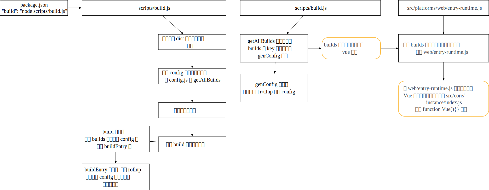

## new Vue阶段
1. 根据构建需要的配置入口文件`scripts/config.js`的builds中的entry，找到`web/entry-runtime.js`，可以逐步向上查找Vue的定义
2. 最终在`src/core/instance/index.js
`找到`function Vue(){}`定义
3. 因此，实际调用new Vue，是会执行`Vue.prototype._init`，最终运行`vm.$mount(vm.$options.el)`方法
4. 在index函数中，会通过Mixin函数定义prototype上的各种方法，而在init中会分别调用initEvent等方法

### 思考

1. vue创建并没有使用class，而是利用es5的function，因为vue利用mixin的方式，将不同功能的prototype分散在不同的文件中
2. 根据`src/core/instance/init.js`可以看出，beforeCreate与create之间主要区别是，会初始化inject，state与provide

### 流程图

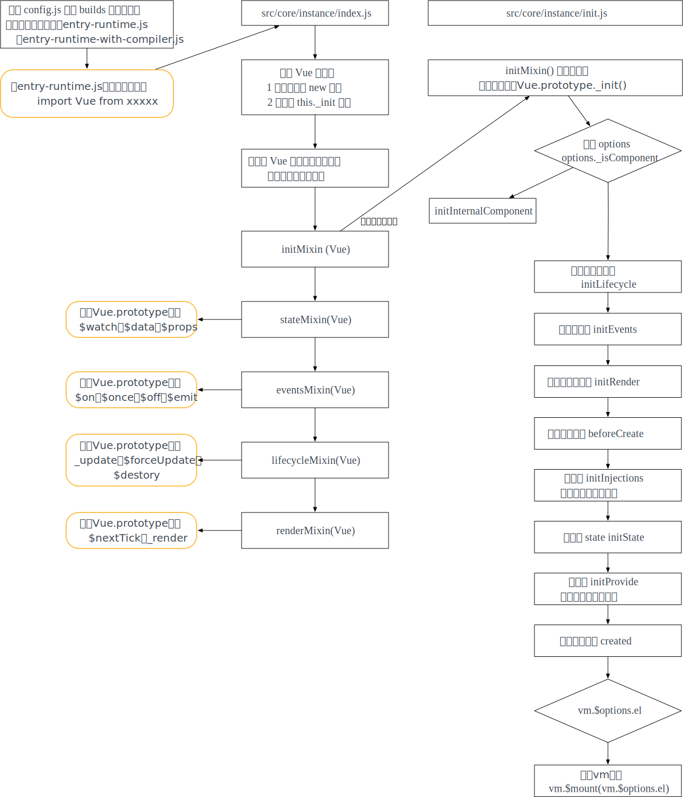

## vm挂载

1. 由于`Vue.prototype._init()`最后是调用vm.$mount方法；这个方法在`src/platforms/web/runtime/index.js`与`src/platforms/web/entry-runtime-with-compiler.js`中都有定义

2. 而编译版本js主要是对template进行处理，编译为render函数，然后进行后续操作

   

### 流程图

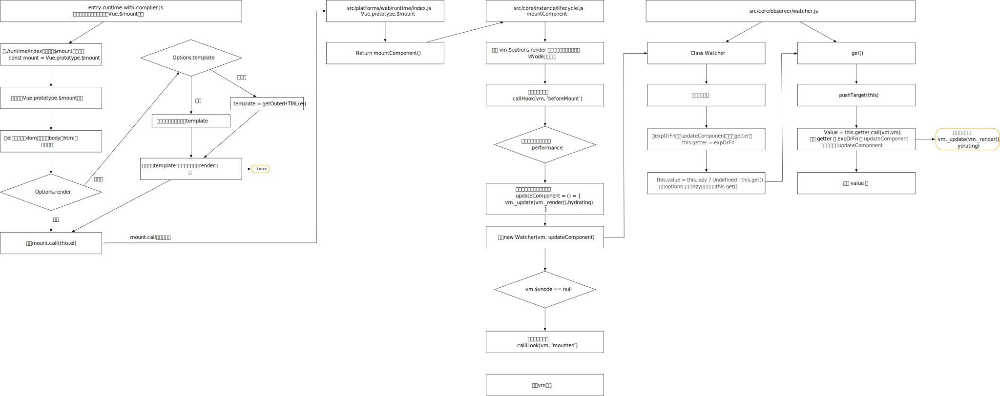

4. 根据流程图可以看出，最终会调用`vm._update(vm._render(),hydrating)`

##  vm._render()

### 概述

1. `vm._render`则是使用render函数，获取vnode 


### 虚拟Dom

1. 可以在控制台打印dom节点

   ```javascript
     const div = document.createElement('div');
     let str = ''
     for(var key in div){
         str += key;
     }
   ```

   - 可以看到实际的dom会包含很多内容

2. virtual DOM实际是用原生js对象去描述一个DOM节点，比创建一个DOM的代价小的多

   - 不需要包含操作dom的方法
   - 映射到真实DOM实际要经历VNode的create、diff、patch等过程

### 流程图

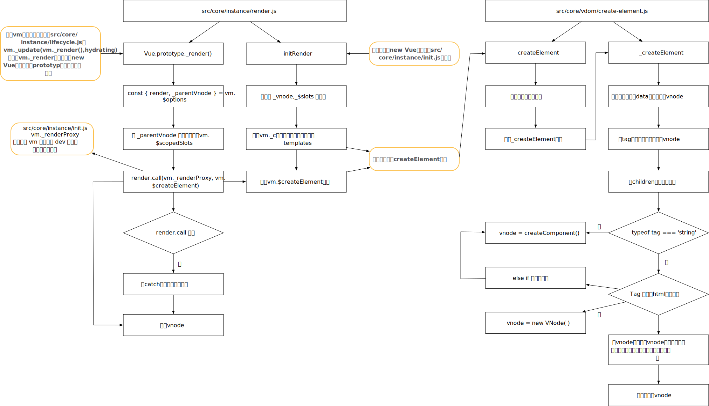

## vm._update()

### 概述

1. 根据流程图可以得知`vm._update`会绕一大圈去调用`src/core/vdom/patch.js`下面patch函数
2. `vm._update`调用`vm.__patch__`时，由于在 Web 和 Weex 环境，把虚拟 DOM 映射到 “平台 DOM” 的方法是不同的，并且对 “DOM” 包括的属性模块创建和更新也不尽相同。
3. 因此`vm.__patch__`会引用`src/platforms`目录下不同文件夹下的patch，而不同目录有各自的 `nodeOps` 和 `modules`。
4. 而不同平台的 `patch` 的主要逻辑部分是相同的，所以这部分公共的部分托管在 `core` 这个大目录下

### 思考

1. 针对不同平台生成patch函数，用到了一个函数柯里化的技巧，通过 `createPatchFunction` 把差异化参数提前固化，这样不用每次调用 `patch` 的时候都传递 `nodeOps` 和 `modules` 了
2. 如果不使用上述方式，则需要再creatPatchFunction中写很多if-else函数

### 流程图

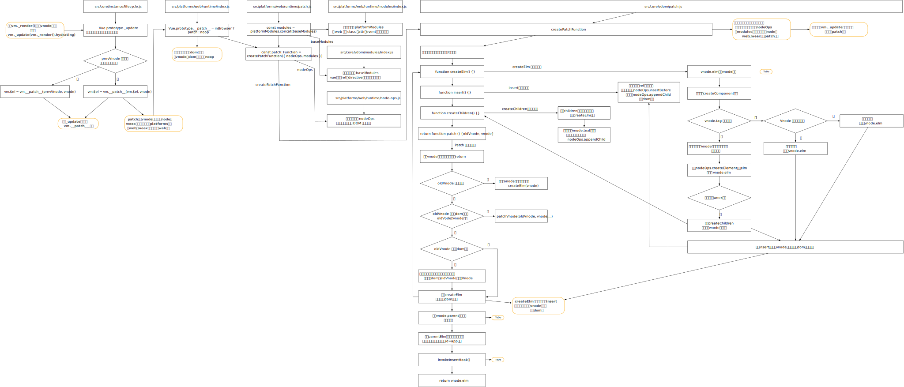

## 组件

### createComponent创建Vnode

#### 概述

1. 实际函数主要是介绍如何生成组件Vnode

2. 上接vm._render()`流程图`_createElement`函数，里面在判断`typeof tag === 'string'`时，如果为false，会调用createComponent

3. 普通tag生成Vnode的主要代码是

   ```javascript
   vnode = new VNode(
     tag, data, children,
     undefined, undefined, context
   )
   ```

4. 对于组件则是

   ```javascript
   const vnode = new VNode(
     `vue-component-${Ctor.cid}${name ? `-${name}` : ''}`,
     data, undefined, undefined, undefined, context,
     { Ctor, propsData, listeners, tag, children },
     asyncFactory
   )
   ```

5. 注意

   - 组件的命名是以vue-component-为开始的，当我们看到一个此类名，就知道是一个组件
   - 组件的子并不是利用children参数传入Vnode的，而是使用componentOptions这个参数传入的，即组件Vnode是空，componentOptions里面包含children、propsData，listeners等

6. 关键：

   - 子组件的构建器是继承Vue的，具有Vue的能力
   - 组件的data会有一些hook
   - 组件Vnode与普通Vnode有区别

#### 流程图

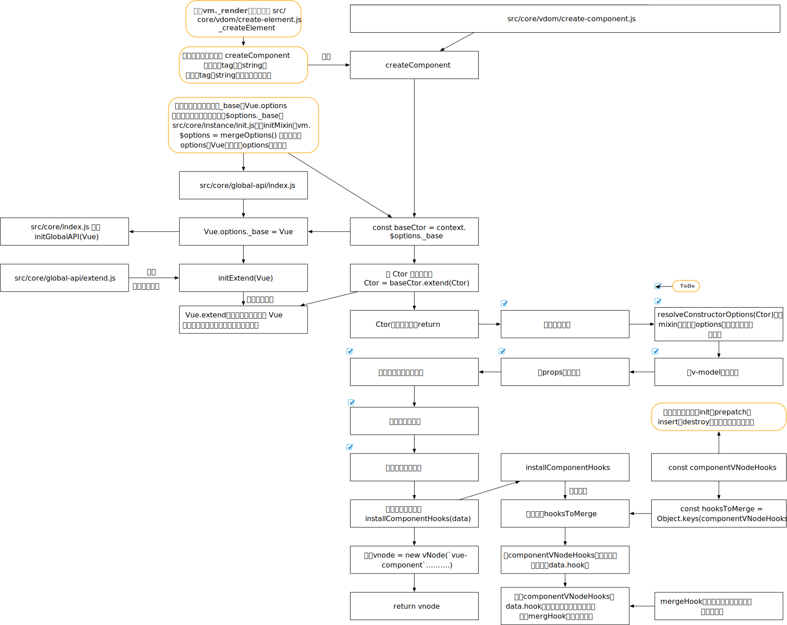

### update

#### 概述

1. 通过上面的createComponent会创建组件的Vnode，然后调用`vm._patch`函数，然后会调用`src/core/vdom/patch.js`的返回patch函数
2. 而这个patch函数会利用createEl使用Vnode创建真实dom节点

#### 流程图

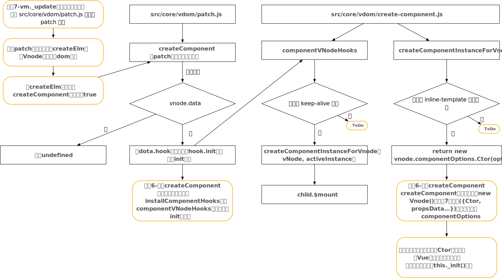


#### 代码流程分析

```vue
// main.js
const main = new Vue({
    el: '#app',
    render(h) {
        return h(App)
    }
})
// App.vue
<div id="componentApp">
  {{msg}}
  <hello-world msg="helloWorld"></hello-world>
</div>
// helloWorld
<div class="hello">
  <h1>{{ msg }}</h1>
</div>
```

##### new Vue的init阶段

1. 在 `function Vue`处打断点，代码执行，进行此函数，执行_init方法，此时的options，即为传入的options，故`vm.$options.el`存在，且为#app；最终执行`vm.$mount(vm.$options.el);`
2. 由于render函数存在，则无需进行运行时编译，直接mountComponent方法，最终调用`vm._update(vm._render(), hydrating);`方法
3. vm._render函数调用，会调用createElement方法，第一个参数为vm实例，第二个参数(tag)实际是App，此App文件会被vue-load进行处理，即模板会变为render函数
4. 进入_createElement，由于tag是对象，会进入createComponent函数，使用此函数生成vnode
5. 进入createComponent函数后，Ctor即是之前的App对象，会将Ctor转换为继承了Vue的构造函数，调用installComponentHooks为data安装hooks，然后生成`tag: "vue-component-1-app"`的Vnode
6. vm._render函数执行完返回的Vnode，会传入update函数，进入patch函数，参数oldVnode实际是vm.$el这个真是dom节点，vnode则是"vue-component-1-app"，然后调用createElm函数
7. 传入createElm的vnode，则是上面的"vue-component-1-app"，insertedVnodeQueue为空数组，parentElm就是#app的父元素body，refElm是#app的nextSibling元素，即文本节点，首先会用相同的参数传入createComponent，由于组件具有hooks，会执行init函数
8. 进入hooks的init函数，会调用createComponentInstanceForVnode函数，而activeInstance是在**Vue.prototype._update**赋值的，实际就是new Vue返回的vue实例
9. 因此，此时对options的赋值，`_parentVnode`实际是"vue-component-1-app"，而parent是vm实例，最终会去调用`new vnode.componentOptions.Ctor(options)`，而Ctor实际就是继承自Vue的构造函数，会调用`_init方法`

##### 子组件init阶段

1. 此时，再进入init函数，options只有3个属性，`_parentVnode`是"vue-component-1-app"，parent是vm实例(main这个实例)，`_isComponent`为true，故先执行initInternalComponent，合并属性操作，实际是将obj.obj类似这样的属性，合并到opts上，即合并到子组件vm.$options上

2. 注意，此时运行进入initLifecycle，由于此时具有parent属性，即会将父级的vm实例放在parent.$children中

3. 此时，并不具有`vm.$options.el`，故init执行完，即回到createComponentInstanceForVnode函数，进而会手动调用`child.$mount(hydrating ? vnode.elm : undefined, hydrating);`进行子组件挂载，此时传入的第一个参数el为undefined，由于vue-load会将App模板转换为render函数，故不会执行运行期编译

4. 再次执行到mountComponent函数，此时的vm是"vue-component-1-app"实例记为app，

5. 又会进入vm._render函数调用，生成vnode，实际上App组件由vue-loader生成的render函数为

   ```javascript
   var render = function() {
     var _vm = this
     var _h = _vm.$createElement
     var _c = _vm._self._c || _h
     return _c(
       "div",
       { attrs: { id: "componentApp" } },
       [
         _vm._v("\n  " + _vm._s(_vm.msg) + "\n  "),
         _c("hello-world", { attrs: { msg: "helloWorld" } })
       ],
       1
     )
   }
   var staticRenderFns = []
   render._withStripped = true
   export { render, staticRenderFns }
   ```

   - _c实际是$createElement函数，只是最后一个参数不同，参数分别为 tag, data, children
   - 会先执行_c("hello-world", { attrs: { msg: "helloWorld" } })生成helloworld组件是Vnode，然后生成此App的Vnode
   - children实际是一个文本Vnode，一个helloWorld组件Vnode（tag: "vue-component-2-HelloWorld"）
   - 注意，此vnode的tag为div

6. 获取了Vnode后，进入update方法，此时的vnode参数，则为刚render生成的vnode

7. 进入patch函数，vm.$el依然是undefined，故先回进入createElm(vnode, insertedVnodeQueue);函数

8. 再次进入createComponent函数，注意，由于此vnode并不是组件，故不存在hooks函数，故此函数返回undefined

9. 继续运行，会调用createChildren函数处理上面的children，然后依次调用createElm，第一个子节点是文本节点，第二个子节点是又是组件节点HelloWorld，此时createComponent会具有hooks函数，然后执行HelloWorld的$mount方法

#### 总结

1. patch整体流程：createComponent->子组件初始化->子组件render->子组件patch
2. activeInstance为当前激活vm实例；vm.$vnode为组件占位符vnode；vm._vnode为组件渲染vnode
3. 嵌套组件的插入顺序是先子后父

### 组件挂载流程分析图

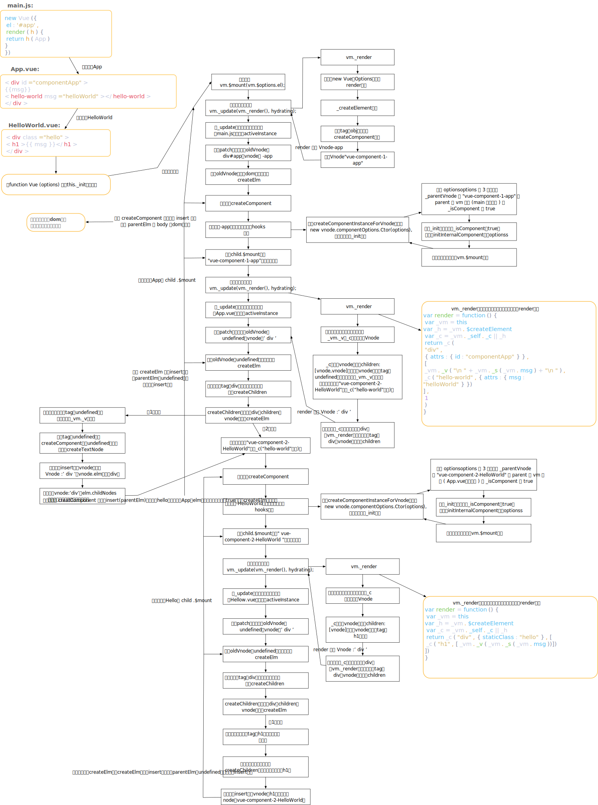


## 合并配置

1. vue合并配置分为如下两种情况
   - 外部调用场景的配置合并
   - 组件场景的配置合并
2. 参见 2-new vue 流程图，可以得知在Vue.prototype._init()会进行配置合并，即合并options

### 举例说明

```javascript
import Vue from 'vue'
let child = {
    template: '<div>{{msg}}</div>',
    created() {
        console.log('child created')
    },
    mounted() {
        console.log('child mounted')
    },
    data() {
        return {
            msg: 'hello'
        }
    }
};
Vue.mixin({
    created() {
        console.log('parent created')
    }
});
new Vue({
    el: '#app',
    render: h => h(child)
});
```

1. 首先，会执行Vue.mixin函数，此函数定义在src/core/global-api/mixin.js中，实际就是利用mergeOptions，将options合并到Vue.options上
2. 调用Vue.mixin时，由于在Vue初始化时，会调用initGlobalAPI将components，directives，filters与_base定义在Vue.options，由于传入参数是created，故将此合并到Vue.options上
   - 注意：由于父（Vue.options）不存在created，子存在，故将created转换为数组返回
3. 然后执行new Vue函数，执行mergeOptions(resolveConstructorOptions(vm.constructor),options || {}, vm)，由于此时vm为Vue，故传入mergeOptions是Vue的opitons，第二个参数是外部new Vue传入的{el: '#app',render}，合并之后实际是将Vue的options与new Vue传入的options全部合并
4.  然后进行组件child的初始化，执行src/core/global-api/extend.js中的extend函数，会有一步通过mergeOptions将父级与当前的options进行合并，此时created是一个数组；由于此时的chid父就是Vue，故会将Vue的options全部合并进来
5. 然后调用initInternalComponent，注意此时的vm实例的proto.constructor挂在了刚刚child的options，而传入的options实际是src/core/vdom/create-component.js中在createComponentInstanceForVnode构建的options，实际此函数主要是将options的某些藏得比较深的属性挂在vm上

### 流程图

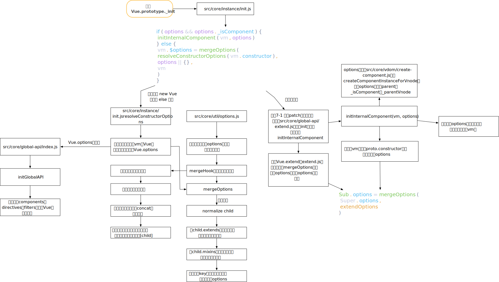

### 总结

1. 外部调用场景下的合并配置是通过mergeOptions，并遵循一定的合并策略，如对于某些options，如created，computed等不知如何合并的，可以通过查看mergeOptions的合并策略
2. 组件合并是通过initInternalComponent，它的合并更快

## 生命周期

### callHook

1. src/core/instance/lifecycle.js，主要通过这个函数对生命周期进行调用

### 流程图

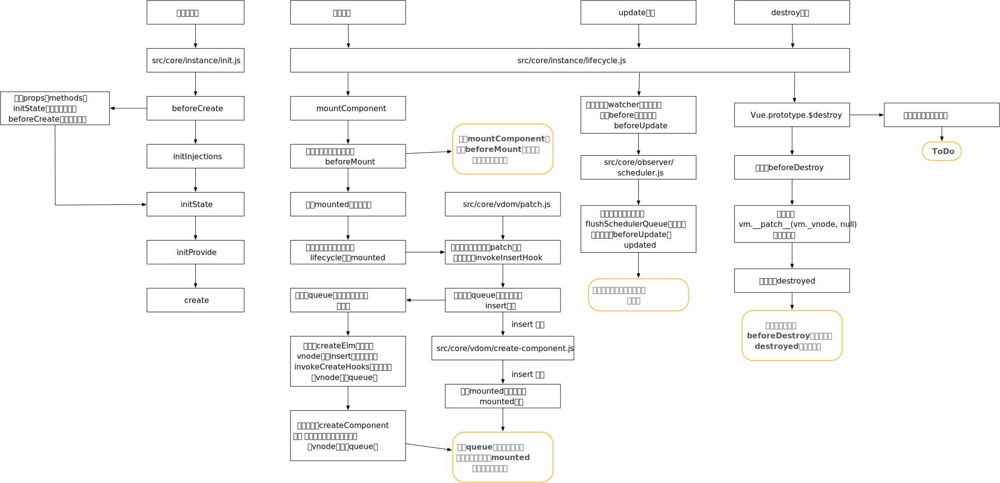


## 组件注册

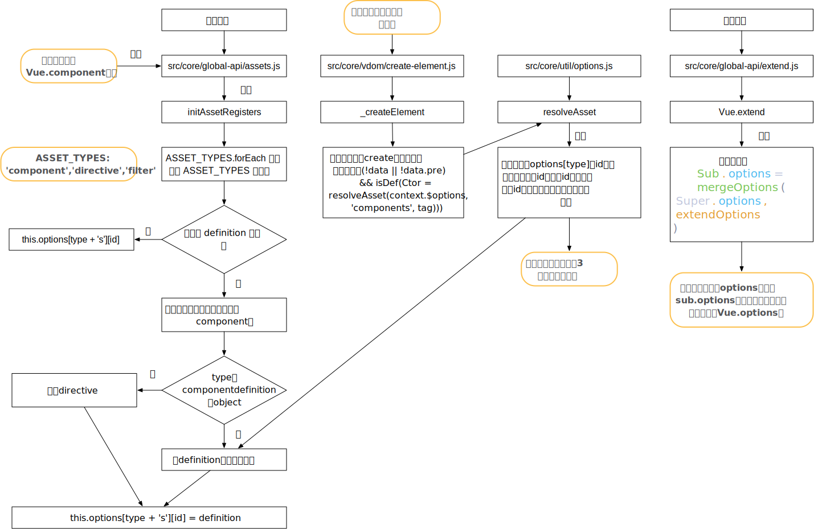

## 异步组件

### 流程图

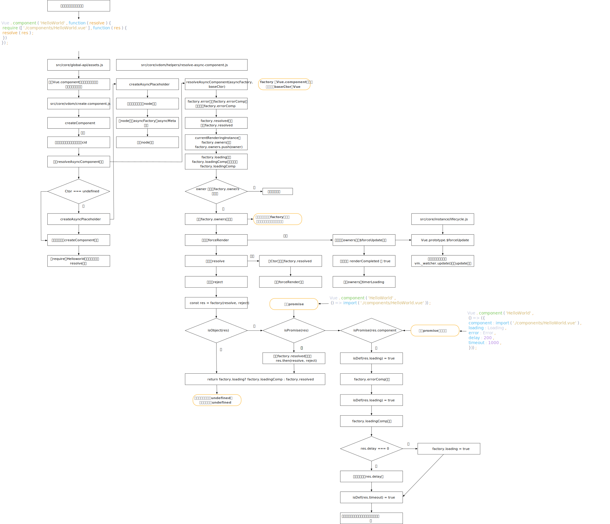

### 总结

1. 异步组件一般是渲染2次以上，第一次是渲染注释节点，当组件加载成功后利用forceRender重新渲染
2. 高级异步组件设计非常巧妙，通过简单配置，实现error，loading，resolve，reject，4种状态

## 深入响应式原理

### 响应式对象

#### 学习

1. 如何将data与props中的属性转为响应式对象的
   - 主要是调用了observe与defineReactive函数
2. data与props属性，设置响应式时，会自动递归调用对象，故即使是嵌套层级的，依旧会被设为响应式
3. 关键的observe与defineReactive方法，学习如何将props与data数据转换为响应式的

#### 流程图

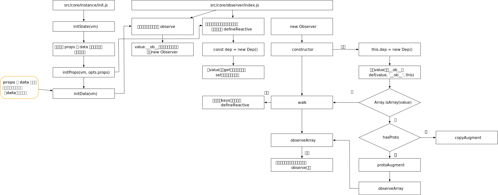


### 依赖收集与派发更新

1. 每个响应式的值都具有一个dep.id,并且dep.subs存储此值的watcher
2. 而每个watcher.deps存储了，哪些值监听了此watcher

#### 问题

1. src/core/observer/scheduler.js 中flushSchedulerQueue会有一个检测循环更新的warning

2. 根据代码逻辑，前面有`has[id]=null`，为何还会出现`has[id]!=null`的情况呢？

   ```html
   <template>
     <div>
       <div>{{msg}}</div>
       <button @click="change">change</button>
     </div>
   </template>
   
   <script>
   export default {
     name: 'hellow-world',
     data() {
       return {
         msg: '123',
       }
     },
     methods: {
       change() {
         this.msg = Math.random();
       }
     },
     watch: {
       msg() {
         this.msg = Math.random();
       }
     }
   }
   </script>
   
   ```

   - 可以在queueWatcher与flushSchedulerQueue增加断点

3. 开始运行，在queue添加的是user Watcher，可以看到此时的watcher.expression=msg，第二次进入时，增加的是vue内部创建的渲染watcher，`watcher.expression="function () {      vm._update(vm._render(), hydrating);    }"`

4. 执行完后，会进入flushSchedulerQueue，循环遍历queue，一个watcher是user watcher，执行watcher.run函数，由于是user watcher，故会执行`this.cb.call(this.vm, value, oldValue)`,`this.msg = Math.random()`，对msg进行赋值操作，故有会调用queueWatcher（加入user watcher与渲染watcher）；由于flushSchedulerQueue会将has[id] =null，flashing=true，故又会往queue插入一个新的user watcher，此时queue.length = 3；而渲染watcher的`has[id]!=null`，不会再加入渲染watcher

5. 由于新的user watcher会插入到queue中，故`if (process.env.NODE_ENV !== 'production' && has[id] != null) `，故`has[id]`不为null，circular[id]++

6. 当queue执行第二次循环时，执行的watcher还是user watcher，即上面插入的watcher，故又重复上面的过程，造成死循环，circular就是避免循环过多次，卡死浏览器

#### 流程图

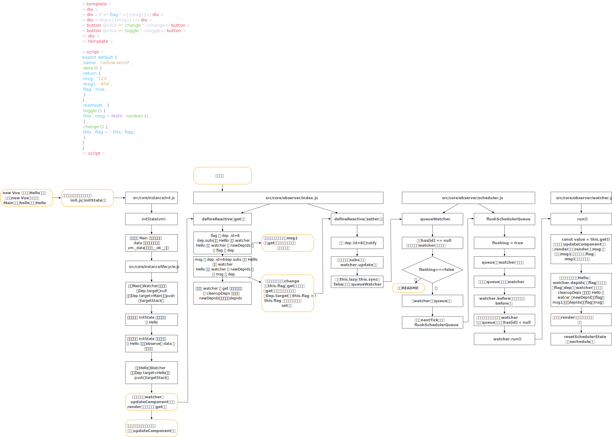

# 问题汇总

1. src/core/vdom/create-element.js的_createElement何种情况会传入data和children

### 问题：为何mounted等可以访问data中定义的数据

1. 这个src/core/instance/init.js的57行，有个initState
2. 进入这个文件`src/core/instance/state.js`
3. initState，告诉我们，会依次初始化props，methods，data，computed，watch
4. 最后通过proxy，将data挂载在vm实例上

