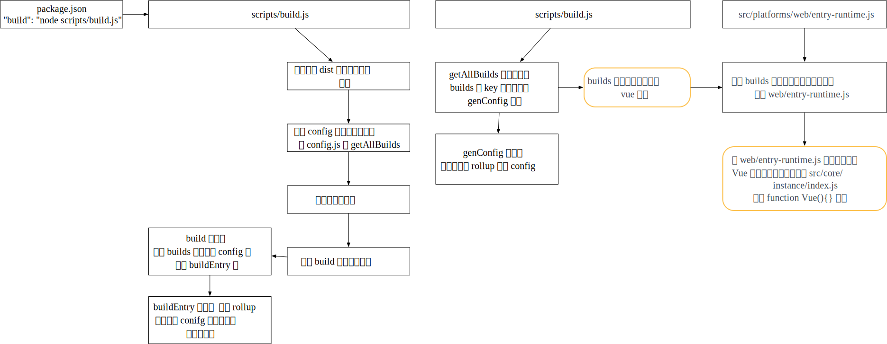

# 学习

## 如何分析源码

1. 没必要像jQuery一样，进行深度遍历的看，这样是比较累的，并且不容易整体把握
2. 可以先跳过一些部分，如响应式原理，等看到响应式原理时，再看这部分代码


# 源码阅读

##  代码构建过程
1. 如何将fs.write封装为promise
   
   - 在`scripts/build.js`的write函数
   
1. 利用\x1b[1m\x1等字符，可以将console的颜色进行更改
   
   - 在`scripts/build.js`的blue，可以使用chalk对console文件进行颜色美化
   
1. 流程图

   
## new Vue阶段
1. 根据构建需要的配置入口文件`scripts/config.js`的builds中的entry，找到`web/entry-runtime.js`，可以逐步向上查找Vue的定义
2. 最终在`src/core/instance/index.js
`找到`function Vue(){}`定义
3. 


1. 
# 内容概述

1. 核心
   - 数据驱动
   - 组件化
   - 响应式原理
2. 编译
   - parse
   - optimize
   - codegen
3. 扩展
   - event、v-model
   - slot、keep-alive
   - transition
4. 生态
   - vue-router
   - vuex

# 准备工作

## 认识Flow

### 概述

1. 静态类型检查，之所以选择Flow是定位Babel和EsLint都有对应的Flow插件以支持语法
2. 可以完全沿用现在的构建配置，非常小的改动就可以让项目拥有静态类型检查的能力

### 常见类型检查方式

1. 类型推断
   - 通过变量的使用上下文推断变量类型，根据这些推断检查类型
2. 类型注释
   - 事先注释好我们期待的类型，Flow会基于这些注释来判断

### vue的使用方式

1. flow提出了libdef的概念，可以识别第三方库或者自定义类型，vue利用了这些特性
2. vue主目录下的`.flowconfig`文件是flow的配置文件
3. 在flow文件夹下，定义了一些自定义类型

## 目录结构

1. compiler：编译相关代码
2. core：核心代码
3. server：服务器相关
4. sfc：可以将单vue文件编译为一个js对象
5. shared：辅助的方法，可以被所有目录共享的辅助方法
6. **思考**：可以将模块拆分非常清楚，在独立的目录下进行维护，方便代码复用，维护性增强，然后使用打包工具将代码合并为一个文件


## 源码构建

1. 基于rollup构建，更适合js库的编译，只负责js，其他如图片等是不管的，更轻量
2. 由于vue也是发布在npm上，故有一个package.json对文件进行描述

### package.json

1. name：唯一的npm名字
2. main：当import vue时，会通过这个main找到入口
3. module：和main是非常类似的
4. scripts：各种构建脚本

## npm build

1. 运行这个时，会调用scripts的build.js函数
2. scripts/build.js函数
3. 主要分析了上述函数的主要构建流程

## 调用import vue做了哪些事情

1. 假设使用runtime+compiler模式，构建出来的js在platforms/entry-runtime-with-compiler.js
2. 向上找，找到主要文件core/index.js
3. **思考**：vue创建并没有使用class，而是利用es5的function，因为vue利用mixin的方式，将不同功能的prototype分散在不同的文件中

# 数据驱动

## 概述

1. 主要是分析，我们在vue中书写如下代码，vue是如何将其渲染为dom的

   ```vue
   <div id="app">
       {{message}}
   </div>
   var app = new Vue({
   	el: '#app',
   	data: {
   		message: 'hello'
   	}
   })
   ```

2. 先不涉及响应式

## new Vue 发生了什么

1. 在src/core/instance/index.js文件中，会调用`this._init(options)`方法
2. 而_init方法的定义是在initMixin中，先看vue是如何处理data的

### 问题：为何mounted等可以访问data中定义的数据

1. 这个src/core/instance/init.js的57行，有个initState
2. 进入这个文件`src/core/instance/state.js`
3. initState，告诉我们，会依次初始化props，methods，data，computed，watch
4. 最后通过proxy，将data挂载在vm实例上

## render函数

## 虚拟Dom
1. 可以在控制台打印dom节点
  ```javascript
    const div = document.createElement('div');
    let str = ''
    for(var key in div){
        str += key;
    }
  ```
  - 可以看到实际的dom会包含很多内容
2. virtual DOM实际是用原生js对象去描述一个DOM节点，比创建一个DOM的代价小的多
  - 不需要包含操作dom的方法
  - 映射到真实DOM实际要经历VNode的create、diff、patch等过程

# 问题汇总
1. src/core/vdom/create-element.js的_createElement何种情况会传入data和children

# 23日
1. 根据`src/core/instance/init.js`可以看出，beforeCreate与create之间主要区别是，会初始化inject，state与provide
1. https://github.com/vuejs/vue/tree/2.6/dist，有各个构建版本含义的介绍
1. 根据`scripts/config.js`，主要是用`src/platforms/web/entry-runtime.js`构建runtime版本，用`src/platforms/web/entry-runtime-with-compiler.js`构建运行与编译版本
# 24日
1. 这两个文件引用的vue文件都来源于`src/platforms/web/runtime/index.js`
1. 而compiler版本多出的代码内容实际是重定义了Vue.prototype.$mount函数