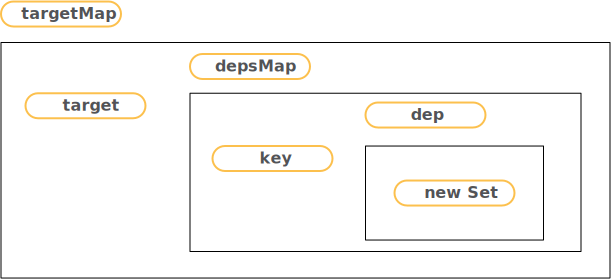

# 概述

1. 对于vue2的实现，vue主流程概括可以分为render部分，以及组件更新后，如何update
2. 看了vue2后，vue3 的代码结构。。简直清晰的令人发狂
3. 


前置准备

1. 实际无需使用vue3仓库源码，直接利用vue create创建vue3的一个demo页即可
2. 为了学习编译过程，需要使用模板，而非使用vue-loader编译后的vue实例，因此可以用如下例子
3. vue默认的js文件是不带编译器的

## 入口

1. vue3 调用方式为

   ```javascript
   import { createApp } from 'vue/dist/vue.esm-bundler.js'
   import HelloWorld from './components/HelloWorld.vue'
   createApp({
       template: `
         
         <HelloWorld msg="Welcome to Your Vue.js App"/>
       `,
     components:  {
       HelloWorld
     },
   }).mount('#app')
   ```

2. vue定义的类型

   - vue在生成vnode时，会对其配置类型shapFlag，定义可参见`packages/shared/src/shapeFlags.ts`；

   - 生成vnode 时 shapFlag 逻辑在：`packages/runtime-core/src/vnode.ts`

     ```typescript
     // type: VNodeTypes | ClassComponent | typeof NULL_DYNAMIC_COMPONENT, 
     // 组件对象，字符串等
     const shapeFlag = isString(type)
         ? ShapeFlags.ELEMENT
         : __FEATURE_SUSPENSE__ && isSuspense(type)
           ? ShapeFlags.SUSPENSE
           : isTeleport(type)
             ? ShapeFlags.TELEPORT
             : isObject(type)
               ? ShapeFlags.STATEFUL_COMPONENT
               : isFunction(type)
                 ? ShapeFlags.FUNCTIONAL_COMPONENT
                 : 0
     ```

     - 一般都是传入对象，为 STATEFUL_COMPONENT 类型（组件）

### 渲染函数

1. createApp函数，首先会构建render

   ```typescript
   export const createApp = ((...args) => {
     // args主要是App，vue实例
     const app = ensureRenderer().createApp(...args)
     const { mount } = app
     app.mount = (containerOrSelector) => {
       // 省略。。。。
       const proxy = mount(container, false, container instanceof SVGElement);
       // 省略。。。。
       return proxy;
     };
   }) as CreateAppFunction<Element>
   
   ```

   - 最终代码执行起点，还是`mount`函数

2. render渲染函数逻辑主要在：`packages/runtime-core/src/renderer.ts` 中的 `baseCreateRenderer`中

   ```typescript
   function baseCreateRenderer(
     options: RendererOptions,
     createHydrationFns?: typeof createHydrationFunctions
   ): any {
   	// x省略。。。。。
     return {
       render,
       hydrate,
       // hydrate赢与
       createApp: createAppAPI(render, hydrate)
     }
   }
   ```

3. 进入mount函数

   ```typescript
   mount(
     rootContainer: HostElement,
     isHydrate?: boolean,
     isSVG?: boolean
   ): any {
     if (!isMounted) {
       const vnode = createVNode(
         rootComponent as ConcreteComponent,
         rootProps
       )
   		// 省略。。。
       // 服务器渲染相关
       if (isHydrate && hydrate) {
         hydrate(vnode as VNode<Node, Element>, rootContainer as any)
       } else {
         // 浏览器
         render(vnode, rootContainer, isSVG)
       }
       isMounted = true
       app._container = rootContainer
   
       return vnode.component!.proxy
     }
   },
   ```

   - 将传参数转换为vnode

   - 执行render函数，上述2中定义的

     ```typescript
     const render: RootRenderFunction = (vnode, container, isSVG) => {
       if (vnode == null) {
         if (container._vnode) {
           unmount(container._vnode, null, null, true)
         }
       } else {
         patch(container._vnode || null, vnode, container, null, null, null, isSVG)
       }
       flushPostFlushCbs()
       container._vnode = vnode
     }
     ```

4. 进入patch函数

   ```typescript
   const patch: PatchFn = (
     n1,
     n2,
     container,
     anchor = null,
     parentComponent = null,
     parentSuspense = null,
     isSVG = false,
     slotScopeIds = null,
     optimized = false
   ) => {
     // 省略。。
     const { type, ref, shapeFlag } = n2
     switch (type) {
       case Text:
         processText(n1, n2, container, anchor)
         break
       case Comment:
         processCommentNode(n1, n2, container, anchor)
         break
       case Static:
         if (n1 == null) {
           mountStaticNode(n2, container, anchor, isSVG)
         } else if (__DEV__) {
           patchStaticNode(n1, n2, container, isSVG)
         }
         break
       case Fragment:
         processFragment()
         break
       default:
         if (shapeFlag & ShapeFlags.ELEMENT) {
           processElement()
         } else if (shapeFlag & ShapeFlags.COMPONENT) {
           processComponent()
         } else if (shapeFlag & ShapeFlags.TELEPORT) {
           ;(type as typeof TeleportImpl).process( )
         } else if (__FEATURE_SUSPENSE__ && shapeFlag & ShapeFlags.SUSPENSE) {
           ;(type as typeof SuspenseImpl).process()
         }
     }
   }
   ```

   - `patch`即，根据vnode，n1与n2 ，根据不同type与shapeFlag，执行不同processxxxxx函数，对内容进行更改；
   - 根据[人口](# 入口)的例子的入参，会执行`processComponent`

#### 创建vnode

1. vnode的type与shapFlag会绝对`patch`函数中的流转过程

2. `createVNode` 默认会执行`_createVNode`

   ```typescript
   function _createVNode(
   type: VNodeTypes | ClassComponent | typeof NULL_DYNAMIC_COMPONENT,
    props: (Data & VNodeProps) | null = null,
    children: unknown = null,
    patchFlag: number = 0,
    dynamicProps: string[] | null = null,
     isBlockNode = false
   ): VNode {
   	// 如果是vnode，进行clone并返回
     if (isVNode(type)) {
       // 省略。。。
       return cloned
     }
   
     // class component normalization.
     if (isClassComponent(type)) {
       type = type.__vccOpts
     }
   
     // class & style normalization.
     if (props) {
       // 省略。。。
       // 主要是重新处理props.style与props.class
     }
   
     const shapeFlag = isString(type)
       ? ShapeFlags.ELEMENT
       : __FEATURE_SUSPENSE__ && isSuspense(type)
         ? ShapeFlags.SUSPENSE
         : isTeleport(type)
           ? ShapeFlags.TELEPORT
           : isObject(type)
             ? ShapeFlags.STATEFUL_COMPONENT
             : isFunction(type)
               ? ShapeFlags.FUNCTIONAL_COMPONENT
               : 0
   
     const vnode: VNode = {
       __v_isVNode: true,
       __v_skip: true,
       type,
       props,
       key: props && normalizeKey(props),
       ref: props && normalizeRef(props),
       scopeId: currentScopeId,
       staticCount: 0,
       shapeFlag,
       patchFlag,
       dynamicProps,
       // 省略一些
     }
   	// normal children
     normalizeChildren(vnode, children)
   
     return vnode
   }
   ```

   - 因此，vnode的type，即原始传入参数，如对象，string等；而`shapeFlag`是vue根据type转换的值（用于类型区分）

3. 特别注意，创建vnode的同时，会对children进行normalize

   ```typescript
   export function normalizeChildren(vnode: VNode, children: unknown) {
     let type = 0
     const { shapeFlag } = vnode
     if (children == null) {
       children = null
     } else if (isArray(children)) {
       type = ShapeFlags.ARRAY_CHILDREN
     } else if (typeof children === 'object') {
       // 省略。。。
     } else if (isFunction(children)) {
       children = { default: children, _ctx: currentRenderingInstance }
       type = ShapeFlags.SLOTS_CHILDREN
     } else {
       children = String(children)
       if (shapeFlag & ShapeFlags.TELEPORT) {
         type = ShapeFlags.ARRAY_CHILDREN
         children = [createTextVNode(children as string)]
       } else {
         type = ShapeFlags.TEXT_CHILDREN
       }
     }
     vnode.children = children as VNodeNormalizedChildren
     vnode.shapeFlag |= type
   }
   ```

   - 关键是为`vnode.children`增加一些属性
   - 特别注意：children的ShapeFlags会影响当前`vnode.shapeFlag`

#### 小结

1. `patch`作为关键的中间函数，会根据类型执行不同的`processXXXX`
2. vnode的type，即原始传入参数，如对象，string等；
3. `shapeFlag`是vue根据type转换的值（用于类型区分）
4. `patchFlag`(packages/shared/src/patchFlags.ts)，是编译时，如果具有动态class，style等动态模块，增加的标识


## 挂载过程

### processElement 

1. 首先看下，最简单的元素挂载过程
2. 最终，都会是元素挂载

#### mountElement 

1. 根据vnode创建元素:`vnode.el = hostCreateElement()`（就是createElement的包装）
2. 处理当前vnode的children => 挂载text，或 执行`mountChildren`循环处理子vnode
3. 执行【自定义指令created钩子】
4. 将props（attr，class等）全部绑定到el上
5. 执行【自定义指令beforeMount钩子】
6. 利用`insertBefore`将dom插入到`container(父级el)`
7. 执行【自定义指令mounted钩子】


### processComponent

1. 会根据n1是否存在，会执行`mountComponent`或`updateComponent`

#### mountComponent

1. 执行【createComponentInstance】 构建`instance`
   - vue2会将全部内容挂载在`new Vue`实例上，vue3会将内容挂载在此`instance`上
   - 内部会` resolved props and emits options`
2. 执行【setupComponent】
   - `initProps与initSlots`
   - 如配置了`setup`函数，执行setup获得结果（这里同时兼容了setup为promise情况） => setupResult
   - 执行【handleSetupResult】处理 setupResult，挂载在instance某个key上
     - 如setupResult是函数，直接将结果 => `instance.render = setupResult`
     - 如果是对象 => `instance.setupState = proxyRefs(setupResult)`
   - 执行【finishComponentSetup】
     - 如`instance.render`不存在，则会调用`compile`函数获取render函数
3. 执行【setupRenderEffect】


#### setupRenderEffect

1. 主要是配置`instance.updatae`方法

   ```typescript
   const setupRenderEffect: SetupRenderEffectFn = (){
     instance.update = effect(function componentEffect(){}, prodEffectOptions)
   }
   ```

   - effect函数
     - 会对传入fn进行包装，fn配置一些如deps,_isEffect等属性
     - 将fn，push到effectStack中
     - 默认会执行fn，即执行 `componentEffect`函数
     
   - 注意参数prodEffectOptions

     ```typescript
     const prodEffectOptions = {
       scheduler: queueJob,
       allowRecurse: true
     }
     ```

     - effect函数，以及scheduler会在响应式原理时用到

2. `componentEffect`函数内部，梳理下挂载流程（即：`!instance.isMounted`）

   - 执行【beforeMount 】钩子 => vue3 会执行两种钩子`beforeMount hook`和`onVnodeBeforeMount`
   - 执行【renderComponentRoot】=> 获取`instance.subTree`
   - 执行【patch】 => `patch(null, subTree.....)`
     - 一般children为` Fragment（isArray(child)）`，故会执行[processFragment](#processFragment)
   - 执行【mounted】钩子


#### renderComponentRoot

1. 执行【instance.render】 获得 result
   - `instance.render`可以简单理解为，内部执行`_createVnode`
   - 获取result过程中，会执行【normalizeVNode】为result确定vnode类型，
2. 处理`vnode.dirs`
3. 处理`vnode.transition`
4. 返回result


#### 小结

1. processComponent的mount过程
   - 初始化props与slot
   - 执行setup函数
   - 通过compile 获取render函数
   - 执行render函数获取subTree（vnode）
   - 执行patch函数 => processFragment


### processFragment

1. Fragments 是vue3新支持的，可以有多个root nodes
   - 多个根，不会自动绑定$attrs
2. `n1 == null`，processComponent，挂载过程
   - 执行【mountChildren】

#### mountChildren

1. 循环`children`，执行【`patch(null, child)`】

   


## 更新过程

1. 先不考虑是如何触发更新，举例，对于如下

   ```html
   <button @click="hello = 'asdasklfdjfsdajlk;safd;ljkafsd;lkjf'">{{hello}}</button>
   ```

   - 点击，按钮，会改变文案，会触发`instance.update`方法

### setupRenderEffect

1. 梳理下更新流程，即`instance.isMounted`
2. 执行【beforeUpdate】钩子
3. 执行【renderComponentRoot】获得 nextTree
4. 执行【`patch(prevTree, nextTree)`】
   - 执行【processFragment】，由于n1 不为null，故执行`patchBlockChildren`
5. 执行【updated】钩子


patchBlockChildren

1. The fast path for blocks.
2. 循环children
3. 确定container => 主要是使用old.el  的 parent
4. 执行【`patch(oldVnode, newVnode)`】


### patchElement

1. 对于`FULL_PROPS(用户clone的vnode)`或如`optimized = false`等情况，执行【patchProps】进行 full diff
2. 否则，会根据patchFlag，对Class，style，props(非class与style的动态绑定)，执行【hostPatchProp】
3. 处理`children`，执行【patchBlockChildren】或【patchChildren】(full diff)

#### 补充

1. `mountChildren`

   - 循环vnode，执行`patch`函数

2. `patchProps`与`hostPatchProp`的区别，为何前一个是full diff

   - `patchProps`，实际是只要`oldProps !== newProps`，会循环每个prop，执行`hostPatchProp`

   - `hostPatchProp` -> `packages/runtime-dom/src/patchProp.ts` 会根据class，style等key，精准替换

     ```typescript
     export const patchProp: DOMRendererOptions['patchProp'] = () => {
       switch (key) {
           // special
         case 'class':
           patchClass(el, nextValue, isSVG)
           break
         case 'style':
           patchStyle(el, prevValue, nextValue)
           break
         default:
           if (isOn(key)) {
             // ignore v-model listeners
             if (!isModelListener(key)) {
               patchEvent(el, key, prevValue, nextValue, parentComponent)
             }
           } else if (shouldSetAsProp(el, key, nextValue, isSVG)) {
             patchDOMProp()
           } else {
             if (key === 'true-value') {
               ;(el as any)._trueValue = nextValue
             } else if (key === 'false-value') {
               ;(el as any)._falseValue = nextValue
             }
             patchAttr(el, key, nextValue, isSVG, parentComponent)
           }
           break
       }
     }
     ```

     - 直接根据`patchFlag`，执行`hostPatchProp`，必然减少了不必要的属性遍历


### updateComponent

1. 判断是否需要更新（shouldUpdateComponent）
2. 不需要更新，则直接把n1的属性赋值到n2上即可
3. 需要更新，直接执行`instance.update`


#### shouldUpdateComponent

1. 注意一点：`patchFlag`是编译时打的标，表示当前class或style或某些部分是动态的

2. 主要是对props与children进行比较

3. `optimized = true时`（无children比较）

   - 如果是`PatchFlags.DYNAMIC_SLOTS` => true
   - 会对prevProps与nextProps，做详细对比，根据不同的shapFlag进行处理（包括判断emits）

4. 否则

   - 只简单的判断`prevProps与nextProps`

   - 简单判断children

     ```typescript
     if (prevChildren || nextChildren) {
       if (!nextChildren || !(nextChildren as any).$stable) {
         return true
       }
     }
     ```

     


# 编译

1. 在mountComponent->finishComponentSetup，会执行compile函数进行编译

   ```typescript
   Component.render = compile(template, finalCompilerOptions);
   ```

   

## compileToFunction

1. packages/vue/src/index.ts
2. 正常template为字符串，也可为 `{nodeType: true, innerHTML: ''}`
3. 缓存template（字符串为key）
4. 执行【compile】函数，获取code
   - options，主要传入onError，onWarn，hoistStatic: true
5. 构造【render】函数 => new Function(code)
6. 设置运行时编译标记`render._rc = true`
7. 返回 render函数


## compile

```typescript
export function compile(
  template: string,
  options: CompilerOptions = {}
): CodegenResult {
  return baseCompile(
    template,
    {.....}
  )
}
```

- 主要是扩展了一下options，如parserOptions
- 而`baseCompile`主要逻辑是
  - 执行【baseParse】，获得AST
  - 执行【transform】
  - 最后执行【generate】


### baseParse

1. 解析原理与vue2类似，主要是遍历template（即html文本），将文本转为对象，类似于

   ```html
   <button @click="hello = 'asdasklfdjfsdajlk;safd;ljkafsd;lkjf'">{{hello}}</button>
   ```

   ```typescript
   op = {
     children: [],
     codegenNode: undefined,
     isSelfClosing: false,
     loc: {start: {…}, end: {…}, source: "<hello-world :msg='hello'></hello-world>"},
     ns: 0,
     props: [{
       arg: {type: 4, content: "msg", isStatic: true, constType: 3, loc: {…}},
       exp: {type: 4, content: "hello", isStatic: false, constType: 0, loc: {…}},
       loc: {start: {…}, end: {…}, source: ":msg='hello'"},
       modifiers: []
       name: "bind",
       type: 7,
     }],
     tag: "hello-world",
     tagType: 1,
     type: 1,
   }
   ```

2. 整个template按照普通的html进行解析为树，把无论是指令还是组件，都解析为tag，props，children，tagName等结构，


### transform

1. 执行【traverseNode】
2. 执行【hoistStatic】 => 暂略
3. 执行【createRootCodegen】 => 暂略
4. 最最关键的是增加patchFlag


#### traverseNode

1. 循环执行【nodeTransforms】，主要定义在packages/compiler-core/src/transforms文件夹

   - 通过不同函数，处理如v-if，v-show，slot等等
   - 值得注意的一点是，函数执行结果，是一个函数
   - 因此这个循环，主要是为了过滤出当前需要使用的transform函数（push到`exitFns`数组中），每次执行traverseNode会重新过滤

2. 根据不同`node.type`

   - 执行【context.helper】=> 定义在`createTransformContext`中

     ```typescript
     helper(name) {
       // helpers: new Map(),
       const count = context.helpers.get(name) || 0
       context.helpers.set(name, count + 1)
       return name
     },
     ```

   - 或递归执行traverseNode

   - 或执行traverseChildren，循环children，执行traverseNode

3. 循环执行【exitFns】数组，即transform函数

   - 大致看了下，主要是node配置codegenNode，会带有patchFlag（用于生成代码）


### generate

1. 主要是通过ast转换为代码，主要是拼接字符串
2. 如果`ast.codegenNode`存在，会执行【genNode】，会根据`node.type`的不同执行不同的`genXXXXXXXXX`


## 小结

### 编译核心步骤

1. Vue2编译的核心3函数parse，optimize，generate，optimize主要是标记静态节点，即node.static与node.staticRoot，并不会关系属性等是否静态
2. vue3在tranform过程中对node标记patchFlag，可以更细力度判断是否静态

### 处理v-if，v-for

1. Vue2都是在parse过程中，在解析html中（src/compiler/parser/index.js的parseHTML的start函数中），遇到就会处理（如删除v-if标记，在`el.if`绑定v-if后面的表达式等等）
2. vue3的parse仅仅是解析与标记，将信息标记在解析对象上，处理全部在transform函数中，通过`options.nodeTransforms`传入处理函数，处理v-for，v-if等


# 响应式原理

1. vue2使用`Object.defineProperty`实现，利用wather，实现依赖依赖与派发更新
2. vue3使用proxy，直接劫持


## reactive

1. 与reactive相关的函数有3个，如下：
   - reactive
   - shallowReactive：不执行嵌套对象的深度响应式转换 
   - readonly：只读代理
2. 这3个函数都会执行【createReactiveObject】，只是传入的handlers不同


### reactive实现逻辑

```typescript
export function reactive(target: object) {
  // if trying to observe a readonly proxy, return the readonly version.
  if (target && (target as Target)[ReactiveFlags.IS_READONLY]) {
    return target
  }
  return createReactiveObject(
    target,
    false,
    mutableHandlers,
    mutableCollectionHandlers,
    reactiveMap
  )
}
```


#### createReactiveObject内部逻辑

```typescript
function createReactiveObject(
target: Target,
 isReadonly: boolean,
 baseHandlers: ProxyHandler<any>,
 collectionHandlers: ProxyHandler<any>,
 proxyMap: WeakMap<Target, any>
) {
  // 1、reactive传入的target需要是对象
  if (!isObject(target)) {
    if (__DEV__) {
      console.warn(`value cannot be made reactive: ${String(target)}`)
    }
    return target
  }
  // 2、对于target is already a Proxy, return it.
  if (
    target[ReactiveFlags.RAW] &&
    !(isReadonly && target[ReactiveFlags.IS_REACTIVE])
  ) {
    return target
  }
  // 3、有缓存直接使用缓存
  const existingProxy = proxyMap.get(target)
  if (existingProxy) {
    return existingProxy
  }
  // 4、只有白名单的target值才能被监听，如Set，WeakMap等是不可被监听的
  const targetType = getTargetType(target)
  if (targetType === TargetType.INVALID) {
    return target
  }
  // 5、使用proxy代理target
  const proxy = new Proxy(
    target,
    targetType === TargetType.COLLECTION ? collectionHandlers : baseHandlers
  )
  proxyMap.set(target, proxy)
  return proxy
}
```

1. 先看最基本情况，target为普通值时，会执行baseHandlers（实际传入参数是mutableHandlers）

   ```typescript
   const get = /*#__PURE__*/ createGetter()
   const set = /*#__PURE__*/ createSetter()
   export const mutableHandlers: ProxyHandler<object> = {
     get, // const get = /*#__PURE__*/ createGetter()
     set,
     deleteProperty,
     has,
     ownKeys
   }
   ```

   - 主要是配置proxy的handler

   - get与set，绑定的是createGetter与createSetter返回的函数

     ```typescript
     function createGetter(isReadonly = false, shallow = false) {
      	// const state = reactive({}), reactive的对象即为target
       // 当使用 `state.hello`，时，执行get函数的 key为 hello
       return function get(target: Target, key: string | symbol, receiver: object) {}
     }
     ```

#### get函数逻辑

1. 当页面存在取值操作时，会执行 【get】 函数， 主要逻辑

   - 获取`res = target[key]`
   - 执行【`track(target, "get", key)`】，参见：[track函数](# track函数)
   - 根据不同情况，返回结果（如是ref，则返回res.value等）

#### set函数逻辑

1. 当设置值时，会执行【set】函数，主要逻辑是
   - 将oldValue与value转为Raw值
   - 执行【trigger】函数


#### 小结

1. 由于基本类型值，使用reactive是无法保留响应式的，故reactive，会优先判断传数据是否为Object
2. 特别注意：reactive的getter函数，默认情况下，会递归调用reactive，将全部值进行依赖收集


### track函数

1. 回想下vue2的get函数，主要是做依赖收集的，即将实例与当前数据进行绑定，用于之后的派发更新

2. 主要逻辑是：

   - 构建【targetMap】缓存数据

     

   - 【`activeEffect.deps.push(dep)`】：建立activeEffect与dep之间关系

3. 何为activeEffect

   - 在[mountComponent](#mountComponent)阶段，会执行`setupRenderEffect`，构造`instance.update`时，会执行effect函数

     ```typescript
     export function effect<T = any>(
       fn: () => T,
       options: ReactiveEffectOptions = EMPTY_OBJ
     ): ReactiveEffect<T> {
       // fn._isEffect === true
       if (isEffect(fn)) {
         fn = fn.raw
       }
       // 构建effect函数，并为effect绑定一些属性
       const effect = createReactiveEffect(fn, options)
       // lazy未配置，会执行
       if (!options.lazy) {
         effect()
       }
       return effect
     }
     ```

   - 由于一般options.lazy未配置，会执行effect 函数(createReactiveEffect内部定义的函数)

     ```typescript
     const effect = function reactiveEffect(): unknown {
       if (!effect.active) {
         return fn()
       }
       if (!effectStack.includes(effect)) {
         // 循环全部effect.deps数组，清除effect
         cleanup(effect)
         try {
           enableTracking()
           // 设置当前的effect为activeEffect
           effectStack.push(effect)
           activeEffect = effect
           return fn()
         } finally {
           effectStack.pop()
           resetTracking()
           activeEffect = effectStack[effectStack.length - 1]
         }
       }
     } as ReactiveEffect
     ```

   - 感觉：每个组件构造一个effect，相当于vue2的组件实例

4. 小结

   - track函数主要是用targetMap缓存target数据
   - 在effect函数上绑定dep


### trigger函数

1. 主要逻辑分为：

   - vue3对于trigger会有4种情况，clear\add\delete\set，先会根据情况提取effect函数
   - 

2. 举例一：对`state.show = true`赋值，伪代码

   ```typescript
   function trigger() {
     const effects = new Set<ReactiveEffect>()
     // add函数，即循环effectsToAdd，将effect函数添加到局部变量effects中
     const add = (effectsToAdd，: Set<ReactiveEffect> | undefined) => {
       if (effectsToAdd) {
         effectsToAdd.forEach(effect => {
           if (effect !== activeEffect || effect.allowRecurse) {
             effects.add(effect)
           }
         })
       }
     }
     if (key !== void 0) {
       add(depsMap.get(key)) // depsMap.get(key) ===> key对应的dep数组
     }
   
     const run = (effect: ReactiveEffect) => {
       // 参见 setupRenderEffect
       if (effect.options.scheduler) {
         effect.options.scheduler(effect)
       } else {
         effect()
       }
     }
     // 执行run函数
     effects.forEach(run)
   }
   ```

   - 即每个effect函数执行run函数，由于在[setupRenderEffect](#setupRenderEffect)配置了scheduler，故会使用队列方式执行（scheduler.ts中的queueJob）函数，
   - 即effect函数会在一个tick执行，由于effect函数最终执行的还是`instance.update`，进行组件

小结

1. 因此整个依赖收集就是：先记录更新函数`effect(instance.update)`
2. 当设置值时，找到key对应的effect函数， 执行函数


### shallowReactive

1. 整体流程和reactive是基本一致的，只是`createReactiveObject`会传入`shallowReactiveHandlers`，get与set方法使用的是带参数的`createGetter(false,true)`

2. 实际调用方法还是一样，只是通过不同参数，区别了shallow与readOnly

3. getter函数

   ```typescript
   if (!isReadonly) {
     track(target, TrackOpTypes.GET, key)
   }
    
   if (shallow) {
     return res
   }
   if (isObject(res)) {
     return isReadonly ? readonly(res) : reactive(res)
   }
   ```

   - 可以看到，如果是shallow，则直接返回res，不再对res进行reactive


## ref

1. 一个独立的原始值 (例如，一个字符串)，想让它变成响应式的简单方法，也可以`reactive({ a: ''})`

2. 源码：

   ```typescript
   export function ref(value?: unknown) {
     return createRef(value)
   }
   
   function createRef(rawValue: unknown, shallow = false) {
     if (isRef(rawValue)) {
       return rawValue
     }
     return new RefImpl(rawValue, shallow)
   }
   ```

   

### RefImpl

```typescript
class RefImpl<T> {
  // 声明内部属性值
  private _value: T
  // 表明是ref值
  public readonly __v_isRef = true
  // shallow，则直接返回rawValue，否则如果是对象使用reactive转换值
  constructor(private _rawValue: T, public readonly _shallow = false) {
    this._value = _shallow ? _rawValue : isObject(_rawValue) ? reactive(_rawValue) : val
  }

  get value() {
    track(toRaw(this), TrackOpTypes.GET, 'value')
    return this._value
  }

  set value(newVal) {
    if (hasChanged(toRaw(newVal), this._rawValue)) {
      this._rawValue = newVal
      this._value = this._shallow ? newVal : convert(newVal)
      trigger(toRaw(this), TriggerOpTypes.SET, 'value', newVal)
    }
  }
}
```

1. get执行是：track是整个RefImpl对象
2. set执行则是，将新值绑定到RefImpl对象上，然后进行trigger
3. 实际，ref的本质就是在基本类型值外面套了个对象，然后使用reactive增加响应式


### toRef

1. 为响应式对象上的 property创建一个 ref，主要可能是用于传递响应式；

   ```typescript
   const state = reactive({
     foo: 1,
     bar: 2
   })
   // 想将bar传递给下个函数。
   test(toRef(state, 'bar'))
   ```

   - 正常，如果想保留响应式，可以直接传state到函数中，然后调用

2. toRef相当于对此进行了包装

   ```typescript
   export function toRef<T extends object, K extends keyof T>(
     object: T,
     key: K
   ): ToRef<T[K]> {
     return isRef(object[key])
       ? object[key]
       : (new ObjectRefImpl(object, key) as any)
   }
   
   class ObjectRefImpl<T extends object, K extends keyof T> {
     public readonly __v_isRef = true
     constructor(private readonly _object: T, private readonly _key: K) {}
     get value() {
       return this._object[this._key]
     }
     set value(newVal) {
       this._object[this._key] = newVal
     }
   }
   ```

   - toRef的返回值实际是，ObjectRefImpl对象，实际是缓存了state引用
   - 如`a = toRef(state, 'a')`，对a的赋值，实际会被转为对`state.a`的赋值

### toRefs

1. toRef是将响应式对象的某个property转换为ref，此函数，则是将整个响应式对象的全部property转为ref

   ```typescript
   export function toRefs<T extends object>(object: T): ToRefs<T> {
     if (__DEV__ && !isProxy(object)) {
       console.warn(`toRefs() expects a reactive object but received a plain one.`)
     }
     const ret: any = isArray(object) ? new Array(object.length) : {}
     for (const key in object) {
       ret[key] = toRef(object, key)
     }
     return ret
   }
   ```

   

## computed

1. 对外暴露的函数在：packages/runtime-core/src/apiComputed.ts

   ```typescript
   import {
     computed as _computed,
   } from '@vue/reactivity'
   export function computed<T>(
     getterOrOptions: ComputedGetter<T> | WritableComputedOptions<T>
   ) {
     const c = _computed(getterOrOptions as any)
     recordInstanceBoundEffect(c.effect)
     return c
   }
   ```

2. 在packages/reactivity/src/computed.ts中的源码

   ```typescript
   export function computed<T>(
     getterOrOptions: ComputedGetter<T> | WritableComputedOptions<T>
   ) {
     let getter: ComputedGetter<T>
     let setter: ComputedSetter<T>
   
     if (isFunction(getterOrOptions)) {
       getter = getterOrOptions
       setter = __DEV__
         ? () => {
             console.warn('Write operation failed: computed value is readonly')
           }
         : NOOP
     } else {
       getter = getterOrOptions.get
       setter = getterOrOptions.set
     }
   
     return new ComputedRefImpl(
       getter,
       setter,
       isFunction(getterOrOptions) || !getterOrOptions.set
     ) as any
   }
   ```

   - 兼容computed的两种使用方式，返回 ComputedRefImpl 实例

3. set操作：直接调用setter函数

   ```typescript
   set value(newValue: T) {
     this._setter(newValue)
   }
   ```

4. constructor中，由于lazy为true，故effect函数不会首次执行

   ```typescript
   constructor(
     getter: ComputedGetter<T>,
     private readonly _setter: ComputedSetter<T>,
     isReadonly: boolean
   ) {
     this.effect = effect(getter, {
       lazy: true,
       scheduler: () => {
         if (!this._dirty) {
           this._dirty = true
           trigger(toRaw(this), TriggerOpTypes.SET, 'value')
         }
       }
     })
   
     this[ReactiveFlags.IS_READONLY] = isReadonly
   }
   ```

   - effect的cheduler参数，实际会在track函数中起作用

5. get 函数

   ```typescript
   get value() {
     // the computed ref may get wrapped by other proxies e.g. readonly() #3376
     const self = toRaw(this)
     if (self._dirty) {
       self._value = this.effect()
       self._dirty = false
     }
     track(self, TrackOpTypes.GET, 'value')
     return self._value
   }
   ```

   - 当执行get时，会执行effect函数，获取实际的值，并对self进行track；
   - `self._dirty`只有在依赖发生改变时，会设为false，故多次取值，并不会重新执行effect函数；

### 举例说明

```typescript
setup() {
  const test = reactive({
    a: 1,
  })
  const a = computed(() => {
    return 1 + test.a;
  })
  setTimeout(() => {
    test.a++;
  },3000)
  return {
    a,
  }
}
```

1. reactive函数会对test.a 进行proxy，get时进行依赖收集，set时，进行triiger触发；

   - 特别注意：未取值操作，并不会进行依赖收集

2. `computed`返回的也是 `new ComputedRefImpl`实例

3. 只有在使用计算属性【a】时，才会调用computed的getter函数

   - 执行`this.effect`函数，即执行`computed`传入的getter函数：`1 + test.a`
   - 由于执行`test.a`，会执行reactive的getter函数，即：`track(target, type, key)`
     - 因为此时的`activeEffect`函数，实际是computed的effect函数；
   - 对computed本身进行track： `track(self, 'get', 'value')`

4. 当定时器执行`test.a ++ `时，进行派发更新（会先test.a 进行取值操作），执行trigger函数

   ```typescript
   // trigger函数有这样逻辑
   const run = (effect) => {
     if (effect.options.scheduler) {
       effect.options.scheduler(effect);
     }
     else {
       effect();
     }
   };
   ```

   - 由于computed的effect函数自定义了scheduler，会执行computed的scheduler
   - 执行派发更新

   

### 问题

1. 为何多次调用computed，不会计算值
   - 只要依赖未变化，this.effect 函数的`scheduler` 不会执行，`self._dirty`一直为false
   - 所以多次调用，不会执行；只有依赖发生变化后，再取值时，才会重新计算


## watch

1. 对外暴露函数在：packages/runtime-core/src/apiWatch.ts

2. watch监听方式

   ```typescript
   // 侦听一个getter
   const state = reactive({ count: 0 })
   watch(
     () => state.count,
     (count, prevCount) => {
       /* ... */
     }
   )
   
   // 直接侦听一个ref
   const count = ref(0)
   watch(count, (count, prevCount) => {
     /* ... */
   })
   // 侦听多个源
   watch([fooRef, barRef], ([foo, bar], [prevFoo, prevBar]) => {
     /* ... */
   })
   ```

源码

1. 主逻辑在doWatch中，根据watch监听方式，首先需要处理source

   ```typescript
   if (isRef(source)) {
     getter = () => (source as Ref).value
     forceTrigger = !!(source as Ref)._shallow
   } else if (isReactive(source)) {
     getter = () => source
     deep = true
   } else if (isArray(source)) {
     isMultiSource = true
     forceTrigger = source.some(isReactive)
     getter = () =>
     source.map(s => {
       if (isRef(s)) {
         return s.value
       } else if (isReactive(s)) {
         return traverse(s)
       } else if (isFunction(s)) {
         return callWithErrorHandling(s, instance, ErrorCodes.WATCH_GETTER)
       } else {
         __DEV__ && warnInvalidSource(s)
       }
     })
   } else if (isFunction(source)) {
     if (cb) {
       // getter with cb
       getter = () =>
       callWithErrorHandling(source, instance, ErrorCodes.WATCH_GETTER)
     } else {
       // no cb -> simple effect
       getter = () => {
         if (instance && instance.isUnmounted) {
           return
         }
         if (cleanup) {
           cleanup()
         }
         return callWithAsyncErrorHandling(
           source,
           instance,
           ErrorCodes.WATCH_CALLBACK,
           [onInvalidate]
         )
       }
     }
   } else {
     getter = NOOP
     __DEV__ && warnInvalidSource(source)
   }
   ```

   - 主要是根据不同类似ref，reactive，函数，数组（内容可以是ref，reactive或函数），获得 `getter` 函数

2. Watch本质是需要，将cb函数加入到source的依赖跟踪中，保证当source发生变化，可以触发cb函数

   ```typescript
   // 构造getter函数的effet函数
   const runner = effect(getter, {
     lazy: true,
     onTrack,
     onTrigger,
     scheduler
   })
   
   recordInstanceBoundEffect(runner, instance)
   
   // initial run
   if (cb) {
     if (immediate) {
       job()
     } else {
       oldValue = runner()
     }
   } else if (flush === 'post') {
     queuePostRenderEffect(runner, instance && instance.suspense)
   } else {
     runner()
   }
   ```

   - 以非immediate为例，会执行runner函数，即执行getter函数，如watch函数为：

     ```typescript
     const test = reactive({
       a: 1,
     })
     watch(
       () => test.a,
       () => {
         console.log('fasdfasdfasdf');
       },
     )
     ```

   - 执行getter函数时，会执行`test.a`，对a进行取值，进行依赖收集；此时的a的effect函数就是watch函数里面定义的

   - 执行结束

3. 当test.a值发生改变时，会触发effect函数定义的scheduler，默认情况会执行job函数

   ```typescript
   let scheduler: ReactiveEffectOptions['scheduler']
   if (flush === 'sync') {
     scheduler = job as any // the scheduler function gets called directly
   } else if (flush === 'post') {
     scheduler = () => queuePostRenderEffect(job, instance && instance.suspense)
   } else {
     // default: 'pre'
     scheduler = () => {
       if (!instance || instance.isMounted) {
         queuePreFlushCb(job)
       } else {
         // with 'pre' option, the first call must happen before
         // the component is mounted so it is called synchronously.
         job()
       }
     }
   ```

4. 【job函数】，实际就是执行cb函数

   ```typescript
     let oldValue = isMultiSource ? [] : INITIAL_WATCHER_VALUE
     const job: SchedulerJob = () => {
       if (!runner.active) {
         return
       }
       if (cb) {
         // watch(source, cb)
         // 执行runner，获取source的最新值
         const newValue = runner()
         if (
           deep ||
           forceTrigger ||
           (isMultiSource
             ? (newValue as any[]).some((v, i) =>
                 hasChanged(v, (oldValue as any[])[i])
               )
             : hasChanged(newValue, oldValue)) ||
           (__COMPAT__ &&
             isArray(newValue) &&
             isCompatEnabled(DeprecationTypes.WATCH_ARRAY, instance))
         ) {
           if (cleanup) {
             cleanup()
           }
           // 执行cb函数
           callWithAsyncErrorHandling(cb, instance, ErrorCodes.WATCH_CALLBACK, [
             newValue,
             oldValue === INITIAL_WATCHER_VALUE ? undefined : oldValue,
             onInvalidate
           ])
           oldValue = newValue
         }
       } else {
         // watchEffect
         runner()
       }
     }
   ```


小结

1. watch函数的source需要是ref，reactive或函数
   - Ref,reactive，在watch内部会转为取值操作，会执行依赖收集
   - 因此，函数如果并非处理响应式数据，改变并不会触发watch函数，因为未触发依赖收集
2. watch函数与依赖收集建立连接
   - 在执行souce的getter函数时，依赖收集时的effect函数为watch定义的函数
   - 定义effect函数的`scheduler`函数，在执行effect函数时，会执行scheduler函数（即自定义逻辑）


# Provide/inject

1. packages/runtime-core/src/apiInject.ts

使用概述

1. provide/inject 中变量的修改是无法控制的，换句话说，你不知道是哪个组件修改了这个全局状态。
2. 在 elementUI，向后代注入组件本身（上下文），后代组件中可以无视层级任意访问祖先组件中的状态。

源码方面

1. 必须在setup里使用，会判断是否为`currentInstance`

2. provide

   ```typescript
   provide('location', location)
   ```

   - location可以是响应式数据，如`location = reactive({ abc: '123' })`

   - 逻辑非常简单，即`currentInstance.provides[key] = value`

3. inject

   ```typescript
   export function inject<T>(
     key: InjectionKey<T> | string,
     defaultValue: T,
     treatDefaultAsFactory?: false
   ): T
   ```

   - inject的一个用法： `inject('location', () => {}, true)`，defaultValue可以传入一个函数
   - 逻辑即是获取`instance.parent.provides`值

问题

1. 是如何实现跨组件获取到祖先的provides值的

   - 在构建组件instance时：packages/runtime-core/src/component.ts，会获取父级的provides

     ```typescript
     const instance: ComponentInternalInstance = {
       provides: parent ? parent.provides : Object.create(appContext.provides),
     }
     ```

2. 注意key重复或被覆盖

   - 由于provide就是在当前实例绑定数据，即`currentInstance.provides[key] = value`
   - 并且会往子组件无限传递，故重复的key，可能会被覆盖


其他方面

1. Vue2，属性是直接挂载在`new Vue()`的实例上面，而vue3使用函数方式，会将内容挂载在`instance(createComponentInstance)`上


问题

1. 如何区分是否需要运行时编译器，以及如何打包产出不带编译器代码
2. 生命周期是如何调用的
   - Vue2，实际是把生命周期函数挂在vm实例上，在指定时期，直接使用`callHook(vm,'befroeMount')`
   - Vue3，在`instance.update`中，会从instance获取对应的钩子函数进行执行
3. processComponent 
   - 是如何处理slot的？slotScopeIds？？
   - 如何处理keepalive
4. createComponentInstance
   - 如何resolve emit 与props，resolve后，会在mountComponent中初始化
5. mountComponent
   - async setup 是如何处理的？？
6. setupStatefulComponent
   - 为何要Proxy instance.ctx ??? 
   - Setup.length > 1 ????? 何时会
   - pauseTracking()  干嘛的？？？？
7. handleSetupResult
   - proxyRefs(setupResult) ???
8. setupRenderEffect
   - effect函数是干嘛的。。。
     - watchEffect可以处理副作用，那么为何computed无法监听到setTimeOut值改变？？ 
     - watchEffect内部会用到effect
     - enableTracking????? 干嘛的
   - beforeMount 与onVnodeBeforeMount ？？？?????
9. renderComponentRoot
   - 如何从instance或vnode上获取到当前vnode的children
   - Render 执行结果？？为何是children？？？？？？？
10. vode.dirs
    - 处理自定义指令
11. patchElement
    - 何为？dynamicChildren
    - patchFlag 何时确定的？？？？
12. ？？？？vue2的组件对比算法？？？没有了吗？？直接就是循环children了吗？？？？

编译

1. traverseNode， context.helper 计数？？？干嘛的


# 问题

1. finishComponentSetup中`Instance.render._rc`
   - 运行时编译，会配置_rc为true（packages/vue/src/index.ts）

