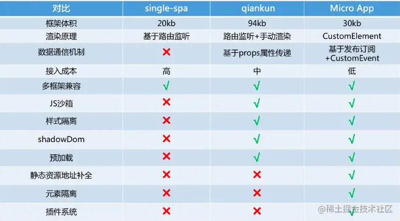

# 微前端

## 路由系统

1. 刷新时，如何加载子应用路由
   - 通过在主应用的子应用配置
   - 刷新时，先确保子应用挂载，然后再由子应用接管url change事件
2. 如何捕获到系统中所有路由的变化
   - 可以通过劫持 `history.pushState` 和 `history.replaceState` ，同时监听 `popstate` 事件。当捕获到路由变化时，根据路由查找对应的子应用


## App Entry

1. js entry
   - 可能需要子应用将资源全部打包到一个js bundle中，无法并行加载资源，且可能出现包体积过大问题
   - 如，经常需要类似`ReactDom.render(<App />, document.getElementById('root'))`，子应用不一定适用root作为结点挂载
2. html entry
   - 直接将子应用打出来 HTML 作为入口，子应用的开发方式和打包方式无需调整


## css隔离

### Shadow DOM

1. 子应用的样式作用域仅在 shadow 元素下，可以在获取子应用时，对子应用的根节点设置Shadow模式
   1. 如类似dialog，会动态插入到body里，由于shadow dom的特性，弹窗是无法获得子应用的样式的。


### Scoped css

1. 子应用使用postcss插件，将输出的css，全部增加前缀

   ```javascript
   // webpack打包部分，在postcss插件中 添加namespace的控制
   config.postcss.push(postcss.plugin('namespace', () => css =>
     css.walkRules(rule => {
       if (rule.parent && rule.parent.type === 'atrule' && rule.parent.name !== 'media') return;
       rule.selectors = rule.selectors.map(s => `.namespace-kaoqin ${s === 'body' ? '' : s}`);
     })
   ));
   ```

   - 优点：
     - 不容易产生副作用，可以多实例共存
     - 对于同一个库不同版本的 `CSS`（如 `antd3` 和 `antd4`）, 可以做到彻底隔离
     - 子应用独立运行和在主应用运行表现一致
   - 缺点：
     - 未经过编译的动态创建样式也无法处理
     - 一定程度上依赖子应用的开发和构建配置
     - 无法处理 `HTML` 中通过 `link` 插入的样式
     - 但也可能存在多个子应用的样式命名重复问题

2. 加载子应用时，修改子应用的CSS选择器，为子应用的样式增加一个父级

   - 可以运行时，加载子应用时解析，由 `loader` 负责处理。

   ```html
   <div id="qiankun-a">
     <style>
       #qiankun-a a {
         color: red;
       }
     </style>
     <div class="a">
       hello
     </div>
   </div>
   ```

   - 缺点：
     - 子应用独立运行表现和在主应用运行表现可能不一致

### Dynamic Stylesheet

1. 动态样式表，当应用切换时移除老应用样式，添加新应用样式

2. HTML Entry 方案，应用加载后dom可能是如下形式，卸载后会直接移除 HTML 结构，从而自动移除了其样式表

   ```html
   
   ```

### 小结

1. 子应用之间样式隔离，一般使用Dynamic Stylesheet
2. 由于主应用一般在微前端，都是一个壳，样式不会特别多。


## js隔离

### 硬隔离

1. 通过window.reload，每个子应用在渲染时都是一个全新环境，为了优化用户体验，可能需要SSR

### 快照沙箱

1. 快照沙箱，在应用沙箱挂载或卸载时记录快照，在切换时依据快照恢复环境 

   - 无法支持多个子应用同时挂载
   - 遍历window对象成本也较大
   
   ```javascript
   // demo
   class SnapshotSandbox{
     constructor(){
       this.proxy = window; 
       this.modifyPropsMap = {}; 
       this.active();
     }
     active(){ // 激活
       this.windowSnapshot = {}; // 拍照 
       for(const prop in window){
         if(window.hasOwnProperty(prop)){
           this.windowSnapshot[prop] = window[prop];
         }
       }
       Object.keys(this.modifyPropsMap).forEach(p=>{
         window[p] = this.modifyPropsMap[p];
       })
     }
     inactive(){ // 失活
       for(const prop in window){
         if(window.hasOwnProperty(prop)){
           if(window[prop]  !== this.windowSnapshot[prop]){
             this.modifyPropsMap[prop] = window[prop];
             window[prop] = this.windowSnapshot[prop]
           }
         }
       }
     }
   }
   ```

### Diff沙箱

1. 考虑到遍历window陈本较大，加载子应用之后记录对 window 属性的增删改，卸载之后恢复回去
   - context的切换，AB比较，需要比较两次，才知道哪些key是增加和删除的
   - 由于子应用较多，两两比较会形成笛卡尔积，最好和原始context对象O进行比较，记录A-O，B-O，C-O，而不是AB，BC、AC记录

### 代理沙箱

1. 每个应用都创建一个proxy来代理window，好处是每个应用都是相对独立，不需要直接更改全局window属性

   ```javascript
   // demo
   class ProxySandbox {
       constructor() {
           const rawWindow = window;
           const fakeWindow = {}
           const proxy = new Proxy(fakeWindow, {
               set(target, p, value) {
                   target[p] = value; 
                   return true
               },
               get(target, p) {
                   return target[p] || rawWindow[p];
               }
           });
           this.proxy = proxy
       }
   }
   ```


### 其他

1. 沙箱做的事情远不止这些，还包括对全局事件监听的劫持等，以确保应用在切出之后，对全局事件的监听能得到完整的卸载，同时也会在 remount 时重新监听这些全局事件，从而模拟出与应用独立运行时一致的沙箱环境。


### 异步脚本

1. 可能会有异步脚本的加载，如动态 `import`，在 `React` 里是 `Loadable`、`Vue` 里是动态组件，都会让 `webpack` 编译出单独的一个异步脚本，这种脚本是通过 `script` 标签去插入的，从而从沙箱里逃逸。
2. 【Garfish】通过劫持 `document` 的 `createElement` 方法，判断如果是创建 `script` ，则阻止原生行为，通过 `fetch` 去拉取 `script` 的内容，再放到沙箱里执行。 但可能有跨域问题，`xhr` 有跨域限制，而 `script` 没有，有一定潜在的风险。


## 通信机制

1. 发布订阅模式
   - 能够统一管理，子应用不直接交互
   - 问题：存在事件名冲突问题，后期维护成本高
2. 应用间状态管理
   - 主应用里做全局状态的初始化，子应用通过global state的get、set方法获取状态


## 依赖复用

1. 使用webpack，外部扩展，在编译“子项目”的时候，把引用公共库的代码从`require('react')`全部替换为`window.app.require('react')`

   ```javascript
   /**
    * 对一些公共包的引用做处理 通过webpack的externals（外部扩展）来解决
    */
   const libs = ['react', 'react-dom', "block"];
   module.exports = function (context, request, callback) {
       if (libs.indexOf(request.split('/', 1)[0]) !== -1) {
           //如果文件的require路径中包含libs中的 替换为 window.app.require('${request}'); 
           //var在这儿是声明的意思 
           callback(null, `var window.app.require('${request}')`);
       } else {
           callback();
       }
   };
   ```

   - 如要处理不同版本，需要更复杂的逻辑

# 主要实现

## single-spa

1. 完成的是微前端基础需求，如url变化时，如何加载与卸载子应用


## qiankun

1. 加载子应用的资源方式
   - single-spa使用systemJs，需要指定子应用要加载的资源，是否可以自动化？
     - 解决思路：qiankun 会把 head 部分转换成 qiankun-head，把 script 部分提取出来自己加载，其余部分放到 html 里、还支持预加载，会在空闲的时候加载解析出的 script 和 style
   - 使用HTML entry的加载方式，
2. css沙箱
   - shadow Dom等多种方案，可以配置选择
3. js隔离

   - 快照沙箱
   - 代理沙箱：
     - legacy沙箱：ES6 proxy把window代理到fakeWindow上，就不用遍历整个window去应用和恢复环境了；共用一个fakeWindow
     - proxySandbox：依然是proxy代理Window，只是有多个fakeWindow
4. 子应用预加载

   - requestIdleCallback：通过时间切片的方式去加载静态资源


# 实践

## 美团微前端（08）

1. 数据请求并没有经过前端服务做透传，而是被Nginx转发到后端Server上

   - 转发规则上限制数据请求格式必须是 `系统名+Api做前缀` 这样保障了各个系统之间的请求可以完全隔离
2. 路由注册

   - 使用全局的`window.app.routes`， 主应用从此获取，子应用注册时，将路由添加到`window.app.routers`中
   - 问题：路由注册，命名空间注册，会存在污染等问题
3. css隔离：使用postcss插件，将输出的css，全部增加前缀

5. 问题

   - 关键要侵入子应用，对子应用进行打包等处理，因此。整体方案，并不优


# 其他方案

1. 头条garfishjs：https://www.garfishjs.org/guide/sandbox
2. 飞冰icestark：https://github.com/ice-lab/icestark
3. micro-app：https://github.com/micro-zoe/micro-app

## iframe解决方案

1. 无界：https://github.com/Tencent/wujie
   - [无界方案](https://mp.weixin.qq.com/s?__biz=MjM5MTA1MjAxMQ==&mid=2651256967&idx=1&sn=8c3cc87ca55d41848acf3d4124f21339&chksm=bd4921038a3ea81537cc3a12d4743b8846f10f0cb6b0344b5216e674faac6170ff1f1407ab8f&scene=21#wechat_redirect) 
2. [擎天框架](https://mp.weixin.qq.com/s/Rohj17iy7qglDAjheo5aKw)
   - 全屏iframe，公共组件使用npm
   - 先加载首屏应用，然后用display：none方式加载其他子应用
   - 改写router.push方式，push后同步内容到主应用，然后改变路由
   - 数据共享通过syncRouter，共享到主应用


# 方案对比




