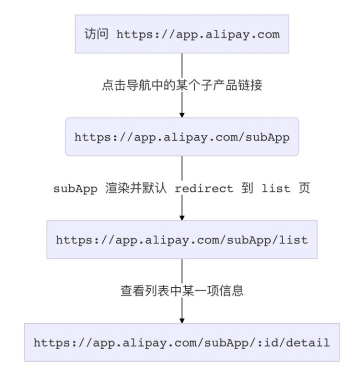
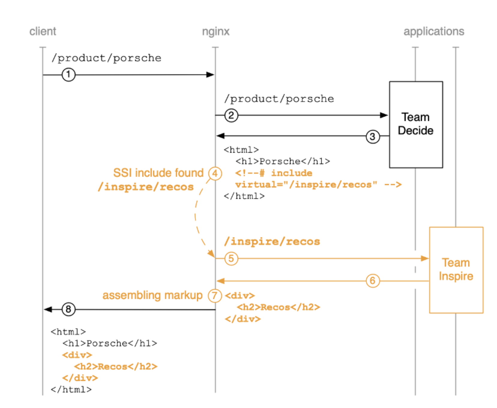
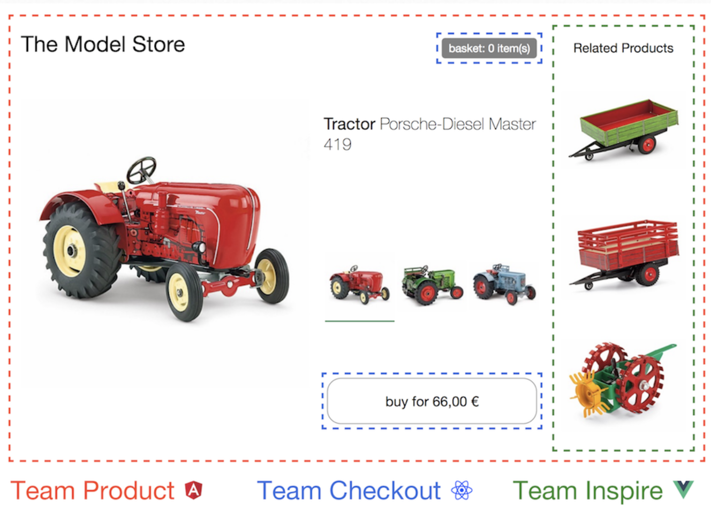
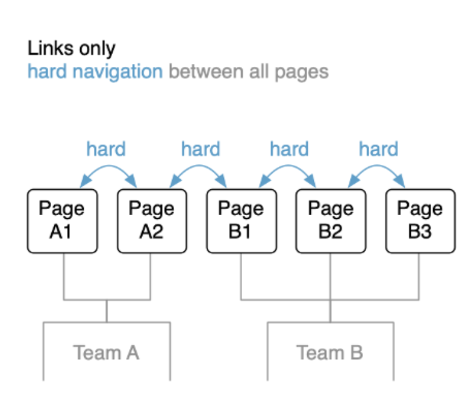
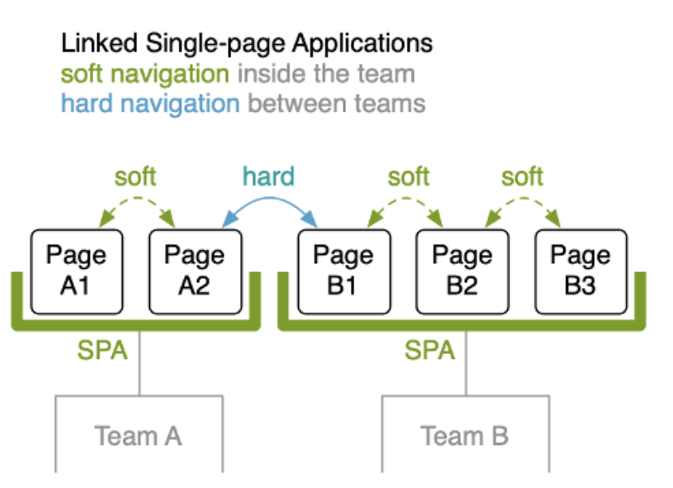
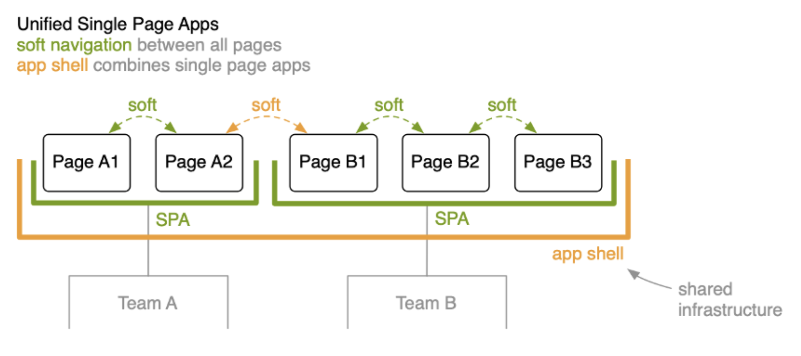
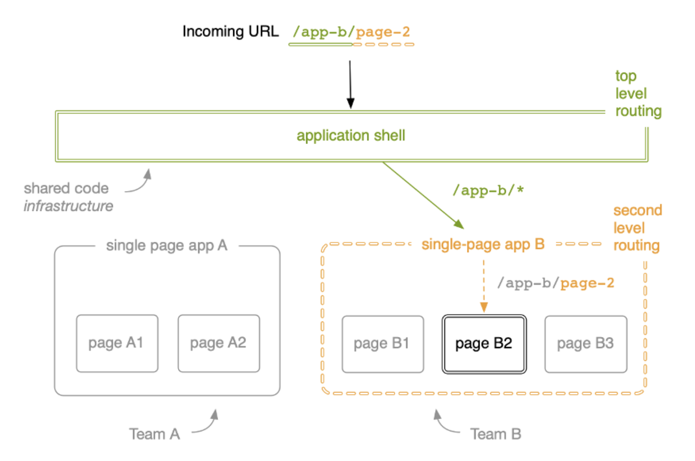
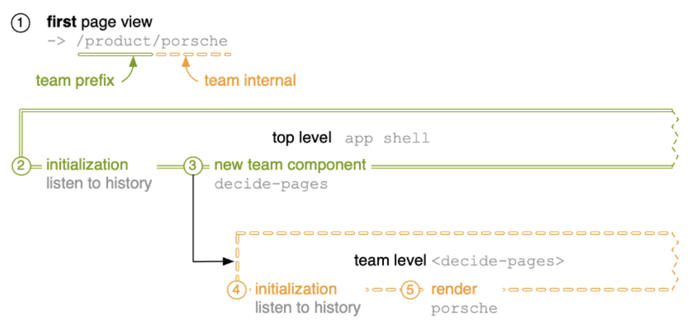
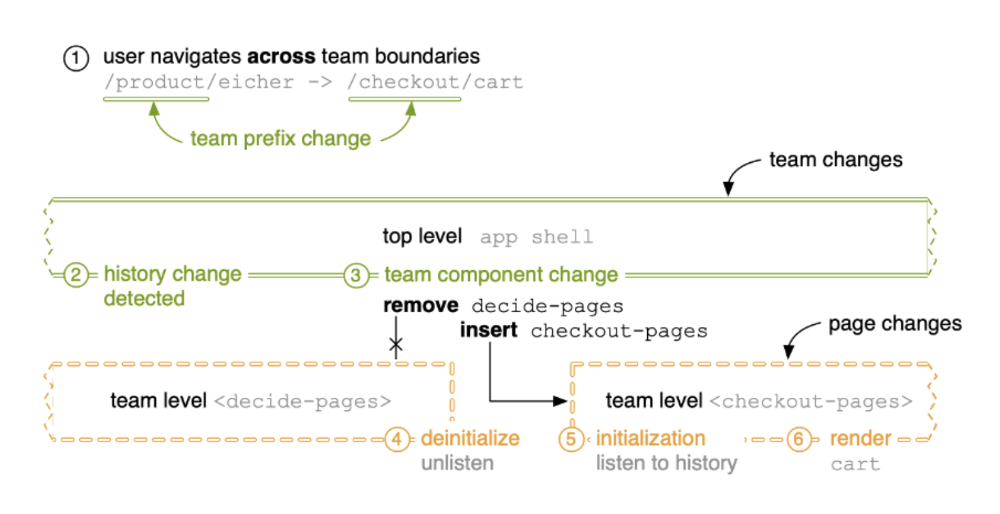
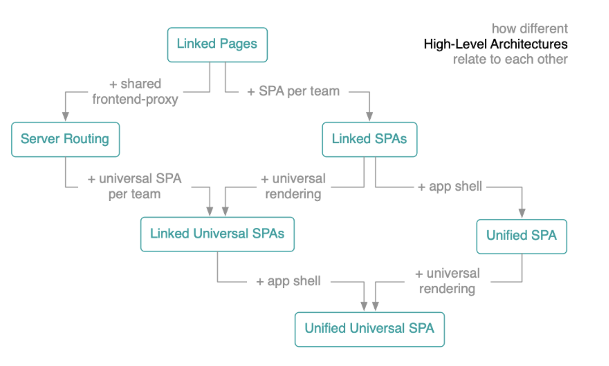

# 参考

1. 《micro-frontends-in-action》
   - 20200421

# 概述

## 目标

1. 解决遗产代码平滑的迁移，确保在若干年后还能用上时下热门的技术栈
2. 解构巨石应用，从而解决巨石应用随着技术更迭、产品升级、人员流动带来的工程上的问题
3. 方案上跟使用 iframe 做微前端一样简单，同时又解决了 iframe 带来的各种体验上的问题

## 核心价值

1. 技术栈无关
   - 应用之间不应该有任何直接或间接的技术栈、依赖、以及实现上的耦合
     - 如不能要求子应用、主应用必须使用某一版本的技术栈实现
     - 如尽量基于浏览器原生的 CustomEvent api，而不是自己搞的 pub/sub。
     - 子应用是否具备不依赖宿主环境独立运行的能力，衡量标准是是否能一行代码不改，或者只改很少的配置，就能达成这一目标
2. 独立开发、独立部署
   - 子应用仓库独立，前后端可独立开发，部署完成后主框架自动完成同步更新
3. 独立运行时 每个子应用之间状态隔离，运行时状态不共享

## 设计理想

1. 主系统构造一个足够轻量的基座，然后让各子应用按照共同的协议去实现即可
2. 这个协议可以包括，主应用应该如何加载子应用，以及子应用如何被主应用感知、调度，应用之间如何通信等。
3. 协议不应该包括，子应用要如何确保隔离性、安全性，不应该有开发、构建、发布 等流程上的侵入
4. 只要子应用实现了这个简单协议，其他的东西怎么玩，应该不需要关心或干预。

## 中后台应用的解决方案

1. 单实例：即同一时刻，只有一个子应用被展示，子应用具备一个完整的应用生命周期。通常基于 url 的变化来做子应用的切换。
2. 多实例：同一时刻可展示多个子应用。通常使用 Web Components 方案来做子应用封装，子应用更像是一个业务组件而不是应用。


# 实现需要考虑的问题

##  Future State

1. 假设微前端有这样一个链路

   

2. 如果在 `https://app.alipay.com/subApp/123/detail`刷新页面

   - 主应用资源会被重新加载，由于子应用是异步加载，子应用资源还没被加载
   - 路由表中并没有这个路由，会导致请求这个路由出现404情况
   - 这个问题存在于所有 lazy load 方式加载子应用的方案

3. 解决办法

   - 主框架配置子应用的路由为 `subApp: { url: '/subApp/**', entry: './subApp.js' }`
   - 当浏览器的地址为 `/subApp/abc` 时，框架需要先加载 entry 资源，待 entry 资源加载完毕，确保子应用的路由系统注册进主框架之后后，再去由子应用的路由系统接管 url change 事件

4. 可以直接使用社区的方案：single-spa

## 打包方式

1. 主子应用构建时一起打包
   - 可以做打包优化，依赖共享等
   - 但应用会完全耦合在一起，一个应用需要发布，需要重新打包
2. 运行时组合（推荐）
   - 完全解耦，主子应用可以完全技术栈无关
   - 会出现一些运行时的复杂度

## 入口方式

1. js Entry
   - 通常是子应用将资源打成一个 entry script
   - 缺点：如要求子应用的所有资源打包到一个 js bundle 里，包括 css、图片等资源；打包体积大，且可能无法利用并行加载的特性
2. html Entry（推荐）
   - 直接将子应用打出来 HTML 作为入口
   - 主框架可以通过 fetch html 的方式获取子应用的静态资源
   - 可以极大的减少主应用的接入成本，子应用的开发方式及打包方式基本上也不需要调整

## 模块导入

1. 需要获取到子应用暴露出的一些钩子引用，如 bootstrap、mount、unmout 等(参考 single-spa)，从而能对接入应用有一个完整的生命周期控制
2. 关键是：如何在浏览器运行时获取远程脚本中导出的模块引用
   - 简单解法：主子应用约定一个全局变量，到子应用导出的钩子挂载在这个全局变量上，缺点是：主子应用有强约定的协议
   - 大体的思路是通过给 window 变量打标记，记住每次最后添加的全局变量，这个变量一般就是应用 export 后挂载到 global 上的变量

## 应用隔离

### 样式隔离

1. shadow dom
   - 如不考虑浏览器兼容性，通常想到的方案是Web Components
   - 基于 Web Components 的 Shadow DOM 能力，我们可以将每个子应用包裹到一个 Shadow DOM 中，保证其运行时的样式的绝对隔离
   - 主要问题：类似的弹窗组件，会将弹窗挂载在body下面，这样子应用弹窗的样式就无法生效
2. css module
   - 通过约定 css 前缀的方式来避免样式冲突
   - 但对于新应用可以，老应用的处理成本高
   - 约定的方式也无法解决第三方库的引入，比如 a 应用引入了 antd 2.x，而 b 应用引入了 antd 3.x，两个版本的 antd 都写入了全局的 `.menu class`，但又彼此不兼容怎么办？
3. Dynamic Stylesheet
   - 只需在应用切出/卸载后，同时卸载掉其样式表即可
   - html entry具有天然的优势，可以在卸载应用的同时，将样式一同卸载

### js隔离

1. 利用沙盒的方式
   - 在应用的 bootstrap 及 mount 两个生命周期开始之前分别给全局状态打下快照，然后当应用切出/卸载时，将状态回滚至 bootstrap 开始之前的阶段，确保应用对全局状态的污染全部清零。
   - 当应用二次进入时则再恢复至 mount 前的状态的，从而确保应用在 remount 时拥有跟第一次 mount 时一致的全局上下文。

# 服务端集成

## Nginx与ssi

1. SSI(Server Side Include)，是一种类似于ASP的基于服务器的网页制作技术 

2. ssi的格式

   ```javascript
   <!--#include file="foot.html"-->
   ```

   - 在将标记传递给客户端之前，Web服务器将其替换为所引用URL的内容。

3. 如开启了ssi，请求一个微应用得到的请求示意图

   

4. 这种方式，通过减少请求（请求有延迟），减少等待js下载（加载自定义元素）的方式，加快了渲染时间

5. 但这种方式存在一个问题

   - 如果ssi获取的某个js，有部分功能会造成很大的延迟
   - 这样给客户端的html，也会出现较大延迟
   - Nginx也提供了后备与超时的配置，可以通过配置Nginx解决下
   - Nginx对多个模块也会并行获取

6. 小结

   - ssi或说服务端渲染，如果一下组装一个很大的页面，也会造成时间浪费，可以先组装前面部分
   - 不重要的部分利用ajax进行请求获取

## 流式发送ESI

1. 不是将html全部组装好才发送给客户端，而是使用类似流的方式进行
2. Edge Side Includes（简称ESI）是一项规范，定义了标记组装的统一方法
3. 介绍微前端一个component组合包：Podium 很小众

## 小结

1. ssi与esi已经过时，上面主要是了解下组装的原理
2. 服务端集成的优势
   - 出色的首次加载性能
   - 渐进增强功能
3. 缺点
   - 第一字节的时间可能不理想，主要是，服务端需要下载片段并组合
   - 本地开发较为复杂，需要有个支持ssi或esi的服务器，但可以用node服务如：Podium或Tailor（都很小众）
4. 


# 使用Web组件包装微前端

## 概述

1. Web组件规范已经制定了很长时间。其目标是引入更好的封装并实现不同库或框架之间的互操作性
   - 所有浏览器都实现了v1标准，未实现的可通过poyfill解决
2. Web组件是一个总称。它描述了三个不同的新API：自定义元素，阴影DOM和HTML模板。

## 自定义元素

1. 可以使用自定义元素构造 HTML规范中缺少的新的通用表示元素，如剪贴板功能

2. 自定义元素可以封装业务逻辑并提供关联的用户界面

   ```html
   <!DOCTYPE html>
   <html lang="en">
   <head>
       <meta charset="UTF-8">
   </head>
   <body>
   <blue-buy sku="a"></blue-buy>
   <script>
       const prices = {
           a: '66,00 €',
           b: '54,00 €',
           c: '58,00 €',
       };
   
       class BlueBuy extends HTMLElement {
           static get observedAttributes() {
               return ['sku'];
           }
           connectedCallback() {
               this.render();
           }
           render() {
               const sku = this.getAttribute('sku');
               const price = prices[sku];
               this.innerHTML = `<button type="button">buy for ${price}</button>`;
           }
         	// 每当有人更改自定义元素的属性时，都会触发此方法
           attributeChangedCallback(attr, oldValue, newValue) {
               this.render();
           }
       }
       window.customElements.define('blue-buy', BlueBuy);
   </script>
   </body>
   </html>
   ```

   - 可以通过更改js，可以生成不同的html片段
   - 如上代码更改sku的值，就会渲染不同的节点

3. 自定义元素提供了类似connectCallBack、attributeChangedback、disconnectCallback等钩子函数，类似于生命周期函数

4. 注意

   - 对于自定义元素实现，我们必须使用ES6类

### 举例

1. 如下是由不同团队构建的，现在蓝色团队的职责是结算相关的需求，他们只需要提供一个按钮与购物车给红色团队

2. 红色团队并不需要知道结算具体逻辑，只需要将蓝色团队提供的组件嵌入具体位置即可

   

3. 而蓝色team通过浏览器是customEvent，可以自己定义点击按钮的效果

   ```javascript
   // 按钮
   class BlueBuy extends HTMLElement {
     connectedCallback() {
       this.render();
       this.firstChild.addEventListener('click', this.addToCart);
     }
     addToCart() {
       // maybe talk to an api
       this.dispatchEvent(new CustomEvent('blue:basket:changed', {
         bubbles: true,
       }));
     }
     render() {
       this.innerHTML = `<button type="button">buy</button>`;
     }
     disconnectedCallback() {
       this.firstChild.removeEventListener('click', this.addToCart);
     }
   }
   // 购物车
   class BlueBasket extends HTMLElement {
     connectedCallback() {
       window.addEventListener('blue:basket:changed', this.refresh);
     }
     disconnectedCallback() {
       window.removeEventListener('blue:basket:changed', this.refresh);
     }
   }
   ```

4. 自定义元素主要的问题是：

   - 由于元素定义在js中，html会出现白屏（因为需要等待js加载完，才能知道自定义元素的样子）

## Shadow DOM

1. Shadow DOM的概念为团队间需要协定css命名提供了一种替代方案

2. 可以通过调用`.attachShadow()`HTML元素，通过JavaScript创建隔离的DOM子树，这个方法可以用于普通的dom元素，也可以结合自定义元素

3. Shadow DOM中定义的样式保留在Shadow DOM中，不会影响页面的其他部分，外部文档中的CSS定义不适用于Shadow DOM。

   ```javascript
   class CheckoutBuy extends HTMLElement {
     connectedCallback() {
       const sku = this.getAttribute("sku");
       this.attachShadow({ mode: "open" });
       this.shadowRoot.innerHTML = `
         <style>
           button {}
           button:hover {}
         </style>
         <button type="button">
           buy for ${prices[sku]} $
         </button>
       `;
     }
   }
   ```

### 优缺点

1. 优点：
   - 强大的类似于iframe的隔离。无需命名空间。
   - 防止全局样式泄漏到微型前端。与旧版应用程序一起使用时很棒。
   - 有可能减少对CSS工具链的需求。
   - 片段是独立的。没有单独的CSS文件引用。
2. 缺点
   - 旧版浏览器不支持。Polyfill存在但很重并且依赖启发式。
   - 需要JavaScript才能工作。
   - 没有渐进增强或服务器渲染。无法通过HTML声明性地定义Shadow DOM。
   - 很难在不同的Shadow DOM之间共享通用样式。

## WEB组件的优缺点

1. 优点
   - web组件是广泛实施的web标准
   - 自定义元素和Shadow DOM都提供了以前无法实现的额外隔离功能
   - Custom Elements引入的生命周期方法使以标准方式包装不同应用程序的代码成为可能
2. 缺点
   - 标准没有涉及服务器渲染
   - 旧浏览器的polyfill shadow dom 更棘手
3. web组件并不意味着全部使用客户端渲染，也是可以将自定义元素，通过ajax的方式加载

## 通信方式

### 父到子通信

1. 通过自定义元素的扩展属性，如`edition`属性

   ```html
   <checkout-buy sku="porsche" edition="platinum"></checkout-buy>
   ```

2. 子组件开发人员，通过edition拿到父组件传过来的值

### 子到父通信

1. 通过自定义事件方式：子组件发出一个事件，checkout可以代表团队名，item_added表示事件类型

   ```javascript
   class CheckoutBuy extends HTMLElement {
     render() {
       this.querySelector("button").addEventListener("click", () => {
         const event = new CustomEvent("checkout:item_added");
         this.dispatchEvent(event);
       });
     }
   }
   const buyButton = document.querySelector("checkout-buy");
   const product = document.querySelector(".decide_product");
   buyButton.addEventListener("checkout:item_added", e => {
     product.classList.add("decide_product--confirm");
   });
   product.addEventListener("animationend", () => {
     product.classList.remove("decide_product--confirm");
   });
   ```

2. 然后在`checkout-buy`组件上监听此事件即可

### 组件间通信

1. 直接通信：由于片段都在dom中，在一个片段中肯定可以通过dom访问，拿到另一个片段的内容，但强耦合，不建议

2. 通过子父->父子：这样数据传输，需要团队间协商，尤其是更改协议后会比较麻烦

3. 事件总线的方式（浏览器天然支持）

   ```javascript
   // 组件1
   const event = new CustomEvent("checkout:item_added", *{
     bubbles: true,
     detail: { sku, edition }
   }*);
   window.dispatchEvent(event);
   // 组件2
   class CheckoutMinicart extends HTMLElement {
     connectedCallback() {
       this.items = [];
       window.addEventListener("checkout:item_added", e => {
         this.items.push(e.detail);
       });
     }
   }
   ```

   - 默认自定义事件不会冒泡，组件1通过冒泡机制将事件发到window上
   - 注意与子父通信是不一样的，是window.dispatchEvent`而不是`element.dispatchEvent

### 小结

1. 事件不应用作传输数据的方式
2. 使用事件或广播时，必须记住，并非所有其他微型前端都可能已经完成加载

## 客户端路由和外壳

### 页面跳转方案

1. 硬跳转： 所有页面跳转都会刷新页面

   

2. 应用间软跳转，不同应用间硬跳转

   

3. 通过外壳的方式，所有链接都是软链接

   

4. 而singe-spa是一种现成的应用程序外壳解决方案

### 应用程序外壳

#### 概述

1. 应用程序外壳充当所有微型前端的父级应用程序，所有传入的请求都到达那里，他选择用户想要查看的微前端并将其呈现在``文档的中
2. 由于是共享代码，故不应该包含任何业务逻辑
3. 解题思路：
   - 将a链接等转跳转为history模式
   - 然后通过路由->组件，动态加载和卸载组件
   - 不同团队将路由->组件注册在外壳中
4. 这种方式主要的问题是
   - 应用外壳需要知道全部路由URL
   - 如果团队需要更改路由，还需要重新调整外壳，这种强耦合显然不适用

#### 两级路由方式

1. 先通过顶级路由找到所属团队，然后再通过二级路由找到对应的子模块

   

### url变化视图的变化

#### 第一个页面加载

1. 如下图，开始进入如下页面

   

2. 步骤

   - 应用程序外壳程序代码首先运行，并执行初始化所需的一切。它开始监视URL进行更改。
   - 由于页面请求的是`/product/porsche`，会先根据product，将team level的`<decide-pages>`组件，加载到页面中（这个路由定义在程序外壳）
   - `<decide-pages>`组件一加载，团队级别组件将初始化自己，它还开始监听URL。
   - 然后查看二级路由，呈现Porsche页面

#### 团队内路由切换

1. 由于一个团队内切换路由，实际product是不会改变的，外壳程序也无需做什么事情
2. team level自己切换组件即可

#### 团队间导航

1. 如下图

   

2. 步骤

   - 当路由从product切换到checkout时，外壳应用会切换路由
   - 加载`<chckout-pages>`，从dom中移除`decide-pages`
   - 关键是移除之前，要先通知decide团队卸载一些东西

1. - 而当html加载完，会加载checkout-buy这个自定义元素的js，为checkout-buy附加逻辑

## 混合渲染

1. 解决：切换组件加载慢，或由于自定义组件通过js生成子dom，网络环境差会显示一段时间空白，因此可以利用通用渲染

2. 如购买按钮非常关键，不希望出现空白的问题，但自定义元素加载后，请求js才知道按钮内容，故可以将按钮服务端渲染

   ```javascript
   <checkout-buy sku="fendt">
     <!--#include virtual="/checkout/fragment/buy/fendt" -->
   </checkout-buy>
   ```

# 微前端的架构方式

## 页面过渡方案

1. 硬链接：最简单的微前端方式，团队间无需任何协调
2. 应用外壳方式（nice）

## 构成技巧

1. 客户端集成：web组件技术，关键是各部分的通信
2. 服务端集成：到达浏览器是组装好的页面
3. iframe：虽然具有天然隔离，但体验差
4. Ajax：通过ajax获取不同片段

## 高级架构



### Linked pages

1. 其实就是最简单硬链接方式，不同团队直接通过硬链接的方式进行跳转
2. 不需要中央基础结构或共享代码，调试很直接

### 服务端路由

1. 与硬链接方式不同的是，所有请求都通过共享的Web服务器或反向代理传递
2. 具有一组路由规则，以标识哪个团队应处理传入的请求

### Linked SPAs

1. 为改善用户体验，无需所有链接都是硬链接
2. 一个团队可以使用spa的方式，团队内的跳转使用软连接的方式

### Linked Universal SPAs

1. 将spa结合服务端渲染，加快首屏渲染速度等

### Unified SPA

1. 将spa增加一个外壳，让应用之间也可以软链接的跳转

### Unified Universal SPA

1. spa增加外壳，解决各spa跳转的问题
2. 增加服务端渲染，解决首屏问题等
3. 是一个理想模式，但也是最复杂的

## 建议

1. 如果您的产品注重内容，则服务器端渲染应是您的首选。使用渐进增强来添加功能应该很自然。
2. 如果您构建的应用程序完全是关于交互而不是内容的，那么最适合客户端的解决方案将是最合适的。在这里，渐进增强的概念根本没有帮助，因为一开始就没有可增强的内容。

