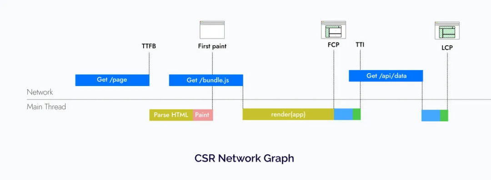
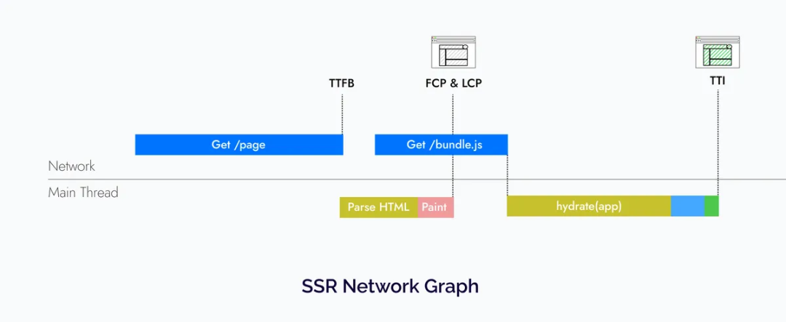
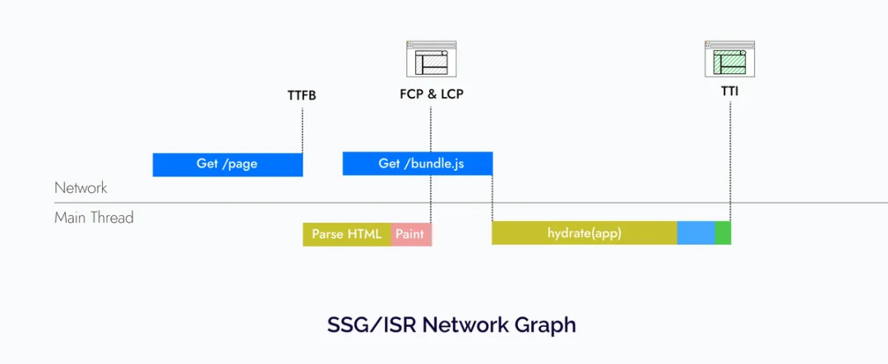
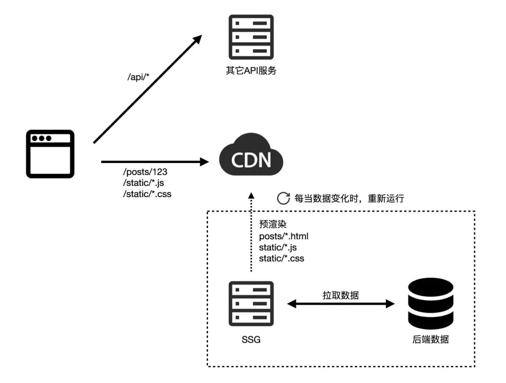
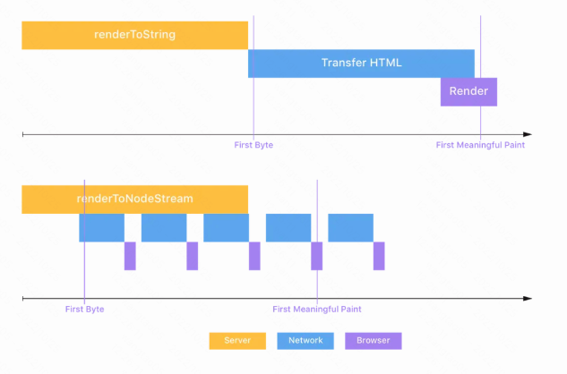

# 相关术语

1. **Time To First Byte** (TTFB) ：发出页面请求到接收到应答数据第一个字节所花费的时间；
2. **First Paint** (FP) ：第一个像素对用户可见的时间。
3. **First Contentful Paint** (FCP)： 第一条内容可见所需的时间。
4. **Largest Contentful Paint** (LCP) ：加载页面主要内容所需的时间。
5. **Time To Interactive** (TTI)： 页面变为交互并可靠响应用户事件的时间。
6. **Cumulative Layout Shift** (CLS) ：累积布局偏移
   - 有时页面因为ajax请求加载数据，或未知尺寸的图像或视频加载后，页面发生偏移
   - CLS 测量整个页面生命周期内发生的所有意外布局偏移中最大一连串的布局偏移分数

# CSR渲染

## 优点

1. 第一个字节很快（TTFB），因为它们主要依赖于静态资源（CDN提供服务）
2. 所有渲染都是在客户端完成的，可在不刷新整个页面的情况下进行导航
3. TTFB 时间很快，因此浏览器可以立即开始加载字体、CSS 和 JavaScript

# SSR渲染

1. TTFB 会受到影响，因为我们必须在服务端获取数据，然后将其转换为 HTML 字符串。
2. 整个流程是：
   - 在server端，获取应用程序的数据
   - 在server端，渲染整个应用为HTML并将其发送client
     - 必须在服务器上收集所有数据，才能开始向客户端发送HTML
   - 在客户端上，加载js代码
   - 在客户端上，将js逻辑与html逻辑整合（hydration）
3. 每一步都需要等上一步完成才可以进行，虽然可以快速看到页面样式，但hydration完成才可以交互
4. 相比csr，ssr并不是让交互更快，是让静态页面更快到客户端
5. 缺点：
   - 需要一个实时后台服务，消耗资源与访问量成正比
   - Node服务部署，因为只能部署在某几个地域，没有cdn加载速度快
   - 需要额外人力维护后端

# SSG/ISR

1. SSG(静态站点生成)，解决问题思路：是考虑很多页面可以静态化，解决的也是每次渲染的大部分内容是一致的

   - **变化不频繁，甚至不会变化的内容**：例如文章、排行榜、商品信息、推荐列表等等，这些数据非常适合缓存；
   - **变化比较频繁，或者千人千面的内容**：例如用户头像、Timeline、登录状态、实时评论等。

2. 与SSR 唯一的区别是，它们不会受到 TTFB 时间较长的影响。因为 HTML 要么是在构建时生成的，要么是在请求传入时以增量方式生成和缓存的。

   

3. 这便是 Gatsby.js、Next.js 这样的网站生成器解决的问题，相当于vue、react上层框架

4. 数据有变化时，重新触发一次网站的异步渲染，然后推送新的内容到 CDN 即可

ISR(增量静态生成)

1. 每次都是全站渲染，对于较大的网站的不可接受的，避免全量更新
   - **关键性的页面**（如网站首页、热点数据等）预渲染为静态页面，缓存至 CDN，保证最佳的访问性能；
   - **非关键性的页面**（如流量很少的老旧内容）先响应 fallback 内容，然后浏览器渲染（CSR）为实际数据；同时对页面进行异步预渲染，之后缓存至 CDN，提升后续用户访问的性能。
2. 主要问题：用户体验不一致
   - 没有预渲染的，用户会先看到fallback页
   - 页面过期很久的，需要用户重新刷新才能看到

# 流式SSR

1. 这允许在渲染它的同时以块的形式发送 HTML，从而为用户提供更快的 TTFB 和 LCP
2. React18使用renderToPipeableStream与suspense组件，简要原理
   - Suspense的组件开始不渲染，等数据准备就绪后，React 将发送最少的 HTML 到客户端（html流式传输）
   - 选择性注水：js如不全下载完，页面也是无法交互的，通过 React.lazy 进行代码拆分（js被作为chunk流式传输）

# Islands 架构（Partial Hydration）

1. 解决传统 SSR/SSG 框架的全量 hydration 问题，做到尽可能少的 Client 端 JS 的开销，甚至是 0 JS。
2. 传统的 SSR 应用中，服务端会给浏览器响应完整的 HTML 内容，并在 HTML 中注入一段完整的 JS 脚本用于完成事件的绑定，也就是完成 hydration (注水) 的过程。当注水的过程完成之后，页面也才能真正地能够进行交互。那么当应用的体积逐渐增大时，需要在客户端执行的 JS 脚本也会越来越多，这也意味着 TTI(可交互时间) 指标越来越高
3. 为了解决这个问题，Islands 架构将页面拆分为各自独立的组件，包含`静态组件`和`可交互组件`
4. 可交互的组件就犹如整个页面中的孤岛(Island)，因此这种模式叫做 Islands 架构

对比 React 18 的 Selection Hydration 特性

1. 从渲染框架上来看， `Selection Hydration` 依附于具体框架的实现，而 `Partial Hydration` 可以做到框架无关
2. 从客户端执行的 JS 总量来看，`Selection Hydration` 仍然需要加载和执行全量的 JS 代码， `Partial Hydration` 可以做到加载部分组件的 JS 代码
3. 从服务端和客户端的交互来看，  `Selection Hydration` 严重依赖于流式(Streaming)渲染，服务端需要加上 `transfer-encoding: chunked` 的响应头，而 `Partial Hydration` 没有这个限制。

