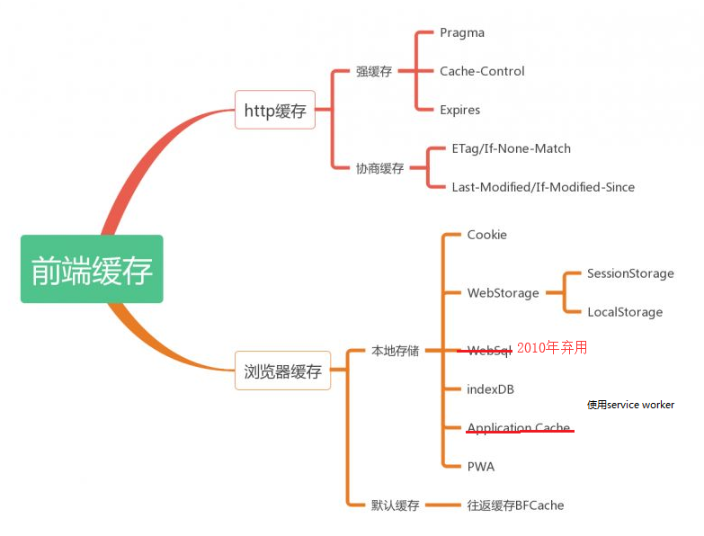

# 前端缓存综述

1. cookie参见《2.网络基础/HTTP》
2. webstorage、indexDB、service worker参见《2-html5/1-离线应用与存储》

# HTTP 缓存

## 什么是HTTP缓存

1. 当客户端向服务器请求资源时，会先抵达浏览器缓存，如果浏览器有“要请求资源”的副本，就可以直接从浏览器缓存中提取而不是从原始服务器中提取这个资源。

2. http缓存都是从第二次请求开始的。第一次请求资源时，服务器返回资源，并在respone header头中回传资源的缓存参数；第二次请求时，浏览器判断这些请求参数，命中强缓存就直接200，否则就把请求参数加到request header头中传给服务器，看是否命中协商缓存，命中则返回304，否则服务器会返回新的资源。

3. 通常来说，POST、DELETE、PUT这类带行为性的请求操作一􏲏不做任何缓存，大多数缓存只应用在GET请求中。

   图灵社区会员 swht 专享 尊重版权 存，大多数缓存只应用在GET请求中。使用缓存的流程如图8-1所示

## 缓存分类

### 概述

## 缓存请求流程

1. 第一次请求

	
	
	- 服务器响应时，会配置Cache-control或Expires、Etag、Last-Modified等是否缓存
	
2. 第二次请求

	

### 强缓存

1. 强制缓存优先级高于协商缓存，当执行强制缓存的规则时，如果缓存生效，直接使用缓存，不再执行对比缓存规则。

2. | header属性              | 可选值                                                       | 优先级 | 优缺点 |
   | ----------------------- | ------------------------------------------------------------ | ------ | ------ |
   | Pragma(HTTP/1.0)        | no-cache：不直接使用缓存，根据新鲜度来使用缓存               | 高     | 1、只支持请求头 2、为了兼容http1.0 |
   | Cache-Control(HTTP/1.1) | no-store、no-cache |       中 | 1、通用头，即请求头与响应头都支持这个属性 |
   | Expires(HTTP/1.0)      | h，必须是 `GMT` 格式的时间，expires=Thu, 25 Feb 2016 04:18:00 GMT（表示这个时间之后cookie失效） | 低 | 1、服务器与客户端时间不一致会出问题 2、响应头 3、表示缓存何时过期，如值为0，则表示过去的时间，即缓存已过期 |

3. Pragma用来禁止缓存，Expires用来设置缓存时间

4. cache-control用于解决服务器与客户端时间不一致问题

#### Cache-control

1. Cache-Control: no-store
	- 禁止进行缓存
	- 每次由客户端发起的请求都会下载完整的响应内容。
2. Cache-Control: no-cache
	- 强制确认缓存
	- 会询问服务器缓存是否过期，如未过期（服务器返回304），则使用本地缓存
3. 私有缓存和公共缓存
	- Cache-Control: private
	- Cache-Control: public
	- 公共缓存表示响应可以被中间任何人（中间代理、CDN）缓存
4. Cache-Control: max-age=31536000
	- 告诉客户端，资源在3153600秒之内是新鲜的，无需向服务器发起请求

#### Pragma头

1. 请求中包含pragma头与Cache-control:no-cache相同
2. 响应头不支持此属性，故不能完全替代cache-control

### 协商缓存

1. 当第一次请求时服务器返回的响应头中

   - 没有Cache-Control和Expires
   - Cache-Control和Expires过期（需要请求新资源，但可能新资源并没有更改，故无需服务器返回资源整个实体）
   - Cache-control属性设置为no-cache时（需要强制确认缓存）
   - 即不走强缓存时，那么浏览器第二次请求时就会与服务器进行协商，与服务器端对比判断资源是否进行了修改更新。
   - 如果服务器端的资源没有修改，那么就会返回304状态码，使用缓存
2. 注意：不走协商缓存时，请求不会带If-Modified-Since请求头

#### Last-Modified/If-Modified-Since

1. Last-Modified
	- 服务器在响应请求时，代表资源的最后修改时间。
	- 弱校验器，需要精确到某一秒
	
2. If-Modified-Since：上次请求时，服务器返回的资源最后修改时间

3. 请求过程图示

   

#### Etag/If-None-Match

1. 优先级高于Last-Modified / If-Modified-Since
2. Etag：响应时，资源的唯一标识（生成规则由服务器决定）
3. If-None-Match：再次请求时，通知服务器客户端缓存数据的唯一标识

#### Etag与Last-Modified区别

1. 某些服务器不能精确得到资源的最后修改时间，这样就无法通过最后修改时间判断资源是否更新
2. Last-modified 只能精确到秒。
3. 一些资源的最后修改时间改变了，但是内容没改变，使用 Last-modified 看不出内容没有改变。
4. Etag 的精度比 Last-modified 高，属于强验证，要求资源字节级别的一致，优先级高。
5. 由于Etag要求资源字节一致，故会占用服务器计算资源；

## 缓存存放的位置

### 内存缓存

1. 内存缓存（from memory cache）
2. 快速读取：内存缓存会将编译解析后的文件，直接存入该进程的内存中，占据该进程一定的内存资源，以方便下次运行使用时的快速读取
3. 时效性：一旦该进程关闭，则该进程的内存则会清空。

### 硬盘缓存

1. 硬盘缓存（from disk cache）
2. 硬盘缓存则是直接将缓存写入硬盘文件中，读取时需要对硬盘进行IO操作，然后解析缓存内容
3. 速度比内存缓存慢

## 用户刷新行为

### 输入栏输入后回车

1.  如有缓存且未过期
2. 直接使用缓存，不向服务器确认，返回`200 OK (from cache)`

### F5刷新

1. F5/点击工具栏中的刷新按钮/右键菜单重新加载
2. 成为soft refresh，只是reload page而已

### ctrl+F5

1. 强制刷新
2. 在request中多了个属性： 都有Cache-Control: no-cache的标识
3. 并去掉If-None-Match，避免走协商缓存

## 清除缓存

1. 路􏵃中跟随Web应用的版本􏲭：`http://url.com/?v=20130501`
2. 路􏵃中跟随该文件内容的hash：`htp://url.com/?hash=afadfadwe`