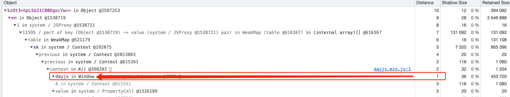
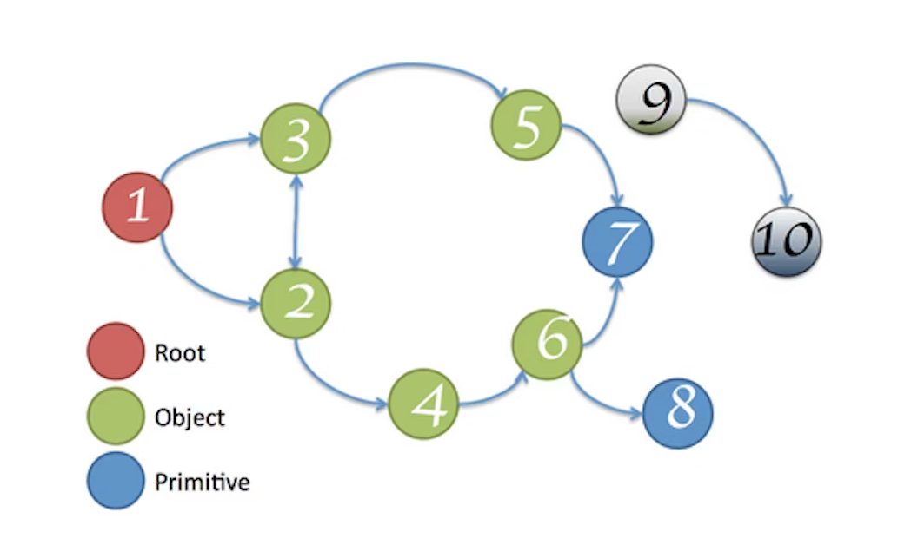
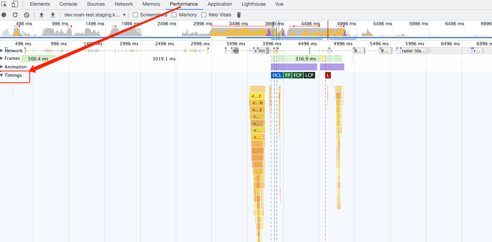

定位内存使用问题

查看内存使用情况

1. performance monitor
   - 可以查看dom数量，内存使用实时监控

chrome memory 面板

### **Shallow size**

1. 对象自身持有的内存

### **Retained size**

1. 释放了这个对象，能释放多少内存
2. GC roots：简单理解为V8内存图谱的根，如window全局对象（每个iframe一个）、DOM 树根节点，对浏览器而言GC 根一般是window对象

### distance

1. 当前对象到GC根最短引用数量
2. 未连接GC 根的对象，如下图的9,10，会被GC回收

内存问题

1. 页面性能延迟或出现卡顿：可能是gc频繁回收内存，导致js执行停止

实时内存使用查看

1. settings => 更多工具 => 任务管理器
2. 点击 header 右键 => js 使用的内存
   - js 使用的内存：js heap 内存使用情况，括号内的实际大小表示当前页面使用到的对象内存占用情况
   - 内存：全部内存使用情况，如 DOM 节点、C++代码使用的内存等，如果一直增长可能是node在不停创建

## Heap Snapshots

1. 如果页面dom tree与 JS code都没有引用才会被GC回收
2. Detached DOM 表示DOM已经从DOM 树移除，但还被JS引用
   -  使用Memory工具，利用Heap snapshot，记录内存升高后内存使用状况。通过class filter Detached HTM

vue3 Performance查看

1. 配置：`app.config.performance = true;`

JS获取性能指标

1. https://www.npmjs.com/package/web-vitals