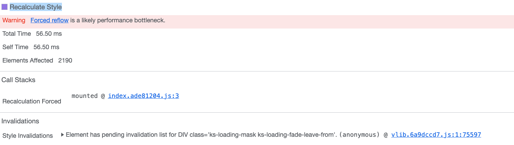

性能面板（Performance Tab）

回流（Recalculate Style）



1. **Recalculation Forced**: 这代码访问了dom属性触发了回流
2. **First Invalidated**: 这代码改变了DOM，ui更新时需要重新计算布局


FPS

1. 使用Frames模块，如果ui卡主frame会持续很长时间


性能优化概述

1. 现状分析

   - 内部工具（类似Lighthouse + performance ）

   - build包分析：rollup-plugin-visualizer 

   - 代码重复率分析

     - Jscpd

   - 圈复杂度：表示程序的复杂度

     - CodeMetrics

     - ESLint

       ```javascript
       rules: { 
         complexity: [ 
           'error', 
           { 
             max: 10 
           } 
         ] 
       }
       ```

2. 包体积优化

   - 库的按需引入，减小第三依赖的体积

   - 避免依赖重复打包，去除无用代码，抽离公共包

     ```javascript
     build: {
       rollupOptions: {
         output: {
           manualChunks: {},
         },
       },
         terserOptions: {
           compress: {
             // warnings: false,
             drop_console: true, // 打包时删除console
               drop_debugger: true, // 打包时删除 debugger
                 pure_funcs: ['console.log'],
           },
             output: {
               // 去掉注释内容
               comments: true,
             },
         },
     }
     
     ```

   - Gzip压缩：一般ng做，也可以vite-plugin-compression