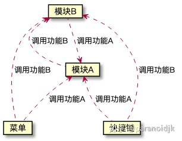
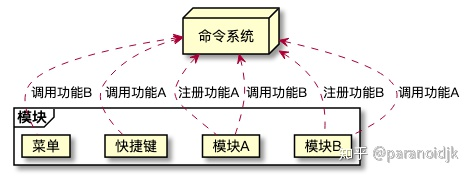

IDE（集成开发环境）

从VSCode看大型应用架构

1. 遵守 electron 规范，按不同环境细分文件夹

   - 避免 由于依赖关系导致预期之外的bug

2. 命令系统：是解决代码依赖关系混乱的一个思路

   - 传统的模块调用是个网状，不太好找到一个切面来理解或治理

     

   - 命令系统是中心化的，各功能末端变成了扁平化的结构

     

3. 插件系统

   - 如何保证插件和原生功能一样优秀呢？历史告诉我们：不能保证
   - vscode做法
     - 把插件们放到单独的进程里，不信任任何人
     - 管理UI保持一致的交互：插件都不能“决定”或者“影响”界面元素如何被渲染（颜色、字体等，一概不行）

4. LSP-基于文本的协议

   - 支持多语言的开发环境的基础
   - 如何做到的呢？
     - 节制的设计：做最小子集，而不是涵盖所有语言特性的超集
     - 抽象：LSP最重要的概念是动作和位置，LSP的大部分请求都是在表达”在指定位置执行规定动作“。
     - 这是一个基于文本的协议，文本降低了理解和调试的难度，如https等二进制协议，理解有多复杂

5. Text Buffer实现

   - 由于需要在V8与C++之间进行字符转换，C++的实现并没有提高很大的性能
   - 编辑器一行行写代码，最初的存储结构就是`Array<Obj>`，但当文件巨大时，Array的存储使用的内存是文件大小的N倍
     - array的主要问题就是，如果插入一个元素，需要移动n个后面的元素，时间复杂度为On
     - 后续使用Piece Table数据结构（文本编辑器的核心），解决的思路是，以append（O1）的方式记录对文件的修改

   

   

   

