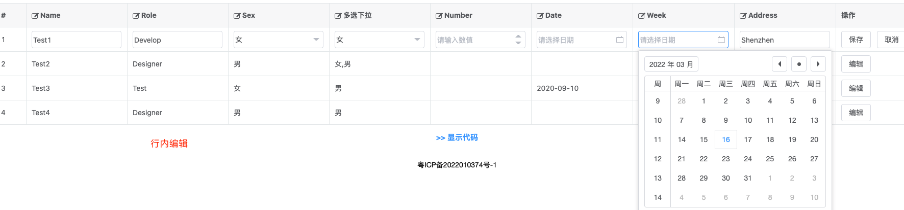
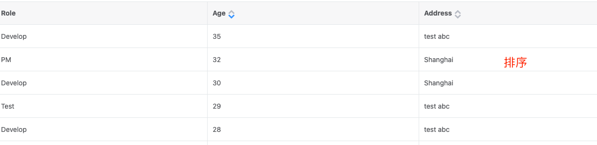
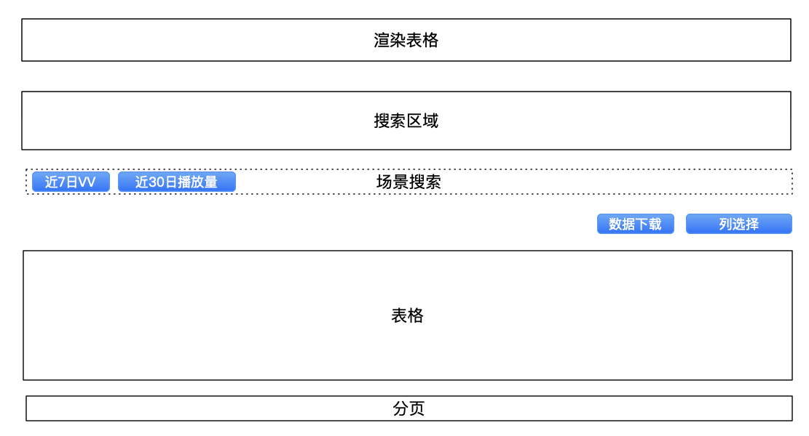
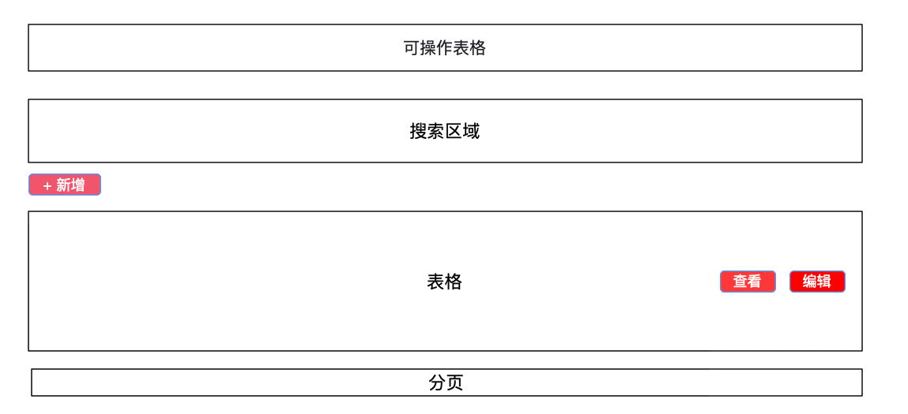
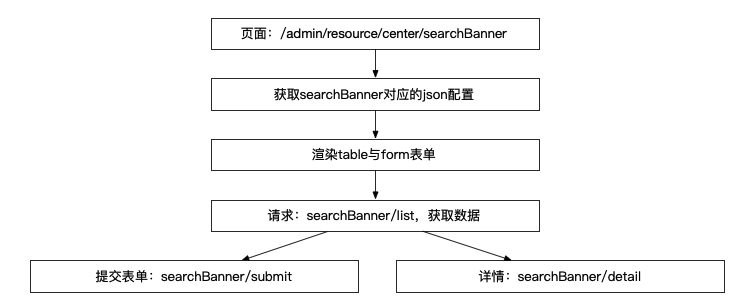
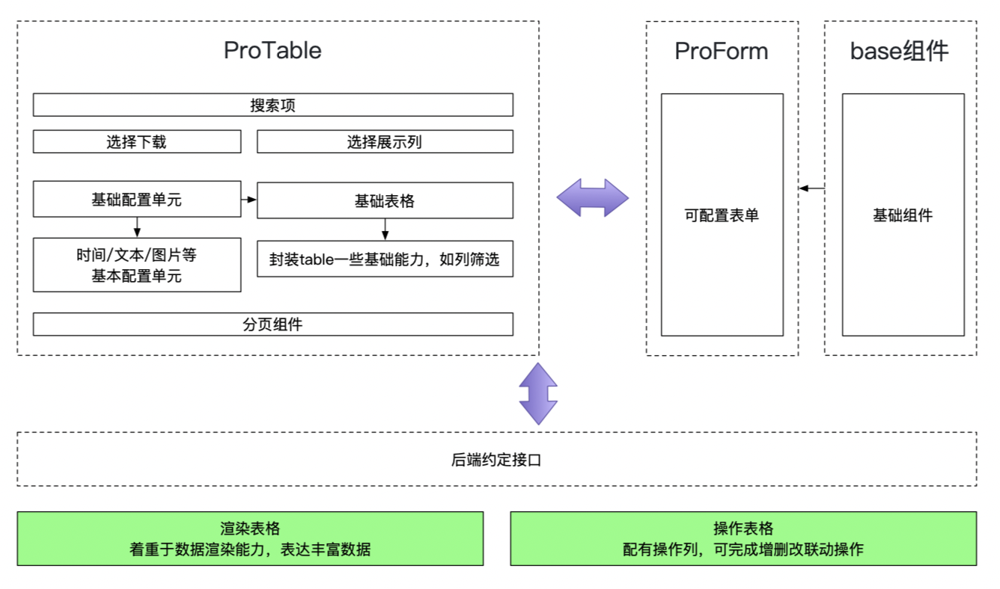

# 调研与现有能力

## NoCode建站平台

主要面向于只有后端同学的项目，或由非技术同学（如产品、运营）搭建布局，然后由技术同学配置交互和数据

### 解决方案

xxxxx

#### 对比

### 主要问题

#### 不可避免的组件开发成本

如表格需要支持列拖拽，表头选择、行内编辑等功能，或是某一列需要支持如视频播放、图表等内容时，整个开发链路会增长：


#### 增加新功能将相对繁琐

如我们已经有10个表格页面，需要增加【下载】功能，那么需要将这10个表格页面重新拖拽配置一遍，并且无法通过JSON生成配置

#### *配置错误纠错复杂

配置导致的页面阅览错误，很难检查问题出在何处

#### 多语言适配问题

目前项目会利用KIBT多语言平台，实现多语言配置；需要做一些适配才能与建站平台整合在一起

### 观点

由于目前表格常用能力并没有封装为组件，因此，使用建站平台并不能提高开发效率；

但当将常用业务组件固化，配置KCONF复杂时，可以尝试接入建站平台，提高配置效率；

## 通用表格与表单？

1. 技术栈不匹配

2. 1. 通用表单使用vue2，并依赖一些admin旧的封装库，而且样式与现在设计规范差距很大
   2. 重构使用 === 重写，成本非常大

3. 页面配置信息与后端返回数据强耦合，使用还需后端进行一系列支持

## 更强大的表格组件

阿里[alibaba/x-render](https://github.com/alibaba/x-render)：需要依赖ant design/ react支持，目前并不适用

[vue-data-tables](https://github.com/njleonzhang/vue-data-tables) / [vue-good-table](https://github.com/xaksis/vue-good-table) / [vue-easytable](https://github.com/Happy-Coding-Clans/vue-easytable): 只支持vue2.x，暂无vue3支持，目前并不适用

[vxe-table](https://github.com/x-extends/vxe-table) ：vue3支持，10+w数据渲染、快捷菜单、行内编辑等，是table功能增强版本，是暂时看到能替代快UI的






## 支持的能力

## 需要改进的

## 如何进一步抽象？

排序，虽然快UI table以及其他第三方库支持了排序能力，但这个能力仅限于页面交互，我们希望将一些列动作全部封装到ProTable里

1. 前端排序可以根据数值从大大小，字母从a-z等，后端排序，可以按照与后端约定的请求格式直接发起请求
2. 每次点击新的排序按钮，可以从page=1，进行数据请求
3. 点击【重置】按钮时，可以将排序字段清空
4. 进入页面，可以使用某个字段的默认排序发起请求


多选，多选按钮配有一系列的交互，可以进行固化，减轻后续开发成本

1. 点击【批量下载】会让列表显示多选按钮；
2. 选择后，会弹出选中条数，以及操作按钮；
3. 点击【保存】后，会将数据提交给后端
4. 下线成功后，会提示下线成功；


# 配置化平台


## 主要问题

1. 无法快速上线，如表格增加一列，或表单增加一个输入框，还需重新走上线流程
2. 无法通过配置能力，实现表格与表单的增删改联动操作


## 目标

1. 高效的上线能力，支持表单、表格快速迭代、快速配置
2. 建立ProTable与ProForm联系，通过配置可以完成增删改查能力
3. 针对某些常用业务场景，如资源位，实现全自动化配置能力


## 渲染表格

重信息密度，重准确性，以数据信息展示为主，主要支持更丰富的表格配置化，列可以进行选择，场景方案列，排序，选择性导出等功能；



### 搜索表单配置：FormJsonSchema

```
[
  {
    type: 'select',
    key: 'bucket',
    label: '桶',
    enumerate: 'bucket',// 从common 或options取
    dataType: 'string/number', // 新增：标记数据类型
    labelEn: 'bucket', // 新增：方便快速通过配置上线
  }   
]
```

### 场景搜索配置

1. 一些搜索项的默认组合，方便用户按一些固定参数快速搜索
2. 比如点击【近7日vv】按钮，就可以快速搜索近7日，vv相关的数据集合


```
[
    {
        "bucket": "",
        "date": "",
        "orderType": "",
        "orderBy": ""
    },
    {
        "bucket": "",
        "date": "",
        "orderType": "",
        "orderBy": ""
    }
]
```


### 表格配置：TableJSONSchema

```
[
    {
        "label": "桶",
        "labelEn": "bucket",
        "key": "emailName",
        "type": "text"
    }
]
```

*1、用户已选列表，存储在前端localstorage中，可以不依赖于后端是否有实现

2、datePicker，拼接date_from, date_to；类似形式


# **可操作表格**

## **目标**

通过配置化能力，完成表格与增删改操作联动




## **表格操作列配置**

### 将操作列常用逻辑进行内置

列配置汇总

```
[
    {
        "label": "操作",
        "labelEn": "operation",
        "key": "emailName",
        "btns": [
            {
                "label": "跳转",
                "labelEn": "operation",
                "type": "buttonHref",
                "url": "/admin/boosterList?taskId=${id}"
            },
            {
                "label": "请求后端接口",
                "labelEn": "operation",
                "type": "buttonReq",
                "url": "/aa/api/xxxx/xxxxxxxx"
            },
            {
                "label": "打开drawer",
                "labelEn": "operation",
                "type": "buttonDialog",
                "url": "某个json配置",
            },
            {
                "label": "自定义按钮",
                "labelEn": "operation",
                "type": "buttonCustom",
                "url": "",
            },
        ]
    }
]
```


### 后端接口

| 接口                           | 接口描述     |
| ------------------------------ | ------------ |
| /aaa/api//${businessId}/list   | 列表查询接口 |
| /aaa/api//${businessId}/detail | 表单详情     |
| /aaa/api//${businessId}/submit | 表单提交     |
| /aaa/getJson/${businessId}     | 配置信息     |

### **页面加载流程**



针对新的资源位，比如 feed挂件，我们只需，创建针对 businessId = "feed挂件"的json配置，等待后端完成接口即可进行上线




## 实现demo

```typescript
function genTextBtn(item: IConfigItem, scope: IScope) {
    const { label, handler, show = () => true, props = {} } = item;
    const DEFAULT = {
        type: 'text',
        size: 'small',
    };
    const isShow = show && show(scope.row);
    if (!!show && isShow) {
        return h(
            Button,
            {
                ...DEFAULT,
                ...props,
                onClick: () => handler(scope),
            },
            { default: () => label }
        );
    }
    return '';
}
function getQueryValue(url: string, datasource: any, urlPayload: any) {
    const payload = {};
    const { query } = urlPayload;
    Object.keys(query).forEach(key => {
        const queryValue = query[key];
        if (/{([_$a-zA-Z]\w*)}/g.test(queryValue)) {
            // 处理通配符‘{a}’
            const paramKey = query[key].replace(/{([_$a-zA-Z]\w*)}/g, '$1');
            payload[key] = datasource[paramKey];
        } else {
            payload[key] = queryValue;
        }
    });
    return payload;
}
// 渲染内置的按钮类型
export function renderBuiltInBtn(item: IConfigItem, scope: IScope = { row: {}, $index: 0 }) {
    const { type } = item;
    switch (type) {
        case BUTTON_TYPE_ENUM.router:
            return renderRouter(item, scope);
        case BUTTON_TYPE_ENUM.request:
            return renderRequest(item, scope);
        case BUTTON_TYPE_ENUM.href:
            return renderHref(item, scope);
        case BUTTON_TYPE_ENUM.dialog:
        case BUTTON_TYPE_ENUM.drawer:
            return renderDialog(item, scope);
        default:
            return '';
    }
}

function renderRouter(item: IConfigItem, scope: IScope) {
    const { url } = item;
    const urlPayload = urlParse(url, true);
    const router = useRouter();
    item.handler = () => {
        router.push({
            path: url,
            query: getQueryValue(url, scope.row, urlPayload),
        });
    };
    return genTextBtn(item, scope);
}

function renderRequest(item: IConfigItem, scope: IScope) {
    const $k18n = getK18n();
    const { url, method = 'POST', label, successTxt, errorTxt, useConfirm = true } = item;
    async function onConfirm() {
        const urlPayload = urlParse(url, true);
        const { pathname } = urlPayload;
        const payload = getQueryValue(url, scope.row, urlPayload);
        const httpUrl = method === 'POST' ? POST()`${pathname}` : GET()`${pathname}`;
        const res: any = await http(httpUrl, payload);
        const { result, message } = res;
        if (result === 1) {
            Message.success({
                message: $k18n(successTxt || '操作成功'),
                type: 'success',
            });
        } else {
            Message.error({
                message: $k18n(errorTxt || message),
                type: 'error',
            });
        }
    }
    if (useConfirm) {
        return h(BtnConfirm, {
            label,
            onConfirm,
        });
    }
    item.handler = async () => {
        onConfirm();
    };
    return genTextBtn(item, scope);
}

function renderHref(item: IConfigItem, scope: IScope) {
    const { url, target = '_blank' } = item;
    item.handler = () => {
        const urlPayload = urlParse(url, true);
        const { pathname } = urlPayload;
        const payload = getQueryValue(url, scope.row, urlPayload);
        const queryStr = Object.keys(payload)
            .map(key => `${key}=${payload[key]}`)
            .join('&');
        window.open(scope.row[url] || `${pathname}?${queryStr}`, target);
    };
    return genTextBtn(item, scope);
}

function renderDialog(item: IConfigItem, scope: IScope) {
    const instance = getCurrentInstance();
    item.handler = () => {
        instance!.emit('show', item, scope?.row || {});
    };
    return genTextBtn(item, scope);
}
```


## QA

1. Import 遇到的问题
   - https://github.com/rollup/plugins/tree/master/packages/dynamic-import-vars#limitations
   - 实际`import()`函数，会转成glob模式，并不能直接import指定文件（测试环境会引用不到）

演化路径

1. 调研技术方案
2. json配置落地方案