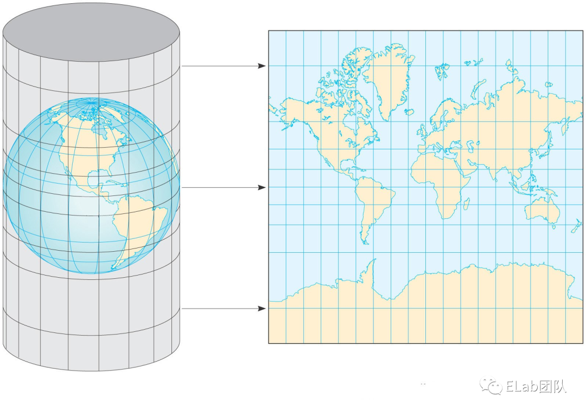

坐标系

1. 为了更好的在球面上进行定位，所以就采取了使用经纬度的方式，在 GIS 开发中，以经度、维度以及相对高度所组成的坐标系将其称作为**地理坐标系（Geographic Coordinate System， 简称 GCS）** 
2. 我们使用的平面地图，称为**投影坐标系（Projection Coordinate System，简称PCS）** 。一个球面从直观上是无法展开成一个连续的，没有褶皱的平面的，因此我们需要一定的数学方法进行转换。

墨卡托投影

1. 主要特点：
   - 经线、纬线分别为平行直线，并且经纬线之间互相垂直
   - 纬度越高的地方，投影面积形变越大，而在纬度无限接近于极点的位置，面积则会无限大，因此纬度的上限和下限分别是北纬 89° 和南纬 89°。
   - 虽然在面积上有形变，但是是各个方向上的均等扩大，所以保证了地图方向、角度以及位置关系的正确性。

Web墨卡托

1. 属于一种不严格的墨卡托投影方式，其被 Google Map 最先发明，计算公式上直接将椭球体（墨卡托投影方式）变成了球体，大大简化了计算公式

EPSG

1. 墨卡托是按地球为椭圆体，web墨卡托则按地球为球体映射，在没有统一标准时，会存在很多映射体系，**EPSG** 就是来管理这些坐标体系的一个组织。
2. EPSG 通过 WKID 来管理不同的坐标体系，每个坐标体系拥有独一无二的WKID。
3. WGS84 （WKID = 4326） 是世界上第一个统一的大地坐标系，所以也被称为世界大地坐标系，常说的GPS定位系统就是依据此坐标系建立的
4. CGCS2000（WKID = 4490）国家大地坐标系
5. GCJ02：火星坐标系，在WGS84 经纬度的基础上进行了一层加密；
6. BD09：在GCJ02 的基础上又进行了一层加密

数据服务

1. WMS (web map service)：地理信息数据被封装成了图片信息并且可以根据用户的请求而动态返回的服务
2. WFS(web feature service)：提供给用户矢量数据并且支持增删改查的服务，比如geoJson
3. 

