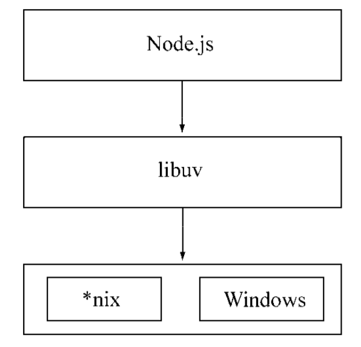
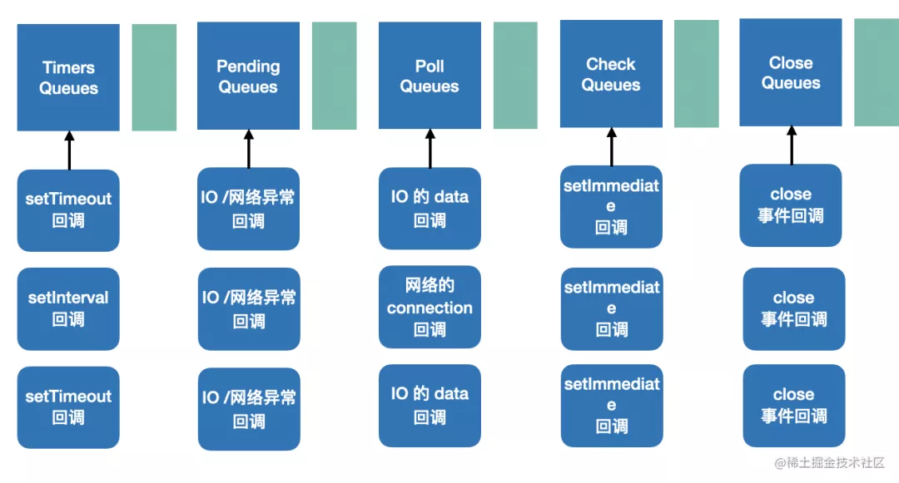

#Node简介

## 概述

1. 目标是写一个基于事件驱动、非阻塞I/O的Web服务器，以达到更高的 性能，提供Apache等服务器之外的选择
2. 是首个将异步作为主要编程方式和设计理念的，Nginx也是这个理念（事件驱动、异步I/O设计理念）设计的
   - Nginx是纯c编写的，性能优异，具备面向客户端管理连接的强大能力
   - 但依然是受限于各种同步方式的编程语言
   - 而node则可以作为服务端处理大量并发请求，还可作为客户端同时发送请求

## 与浏览器的区别

1. Node不处理UI，但用与浏览 器相同的机制和原理运行

2. JavaScript作为一门图灵完备的语言，长 久以来却限制在浏览器的沙箱中运行，它的能力取决于浏览器中间层提供的支持有多少

3. 组件组成对比

   

## 特点

### 概述

1. node没有改变js的语言特性（基于继承链与作用域），只是将思想迁移到服务端

### 单线程

1. 单线程的最大好处
   - 不用像多线程编程那样处处在意状态的同步问题
   - 没有死锁的存在
   - 也没有线程上下文交换所带来的性能上的开销。
2. 重要缺点
   - 无法利用多核CPU
   - 错误会引起整个应用退出，应用的健壮性值得考验
   - 大量计算占用CPU导致无法继续调用异步I/O
3. 与浏览器js执行时间过长会卡住ui一样，node的js执行过长，会卡住后续异步IO调用
4. 为解决这个问题，浏览器可以使用Web Workers，而node借鉴同样的思想：child_process
5. 通过Master-Worker的管理方式，也可以 很好地管理各个工作进程，以达到更高的健壮性。

### 跨平台

1. Node基于libuv实现跨平台的架构示意图：

   

2. 目前，libuv已经成为许多系统实现跨平台的基础组件

## 应用场景

### IO密集型

1. I/O密集的优势主要在于Node利用事件循环的处理能力，而不是启动每一个线程为每一个请求服务，资源占用极少。

### CPU密集型

1. 由于v8引擎的深度优化，node具有优秀的计算能力
2. 主要的挑战是，node是单线程，大量的计算会影响后续IO无法处理
   - 可以适当调整和分解大型运算任务为多个小任务，使得运算能够适时释放，不阻塞I/O调用的发起
3. CPU密集不可怕，如何合理调度是诀窍

# 事件机制

1. 特别要注意，与浏览器的不同
2. 为何不同，node采用V8作为js的解析引擎（浏览器只有chrome用v8解析js），而I/O处理方面使用了自己设计的libuv，libuv是一个基于事件驱动的跨平台抽象层，封装了不同操作系统一些底层特性，对外提供统一的API，事件循环机制也是它里面的实现

## 运行机制

1. V8引擎解析JavaScript脚本。
2. 解析后的代码，调用Node API。
3. libuv库负责Node API的执行。它将不同的任务分配给不同的线程，形成一个Event Loop（事件循环），以异步的方式将任务的执行结果返回给V8引擎。
4. V8引擎再将结果返回给用户。

## 事件循环

1. libuv引擎中的事件循环分为 6 个阶段，它们会按照顺序反复运行。
2. 每当进入某一个阶段的时候，都会从对应的回调队列中取出函数去执行。
3. 当队列为空或者执行的回调函数数量到达系统设定的阈值，就会进入下一阶段。
   - 设定阈值是为了避免下个阶段一直得不到执行
   - 如果执行到 poll 阶段，发现 poll 队列为空并且 timers 队列、check 队列都没有任务要执行，那么就阻塞的等在这里等 IO 事件，而不是空转。 这点设计也是因为服务器主要是处理 IO 的，阻塞在这里可以更早的响应 IO。

## 阶段描述

1. 事件循环操作顺序的简化概览：

   

2. Timers Callback：涉及到时间（ `setTimeout()` 和 `setInterval()` ），肯定越早执行越准确。

3. Pending Callback：处理网络、IO 等异常时的回调，有的 *niux 系统会等待发生错误的上报，所以得处理下。

4. idle，prepare：node内部使用

5. Poll Callback：处理 IO 的 data，网络的 connection，服务器主要处理的就是这个。

6. Check Callback：执行 setImmediate 的回调，特点是刚执行完 IO 之后就能回调这个。

7. Close Callback：关闭资源的回调，晚点执行影响也不到，优先级最低。

### 注意

1. 与浏览器的不同是，浏览器是先执行微任务队列，然后执行宏任务队列
2. node则，可以理解为，每个阶段是一个任务队列

## process.nextTick

1. 独立于 Event Loop 之外的，它有一个自己的队列，当每个阶段完成后，如果存在 nextTick 队列，就会清空队列中的所有回调函数，并且优先于其他 microtask 执行
2. 因此从技术上讲，并不是事件循环的一部分

##  EventLoop 为什么这么设计

1. JavaScript 最早是用于写网页交互逻辑的，为了避免多线程同时修改 dom 的同步问题，设计成了单线程，
2. 为了解决单线程的阻塞问题，加了一层调度逻辑，就是 Loop 循环和 Task 队列，把阻塞的逻辑放到其他线程跑，从而支持了异步。
3. 为了支持高优先级的任务调度，又引入了微任务队列，这就是**浏览器的 Event Loop 机制：每次执行一个宏任务，然后执行所有微任务。**
4. 而Node服务端环境更复杂
   - 对宏任务做了更细粒度的优先级划分：比如定时器 Timer 的逻辑就比 IO 的逻辑优先级高，因为涉及到时间，越早越准确；而 close 资源的处理逻辑优先级就很低，因为不 close 最多多占点内存等资源，影响不大。
   - 又划分了 2 种微任务，分别是 process.nextTick 的微任务和其他的微任务。

