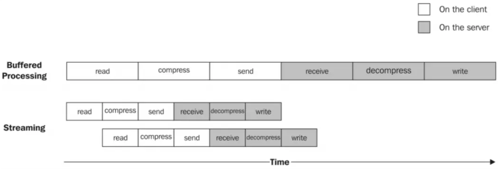

# stream

## 概述

1. 流（Stream）是一个抽象的数据接口，`Node.js`中很多对象都实现了流，因此对于以消费流对象为主的开发者，极少需要直接使用 `stream` 模块
2.  NodeJS 最大只允许写入 2GB 的数据到它的缓冲区，如果高于此值，会报`File size is greater than possible Buffer: 0x7fffffff bytes`错误
3. 在进行 I/O 密集操作的时候（复制、处理、压缩等），最好考虑一下内存的情况。
4. stream主要是将IO密集操作，转为`IO`分批分段进行操作

### 重要性

1. 在`Node.js`中，处理`I / O`的最有效的方法是实时处理，一旦有输入的信息，立马进行处理，一旦有需要输出的结果，也立马输出反馈。

### 组会性

1. 因为`Streams`具有统一的接口，并且就`API`而言，不同`Streams`也可以很好的进行交互。
2. 唯一的先决条件是管道的下一个`Streams`必须支持上一个`Streams`生成的数据类型，可以是二进制，文本甚至是对象

## 与Buffer区别

1. 对于输入操作，`Buffer`模式会将来自资源的所有数据收集到`Buffer`区中; 一旦读取完整个资源，就会把结果传递给回调函数
2. `Streams`允许你在数据到达时立即处理数据

### 空间效率

1. 由于node有缓冲区限制，并且并发读取文件必然会很快将内存消耗光，因此使用流的方式解决这个问题

### 时间效率

1. 如考虑压缩文件上传，服务器解压后存在服务器中，如使用`Buffered`的`API`实现的，只有整个文件都上传成功，解压才能开始

2. 如图，显示了两种方式是时间效率的区别

   

3. 唯一的限制就是每个阶段都必须保证数据块的到达顺序


## API

###  流类型

1. `Node.js`中的每个`Streams`都是`Streams`核心模块中可用的四个基本抽象类之一的实现：
   - `stream.Readable`
   - `stream.Writable`
   - `stream.Duplex`
   - `stream.Transform`
2. 每个`stream`类也是`EventEmitter`的一个实例
3. `Streams`之所以如此灵活，是它不仅能够处理二进制数据，而且几乎可以处理任何`JavaScript`值：
   - 二进制模式：以数据块形式（例如`buffers`或`strings`）流式传输数据
   - 对象模式：将流数据视为一系列离散对象（这使得我们几乎可以使用任何`JavaScript`值）
4. 这两种操作模式使我们不仅可以使用`I/O`流，而且还可以作为一种工具，以函数式的风格优雅地组合处理单元。

### 缓冲

1. 当调用 [`stream.push(chunk)`](http://nodejs.cn/s/8s3paZ) 时，数据会被缓冲在可读流中。 如果流的消费者没有调用 [`stream.read()`](http://nodejs.cn/s/SpgRaa)，则数据会保留在内部队列中直到被消费。
2. 一旦内部的可读缓冲的总大小达到 `highWaterMark` 指定的阈值时，流会暂时停止从底层资源读取数据，直到当前缓冲的数据被消费
3. stream` API 的主要目标，特别是`stream.pipe()`是为了限制数据的缓冲到可接受的程度，也就是读写速度不一致的源头与目的地不会压垮内存
4. 可读又可写流，它们各自维护着两个相互独立的内部缓冲器用于读取和写入，这使得它们在维护数据流时，读取和写入两边可以各自独立地运作

##stream.Readable

### 暂停模式（paused）

1. 必须显式调用 [`stream.read()`](http://nodejs.cn/s/SpgRaa) 读取数据块

2. 默认为此模式，需附加一个可读事件侦听器（readable）

3. 举例：使用标准输入中读取数据

   ```javascript
   process.stdin
     .on('readable', () => {
       let chunk;
       console.log('New data available');
       while ((chunk = process.stdin.read()) !== null) {
         console.log(
           `Chunk read: (${chunk.length}) "${chunk.toString()}"`
         );
       }
     })
     .on('end', () => process.stdout.write('End of stream'));
   ```

4. 可以尝试将我们的程序与其他程序连接起来，使用管道运算符（`|`）：

   ```bash
   cat <path to a file> | node readStdin
   ```

### 流动模式（flowing）

1. 使用`data`作为事件监听，数据不再使用read进行监听，而是一旦有数据到达`data`监听器就被推送到监听器内

2. 上面的代码改为此模式：

   ```javascript
   process.stdin
       .on('data', chunk => {
           console.log('New data available');
           console.log(
               `Chunk read: (${chunk.length}) "${chunk.toString()}"`
           );
       })
       .on('end', () => process.stdout.write('End of stream'));
   ```

3. 虽然看起来更简单，但其灵活性较低，`API`较少

### 实现

1. 需要继承`stream.Readable`的原型来创建一个新的类

2. 重写内部方法`_read()`

3. 假设一个字符串生成的流文件

   ```javascript
   const stream = require('stream');
   
   
   class RandomStream extends stream.Readable {
       constructor(options) {
           super(options);
       }
       _read(size) {
           const chunk = 'xxxxxxxx'; //[1]
           console.log(`Pushing chunk of size: ${chunk.length}`);
           this.push(chunk, 'utf8');
           this.push(null)
       }
   }
   module.exports = RandomStream;
   
   ```

   - 1处生成一些随机字符，利用流的方式传递出去

4. main.js

   ```javascript
   const RandomStream = require('./randomStream');
   const randomStream = new RandomStream();
   
   randomStream.on('readable', () => {
       let chunk;
       while ((chunk = randomStream.read()) !== null) {
           console.log(`Chunk received: ${chunk.toString()}`);
       }
   });
   ```

## stream.Writable

### 写入一个stream

1. 使用：`writable.write(chunk, [encoding], [callback])`

   - encoding默认utf-8
   - callback是：当数据块全部被写入`stream`中时，会触发

2. 为了表示没有更多的数据将被写入`stream`中，必须使用`end()`方法：

   ```javascript
   writable.end([chunk], [encoding], [callback])
   ```

### Back-pressure

1. write函数会返回true或false，避免接收方处理数据过慢，导致缓冲区内存沾满，内存泄漏等问题

2. 整个的机制是：

   - 通过write的true或false，控制是否还要继续写入（false应该停止）
   - drain事件：当缓冲区被清空后，通过此事件，可以继续安全写入

3. 举例：

   ```javascript
   const Chance = require('chance');
   const chance = new Chance();
   
   require('http').createServer((req, res) => {
     res.writeHead(200, {
       'Content-Type': 'text/plain'
     });
   
     function generateMore() { //[1]
       while (chance.bool({
           likelihood: 95
         })) {
         const shouldContinue = res.write(
           chance.string({
             length: (16 * 1024) - 1
           }) //[2]
         );
         if (!shouldContinue) { //[3]
           console.log('Backpressure');
           return res.once('drain', generateMore);
         }
       }
       res.end('\nThe end...\n', () => console.log('All data was sent'));
     }
     generateMore();
   }).listen(8080, () => console.log('Listening on http://localhost:8080'));
   ```

   - 可以在浏览器或通过`curl http://localhost:8080`的方式请求
   - 在node的控制台会看到 Backpressure
   - 避免多次监听事件，可以使用once事件

## 实现

1. 将一个文件普通的文件写入转为一个流

   ```javascript
   const stream = require('stream');
   const fs = require('fs');
   const path = require('path');
   
   class ToFileStream extends stream.Writable {
       constructor() {
           super({
               objectMode: true
           });
       }
       _write(chunk, encoding, callback) {
           fs.writeFile(chunk.path, chunk.content, callback);
       }
   }
   module.exports = ToFileStream;
   ```

   

## stream.Duplex

1. 双重stream，实际就是内部实现了write与read方法

2. 为了使双重的stream在一方以对象模式工作，而在另一方以二进制模式工作，我们需要在流构造器中手动设置以下属性：

   ```javascript
   this._writableState.objectMode
   this._readableState.objectMode
   ```

   

## stream.Transform

## 概述

1. 特殊形式的双重stream
2. 普通的stream，读写之间并没有联系
3. 从外面看，转换的`Streams`的接口与双重`Streams`的接口完全相同，只是会在内部对流进行转换