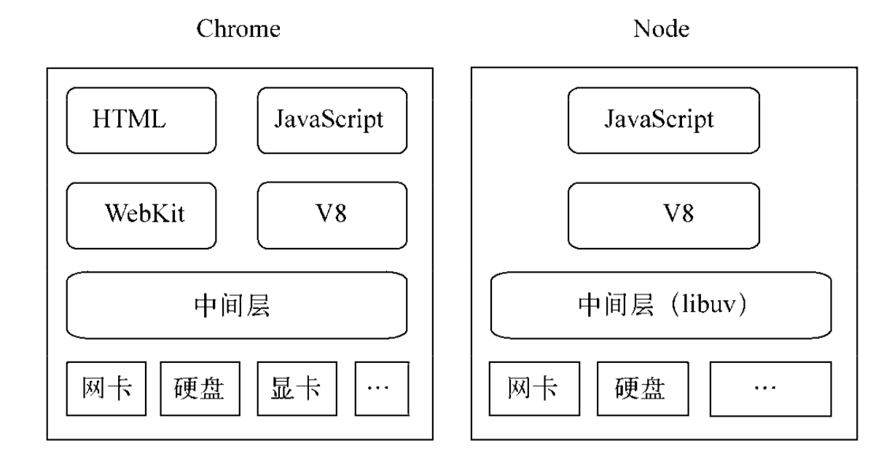
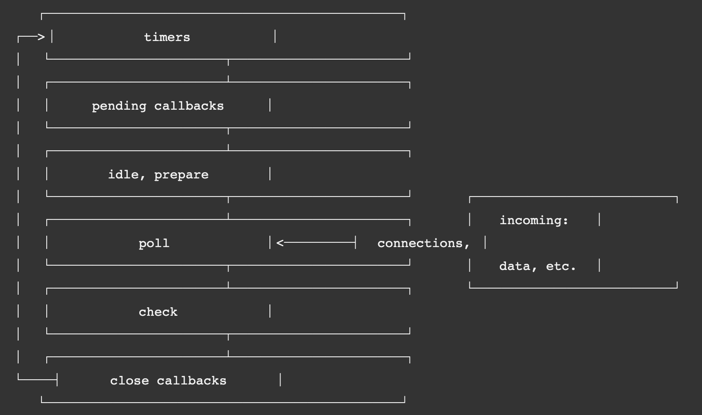

#Node简介

## 概述

1. 目标是写一个基于事件驱动、非阻塞I/O的Web服务器，以达到更高的 性能，提供Apache等服务器之外的选择
2. 是首个将异步作为主要编程方式和设计理念的，Nginx也是这个理念（事件驱动、异步I/O设计理念）设计的
   - Nginx是纯c编写的，性能优异，具备面向客户端管理连接的强大能力
   - 但依然是受限于各种同步方式的编程语言
   - 而node则可以作为服务端处理大量并发请求，还可作为客户端同时发送请求

## 与浏览器的区别

1. Node不处理UI，但用与浏览 器相同的机制和原理运行

2. JavaScript作为一门图灵完备的语言，长 久以来却限制在浏览器的沙箱中运行，它的能力取决于浏览器中间层提供的支持有多少

3. 组件组成对比

   

## 特点

### 概述

1. node没有改变js的语言特性（基于继承链与作用域），只是将思想迁移到服务端

### 单线程

1. 单线程的最大好处
   - 不用像多线程编程那样处处在意状态的同步问题
   - 没有死锁的存在
   - 也没有线程上下文交换所带来的性能上的开销。
2. 重要缺点
   - 无法利用多核CPU
   - 错误会引起整个应用退出，应用的健壮性值得考验
   - 大量计算占用CPU导致无法继续调用异步I/O
3. 与浏览器js执行时间过长会卡住ui一样，node的js执行过长，会卡住后续异步IO调用
4. 为解决这个问题，浏览器可以使用Web Workers，而node借鉴同样的思想：child_process
5. 通过Master-Worker的管理方式，也可以 很好地管理各个工作进程，以达到更高的健壮性。

### 跨平台

1. Node基于libuv实现跨平台的架构示意图：

   

2. 目前，libuv已经成为许多系统实现跨平台的基础组件

## 应用场景

### IO密集型

1. I/O密集的优势主要在于Node利用事件循环的处理能力，而不是启动每一个线程为每一个请求服务，资源占用极少。

### CPU密集型

1. 由于v8引擎的深度优化，node具有优秀的计算能力
2. 主要的挑战是，node是单线程，大量的计算会影响后续IO无法处理
   - 可以适当调整和分解大型运算任务为多个小任务，使得运算能够适时释放，不阻塞I/O调用的发起
3. CPU密集不可怕，如何合理调度是诀窍

# 事件机制

1. 特别要注意，与浏览器的不同
2. 为何不同，node采用V8作为js的解析引擎（浏览器只有chrome用v8解析js），而I/O处理方面使用了自己设计的libuv，libuv是一个基于事件驱动的跨平台抽象层，封装了不同操作系统一些底层特性，对外提供统一的API，事件循环机制也是它里面的实现

## 运行机制

1. V8引擎解析JavaScript脚本。
2. 解析后的代码，调用Node API。
3. libuv库负责Node API的执行。它将不同的任务分配给不同的线程，形成一个Event Loop（事件循环），以异步的方式将任务的执行结果返回给V8引擎。
4. V8引擎再将结果返回给用户。

## 事件循环

1. libuv引擎中的事件循环分为 6 个阶段，它们会按照顺序反复运行。
2. 每当进入某一个阶段的时候，都会从对应的回调队列中取出函数去执行。
3. 当队列为空或者执行的回调函数数量到达系统设定的阈值，就会进入下一阶段。

## 阶段描述

1. 事件循环操作顺序的简化概览：

   

### timers阶段

1. 执行 `setTimeout()` 和 `setInterval()` 的回调函数。

### pending回调

1. 处理一些上一轮循环中的少数未执行的 I/O 回调

### idle，prepare

1. 仅node内部使用

### poll阶段

1. 获取新的I/O事件, 适当的条件下node将阻塞在这里

### check 阶段

1. 执行 setImmediate() 的回调

### close callbacks 阶段

1. 执行 socket 的 close 事件回调

### 注意

1. 与浏览器的不同是，浏览器是先执行微任务队列，然后执行宏任务队列
2. node则，可以理解为，每个阶段是一个任务队列

## process.nextTick

1. 独立于 Event Loop 之外的，它有一个自己的队列，当每个阶段完成后，如果存在 nextTick 队列，就会清空队列中的所有回调函数，并且优先于其他 microtask 执行
2. 因此从技术上讲，并不是事件循环的一部分