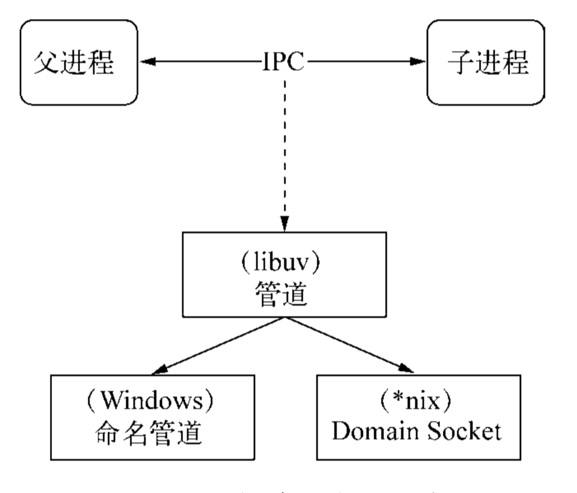

# 进程管理

## 概述

1. node单线程面临的几个问题
   - 一个进程只用一个CPU：如何充分利用多核CPU服务器
   - 单线程如果抛出错误未捕获，则整个进程崩溃：如何􏱘􏱙􏱈保证进程的稳定性与健壮性

## 服务器模型变迁

### 石器时代-同步模式

1. 一次只能处理一个请求，所有请求需要按次序等待服务
2. 它的处理能力相当低下，􏰰假设每次响应服务耗用的时间稳定为*N*􏰱，这类服务的QPS为1/*N*。

### 青铜时代-复制进程

1. 为解决同步模式的并发问题，一个简单的改进是：通过进程复制的方式，每个链接一个进程
2. 在进程复制的过程中，需要复制进程内部的状态，会造成大量浪费
3. 如进程上限是M，则QPS为M/N

### 白银时代-多线程

1. 为了解决进程复制的问题，在一个进程开启多个线程
2. 线程之间可以共享数据，内存浪费可以得到解决，
   - 所面临的并发问题只是比进程稍微好一点，因为每个线程有自己独立的堆栈
   - 由于一个CPU在一个时间只能干一件事，线程数量过多时， 时间将会被耗用在线程上下文切换中
3. 假设，不考虑切换线程上下文的浪费，线程所占用的资源为进程的1/*L*，故QPS为M*L/ N
4. Apache就是采用多线程/多进程模型实现的，并发上万时，内存耗用的问题就会出现

### 黄金时代-事件驱动

1. 采用单线程避免了不必要的内存开销和上下文切换开销
2. 由于所有处理都在单线程上进行，影响事件驱动服务模型性能的点在于CPU的计算能力，它的上限决定这类服务模型的性能上限

## 􏱂多进程架构

### 概述

1. 解决CPU使用不足的问题，前人的经验是启动多进程

2. Node提供了`child_process`模块，和`child_process.fork()`函数供我们实现进程的复制

3. 例如，一个js文件worker.js

   ```javascript
   var fork = require('child_process').fork;
   var cpus = require('os').cpus();
   for (var i = 0; i < cpus.length; i++) {
     fork('./worker.js'); 
   }
   ```

   - 可以通过`ps aux | grep worker.js`查看到进程的数量

4. 一般使用主从模式，主进程负责调度或管理工作进程，趋􏱚向于稳定的，从进程负责具体业务

5. 通过fork的进程，会有一个独立而全新的V8实例，需要至少30􏱫􏰱的启动时间和至少10 MB的内存

### 􏱭􏱮􏱯创建子进程

1. `child_process`模块主要提供4个方法用于创建子进程

   ```javascript
   var cp = require('child_process');
   cp.spawn('node', ['worker.js']);
   cp.exec('node worker.js', function (err, stdout, stderr) {
     // some code 
   });
   cp.execFile('worker.js', function (err, stdout, stderr) { 
     // some code
   }); 
   cp.fork('./worker.js');
   ```

2. 后面3种方法都是spawn()的延伸应用

### 进程间通信

#### node实现方式

1. 主要是通过send方法与on事件

   ```javascript
   // parent.js
   var cp = require('child_process');
   var n = cp.fork(__dirname + '/sub.js');
   n.on('message', function (m) { 
     console.log('PARENT got message:', m);
   });
   n.send({hello: 'world'});
   // sub.js
   process.on('message', function (m) { 
     console.log('CHILD got message:', m);
   });
   process.send({foo: 'bar'});
   ```

   - 主进程，实例化一个子进程n，然后通过`n.send`发送数据，`n.on`接收数据
   - 子进程，通过process.send与process.on 给主进程发送消息，并接收数据

#### 进程间通信原理

1. IPC的全称是Inter-Process Communication，即进程间通信

2. 实现进程间通信的技术有很多，如命名管道、􏲉匿名管道、socket、信号量、共享内存、消息队列、Domain Socket等

3. Node中实现IPC通道的是管道(pipe) 技术，具体实现细节由libuv提供，在 Windows下由命名管道(named pipe)实现，*nix系统则采用Unix Domain Socket实现

   

### 句柄传递

#### 概述

1. 如果多个子进程同时监听一个端口，只有一个可以工作，其他的进程会抛出EADDRINUSE错误（端口占用），这个问题破坏了我们想多个进程监听一个端口的想法
2. 通常做法是：主进程监听80端口，然后将不同端口代理到不同进程上
   - 假设主进程为代理进程，客户端连接代理进程会占用一个文件描述符
   - 代理进程将消息分发给工作进程，还需要建立socket连接，还需要占用一个文件描述符
   - 由于文件描述符是有限的，这种方式严重影响了系统的扩展

#### 传递句柄

1. 为解决这个问题，node 的send函数可以发送句柄：`child.send(message, [sendHandle])`

2. 􏱝􏱞句柄是一种可以用来标识资源的引用，它的内部包含了指向对象的文件􏱜述符

3. 发送句柄的含义是，使主进程接收到socket 请求后，将这个socket直接发送给工作进程（类似参数传递）

   ```javascript
   // parent.js
   var cp = require('child_process');
   var child1 = cp.fork('child.js'); 
   var child2 = cp.fork('child.js');
   var server = require('net').createServer(); 
   server.listen(1337, function () {
     child1.send('server', server); 
     child2.send('server', server);
     // 关闭，避免主进程对1337端口进行响应
     server.close();
   });
   // child.js
   var http = require('http');
   var server = http.createServer(function (req, res) {
     // xxxx
   });
   process.on('message', function (m, tcp) { 
     if (m === 'server') {
       tcp.on('connection', function (socket) { 
         server.emit('connection', socket);
       });
     }
   });
   ```

   - 这样所有请求都由子进程处理

#### 原理

1. 句柄传递看起来像参数传递：但Node进程之间只有消息传递，不会真正地传递对象，这种错觉是􏱡抽象封装􏱢的结果。

2. 子进程对象send可以发送的句柄类型

   - net.Socket。TCP套接字。
   - net.Server。TCP服务器，
   - net.Native。C++层面的TCP套接字或IPC管道。
   - dgram.Socket。UDP套接字。
   - dgram.Native。C++层面的UDP套接字

3. send()方法能发送消息和􏱝􏱞并不意味着它能发送任意对象

4. send函数的底层实现原理

   - 将消息发送到IPC管道前，会将消息封装为两个对象，一个是handler，一个是message如下

     ```json
     {
       cmd: 'NODE_HANDLE', 
       type: 'net.Server',
       msg: message
     }
     ```

   - 然后将message序列化后，通过IPC管道发送

   - 子进程j接收到message后，会被过滤处理，判断message.cmd = 'NODE_HANDLE'，然后通过type还原出对象

#### 为何句柄方式可以多进程监听一个端口

1. 主要是node底层允许不同进程可以就相同的网卡和端口进行􏱟听，服务器端套接字可以被不同的进程复用
2. 独立启动的进程互相之间并不知道文件􏱜述符，即并不是套接字在不同进程复用，而是相同端口使用不同套接字，所以失败
3. 但对于句柄方式，子进程还原的套接字是相同的

## 单机集群稳定之路

1. 还有一些细节需要考虑
   - 性能问题。
   - 多个工作进程的存活状态管理。
   - 工作进程的平滑􏲽重启􏱱
   - 配置或者静态数据的动态重新载入
   - 其他细节。

### 进程事件

1. 主进程还可以监听如下事件
   - error：子进程发生错误时
   - exit：正常退出第一个参数为退出码，否则为null，如果被kill，则第二参数表示杀死进程的信号
   - disconnect：主进程或子进程调用disconnect()方法时􏲖触发
   - close：在子进程的标准输入输出流中􏲿时􏲖发该事件，参数与exit相同
2. kill方法
   - 并不能真正地将通过IPC相连的子进程杀死，它只是给子进程发送了一个系统信号`child.kill([signal]);`
   - 在node命令行中，通过`kill -l`，可以信号类型
   - node为每个信号类型都对应不同事件，这些信号有约定的含义，子进程接收到信号后，也应进行约定行为

### 自动重启

1. 常见的思路是：监听exit事件，发生错误，则创建一个新的子进程

2. 但通常情况下，我们需要处理业务中的bug，如果发现未知错误断开连接

   ```javascript
   process.on('uncaughtException', function () {
     // 􏳟􏳠停止接收新连接 
     worker.close(function () {
       // 􏳛退出进程
       process.exit(1); 
     });
   });
   ```

   - 但这种模式会存在一个问题，是子进程先断开连接，然后主进程才能收到exit信号，创建新的子进程
   - 可能造成没有进程可用的情况

3. 需要改进这个过程，不能等到工作进程退出后才重启新的工作进程。当然也不能暴力退出进程，因为这样会导致已连接的用户直接断开

   - 因此，可以在uncaughtException中发送一个自杀消息，让主进程监听这个消息就新建子进程

     ```javascript
     // worker
     process.on('uncaughtException', function () {
       process.end({act: 'suicide'})
       worker.close(function () {
         process.exit(1); 
       });
     });
     // main
     worker.on('message', function (message) {
       if (message.act === 'suicide') { 
         createWorker();
       }});
     ```

     - 这种方式可以保证在断开连接时，会有新的进程创建

4. 并不是所有连接都是短连接，为已有连接的断开设置一个超时时间是必要的

   ```javascript
   process.on('uncaughtException', function (err) {
     process.send({act: 'suicide'});
     worker.close(function () {
       process.exit(1);
     }); 
     // 超时断开
     setTimeout(function () {
       process.exit(1); 
     }, 5000);
   });
   ```

   - 定时器主要是为了避免`worker.close`由于长链接，长时间得不到响应

5. 进程中如果出现􏳥能捕获的异常，就意味着有那么一􏱓代码在健壮性上是不合􏰞的，因此还需通过日志记录错误

### 负载均衡

1. Node默认的负载均衡策略是：抢占式，谁先抢到谁服务，一般而言这种方式对大家都公平
2. node繁忙是由两部分构成的：CPU和I/O
   - 影响抢占的是CPU空闲程度
   - 某些服务可能是IO繁忙的，但CPU空闲，这时候抢到很多请求，是不合理的
3. 为此，node还提供一种新的􏴜􏱇􏴝策略Round-Robin，称之为轮叫调度
4. 工作方式：由主进程接受连接，将其依次分发给工作进程。分发的􏴜􏱇是在*N*个工作进程中，每次选择第$i = (i + 1)  mod  n$个进程来发送连接
5. 一种简单的负载均衡方式，可以避免CPU和I/O􏳺􏴙􏱳异导致的负载不均􏲑

### 状态共享

1. Node不允􏲃许在多个进程之间共享数据，但实际业务中需要共享一些数据，如配置数据
2. 第三方数据存储
   - 这是最简单最直接的数据共享方式
   - 可以把数据存在磁盘、缓存、数据库等
   - 但这种方式有个问题是：如果数据改变，需要通知子进程更新内部数据状态

#### 状态同步方式

1. 子进程向第三方定时轮询：主要问题是
   - 轮询时间间隔，过长会导致数据无法及时更新，过短会造成资源浪费
   - 子进程都进行轮询，状态响应的第三方压力会很大
2. 主动通知：单独搞一个进行，专门做轮询，获得新数据后，通知其他子进程更新状态
   - 主要是减少轮􏴤询的进程数量

### Cluster 􏰥􏴻模块

1. 用以解决多核CPU的利用率问题，同时也提供了较完整的API，用以处理进程的健壮性问题。

#### 工作原理

1. 事实上cluster模块就是child_process和net模块的组合应用，就是上述《句柄传递》的逻辑
2. 在cluster模块应用中，一个主进程只能管理一组工作进程，而使用child_process操作，可以控制多组工作进程
   - 含义：cluster模块主进程下的工作进程都是同一个js，而利用child_process，工作进程可以是多个js


# Process（进程）

## 概述

1. `process`是一个 `global`全局对象
2. `process` 对象是 [`EventEmitter`](http://nodejs.cn/s/pGAddE) 的实例。

## API

### process.env

1. 返回包含用户环境的对象
2. 因此：使用`process.env.NODE_PATH`实际是返回系统配置的NODE_PATH变量值
3. `process.env`对象并不含有NODE_PATH

