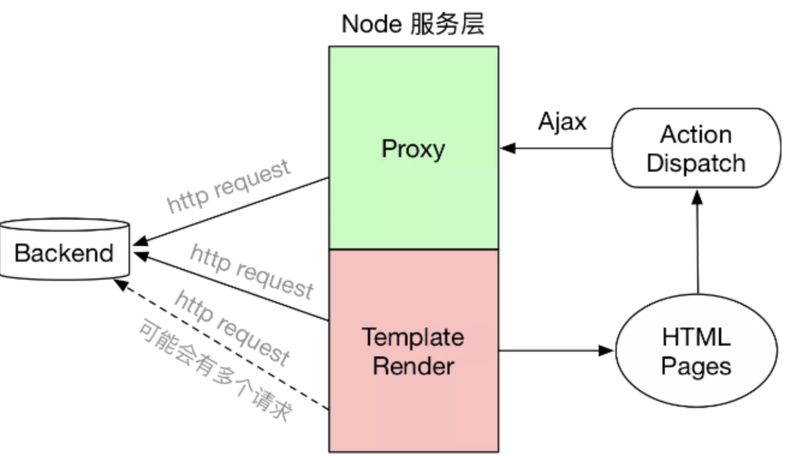
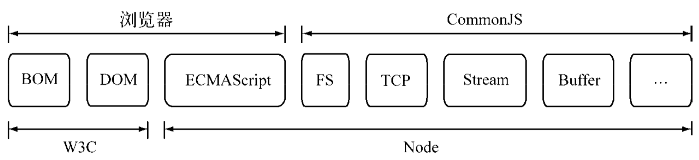
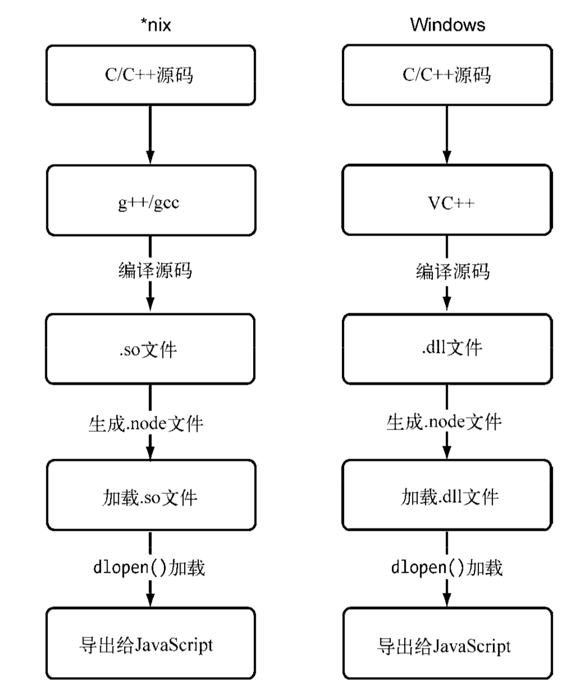

# 学习

1. 《深入浅出nodejs》
   - 20200202
   - 如第四章异步编程，主要从宏观角度，介绍不同库，不同方式解决的问题，或说异步编程遇到的问题，是如何解决的
   - 如第七章网络编程，主要介绍net、dgram、http、https这4个模块构建客户端的基本使用，以及udp，tcp，http基本知识（跳过）
   - 第8章，构建web应用基本常识，从处理请求到响应请求的整个过程的原理性􏹛叙述，框架的底层概括性实现
     - web应用最基本的内容，请求方法、路径解析、cookie等
     - 客户端向服务端提交数据，表单提交
     - 处理不同path的方式
     - node的中间件，如何搞一个函数处理中间件的执行
     - 如何让页面渲染html，自己搞一个模板render函数（未仔细看）
   - 第10章测试
     - 测试框架以mocha为例介绍，概述测试报告，测试覆盖率等如何搞
   - 第11章产品化（略读）
     - 概述成熟的node或说web应用，需要考虑的工程化、部署、日志、性能、监控
2. 《七天学会NodeJS》
   - http://nqdeng.github.io/7-days-nodejs/#1.1
   - 大致粗略看了下，粗略api介绍

# 概述

1. 典型的node作为服务层的前后端结构

   

2. node作用

   - 请求代理
     - 跨域
     - 数据需要二次加工
     - 后端服务部署在内网时，前端无法直接调用
   - 路由
   - 模板渲染

   ## 

# 模块机制

## 概述

1. 在编写每个模块时，都有`require`、`exports`、`module`三个预先定义好的变量可供使用。

## CommonJS 规范

1. 主要出发点：Web在发展，浏览器中出现了更多的标准API，但后端JavaScript 的规范却远远落后

2. CommonJS规范的提出，主要是为了弥补当前JavaScript没有标准的缺陷，以达到具备开发大型应用的基础能力

3. node与w3c、CommonJS的关系

   

## node模块实现

1. Node在实现中并非完全按照规范实现，同时增加了许多自身需要的特性
2. node引入模块需要经历如下3个步骤
   - 路径分析
   - 文件定位
   - 编译执行
3. node的中的模块分为
   - 核心模块：在node启东时，就会加载到内存中，故加载时，只需进行路径分析，因此加载速度最快
   - 文件模块：用户编写的，在运行时动态加载的，需要执行上述3个步骤

### 优先从缓存加载

1. 对于require加载过的文件，node也会进行缓存
2. Node缓存的是编译和执行之后的对象
3. 第二次加载一律使用缓存优先的原则，优先检查核心模块，然后是文件模块

### 路径分析和文件定位

#### 概述

1. node中的模块标识符主要有
   - 核心模块：fs等
   - 相对路径：以.或..开始
   - 绝对路径：以 / 开始
   - 自定义模块：如npm包
2. 试图加载一个与核心模块标识符相同的自定义模块，那是不会成功的
3. 对于相对或绝对路径，分析路径时，require会将路径转换为真实路径，编译后将结果放于缓存中

#### 自定义模块

1. 模块路径
   - 是Node在定位文件模块的具体文件时制定的查找策略
   - 即一个子 -> 祖先的node_modules数组，就是沿路径向上逐级递归，直到根目录下的node_modules目录
   - 当前文件的路径越深，查找耗时会越多，这是自定义模块的加载速度是最慢的原因。

#### 文件定位

1. 文件定位还有文件扩展名的分析、目录和包 的处理
2. require可以不写文件的扩展名，Node会按.js、.json、.node的次序补足扩展名，依次尝试
3. 由于尝试过程实际就是利用fs模块同步阻塞式判断文件是否存在
   - 如果是.node和.json文件，在传递给require() 的标识符中带上扩展名，会加快一点速度
4. 对于npm包，多数情况是`require('test')`得到的是目录，node会将目录当做一个包来处理
   - 会优先查找目录下的package.json，然后解析为一个对象，取main对应的文件进行定位
   - 如果没有package.json或main对应的文件有误，会将index当做默 认文件名，然后依次查找index.js、index.json、index.node。
   - 如果没有解析成功会往父级查找，都解析不对，则报错

### 模块编译

1. 定位到文件后，node会对文件进行编译

   - .js 文件：利用fs模块同步读取后编译执行
   - .node文件：用C/C++编写的扩展文件，通过dlopen()方法
   - .json文件：fs同步读取后，使用`JSON.parse()`得到结果
   - 其他文件：作为js文件解析

2. 通过在代码中访问`require.extensions`可以知道系统中已有的扩展加载方式

3. js模块编译

   - 为何每个模块都可以使用module，export等，node在编译的过程中，对js文件进行了包装

     ```javascript
     (function (exports, require, module, __filename, __dirname) { 
       var math = require('math');
     	exports.area = function (radius) {
     	return Math.PI * radius * radius; };
     });
     ```

   - 在执行之后，模块的exports 属性被返回给了调用方。

   - exports属性上的任何方法和属性都可以被外部调用到

## 核心模块

1. 核心模块分为两类
   - C/C++文件存放在Node项目的src目录下
   -  js文件存放在lib目录下。

### js核心模块编译过程

1. 在编译所有c/c++文件前，需要将所有js文件先编译为c/c++代码

### C/C++核心模块的编译过程

1. 内建模块
   - 全部由C/C++编写的模块
   - 通常不被用户直接调用
   - 性能上优于脚本语言
   - 文件编译时，直接编译为二进制文件，加载在内存中，查找迅速
2. 还有一部分模块是有C/C++编写核心部分，js实现包装或向外导出
   - 这种复合模式，兼容了js开发速度快与C/C++代码效率高的特点
   - 如fs，os等模块

## C/C++扩展模块

1. js典型弱点是位运算，

   - java位运算是在int类型数字基础上
   - js则是在double类型数字上，在进行位运算时，需要先转为int，然后再进行位运算
   - 这个时候可以编写C/C++扩展模块来提升性能

2. 原生模块一定程度上是可以跨平台的，前提是源代码可以支持在*nix和Windows上编译

3. 一个平台下的.node文件在另一个平台下是无法加载执行的

4. 除非JS模块不能满足需求，否则不要轻易使用C/C++（二进制）模块

5. 不同平台上的编译和加载过程

   


## 包与NPM

### 概述

1. CommonJS的包规范的定义其实也十分简单，它由包结构和包描述文件两个部分组成
2. 完全符合CommonJS规范的包目录应该包含如下这些文件
   - package.json:包描述文件。
   - bin:用于存放可执行二进制文件的目录。
   - lib:用于存放JavaScript代码的目录。
   -  doc:用于存放文档的目录。
   - test:用于存放单元测试用例的代码。
3. CommonJS包规范尚处于草案阶段，NPM是居于此规范的实践，并做了一定的取舍，主要是多了4个描述字段
   - author：作者
   - bin：用于命令行工具
   - main：包入口
   - devDependencies：开发依赖

###  NPM钩子命令

1. package.json中scripts字段是让包在安装或者卸载等过程中提供钩子机制

   ```json
   "scripts": {
     "preinstall": "preinstall.js", 
     "install": "install.js",
     "uninstall": "uninstall.js",
     "test": "test.js"
   }
   ```

## 前后端共用模块

1. 浏览器端的js 需要经历从同一个服务器端分发到多个客户端执行
   - 瓶颈在于带宽
   - 需要通过网络加载代码
2. 服务器端js是相同的代码需要多次执行
   - 瓶颈则在于CPU和内存等资源
   - 从磁盘中加载，两者的加载速度不在一个数量级上。

# 异步IO

## 概述

1. 由于程序员不适合通过异步设计程序，故php的设计对调用层不仅屏蔽了异步，甚至连多线程都不提供；php从头到脚都是用同步阻塞的方式来执行的，复杂应用则无法更好的实现并发

## 为何要异步IO

1. 这与Node面向网络而设计不无关系
2. 现在的web应用不是一台服务器可以胜任的了，并发是现代编程中的标准配备了。

### 用户体验

1. 前端通过异步可以消除掉UI阻塞的现象
2. 通过异步请求资源将等待时间从M+N缩短到`max(M,N)`

### 资源分配

1. 完成一组互不相关的任务，通常的做法
   - 单线程同步编程模型会因阻塞I/O导致硬件资源得不到更优的使用
   - 多线程编程模型也因编程中的死锁、状态同步等问题让开发人员头疼
2. Node在两者之间给出了它的方案:
   - 利用单线程，远离多线程死锁、状态同步等问题;
   - 利用异步I/O，让单线程远离阻塞，以更好地使用CPU。

## 异步IO的实现现状

1. 操作系统对异步I/O实现的支持状况

### 异步I/O与非阻塞I/O

1. 从计算机内核I/O而言，异步/同步和阻塞/非阻塞实际上是两回事
2. 操作系统内核对于I/O只有两种方式:
   - 阻塞：在调用阻塞I/O时，应用程序需要等待 I/O完成才返回结果，造成cpu浪费
   - 非阻塞：cpu立即返回，获得的并非完整数据，需要使用轮训的方式确保数据完整性
3. 对内核与系统之间的IO交互不是很理解？？？？？？？？？？？？


## 非 I/O 的异步 API

### 定时器

1. 它们的实现原理与异步I/O比较类似，只是不需要I/O线程池的参与
2. 定时器需要动用红黑树， 创建定时器对象和迭代等操作


### process.nextTick()

1. 为了立即异步执行一个任务，可能会使用setTimeout(fun, 0)
2. 每次调用process.nextTick()方法，只会将回调函数放入队列中，在下一轮Tick时取出执行

### setImmediate

1. process.nextTick()的回调函数保存在一个数组中，setImmediate()的结果 则是保存在链表中
2. 在行为上，process.nextTick()在每轮循环中会将数组中的回调函数全部执行完，而setImmediate()在每轮循环中执行链表中的一个回调函数

## 事件驱动与高性能服务器

1. 每线程/每请求的方式目前还被Apache所采用
2. node通过事件驱动方式，无需为每个请求创建和销毁线程，操作系统在调度任务时因为线程较少，上下文切换的代价很低

# 异步编程

## 难点

1. 异常处理
   - node形成了一种约定，将异常作为回调函数的第一个实参传回，如果为空值， 则表明异步调用没有异常抛出
2. node操作中会有较多的异步依赖关系，如果处理不好，则无法利用好异步I/O带来的并行优势
3. js没有类似的sleep函数，无法对代码进行阻塞
   - 使用while模拟会占用大量cpu时间片
   - 在统一规划业务逻辑之后，调用setTimeout()的效果会更好。
4. 多线程编程
   - Web Workers能解决利用CPU和减少阻塞UI渲染，但是不能解决UI渲染的效率问题

# Buffer

## 概述

1. 在Node中，应用需要处理网络协议、 操作数据库、处理图片、接收上传文件等，在网络流和文件的操作中，还要处理大量二进制数据， JavaScript自有的字符串远远不能满足这些需求，于是Buffer对象应运而生
2. 像Array的对象，主要是操作字节，每个元素是16进制的两位数

## Buffer对象

### 概述

1. 元素只能是0-255的值
2. 给元素的赋值如果小于0，就将该值逐次加256，直到得到一个0到255之间的整数。
3. 如数值大于255，就逐次减256，直到得到0~255区间内的数值。
4. 如是小数，舍弃小数部分，只保留整数部分。

### Buffer内存分配

1. 使用的不是V8堆内存，是在Node的C++层面实现内存的申请的
2. 为了高效地使用申请来的内存，Node采用了slab（动态内存管理机制）分配机制
3. slab就是一块申请好的固定大小的内存区域，分为如下3种状态
   - full：完全分配状态
   - partial：部分分配状态
   - empty：没被分配状态
4. Node以8 KB为界限来区分Buffer是大对象还是小对象

#### 分配小Buffer对象

1. 如指定的Buffer小于8KB，会使用slab一部分

2. 第二次分配时，会检查当前slab剩余空间是否够用

3. 如果够用，则直接使用剩下的slab，否则会重新开启一个新的slab

4. 故，如下形式的Buffer会占用2个8KB的内存

   ```javascript
   new Buffer(1);
   new Buffer(8192);
   ```

   - 第一个Buffer会独占一个8KB的slab

5. 如果多个小的Buffer占用一个slab，只有全部Buffer被清空时，这个8KB的slab内存才会被归还

#### 分配大的Buffer对象

1. 直接使用C++底层的内存，即c++层面的Buffer对象

## Buffer转换

### 字符串转Buffer

1. 利用构造函数`new Buffer(str, [encoding]);`存储的只能是一种编码类型

2. 利用`write()`实现存储多种编码类型字符串

   ```javascript
   buf.write(string, [offset], [length], [encoding])
   ```

   - 不同编码所用的字节长度不同，对于具有多种编码的Buffer，解码时要特别注意

### Buffer转字符串

1. `buf.toString([encoding], [start], [end])`
   - 可以设置encoding(默认为UTF-8)、start、end这3个参数实现整体或局部的转换

### 不支持的编码类型

1. 判断编码是否支持转换：`Buffer.isEncoding(encoding)`
2. 对于不支持的编码类型，可以使用npm包（iconv和iconv-lite）

## Buffer的拼接

### 概述

1. 常见的一种使用方式如下：

   ```javascript
   var fs = require('fs');
   var rs = fs.createReadStream('test.md');
   var data = '';
   rs.on("data", function (chunk){ 
     data += chunk; 
   });
   ```

2. 隐藏的问题是`data += chunk`，这句代码隐藏了`toString()`操作，等价于

   ```javascript
   data = data.toString() + chunk.toString();
   ```

   - chunk对象就是一个Buffer对象

### 乱码是如何产生的

1. 由于中文编码是3个字符，如果Buffer用11个长度接收Buffer，那么会导致后面两个数据无法解析为正确的中文，出现乱码
2. 要关注宽字符被截断的情况

#### setEncoding()

1. 可以利用这个方法，将流返回的数据直接转换为编码后结果

   ```javascript
   var rs = fs.createReadStream('test.md', { highWaterMark: 11});
   rs.setEncoding('utf8');
   rs.on('data', (chunk) => { data += chunk })
   ```

   - 这个返回的结果是中文

2. 设置了编码并没有改变获取数据的次数

   - 只是在调用setEncoding()时，可读流对象在内部设置了一个decoder对象
   - 第一次只会解析9个字符，存储无法解析的2个字符
   - 第二次解析2+11个字符，这样避免乱码

3. 目前只能处理UTF-8、Base64和 UCS-2/UTF-16LE这3种编码。

4. 通过setEncoding()的方式不可否认能解决大部分的乱码问题，但并不能从根本上解决该问题。

### 正确拼接

1. 由于+=实际是调用`buf.toString`，故正确的方式是

   ```javascript
   var chunks = [];
   var size = 0;
   res.on('data', function (chunk) {
     chunks.push(chunk);
     size += chunk.length; 
   });
   res.on('end', function () {
     var buf = Buffer.concat(chunks, size); 
     var str = iconv.decode(buf, 'utf8'); 
   });
   ```

2. 调用`Buffer.concat()`方法生成一个合并的Buffer对象

