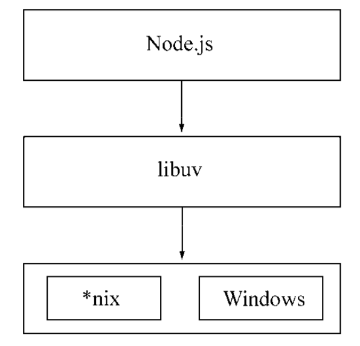

# 概述

1. 《深入浅出nodejs》
   - 20200202
   - 如第四章异步编程，主要从宏观角度，介绍不同库，不同方式解决的问题，或说异步编程遇到的问题，是如何解决的
   - 如第七章网络编程，主要介绍net、dgram、http、https这4个模块构建客户端的基本使用，以及udp，tcp，http基本知识（跳过）
   - 第8章，构建web应用基本常识，从处理请求到响应请求的整个过程的原理性􏹛叙述，框架的底层概括性实现
     - web应用最基本的内容，请求方法、路径解析、cookie等
     - 客户端向服务端提交数据，表单提交
     - 处理不同path的方式
     - node的中间件，如何搞一个函数处理中间件的执行
     - 如何让页面渲染html，自己搞一个模板render函数（未仔细看）
   - 第10章测试（略读）
     - 测试框架以mocha为例介绍，概述测试报告，测试覆盖率等如何搞
   - 第11章产品化（略读）
     - 概述成熟的node或说web应用，需要考虑的工程化、部署、日志、性能、监控
2. 《七天学会NodeJS》
   - http://nqdeng.github.io/7-days-nodejs/#1.1
   - 


#Node简介

## 概述

1. 目标是写一个基于事件驱动、非阻塞I/O的Web服务器，以达到更高的 性能，提供Apache等服务器之外的选择
2. 是首个将异步作为主要编程方式和设计理念的，Nginx也是这个理念（事件驱动、异步I/O设计理念）设计的
   - Nginx是纯c编写的，性能优异，具备面向客户端管理连接的强大能力
   - 但依然是受限于各种同步方式的编程语言
   - 而node则可以作为服务端处理大量并发请求，还可作为客户端同时发送请求

## 与浏览器的区别

1. Node不处理UI，但用与浏览 器相同的机制和原理运行

2. JavaScript作为一门图灵完备的语言，长 久以来却限制在浏览器的沙箱中运行，它的能力取决于浏览器中间层提供的支持有多少

3. 组件组成对比

   

## 特点

### 概述

1. node没有改变js的语言特性（基于继承链与作用域），只是将思想迁移到服务端

### 单线程

1. 单线程的最大好处
   - 不用像多线程编程那样处处在意状态的同步问题
   - 没有死锁的存在
   - 也没有线程上下文交换所带来的性能上的开销。
2. 重要缺点
   - 无法利用多核CPU
   - 错误会引起整个应用退出，应用的健壮性值得考验
   - 大量计算占用CPU导致无法继续调用异步I/O
3. 与浏览器js执行时间过长会卡住ui一样，node的js执行过长，会卡住后续异步IO调用
4. 为解决这个问题，浏览器可以使用Web Workers，而node借鉴同样的思想：child_process
5. 通过Master-Worker的管理方式，也可以 很好地管理各个工作进程，以达到更高的健壮性。

### 跨平台

1. Node基于libuv实现跨平台的架构示意图：

   

2. 目前，libuv已经成为许多系统实现跨平台的基础组件

## 应用场景

### IO密集型

1. I/O密集的优势主要在于Node利用事件循环的处理能力，而不是启动每一个线程为每一个请求服务，资源占用极少。

### CPU密集型

1. 由于v8引擎的深度优化，node具有优秀的计算能力
2. 主要的挑战是，node是单线程，大量的计算会影响后续IO无法处理
   - 可以适当调整和分解大型运算任务为多个小任务，使得运算能够适时释放，不阻塞I/O调用的发起
3. CPU密集不可怕，如何合理调度是诀窍


# 模块机制

## 概述

1. 在编写每个模块时，都有`require`、`exports`、`module`三个预先定义好的变量可供使用。

## CommonJS 规范

1. 主要出发点：Web在发展，浏览器中出现了更多的标准API，但后端JavaScript 的规范却远远落后

2. CommonJS规范的提出，主要是为了弥补当前JavaScript没有标准的缺陷，以达到具备开发大型应用的基础能力

3. node与w3c、CommonJS的关系

   

## node模块实现

1. Node在实现中并非完全按照规范实现，同时增加了许多自身需要的特性
2. node引入模块需要经历如下3个步骤
   - 路径分析
   - 文件定位
   - 编译执行
3. node的中的模块分为
   - 核心模块：在node启东时，就会加载到内存中，故加载时，只需进行路径分析，因此加载速度最快
   - 文件模块：用户编写的，在运行时动态加载的，需要执行上述3个步骤

### 优先从缓存加载

1. 对于require加载过的文件，node也会进行缓存
2. Node缓存的是编译和执行之后的对象
3. 第二次加载一律使用缓存优先的原则，优先检查核心模块，然后是文件模块

### 路径分析和文件定位

#### 概述

1. node中的模块标识符主要有
   - 核心模块：fs等
   - 相对路径：以.或..开始
   - 绝对路径：以 / 开始
   - 自定义模块：如npm包
2. 试图加载一个与核心模块标识符相同的自定义模块，那是不会成功的
3. 对于相对或绝对路径，分析路径时，require会将路径转换为真实路径，编译后将结果放于缓存中

#### 自定义模块

1. 模块路径
   - 是Node在定位文件模块的具体文件时制定的查找策略
   - 即一个子 -> 祖先的node_modules数组，就是沿路径向上逐级递归，直到根目录下的node_modules目录
   - 当前文件的路径越深，查找耗时会越多，这是自定义模块的加载速度是最慢的原因。

#### 文件定位

1. 文件定位还有文件扩展名的分析、目录和包 的处理
2. require可以不写文件的扩展名，Node会按.js、.json、.node的次序补足扩展名，依次尝试
3. 由于尝试过程实际就是利用fs模块同步阻塞式判断文件是否存在
   - 如果是.node和.json文件，在传递给require() 的标识符中带上扩展名，会加快一点速度
4. 对于npm包，多数情况是`require('test')`得到的是目录，node会将目录当做一个包来处理
   - 会优先查找目录下的package.json，然后解析为一个对象，取main对应的文件进行定位
   - 如果没有package.json或main对应的文件有误，会将index当做默 认文件名，然后依次查找index.js、index.json、index.node。
   - 如果没有解析成功会往父级查找，都解析不对，则报错

### 模块编译

1. 定位到文件后，node会对文件进行编译

   - .js 文件：利用fs模块同步读取后编译执行
   - .node文件：用C/C++编写的扩展文件，通过dlopen()方法
   - .json文件：fs同步读取后，使用`JSON.parse()`得到结果
   - 其他文件：作为js文件解析

2. 通过在代码中访问`require.extensions`可以知道系统中已有的扩展加载方式

3. js模块编译

   - 为何每个模块都可以使用module，export等，node在编译的过程中，对js文件进行了包装

     ```javascript
     (function (exports, require, module, __filename, __dirname) { 
       var math = require('math');
     	exports.area = function (radius) {
     	return Math.PI * radius * radius; };
     });
     ```

   - 在执行之后，模块的exports 属性被返回给了调用方。

   - exports属性上的任何方法和属性都可以被外部调用到

## 核心模块

1. 核心模块分为两类
   - C/C++文件存放在Node项目的src目录下
   -  js文件存放在lib目录下。

### js核心模块编译过程

1. 在编译所有c/c++文件前，需要将所有js文件先编译为c/c++代码

### C/C++核心模块的编译过程

1. 内建模块
   - 全部由C/C++编写的模块
   - 通常不被用户直接调用
   - 性能上优于脚本语言
   - 文件编译时，直接编译为二进制文件，加载在内存中，查找迅速
2. 还有一部分模块是有C/C++编写核心部分，js实现包装或向外导出
   - 这种复合模式，兼容了js开发速度快与C/C++代码效率高的特点
   - 如fs，os等模块

## C/C++扩展模块

1. js典型弱点是位运算，

   - java位运算是在int类型数字基础上
   - js则是在double类型数字上，在进行位运算时，需要先转为int，然后再进行位运算
   - 这个时候可以编写C/C++扩展模块来提升性能

2. 原生模块一定程度上是可以跨平台的，前提是源代码可以支持在*nix和Windows上编译

3. 一个平台下的.node文件在另一个平台下是无法加载执行的

4. 除非JS模块不能满足需求，否则不要轻易使用C/C++（二进制）模块

5. 不同平台上的编译和加载过程

   


## 包与NPM

### 概述

1. CommonJS的包规范的定义其实也十分简单，它由包结构和包描述文件两个部分组成
2. 完全符合CommonJS规范的包目录应该包含如下这些文件
   - package.json:包描述文件。
   - bin:用于存放可执行二进制文件的目录。
   - lib:用于存放JavaScript代码的目录。
   -  doc:用于存放文档的目录。
   - test:用于存放单元测试用例的代码。
3. CommonJS包规范尚处于草案阶段，NPM是居于此规范的实践，并做了一定的取舍，主要是多了4个描述字段
   - author：作者
   - bin：用于命令行工具
   - main：包入口
   - devDependencies：开发依赖

###  NPM钩子命令

1. package.json中scripts字段是让包在安装或者卸载等过程中提供钩子机制

   ```json
   "scripts": {
     "preinstall": "preinstall.js", 
     "install": "install.js",
     "uninstall": "uninstall.js",
     "test": "test.js"
   }
   ```

## 前后端共用模块

1. 浏览器端的js 需要经历从同一个服务器端分发到多个客户端执行
   - 瓶颈在于带宽
   - 需要通过网络加载代码
2. 服务器端js是相同的代码需要多次执行
   - 瓶颈则在于CPU和内存等资源
   - 从磁盘中加载，两者的加载速度不在一个数量级上。

# 异步IO

## 概述

1. 由于程序员不适合通过异步设计程序，故php的设计对调用层不仅屏蔽了异步，甚至连多线程都不提供；php从头到脚都是用同步阻塞的方式来执行的，复杂应用则无法更好的实现并发

## 为何要异步IO

1. 这与Node面向网络而设计不无关系
2. 现在的web应用不是一台服务器可以胜任的了，并发是现代编程中的标准配备了。

### 用户体验

1. 前端通过异步可以消除掉UI阻塞的现象
2. 通过异步请求资源将等待时间从M+N缩短到`max(M,N)`

### 资源分配

1. 完成一组互不相关的任务，通常的做法
   - 单线程同步编程模型会因阻塞I/O导致硬件资源得不到更优的使用
   - 多线程编程模型也因编程中的死锁、状态同步等问题让开发人员头疼
2. Node在两者之间给出了它的方案:
   - 利用单线程，远离多线程死锁、状态同步等问题;
   - 利用异步I/O，让单线程远离阻塞，以更好地使用CPU。

## 异步IO的实现现状

1. 操作系统对异步I/O实现的支持状况

### 异步I/O与非阻塞I/O

1. 从计算机内核I/O而言，异步/同步和阻塞/非阻塞实际上是两回事
2. 操作系统内核对于I/O只有两种方式:
   - 阻塞：在调用阻塞I/O时，应用程序需要等待 I/O完成才返回结果，造成cpu浪费
   - 非阻塞：cpu立即返回，获得的并非完整数据，需要使用轮训的方式确保数据完整性
3. 对内核与系统之间的IO交互不是很理解？？？？？？？？？？？？


## 非 I/O 的异步 API

### 定时器

1. 它们的实现原理与异步I/O比较类似，只是不需要I/O线程池的参与
2. 定时器需要动用红黑树， 创建定时器对象和迭代等操作


### process.nextTick()

1. 为了立即异步执行一个任务，可能会使用setTimeout(fun, 0)
2. 每次调用process.nextTick()方法，只会将回调函数放入队列中，在下一轮Tick时取出执行

### setImmediate

1. process.nextTick()的回调函数保存在一个数组中，setImmediate()的结果 则是保存在链表中
2. 在行为上，process.nextTick()在每轮循环中会将数组中的回调函数全部执行完，而setImmediate()在每轮循环中执行链表中的一个回调函数

## 事件驱动与高性能服务器

1. 每线程/每请求的方式目前还被Apache所采用
2. node通过事件驱动方式，无需为每个请求创建和销毁线程，操作系统在调度任务时因为线程较少，上下文切换的代价很低

# 异步编程

## 难点

1. 异常处理
   - node形成了一种约定，将异常作为回调函数的第一个实参传回，如果为空值， 则表明异步调用没有异常抛出
2. node操作中会有较多的异步依赖关系，如果处理不好，则无法利用好异步I/O带来的并行优势
3. js没有类似的sleep函数，无法对代码进行阻塞
   - 使用while模拟会占用大量cpu时间片
   - 在统一规划业务逻辑之后，调用setTimeout()的效果会更好。
4. 多线程编程
   - Web Workers能解决利用CPU和减少阻塞UI渲染，但是不能解决UI渲染的效率问题

# Buffer

## 概述

1. 在Node中，应用需要处理网络协议、 操作数据库、处理图片、接收上传文件等，在网络流和文件的操作中，还要处理大量二进制数据， JavaScript自有的字符串远远不能满足这些需求，于是Buffer对象应运而生
2. 像Array的对象，主要是操作字节，每个元素是16进制的两位数

## Buffer对象

### 概述

1. 元素只能是0-255的值
2. 给元素的赋值如果小于0，就将该值逐次加256，直到得到一个0到255之间的整数。
3. 如数值大于255，就逐次减256，直到得到0~255区间内的数值。
4. 如是小数，舍弃小数部分，只保留整数部分。

### Buffer内存分配

1. 使用的不是V8堆内存，是在Node的C++层面实现内存的申请的
2. 为了高效地使用申请来的内存，Node采用了slab（动态内存管理机制）分配机制
3. slab就是一块申请好的固定大小的内存区域，分为如下3种状态
   - full：完全分配状态
   - partial：部分分配状态
   - empty：没被分配状态
4. Node以8 KB为界限来区分Buffer是大对象还是小对象

#### 分配小Buffer对象

1. 如指定的Buffer小于8KB，会使用slab一部分

2. 第二次分配时，会检查当前slab剩余空间是否够用

3. 如果够用，则直接使用剩下的slab，否则会重新开启一个新的slab

4. 故，如下形式的Buffer会占用2个8KB的内存

   ```javascript
   new Buffer(1);
   new Buffer(8192);
   ```

   - 第一个Buffer会独占一个8KB的slab

5. 如果多个小的Buffer占用一个slab，只有全部Buffer被清空时，这个8KB的slab内存才会被归还

#### 分配大的Buffer对象

1. 直接使用C++底层的内存，即c++层面的Buffer对象

## Buffer转换

### 字符串转Buffer

1. 利用构造函数`new Buffer(str, [encoding]);`存储的只能是一种编码类型

2. 利用`write()`实现存储多种编码类型字符串

   ```javascript
   buf.write(string, [offset], [length], [encoding])
   ```

   - 不同编码所用的字节长度不同，对于具有多种编码的Buffer，解码时要特别注意

### Buffer转字符串

1. `buf.toString([encoding], [start], [end])`
   - 可以设置encoding(默认为UTF-8)、start、end这3个参数实现整体或局部的转换

### 不支持的编码类型

1. 判断编码是否支持转换：`Buffer.isEncoding(encoding)`
2. 对于不支持的编码类型，可以使用npm包（iconv和iconv-lite）

## Buffer的拼接

### 概述

1. 常见的一种使用方式如下：

   ```javascript
   var fs = require('fs');
   var rs = fs.createReadStream('test.md');
   var data = '';
   rs.on("data", function (chunk){ 
     data += chunk; 
   });
   ```

2. 隐藏的问题是`data += chunk`，这句代码隐藏了`toString()`操作，等价于

   ```javascript
   data = data.toString() + chunk.toString();
   ```

   - chunk对象就是一个Buffer对象

### 乱码是如何产生的

1. 由于中文编码是3个字符，如果Buffer用11个长度接收Buffer，那么会导致后面两个数据无法解析为正确的中文，出现乱码
2. 要关注宽字符被截断的情况

#### setEncoding()

1. 可以利用这个方法，将流返回的数据直接转换为编码后结果

   ```javascript
   var rs = fs.createReadStream('test.md', { highWaterMark: 11});
   rs.setEncoding('utf8');
   rs.on('data', (chunk) => { data += chunk })
   ```

   - 这个返回的结果是中文

2. 设置了编码并没有改变获取数据的次数

   - 只是在调用setEncoding()时，可读流对象在内部设置了一个decoder对象
   - 第一次只会解析9个字符，存储无法解析的2个字符
   - 第二次解析2+11个字符，这样避免乱码

3. 目前只能处理UTF-8、Base64和 UCS-2/UTF-16LE这3种编码。

4. 通过setEncoding()的方式不可否认能解决大部分的乱码问题，但并不能从根本上解决该问题。

### 正确拼接

1. 由于+=实际是调用`buf.toString`，故正确的方式是

   ```javascript
   var chunks = [];
   var size = 0;
   res.on('data', function (chunk) {
     chunks.push(chunk);
     size += chunk.length; 
   });
   res.on('end', function () {
     var buf = Buffer.concat(chunks, size); 
     var str = iconv.decode(buf, 'utf8'); 
   });
   ```

2. 调用`Buffer.concat()`方法生成一个合并的Buffer对象

# 构建web应用

## 基础功能

### 􏵷􏵸􏵹请求方法

1. 请求方法存在于􏱻文的第一行的第一个单词，通常是大写
2. 通过`req.method` 获得请求方法，可以根据不同的请求方法，进行不同处理
3. 在RESTful类Web服务中请求方法十分重要，它决定资源的操作行为。
   - PUT代表新建一个资源
   - POST表示要更新一个资源
   - GET表示查看一个资源
   - DELETE表示􏵻除一个资源

### 路径解析

1. 路径可能对应着静态服务器，即路径地址直接获取文件
2. 路径多数是对应的action，不同路径会执行不同action，执行不同逻辑

### 查询字符串

1. 将查询字符串转换为对象
   - querystring模块􏶆􏱂􏶇􏶈􏶅􏶆􏱂􏶇􏶈：`querystring.parse(url.parse(req.url).query)`
   - 或直接：`url.parse(req.url, true).query`

## 数据上传

### 概述

1. Node的http模块只对HTTP􏱻文的􏴻部进行了解􏲈，然后􏰩发request事件，如请求还带有内容，需用户自己判断解析

2. 通过􏱻􏴻的Transfer-Encoding或Content-Length即可判断请求中是否带有内容

   ```javascript
   var hasBody = function(req) {
     return 'transfer-encoding' in req.headers || 'content-length' in req.headers;
   };
   ```

3. 在HTTP_Parser解􏲈􏱻􏴻结束后，􏱻文内容部分会通过data事件􏰩发

   ```javascript
   function (req, res) { 
     if (hasBody(req)) { 
       var buffers = [];
       req.on('data', function (chunk) {
         buffers.push(chunk);
       });
       req.on('end', function () {
         req.rawBody = Buffer.concat(buffers).toString();
         handle(req, res);
       }); 
     }else{ 
       handle(req, res);
     } }
   ```

### 表单数据

1. 􏰰􏰱默认的表单提交，请求􏴻中的Content-Type字􏰐值为application/x-www-form-urlencoded
2. 直接使用：`querystring.parse(req.rawBody)`就可以解析

### JSON数据

1. content-type中，JSON类型的值为application/json
2. 通过JSON.parse可以直接进行解析

### 附件上传

1. 通常的表单，其内容可以通过urlencoded的方式编码内容􏳏成􏱻文体，再发送给服务器端
2. 但对于文件上传，使用文件上传控件，并且需要指定表单􏰶性enctype为multipart/form-data
3. 可以使用formidable模块，他基于流式处理解􏲈􏱻报文，将接收到的文件写入到系统 的􏸠时文件􏸡中，并返回对应的路路径

### 内存与安全

1. 上面解析表单数据的策略是，先保存用户提交的所有数据（`buffers.push(chunk)`），然后再解析􏲈处理（`Buffer.concat(buffers).toString();`），最后才传递给业务逻辑（`handle(req, res);`）
2. 如果数据量变大，会导致内存被占光，解决方案
   - 限制上传内容的大小，一􏰘超过限制，􏴿􏳑接收数据，并响应400状态码
   - 通过流式解解析，将数据流导向到􏰟􏰠磁盘中，Node只保留文件路路径等小数据。
3. 限制大小的方式
   - 如果存在content-length，可以直接通过此判断
   - 否则可以在接收data时，判断接收的chunk.length，超过限制后，则不再接收

## 路由解析

### 文件路径

1. 静态文件：path执行的就是文件，无需转换，直接将请求路径对应的文件发给客户端即可

### MVC

1. 路径对应的不是文件，而是某个action
2. 如果不使用框架，可以自建路由表，利用手动添加或正则的方式，将patch对应到不同的函数上

### RESTful

1. 直到RESTful的流行，大家才意识到URL也可以设计得很规范， 请求方法也能作为逻辑分发的单元
2. REST的全称是Representational State Transfer，中文含义为表现层状态转化。
3. 符合REST规范的设计，我们称为RESTful设计。
4. 设计􏹄思想：主要将服务器端提供的内容实体看作一个资源， 并表现在URL上。
5. 举例说明，比如一个用户的地址：/users/jacksontian，之前增删改查设计为：
   - POST /user/add?username=jacksontian
   - GET /user/remove?username=jacksontian
   - POST /user/update?username=jacksontian 
   - GET /user/get?username=jacksontian
6. 而RESTful利用不同的请求，对/users/jacksontian发起请求，获得不一样的结果
   - POST /user/jacksontian 
   - DELETE /user/jacksontian 
   - PUT /user/jacksontian 
   - GET /user/jacksontian
   - RESTful的设计，与path无关
7. 相比MVC，RESTful只是将HTTP请求方法也加入了路由的过程，以及在URL路径上体现得更资源化

## 中间件

### 概述

1. 中间件(middleware)是来简化和隔􏸇离这些基础设施与业务逻辑之间的细节，􏱅开发者能够关注在业务的开发上，提高效率

2. 由于Node异步的原因，需要提供一种机制，在当前中间件处理完成后，通知下一个中间件执行，一般中间件的形式：

   ```javascript
   var middleware = function (req, res, next) { 
     // xxxxxx
     next();
   }
   ```

3. 由于每个中间件是异步函数，故需要自己处理异常，然后通过next(err)，进行传递

# 进程管理

## 概述

1. node单线程面临的几个问题
   - 一个进程只用一个CPU：如何充分利用多核CPU服务器
   - 单线程如果抛出错误未捕获，则整个进程崩溃：如何􏱘􏱙􏱈保证进程的稳定性与健壮性

## 服务器模型变迁

### 石器时代-同步模式

1. 一次只能处理一个请求，所有请求需要按次序等待服务
2. 它的处理能力相当低下，􏰰假设每次响应服务耗用的时间稳定为*N*􏰱，这类服务的QPS为1/*N*。

### 青铜时代-复制进程

1. 为解决同步模式的并发问题，一个简单的改进是：通过进程复制的方式，每个链接一个进程
2. 在进程复制的过程中，需要复制进程内部的状态，会造成大量浪费
3. 如进程上限是M，则QPS为M/N

### 白银时代-多线程

1. 为了解决进程复制的问题，在一个进程开启多个线程
2. 线程之间可以共享数据，内存浪费可以得到解决，
   - 所面临的并发问题只是比进程稍微好一点，因为每个线程有自己独立的堆栈
   - 由于一个CPU在一个时间只能干一件事，线程数量过多时， 时间将会被耗用在线程上下文切换中
3. 假设，不考虑切换线程上下文的浪费，线程所占用的资源为进程的1/*L*，故QPS为M*L/ N
4. Apache就是采用多线程/多进程模型实现的，并发上万时，内存耗用的问题就会出现

### 黄金时代-事件驱动

1. 采用单线程避免了不必要的内存开销和上下文切换开销
2. 由于所有处理都在单线程上进行，影响事件驱动服务模型性能的点在于CPU的计算能力，它的上限决定这类服务模型的性能上限

## 􏱂多进程架构

### 概述

1. 解决CPU使用不足的问题，前人的经验是启动多进程

2. Node提供了`child_process`模块，和`child_process.fork()`函数供我们实现进程的复制

3. 例如，一个js文件worker.js

   ```javascript
   var fork = require('child_process').fork;
   var cpus = require('os').cpus();
   for (var i = 0; i < cpus.length; i++) {
     fork('./worker.js'); 
   }
   ```

   - 可以通过`ps aux | grep worker.js`查看到进程的数量

4. 一般使用主从模式，主进程负责调度或管理工作进程，趋􏱚向于稳定的，从进程负责具体业务

5. 通过fork的进程，会有一个独立而全新的V8实例，需要至少30􏱫􏰱的启动时间和至少10 MB的内存

### 􏱭􏱮􏱯创建子进程

1. `child_process`模块主要提供4个方法用于创建子进程

   ```javascript
   var cp = require('child_process');
   cp.spawn('node', ['worker.js']);
   cp.exec('node worker.js', function (err, stdout, stderr) {
     // some code 
   });
   cp.execFile('worker.js', function (err, stdout, stderr) { 
     // some code
   }); 
   cp.fork('./worker.js');
   ```

2. 后面3种方法都是spawn()的延伸应用

### 进程间通信

#### node实现方式

1. 主要是通过send方法与on事件

   ```javascript
   // parent.js
   var cp = require('child_process');
   var n = cp.fork(__dirname + '/sub.js');
   n.on('message', function (m) { 
     console.log('PARENT got message:', m);
   });
   n.send({hello: 'world'});
   // sub.js
   process.on('message', function (m) { 
     console.log('CHILD got message:', m);
   });
   process.send({foo: 'bar'});
   ```

   - 主进程，实例化一个子进程n，然后通过`n.send`发送数据，`n.on`接收数据
   - 子进程，通过process.send与process.on 给主进程发送消息，并接收数据

#### 进程间通信原理

1. IPC的全称是Inter-Process Communication，即进程间通信

2. 实现进程间通信的技术有很多，如命名管道、􏲉匿名管道、socket、信号量、共享内存、消息队列、Domain Socket等

3. Node中实现IPC通道的是管道(pipe) 技术，具体实现细节由libuv提供，在 Windows下由命名管道(named pipe)实现，*nix系统则采用Unix Domain Socket实现

   

### 句柄传递

#### 概述

1. 如果多个子进程同时监听一个端口，只有一个可以工作，其他的进程会抛出EADDRINUSE错误（端口占用），这个问题破坏了我们想多个进程监听一个端口的想法
2. 通常做法是：主进程监听80端口，然后将不同端口代理到不同进程上
   - 假设主进程为代理进程，客户端连接代理进程会占用一个文件描述符
   - 代理进程将消息分发给工作进程，还需要建立socket连接，还需要占用一个文件描述符
   - 由于文件描述符是有限的，这种方式严重影响了系统的扩展

#### 传递句柄

1. 为解决这个问题，node 的send函数可以发送句柄：`child.send(message, [sendHandle])`

2. 􏱝􏱞句柄是一种可以用来标识资源的引用，它的内部包含了指向对象的文件􏱜述符

3. 发送句柄的含义是，使主进程接收到socket 请求后，将这个socket直接发送给工作进程（类似参数传递）

   ```javascript
   // parent.js
   var cp = require('child_process');
   var child1 = cp.fork('child.js'); 
   var child2 = cp.fork('child.js');
   var server = require('net').createServer(); 
   server.listen(1337, function () {
     child1.send('server', server); 
     child2.send('server', server);
     // 关闭，避免主进程对1337端口进行响应
     server.close();
   });
   // child.js
   var http = require('http');
   var server = http.createServer(function (req, res) {
     // xxxx
   });
   process.on('message', function (m, tcp) { 
     if (m === 'server') {
       tcp.on('connection', function (socket) { 
         server.emit('connection', socket);
       });
     }
   });
   ```

   - 这样所有请求都由子进程处理

#### 原理

1. 句柄传递看起来像参数传递：但Node进程之间只有消息传递，不会真正地传递对象，这种错觉是􏱡抽象封装􏱢的结果。

2. 子进程对象send可以发送的句柄类型

   - net.Socket。TCP套接字。
   - net.Server。TCP服务器，
   - net.Native。C++层面的TCP套接字或IPC管道。
   - dgram.Socket。UDP套接字。
   - dgram.Native。C++层面的UDP套接字

3. send()方法能发送消息和􏱝􏱞并不意味着它能发送任意对象

4. send函数的底层实现原理

   - 将消息发送到IPC管道前，会将消息封装为两个对象，一个是handler，一个是message如下

     ```json
     {
       cmd: 'NODE_HANDLE', 
       type: 'net.Server',
       msg: message
     }
     ```

   - 然后将message序列化后，通过IPC管道发送

   - 子进程j接收到message后，会被过滤处理，判断message.cmd = 'NODE_HANDLE'，然后通过type还原出对象

#### 为何句柄方式可以多进程监听一个端口

1. 主要是node底层允许不同进程可以就相同的网卡和端口进行􏱟听，服务器端套接字可以被不同的进程复用
2. 独立启动的进程互相之间并不知道文件􏱜述符，即并不是套接字在不同进程复用，而是相同端口使用不同套接字，所以失败
3. 但对于句柄方式，子进程还原的套接字是相同的

## 单机集群稳定之路

1. 还有一些细节需要考虑
   - 性能问题。
   - 多个工作进程的存活状态管理。
   - 工作进程的平滑􏲽重启􏱱
   - 配置或者静态数据的动态重新载入
   - 其他细节。

### 进程事件

1. 主进程还可以监听如下事件
   - error：子进程发生错误时
   - exit：正常退出第一个参数为退出码，否则为null，如果被kill，则第二参数表示杀死进程的信号
   - disconnect：主进程或子进程调用disconnect()方法时􏲖触发
   - close：在子进程的标准输入输出流中􏲿时􏲖发该事件，参数与exit相同
2. kill方法
   - 并不能真正地将通过IPC相连的子进程杀死，它只是给子进程发送了一个系统信号`child.kill([signal]);`
   - 在node命令行中，通过`kill -l`，可以信号类型
   - node为每个信号类型都对应不同事件，这些信号有约定的含义，子进程接收到信号后，也应进行约定行为

### 自动重启

1. 常见的思路是：监听exit事件，发生错误，则创建一个新的子进程

2. 但通常情况下，我们需要处理业务中的bug，如果发现未知错误断开连接

   ```javascript
   process.on('uncaughtException', function () {
     // 􏳟􏳠停止接收新连接 
     worker.close(function () {
       // 􏳛退出进程
       process.exit(1); 
     });
   });
   ```

   - 但这种模式会存在一个问题，是子进程先断开连接，然后主进程才能收到exit信号，创建新的子进程
   - 可能造成没有进程可用的情况

3. 需要改进这个过程，不能等到工作进程退出后才重启新的工作进程。当然也不能暴力退出进程，因为这样会导致已连接的用户直接断开

   - 因此，可以在uncaughtException中发送一个自杀消息，让主进程监听这个消息就新建子进程

     ```javascript
     // worker
     process.on('uncaughtException', function () {
       process.end({act: 'suicide'})
       worker.close(function () {
         process.exit(1); 
       });
     });
     // main
     worker.on('message', function (message) {
       if (message.act === 'suicide') { 
         createWorker();
       }});
     ```

     - 这种方式可以保证在断开连接时，会有新的进程创建

4. 并不是所有连接都是短连接，为已有连接的断开设置一个超时时间是必要的

   ```javascript
   process.on('uncaughtException', function (err) {
     process.send({act: 'suicide'});
     worker.close(function () {
       process.exit(1);
     }); 
     // 超时断开
     setTimeout(function () {
       process.exit(1); 
     }, 5000);
   });
   ```

   - 定时器主要是为了避免`worker.close`由于长链接，长时间得不到响应

5. 进程中如果出现􏳥能捕获的异常，就意味着有那么一􏱓代码在健壮性上是不合􏰞的，因此还需通过日志记录错误

### 负载均衡

1. Node默认的负载均衡策略是：抢占式，谁先抢到谁服务，一般而言这种方式对大家都公平
2. node繁忙是由两部分构成的：CPU和I/O
   - 影响抢占的是CPU空闲程度
   - 某些服务可能是IO繁忙的，但CPU空闲，这时候抢到很多请求，是不合理的
3. 为此，node还提供一种新的􏴜􏱇􏴝策略Round-Robin，称之为轮叫调度
4. 工作方式：由主进程接受连接，将其依次分发给工作进程。分发的􏴜􏱇是在*N*个工作进程中，每次选择第$i = (i + 1)  mod  n$个进程来发送连接
5. 一种简单的负载均衡方式，可以避免CPU和I/O􏳺􏴙􏱳异导致的负载不均􏲑

### 状态共享

1. Node不允􏲃许在多个进程之间共享数据，但实际业务中需要共享一些数据，如配置数据
2. 第三方数据存储
   - 这是最简单最直接的数据共享方式
   - 可以把数据存在磁盘、缓存、数据库等
   - 但这种方式有个问题是：如果数据改变，需要通知子进程更新内部数据状态

#### 状态同步方式

1. 子进程向第三方定时轮询：主要问题是
   - 轮询时间间隔，过长会导致数据无法及时更新，过短会造成资源浪费
   - 子进程都进行轮询，状态响应的第三方压力会很大
2. 主动通知：单独搞一个进行，专门做轮询，获得新数据后，通知其他子进程更新状态
   - 主要是减少轮􏴤询的进程数量

### Cluster 􏰥􏴻模块

1. 用以解决多核CPU的利用率问题，同时也提供了较完整的API，用以处理进程的健壮性问题。

#### 工作原理

1. 事实上cluster模块就是child_process和net模块的组合应用，就是上述《句柄传递》的逻辑
2. 在cluster模块应用中，一个主进程只能管理一组工作进程，而使用child_process操作，可以控制多组工作进程
   - 含义：cluster模块主进程下的工作进程都是同一个js，而利用child_process，工作进程可以是多个js

